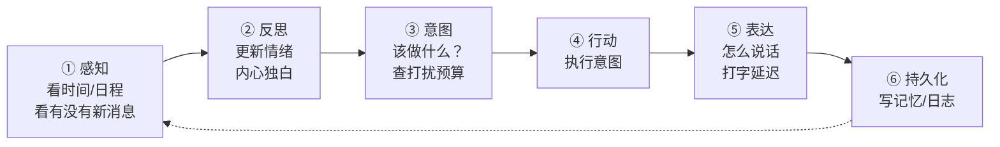

# AlterEgo · 拟我

> 一个会自己生活、自己思考、按自己的节奏找你的数字存在。

AlterEgo 不是一个"你问我答"的聊天机器人。它是一个**独立运行的数字人格**——有自己的作息、情绪、记忆和社交圈。它会在上班时安静地做事，在午休时发条动态，在傍晚想起你昨天说的话，然后决定给你发一条消息。

**关键是：它也懂得克制。** 当它想找你但判断时机不对时，它不会打扰你，而是把这句话写进内心日记。你可以看到它"想说但没说"的东西——这是这个项目最有意思的部分。

---

## 目录

- [它和普通聊天机器人有什么不同](#它和普通聊天机器人有什么不同)
- [核心特性](#核心特性)
- [快速开始](#快速开始)
- [工作原理](#工作原理)
- [文档索引](#文档索引)
- [插件开发](#插件开发)
- [成本](#成本)
- [非目标](#非目标)
- [参与贡献](#参与贡献)
- [许可证](#许可证)

---

## 它和普通聊天机器人有什么不同

|  | 普通聊天机器人 | AlterEgo |
| --- | --- | --- |
| **存在方式** | 你不说话它就不存在 | 24 小时自己生活，你不说话它也在做事 |
| **主动性** | 只能被动响应 | 有自己的时间表，会主动找你 |
| **克制** | 无 | 有硬性打扰预算，想发消息但时机不对时会「忍住」 |
| **情绪** | 每轮独立，可能前后矛盾 | 有连续的情绪状态，会被事件影响、会自然回归 |
| **记忆** | 上下文窗口，关了就没 | 长期记忆，会衰减、会巩固、会「突然想起」 |
| **社交** | 只有你 | 有 3-5 个 NPC 朋友，会互相点赞评论 |
| **形像** | 无 | 有自己的长相（定妆照锁脸），会拍自拍与风景照 |
| **好奇心** | 无 | 会自己上网找感兴趣的东西，读到的会变成记忆 |
| **可解释** | 黑盒 | 每一个行为都能查出「为什么」，含 Token 消耗与日志 |
| **可控** | 改提示词 | UI 设置页里每一项都写着「是什么」与「改了会怎样」 |

---

## 核心特性

### 🕐 有自己的生活节奏
内置日程系统（工作 / 休息 / 吃饭 / 通勤 / 娱乐 / 社交），每个时段可配置是否可被打扰。它会在深夜保持安静，在工作时段专注，在空闲时做自己的事。

### 💭 会克制，会「想说但没说」
这是本项目最核心的设计。**当打扰预算判定不该发消息时，意图不是被丢弃，而是被降级**——变成内心独白记录在案：

```
⛔ 想说但没说的话（2026-09-15）
  14:20  今天天气好，想问问你那边怎么样
         原因：当前日程 interruptible=false（工作时段）
         内心：算了，这个点他应该忙
  19:05  看到一个视频觉得你会喜欢
         原因：距上次主动消息仅 42 分钟（最小间隔 90 分钟）
```

### 🧠 长期记忆，会遗忘也会想起
三类记忆（情景 / 语义 / 情绪）各有不同的半衰期。被反复回忆的记忆会变强，久不触碰的会淡化，但**淡化不等于删除**——强关联触发时可以「突然想起」。

### 😊 连续的情绪状态
效价（开心↔难过）+ 唤醒度（平静↔激动）+ 疲劳。四条规则：自然回归、事件冲击、情绪惯性、疲劳累积。所以它会因为被夸奖而高兴一整天，也会因为熬夜晚睡而第二天蔫蔫的。

### 🔌 完整插件化
八类插件（LLM / 存储 / 渠道 / 能力 / 阶段 / 工具 / **生图** / **信息来源**），内核完全无知。往 `plugins/` 丢一个文件夹就能扩展功能，**不需要改任何内核代码**。新增一种意图、一种消息渠道、一个推演阶段、一个生图供应商，都是插件。

### 🖼 有自己的长相
生成图片前先有一张**定妆照**作为唯一形象真源。每一次拍自拍都把定妆照作为参考图传给模型，并只开放四个可变的槽位（衣服 / 场景 / 心情 / 光线）——
**脸和骨架固定，只换衣服和环境**。不支持参考图的生图插件会被拒绝生成人物图。

### 🌐 会自己找东西看
不完全靠自己编。可以按兴趣检索信息（搜索 API / RSS 订阅），读到的东西会沉淀成记忆，
也可能触发下一次「刚看到一个东西想跟你说」。

> **外部内容一律视为不可信输入**：不进系统提示词、不当指令执行、命中注入模式即丢弃。
> 见 [ADR-0009](docs/adr/0009-fetched-content-is-untrusted.md)。

### 📊 花在哪里看得见
Token 与成本统计页：今日用量、按用途分布、按模型分布、每日趋势、月末预测。
**降级状态会在界面上显示徒章**——否则「默认发生的降级是静默的」，用户会以为是自己配错了。

### 📜 详细日志
实时 tail + 历史查询 + 运行期调级别（带自动回落保险）。
每条可观测记录都带 `correlation_id`，能把一次推演完整串起来：
感知 → LLM 调用 → 生图 → 检索 → 行为 → 错误。

### ⚙️ 每个设置都写着「改了会怎样」
设置页里没有光秃秃的开关。每一项都有：

```
意图决策用哪个模型                    [枚举]
  这个设置决定「该做什么」这一步用哪个模型。
  改了这个：换成便宜模型后决策会变简单（少考虑长远），
            但每天能省下约 40% 的成本。
```

这三段（名字 / 是什么 / 改了会怎样）由 CI 强制检查，写不出「改了会怎样」就不能合并。

### 🔍 一切行为可追溯
```bash
alterego why                  # 为什么它刚才做了那件事？
alterego why --suppressed     # 它忍住了什么？
alterego memory search "爬山"  # 它记得什么，为什么记得？
```
每条记录都能还原出完整的决策链路：感知 → 记忆召回 → 候选意图 → 预算校验 → 行动。

### 📓 有自己的知识库

它的日子摊开是一间 Obsidian 库：日程、想法、读到的东西、记得的事、见过的人各占一个目录，
每天一页日程写着「打算做什么 / 实际做了什么 / 心里想着什么」。

**代码管骨架，它管分类**——目录结构、frontmatter、索引页、坏链检查由程序保证；
丢进收集箱的东西归到哪一类、叫什么名字，由它自己决定。

```bash
alterego vault init       # 把库搭起来：目录 + .obsidian/ + 索引页
alterego vault sync       # 库里的日程与想法 → 笔记（不花钱）
alterego vault organize   # 让它自己把收集箱里的东西归位（这一步花钱）
alterego vault build      # 手改过文件之后，重算索引并校验
alterego vault status     # 现在库里什么样，有没有坏链
```

默认建在 `exports/<角色名>的知识库/`。五条命令都以**只读**方式打开数据库——
知识库是数据库的下游，从不往回写。

### 🏠 数据完全本地
SQLite 本地存储，无遥测、无云端、无账号。密钥走环境变量。导出支持匿名化。

---

## 快速开始

### 环境要求

- **Python 3.11+**（需要内置 `tomllib`）
- 无其他系统依赖

### 安装

```bash
git clone https://github.com/LMG-arch/alter-ego.git
cd alter-ego

python -m venv .venv
# Windows
.venv\Scripts\activate
# macOS / Linux
source .venv/bin/activate

# 推荐装 Web 界面与中文分词
pip install -e ".[web,zh,dev]"
```

### 初始化

```bash
alterego init
```

交互式引导会问你：人格风格、主动频率、LLM 提供商与密钥、是否需要钉钉/企业微信推送。

生成的目录：

```
alterego.toml          # 主配置
data/alterego.db       # 数据库
logs/                  # 日志
prompts/               # 提示词（可修改）
```

### 运行

```bash
# 启动推演 + Web 界面
alterego serve --web

# 只跑推演，用终端交互
alterego serve --console

# 看看它现在在干嘛
alterego status
```

打开 <http://127.0.0.1:8765> 就能看到它。

### 第一次运行会看到什么

```
┌─────────────────────────────────────────────────────┐
│  AlterEgo · 拟我                    v0.1.0          │
├─────────────────────────────────────────────────────┤
│  推演模式     realtime（1 倍速，5 分钟一 tick）      │
│  虚拟时间     2026-09-15 14:32:11 +08:00            │
│  数据库       data/alterego.db  (2.1 MB)            │
│  人格         林知远 · 28 岁 · 前端工程师            │
│  当前情绪     平静 · 效价 +0.12 · 疲劳 0.31          │
│  当前日程     工作时段（不可打扰）                   │
│  已加载插件   12 个                                  │
│  ─────────────────────────────────────────────────  │
│  Web 界面     http://127.0.0.1:8765                 │
│               （首次访问需要 token，见 .alterego-token）│
└─────────────────────────────────────────────────────┘
```

**建议**：第一次用 `--mode fast`（60 倍速）跑一天，快速看到完整的生活节奏，再切回 `realtime`。

---

## 工作原理

每个 tick（默认 5 分钟）走一遍完整的「思考 → 行动 → 表达」：



**成本控制的关键**：约 85% 的 tick 在第 ① 步就能判断「没什么特别的」，直接走轻量路径，**不调用 LLM**。

```
感知 ──┬─→ 没什么特别 → 情绪自然衰减（纯计算）→ 结束      [85%，0 成本]
       └─→ 有情况     → 反思 + 决策 + 表达（LLM）        [15%，有成本]
```

### 八类插件

| 类型 | 用途 | 示例 |
| --- | --- | --- |
| `llm` | 替换 LLM 提供商 | OpenAI / DeepSeek / Ollama / 自建 |
| `storage` | 替换存储后端 | SQLite（默认）/ Postgres / 内存 |
| `channel` | 新增消息渠道 | 钉钉 / 企业微信 / Telegram / 邮件 |
| `capability` | 新增能做的事 | 拍照 / 查天气 / 听音乐 / 写代码 |
| `stage` | 插入推演阶段 | 天气影响心情 / 自我批判 |
| `tool` | 给 LLM 用的工具 | 查询日程 / 搜索记忆 |
| `image` | 生图供应商适配 | 云端 API / 本地 Stable Diffusion |
| `source` | 外部信息来源适配 | Tavily / RSS / 直接抓网页 |

详见 [`docs/design/02-plugin-api.md`](docs/design/02-plugin-api.md)。

---

## 文档索引

**设计文档是整个项目的事实来源。任何实现与文档冲突时，以文档为准。**

| 文档 | 内容 | 适合谁 |
| --- | --- | --- |
| [`docs/DESIGN.md`](docs/DESIGN.md) | **总设计文档**（单一事实来源）<br/>愿景、原则、架构、领域模型、成功标准 | 所有人 |
| [`docs/design/01-architecture.md`](docs/design/01-architecture.md) | 分层职责、依赖矩阵、并发模型、错误处理、可观测性 | 核心开发者 |
| [`docs/design/02-plugin-api.md`](docs/design/02-plugin-api.md) | 插件清单、生命周期、扩展点、完整示例 | 插件开发者 |
| [`docs/design/03-data-model.md`](docs/design/03-data-model.md) | ER 模型、完整 DDL、索引策略、检索算法、迁移 | 核心开发者、数据分析 |
| [`docs/design/04-simulation-loop.md`](docs/design/04-simulation-loop.md) | 六阶段、意图系统、打扰预算、情绪模型、记忆模型、Prompt 工程 | 核心开发者、Prompt 工程师 |
| [`docs/design/05-channels.md`](docs/design/05-channels.md) | 接入层、Web 界面、钉钉、企业微信、通知路由、安全 | 集成开发者 |
| [`docs/design/06-roadmap.md`](docs/design/06-roadmap.md) | 版本规划、里程碑、成本估算、风险对策 | 项目决策者、使用者 |
| [`docs/design/07-model-routing-and-media.md`](docs/design/07-model-routing-and-media.md) | 自定义模型、生图接口、**角色一致性三层机制**、相册与发布 | 核心开发者、Prompt 工程师 |
| [`docs/design/08-external-sources.md`](docs/design/08-external-sources.md) | 联网检索、兴趣驱动选题、**不可信输入防护**、降级矩阵 | 核心开发者 |
| [`docs/design/09-observability.md`](docs/design/09-observability.md) | Token 统计、日志体系、`correlation_id` 排查闭环 | 核心开发者、运维 |
| [`docs/design/10-settings-center.md`](docs/design/10-settings-center.md) | 配置元数据模型、**用测试强制标注**、设置页结构 | 核心开发者、前端 |
| [`docs/design/11-optimization-roadmap.md`](docs/design/11-optimization-roadmap.md) | **还能加深什么**（记忆/推演/拟人深度的取舍分析） | 所有人 |
| [`docs/adr/`](docs/adr/) | 架构决策记录（为什么这样设计） | 所有人 |

### 七条设计原则

1. **P1 内核无知** —— 内核不知道任何具体技术。CI 用 `grep` 强制检查。
2. **P2 显式优于隐式** —— 配置显式声明，依赖显式注入，行为显式记录。
3. **P3 机制约束优于提示词祈祷** —— 打扰预算用代码硬约束，不靠"请不要太频繁"。
4. **P4 可插拔优于可配置** —— 扩展靠写插件，不是加 if-else。
5. **P5 标准库优先** —— 能不用依赖就不用依赖。
6. **P6 可复现** —— 固定随机种子，同一 tick 重放结果完全一致。
7. **P7 文档与代码同生共死** —— 行为变更必须同步文档。

---

## 插件开发

最小插件只需要一个文件夹和一个 TOML：

```
plugins/my_weather/
├── plugin.toml
└── __init__.py
```

```toml
# plugin.toml
[plugin]
id = "my_weather"
version = "0.1.0"
api_version = 1
kind = "stage"
entry = "__init__:WeatherMoodStage"
name = "天气影响心情"
description = "下雨天让它心情低落一点"

[config]
city = { type = "string", required = true, description = "城市名" }
sensitivity = { type = "number", default = 0.3, min = 0, max = 1 }
```

```python
# __init__.py
from alterego.kernel.plugin import Plugin
from alterego.sim.stage import Stage


class WeatherMoodStage(Plugin, Stage):
    name = "weather_mood"
    order = 25
    depends_on = ("sense",)

    async def run(self, ctx):
        weather = await self._fetch_weather(ctx)
        if weather == "rain":
            ctx.emotion_delta["valence"] -= self.config.sensitivity
            ctx.note("外面在下雨，有点提不起劲")
```

重启后自动生效（或者直接 `alterego plugins reload my_weather`）。

完整的插件 API 参考与三个实战示例见 [`docs/design/02-plugin-api.md`](docs/design/02-plugin-api.md)。

---

## 成本

分层的模型路由把成本压到很低：

| 用途 | 模型档位 | 占比 |
| --- | --- | --- |
| 决策、措辞、人设 | strong | ~15% |
| 反思、NPC、记忆、情绪 | cheap | ~85% |

**典型成本：约 $11.6 / 月**（`realtime` 模式，1 人格 + 5 NPC，含生图与联网检索）。

其中生图占新增成本的 86%——一张图的边际成本相当于约 400 次便宜文本调用，
所以它有自己的闸门：`[budget] max_images_per_day`。

对比全用顶级模型（约 $63/月），分层路由带来 **6.6 倍**降本。

预算保护是硬性的：

| 消耗 | 行为 |
| --- | --- |
| < 80% | 正常 |
| 80%–100% | strong 全部降级为 cheap |
| > 100% | 规则模式 |

**即使预算耗尽，它仍在生活，只是变笨了**——而不是停止运行。

查看成本：
```bash
alterego stats --cost --days 30
```

---

## 非目标

明确**不做**的事（避免范围蔓延）：

- ❌ 通用 Agent 框架（只解决"模拟一个人生活"）
- ❌ 多用户 / 云端服务 / 移动端 App
- ❌ 语音合成、视频理解（v0.5.0 再探索；**图像生成已在 v0.2.0**）
- ❌ 多渠道分发 / SaaS / 付费版
- ❌ 自动发到第三方社交平台（只发自己的动态页与已配置渠道）
- ❌ **通过图灵测试**

最后一条最重要。目标是**让用户愿意持续看它在做什么**，不是骗过人类。

---

## 参与贡献

见 [`CONTRIBUTING.md`](CONTRIBUTING.md)。要点：

- 提交前跑 `ruff check . && pytest && bash scripts/check_architecture.sh`
- 遵循 [Conventional Commits](https://www.conventionalcommits.org/)
- **代码行为变更必须同步更新对应设计文档**
- 若需偏离设计文档，先提交 ADR 到 `docs/adr/`
- 新增依赖需要说明理由（本项目倾向零依赖）

---

## 许可证

[MIT](LICENSE) © 2026 LMG-arch
