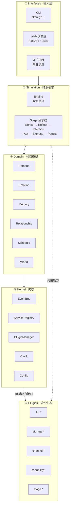
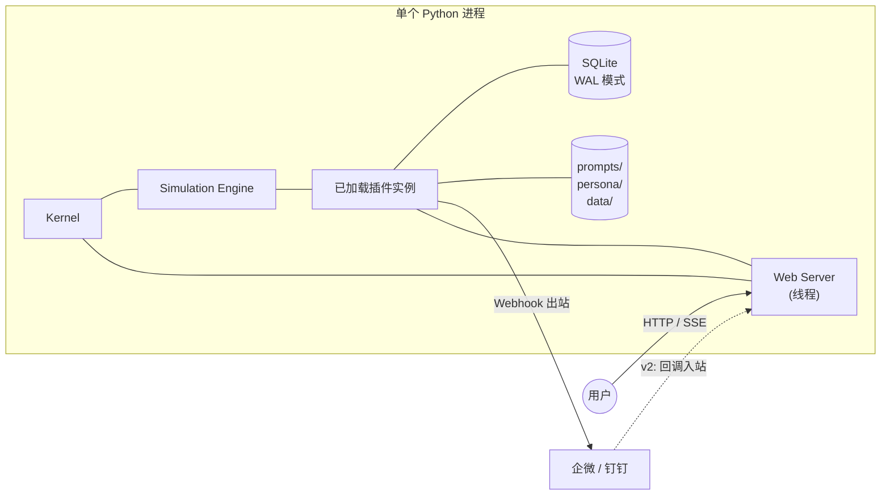
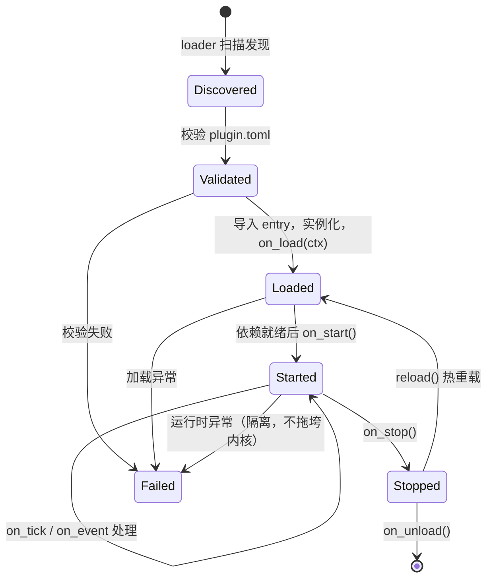
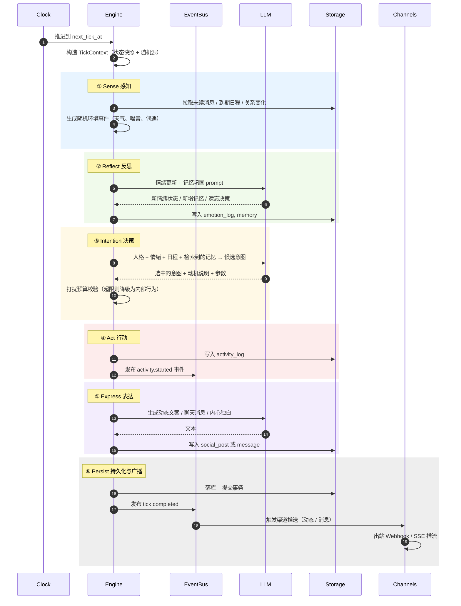
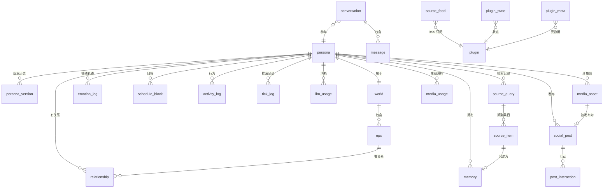

# AlterEgo · 拟人 Agent 设计总文档

> **版本**：v0.1.0 (Draft)
> **状态**：设计中
> **最后更新**：2026-09-15
> **文档定位**：本项目架构的**唯一事实来源（Single Source of Truth）**。任何实现与本文档冲突时，以本文档为准；若确需偏离，必须先提交 ADR（`docs/adr/`）并更新本文档。

---

## 目录

1. [项目愿景](#1-项目愿景)
2. [核心概念](#2-核心概念)
3. [设计原则](#3-设计原则)
4. [系统架构总览](#4-系统架构总览)
5. [分层职责](#5-分层职责)
6. [插件体系](#6-插件体系)
7. [领域模型](#7-领域模型)
8. [推演循环](#8-推演循环)
9. [数据存储](#9-数据存储)
10. [接入层](#10-接入层)
11. [外部渠道](#11-外部渠道)
12. [配置与部署](#12-配置与部署)
13. [目录结构](#13-目录结构)
14. [版本管理与文档纪律](#14-版本管理与文档纪律)
15. [非目标（Non-Goals）](#15-非目标non-goals)
16. [术语表](#16-术语表)
17. [分册索引](#17-分册索引)

---

## 1. 项目愿景

AlterEgo 是一个**由大语言模型驱动推演的拟人 Agent**。它不是聊天机器人，也不是任务助手——它模拟一个**真实存在的人**在生活：

| 能力 | 说明 |
| --- | --- |
| **有人格** | 有姓名、年龄、职业、性格、说话习惯、价值观、喜好与厌恶 |
| **有生活** | 有作息表：起床、通勤、上班、摸鱼、吃饭、健身、追剧、睡觉 |
| **有情绪** | 心情会因事件和时间变化，并影响它的言行 |
| **有记忆** | 记得和你聊过的事，也会遗忘不重要的事 |
| **有交际** | 有朋友、同事、家人的 NPC，它们之间会互相聊天 |
| **会发动态** | 主动发布朋友圈式动态，内容源于它真实的生活与情绪 |
| **会主动找你** | 不是被动应答——它会因为「看到好玩的东西」「心情不好想倾诉」「突然想起你」而主动发消息 |

**设计北极星**：让用户在打开聊天窗口前，无法预测下一条消息是什么；但事后回看，又觉得「这确实像它会说的话」。

### 1.1 与常见项目的区别

| 对比对象 | 区别 |
| --- | --- |
| 角色扮演类 Prompt 工程 | 本项目的「人格」是**持久化状态**，不是一段提示词；情绪、记忆、关系都是可查询、可演化的数据 |
| 通用 Agent 框架（LangChain 等） | 本项目的推演循环围绕「**生活模拟**」而非「任务完成」设计；核心产物是行为与表达，不是工具调用结果 |
| 虚拟宠物 / 桌宠 | 本项目有**语义级**的内心活动与社交关系，行为由 LLM 推理得出而非状态机硬编码 |

### 1.2 成功标准

一个合格的 AlterEgo 实例应满足：

1. **连续性**：连续运行 30 天，人格不发生漂移，早期记忆可被正确回忆
2. **自发性**：24 小时内至少产生 1 次非用户触发的主动行为（动态或消息），且动机可解释
3. **合理性**：所有行为都能在日志中追溯到「人格 + 情绪 + 日程 + 记忆」的推理依据
4. **不骚扰**：主动消息严格受打扰预算约束，任何时候都不会刷屏
5. **可扩展**：新增一种行为类型 = 新增一个插件，无需修改内核代码

---

## 2. 核心概念

### 2.1 三个时间维度

| 概念 | 含义 | 技术映射 |
| --- | --- | --- |
| **真实时间（Real Time）** | 用户所处的时间 | 系统时钟 |
| **虚拟时间（Virtual Time）** | Agent 所处的时间，可加速 | `VirtualClock`，支持倍速 |
| **Tick** | 推演循环的最小节拍 | 一次完整的六阶段流水线执行 |

虚拟时间与真实时间默认 **1:1 同步**（Agent 与用户处在同一时间线）。开启**仿真加速**时，虚拟时间可以跑得比真实时间快——例如 60 倍速下，1 分钟真实时间推进 1 小时虚拟时间，用于「看它怎么过完一整天」。

### 2.2 核心对象

| 对象 | 定义 | 数量 |
| --- | --- | --- |
| **Persona** | 主角人格，即「AlterEgo 本身」 | 1 |
| **User** | 真实用户，被 Agent 视为「一个重要的朋友」 | 1（v1 单用户） |
| **NPC** | Agent 社交圈中的其他人物 | N（建议 5~15） |
| **World** | 世界背景设定：城市、时代、行业、社会关系网 | 1 |
| **Emotion** | 情绪状态，用「效价-唤醒度」二维模型表示 | 1（随时间演变） |
| **Memory** | 记忆条目，含重要度与时间衰减 | N（持续增长） |
| **Relationship** | Agent 与某个其他实体（User/NPC）的关系状态 | N |
| **ScheduleBlock** | 作息表中的一段时间块 | ~10 条/天 |
| **Activity** | 一次具体的生活行为 | N |
| **Post** | 一条对外发布的动态 | N |
| **Message** | 一条会话消息 | N |

### 2.3 插件（Plugin）

插件是**能力的最小交付单元**。系统的一切可变部分——LLM 供应商、存储后端、消息渠道、行为类型、推演阶段——全部以插件形式存在。内核不认识任何具体插件，只认识插件**声明提供的能力接口**。

详见 [02-plugin-api.md](design/02-plugin-api.md)。

---

## 3. 设计原则

这些原则是取舍时的投票权排序，冲突时上位原则胜出。

### P1 · 内核无知（Kernel Ignorance）

> 内核代码中不得出现任何具体插件的名字。

内核只知道 `LLMProvider`、`StorageBackend`、`Channel` 这些**接口**。`openai_compatible`、`sqlite`、`wecom_webhook` 都是插件，可以被替换、被卸载、被并行提供多个实现。

**验证方式**：`grep -r "sqlite\|openai\|wecom" src/alterego/kernel/` 应无结果。

### P2 · 显式优于隐式（Explicit over Implicit）

Agent 的每一个行为都必须能回答「为什么」。推演过程中产生的关键决策（选择了哪个意图、检索到哪些记忆、情绪如何变化）全部写入 `tick_log`，可回溯、可审计、可调试。

**反例**：在提示词里写「请自然地回复用户」然后希望模型自己想到该主动找用户聊天。本项目用**显式意图 + 打扰预算机制**保证行为可控。

### P3 · 机制约束优于提示词祈祷（Mechanism over Prompting）

对于**必须成立**的约束，用代码机制保证，不依赖 LLM 遵守提示词。例如：
- 每日主动消息上限 → `DisturbBudget` 类硬性计数
- 静默时段不推送 → `Scheduler` 时间窗判断
- 人格不漂移 → 人格数据只读，仅允许通过显式的「人格演化」事件修改

### P4 · 可插拔优于可配置（Pluggable over Configurable）

当面对「要不要做成可配置项」的抉择时，优先做成插件。配置项的组合爆炸是维护噩梦，而插件有清晰的契约边界。

### P5 · 只依赖标准库优先（Stdlib First）

核心运行时依赖控制在 `pydantic` + `httpx`（+ 可选 `fastapi`）。重依赖放入 `extras`，按需安装。这直接服务于用户提出的「加载快、内存占用少、代码简单」诉求。

### P6 · 可复现（Reproducible）

所有随机性经由统一注入的 `random.Random(seed)` 产生。给定相同的种子与初始状态，推演结果必须完全一致。这是测试推演引擎的前提。

### P7 · 文档与代码同生共死（Docs Live with Code）

每个功能提交必须同时更新 `CHANGELOG.md` 与相关设计文档。CI 会校验这一点。

---

## 4. 系统架构总览

### 4.1 四层架构



**依赖方向是单向的**：上层依赖下层，下层绝不引用上层。插件的依赖方向是「**横向 + 向下**」——插件可以依赖内核，但不能依赖其他层的内部实现（只能依赖其公开接口）。

详见 [01-architecture.md](design/01-architecture.md)。

### 4.2 运行时剖面



v1 采用**单进程多线程**模型：
- 主线程运行 `Simulation Engine`（Tick 循环）
- 子线程运行 `Web Server`（FastAPI/uvicorn）
- SQLite 开启 **WAL 模式**以支持并发读写
- Tick 与 Web 之间通过 `EventBus` + 内存队列通信，Web 通过 **SSE** 把事件推给浏览器

选择理由：单进程避免了 IPC 与序列化开销，符合「简单」原则；SSE 比 WebSocket 实现更简单且足够满足单向推送需求。

---

## 5. 分层职责

### 5.1 Kernel · 内核层

**职责**：提供一切基础设施能力，不含任何业务逻辑。

| 模块 | 职责 | 关键类 |
| --- | --- | --- |
| `config.py` | 配置加载（TOML + 环境变量 + 默认值）、校验、访问 | `Config` |
| `bus.py` | 事件总线：发布/订阅、优先级、通配符、同步/异步 | `EventBus`, `Event` |
| `registry.py` | 能力注册与解析：按接口类型查找实现 | `ServiceRegistry` |
| `clock.py` | 时间抽象：真实时钟 / 虚拟时钟（可倍速、可跳转） | `Clock`, `RealClock`, `VirtualClock` |
| `plugin.py` | 插件契约：基类、上下文、清单 | `Plugin`, `PluginContext`, `PluginManifest` |
| `loader.py` | 插件发现与导入：本地目录 + entry_points | `PluginLoader` |
| `manager.py` | 插件生命周期：拓扑排序、启动、停止、热重载、隔离 | `PluginManager` |
| `scheduler.py` | 周期任务与时间点任务调度（基于 `Clock`） | `Scheduler` |
| `errors.py` | 统一异常层次 | `AlterEgoError` 及子类 |
| `logging.py` | 结构化日志（JSON Lines），支持按模块分级 | `get_logger()` |

**内核不变的承诺**：新增任何功能都不需要修改内核。如果发现必须改内核，说明该功能抽象层次有误，应先设计新的扩展点。

### 5.2 Domain · 领域层

**职责**：定义业务概念的数据结构与纯逻辑规则，**不涉及持久化、不涉及 IO**。

| 模块 | 职责 |
| --- | --- |
| `persona.py` | 人格数据类、人格卡加载与校验、人格渲染为提示词片段 |
| `emotion.py` | 情绪二维模型、情绪更新规则（衰减、事件冲击、情绪惯性） |
| `memory.py` | 记忆条目、重要度评估、遗忘曲线、检索排序算法 |
| `relationship.py` | 关系状态、好感度演变规则、关系亲密度分层 |
| `schedule.py` | 作息模板、日程生成、当前时段判定、冲突处理 |
| `world.py` | 世界设定、NPC 档案、社交网络拓扑 |
| `post.py` | 动态内容模型 |
| `conversation.py` | 会话与消息模型 |

领域层是**纯函数式**的：给定输入状态与事件，输出新状态。所有随机性来自传入的 `Random` 实例。这让领域逻辑可以被单元测试完全覆盖，无需数据库或 LLM。

### 5.3 Simulation · 推演层

**职责**：编排推演循环，把领域规则与 LLM 推理结合起来，驱动 Agent 产生行为。

| 模块 | 职责 |
| --- | --- |
| `engine.py` | Tick 主循环、阶段编排、异常兜底、tick 日志 |
| `context.py` | `TickContext`：单次 tick 的共享上下文（状态快照、随机源、已执行动作） |
| `stages/` | 六个内置阶段，每个都是可替换的 `Stage` 插件 |
| `intents/` | 意图类型定义与各自的具体执行逻辑 |
| `budget.py` | 打扰预算：主动消息配额、静默时段 |
| `narrator.py` | 内心独白生成（用于调试与 Web 展示） |

详见 [04-simulation-loop.md](design/04-simulation-loop.md)。

### 5.4 Interfaces · 接入层

| 模块 | 职责 |
| --- | --- |
| `cli/` | 命令行入口与子命令 |
| `web/` | FastAPI 应用、SSE 推流、静态页面 |
| `daemon.py` | 守护进程封装：信号处理、优雅退出、崩溃恢复 |

---

## 6. 插件体系

### 6.1 八类插件

| kind | 说明 | 内置实现 | 扩展点 |
| --- | --- | --- | --- |
| `llm` | 大模型供应商适配 | `llm.openai_compatible` | `provide_llm()` |
| `storage` | 持久化后端 | `storage.sqlite` | `provide_storage()` |
| `channel` | 消息进出通道 | `channel.file`, `channel.web`, `channel.wecom_webhook`, `channel.dingtalk_webhook` | `provide_channel()` |
| `capability` | 具体行为执行能力 | `capability.activity`, `capability.post`, `capability.chat`, `capability.selfie`, `capability.research` | `provide_tool()` |
| `stage` | 推演流水线阶段 | `stage.sense/reflect/intention/act/express/persist` | 注册到 `pipeline` 扩展点 |
| `tool` | LLM 可调用的工具 | `tool.time_query` | `provide_tool()` |
| `image` | 生图供应商适配（v0.2.0） | `image.openai_compatible`, `image.local_sd` | `provide_image()` |
| `source` | 外部信息来源适配（v0.3.0） | `source.tavily`, `source.rss`, `source.http_fetch` | `provide_source()` |

`image` 与 `source` 的契约见 [07-model-routing-and-media.md](design/07-model-routing-and-media.md#4-生图接口契约)
与 [08-external-sources.md](design/08-external-sources.md#3-接口契约)。

**为什么单独设两类而不复用 `tool`**：`tool` 是「LLM 可以主动调用的事情」，会出现在 function calling 列表里；
而生图与检索是**推演循环自己决定要做的事**（角色想拍张照、想去读点东西），不经过 LLM 的工具选择环节。
把它塞进 `tool` 会让 LLM 有能力不经过预算门直接生图与联网，破坏 P3。

### 6.2 插件清单

每个插件目录下必须有 `plugin.toml`：

```toml
[plugin]
id = "channel.dingtalk_webhook"
name = "钉钉自定义机器人"
version = "0.1.0"
api_version = "1"
kind = "channel"
entry = "plugin:DingtalkWebhookChannel"
description = "通过钉钉自定义机器人 Webhook 推送消息"
authors = ["LMG-arch"]
license = "MIT"
requires = ["storage.sqlite >= 0.1.0"]
provides = ["channel"]

[config]
webhook_url = { type = "string", required = true, secret = true, env = "DINGTALK_WEBHOOK" }
secret = { type = "string", required = true, secret = true, env = "DINGTALK_SECRET" }
at_mobiles = { type = "array", default = [] }
```

完整字段与语义见 [02-plugin-api.md](design/02-plugin-api.md)。

### 6.3 插件生命周期



**隔离原则**：单个插件在 `on_load` 抛异常 → 该插件标记为 `Failed`，**其余插件继续正常启动**。内核只记录错误并发出 `plugin.failed` 事件。

### 6.4 加载来源（双源）

1. **本地 drop-in 目录**：`plugins/<name>/` — 开发期首选，支持热重载（监听文件变化 → 自动 reload）
2. **Python entry_points**：`pyproject.toml` 中声明 `[project.entry-points."alterego.plugins"]` — 用于 pip 分发的第三方插件

两者并存，本地目录优先级更高（便于覆盖调试）。

### 6.5 插件状态持久化

插件可通过 `ctx.state` 读写自己的 KV 存储（持久化到 `plugin_state` 表），无需自己管理数据库 schema：

```python
ctx.state.set("last_post_at", now.isoformat())
last = ctx.state.get("last_post_at")
```

---

## 7. 领域模型

### 7.1 人格（Persona）

人格是 Agent 的**不变核心**（可演化但极缓慢）。子结构：

| 子结构 | 字段 | 说明 |
| --- | --- | --- |
| 身份 | `name`, `age`, `gender`, `city`, `occupation`, `education` | 基础社会属性 |
| 性格 | `big_five`, `traits`, `values` | 大五人格 + 自由标签 + 价值观 |
| 表达 | `tone`, `verbosity`, `emoji_habit`, `catchphrases`, `typing_quirks` | 决定「说话像不像人」 |
| 偏好 | `likes`, `dislikes`, `habits`, `fears`, `desires` | 驱动意图选择 |
| 背景 | `backstory`, `current_situation`, `goals` | 长文本，注入提示词 |
| 作息 | `schedule_template` | 见 `schedule.py` |

**人格生成**：支持三种方式
1. 手工编写 `persona/*.yaml`
2. `alterego init --generate` — 由 LLM 按用户给出的关键词（如「28岁、杭州、插画师、社恐但网上话多」）生成为完整人格卡
3. `alterego persona refine --instruction "让它更毒舌一点"` — 由 LLM 在保持一致性的前提下优化人格，产出 diff 供确认

**人格锁**：运行时人格为**只读**。任何修改必须走显式命令并落 `persona` 表的新版本记录，防止 LLM 在推演中无意改变人格。

### 7.2 情绪（Emotion）

采用**效价-唤醒度（Valence-Arousal）**二维模型，辅以离散情绪标签：

| 维度 | 范围 | 含义 |
| --- | --- | --- |
| `valence` | -1.0 ~ 1.0 | 愉快 ↔ 不愉快 |
| `arousal` | 0.0 ~ 1.0 | 平静 ↔ 兴奋 |
| `label` | 枚举 | 由 LLM 结合二维值给出：开心/平静/烦躁/低落/兴奋/焦虑/疲惫/感动… |

更新规则（每个 Tick 执行）：
1. **自然回归**：向人格基线（`baseline_valence`, `baseline_arousal`）缓慢回归
2. **事件冲击**：发生事件时产生即时偏移，幅度由事件重要度与人格敏感度决定
3. **情绪惯性**：已有情绪会放大同向新事件、削弱反向新事件（避免情绪乱跳）
4. **疲劳累积**：长时间清醒降低 arousal 上限，睡眠恢复

情绪**直接进入意图决策与表达生成的提示词**——这是让 Agent 显得「有心情」的关键。

### 7.3 记忆（Memory）

三类记忆：

| 类型 | 内容 | 衰减 |
| --- | --- | --- |
| `episodic` | 具体经历的事件（「今天和小林去吃了火锅」） | 较快 |
| `semantic` | 抽象事实（「用户在做 AI 项目」） | 很慢 |
| `emotional` | 情绪标记强烈的记忆 | 极慢 |

记忆生命周期：
1. **写入**：Tick 中发生值得记住的事 → 计算 `importance`（0~1）
2. **巩固**：周期性「反思」阶段把零散经历压缩成更高层记忆
3. **遗忘**：`strength = importance × e^(-λ·Δt) × 唤醒次数`，低于阈值的记忆不删除但降权
4. **检索**：给定查询，用 **FTS5 全文检索**（可选 embedding 插件）召回候选，再按 `相关性 × 重要度 × 时间新近度 × 情绪一致度` 排序取 Top-K

> **设计取舍**：v1 默认**不依赖向量数据库**——FTS5 + 加权排序在中文场景下（配合 jieba 分词可选插件）足够好，且零额外依赖。向量检索作为可选插件提供，用户想用再装。

### 7.4 关系（Relationship）

Agent 对每个实体（User / NPC）维护关系状态：

| 字段 | 说明 |
| --- | --- |
| `affinity` | 好感度 -100 ~ 100 |
| `familiarity` | 熟悉度 0 ~ 100 |
| `trust` | 信任度 0 ~ 100 |
| `tension` | 紧张度 0 ~ 100（吵架了会升高） |
| `relation_type` | 关系类型：朋友/同事/家人/恋人/熟人/用户 |
| `notes` | LLM 生成的自由文本印象笔记 |
| `last_contact_at` | 上次联系时间（影响「想念」倾向） |

好感度随互动演变：正向互动提升、长期不联系缓慢衰减、负面互动下降。

### 7.5 作息（Schedule）

`schedule_template` 定义典型一天：

```yaml
weekday:
  - {start: "07:30", end: "08:10", activity: "起床洗漱", flexible: 20}
  - {start: "08:10", end: "08:50", activity: "通勤", flexible: 10}
  - {start: "09:00", end: "12:00", activity: "工作", flexible: 30, interruptible: false}
  - {start: "12:00", end: "13:30", activity: "午餐+午休", flexible: 30, interruptible: true}
  - {start: "13:30", end: "18:00", activity: "工作", flexible: 30, interruptible: false}
  - {start: "18:00", end: "19:00", activity: "通勤+晚饭", flexible: 40}
  - {start: "19:00", end: "23:00", activity: "自由时间", flexible: 120, interruptible: true}
  - {start: "23:30", end: "07:30", activity: "睡觉", flexible: 60, interruptible: false}
weekend:
  - {start: "09:30", end: "10:30", activity: "赖床", flexible: 60}
  # ...
```

关键语义：
- `flexible`：该时段起止时间的浮动范围（分钟），让作息不机械
- `interruptible`：该时段是否允许被「主动联系用户」打断——**睡觉和工作时段默认不可被打断**，这从机制上避免了凌晨三点发消息
- 实际每日日程由模板 + 随机扰动 + 天气/情绪修正生成，存入 `schedule_block` 表

### 7.6 世界（World）

| 内容 | 说明 |
| --- | --- |
| `setting` | 时代、城市、行业、社会背景（长文本） |
| `npc[]` | NPC 档案：姓名、身份、与主角关系、性格、说话风格 |
| `relations` | NPC 之间的关系（NPC 之间也是朋友/同事） |
| `locations` | 常去地点（公司、家、常去的咖啡馆、健身房） |
| `events` | 世界级事件（季节、节日、社会热点） |

**NPC 也是「人」**：每个 NPC 有简化的人格卡与情绪状态，由 LLM 以更低频率（默认 30 分钟虚拟粒度）驱动。NPC 之间会互相发消息，这些对话会进入主角的记忆（主角「听说」了某事）。

---

## 8. 推演循环

### 8.1 Tick 流水线

每个 Tick 顺序执行六个阶段，每个阶段都是**可替换的插件**：



### 8.2 意图系统

意图是「Agent 想做什么」的显式表达。v1 意图目录：

| 意图 | 说明 | 是否对外 |
| --- | --- | --- |
| `work` | 上班干活 | 否 |
| `rest` | 休息、发呆 | 否 |
| `eat` | 吃饭 | 否 |
| `commute` | 通勤 | 否 |
| `entertain` | 娱乐（追剧/游戏/看书） | 否 |
| `socialize` | 和 NPC 聊天 | 部分（NPC 对话可被看到） |
| `post_moment` | 发动态 | **是**（朋友圈流 + 可选 IM 推送） |
| `reach_out` | **主动找用户聊天** | **是**（IM 推送 + Web 聊天） |
| `reply` | 回复用户消息 | 是 |
| `reflect_internal` | 内心反思（写日记） | 否（Web 可见） |

**`reach_out` 的动机字段**（必须填写，用于可解释性与防骚扰）：
```json
{
  "intent": "reach_out",
  "motivation": "share_something",   // 看到好玩的东西想分享
  "trigger": "刚刷到一个关于独立游戏的视频，想起用户在做 AI 项目",
  "urgency": 0.3,                     // 0~1，影响是否被预算拦截
  "target": "user"
}
```

动机枚举：`share_something`（分享）、`miss_you`（想念）、`need_comfort`（求安慰）、`ask_question`（求助）、`follow_up`（跟进之前聊的事）、`just_bored`（无聊）。

### 8.3 打扰预算（反骚扰机制）

| 约束 | 默认值 | 说明 |
| --- | --- | --- |
| 每日主动消息上限 | 3 条 | `urgency > 0.8` 可突破至 5 条 |
| 每日动态上限 | 4 条 | — |
| 静默时段 | 23:30 ~ 08:00 | 此期间不推送任何消息与动态 |
| 最短间隔 | 90 分钟 | 两条主动消息之间的最小间隔 |
| 连续未回复熔断 | 3 次 | 用户连续 3 次未回复 → 暂停主动消息 24 小时 |
| 用户状态感知 | — | 用户明确说「在忙」→ 当日预算减半 |

**关键设计**：预算耗尽时，意图**不是被丢弃而是被降级**——`reach_out` 降级为 `reflect_internal`（写进内心日记），这样 Agent 的「想找你」这个心理活动依然被记录下来，日后可以被回忆或提起。这比简单丢弃更有拟人感。

### 8.4 Tick 频率与成本

| 模式 | Tick 粒度（虚拟时间） | 说明 |
| --- | --- | --- |
| `realtime`（默认） | 5 分钟 | 真实时间 1:1 推进，低频省成本 |
| `fast` | 5 分钟 | 60x 倍速，用于仿真观察 |
| `turbo` | 15 分钟 | 300x 倍速，用于长期演化测试 |

**分层模型路由**（成本控制核心）：

| 用途 | 模型档位 | 理由 |
| --- | --- | --- |
| 意图决策（主角） | `strong` | 最关键，需要推理能力 |
| 表达生成（动态/消息） | `strong` | 直接对用户可见，质量重要 |
| 情绪/记忆反思 | `cheap` | 结构化任务，便宜模型够用 |
| NPC 对话 | `cheap` | 数量大，质量要求相对低 |
| 人格生成/优化 | `strong` | 一次性任务 |

预期成本：低频模式下单日约 300~500 次调用（主角 ~288 tick × 1 次决策 + NPC 分摊），其中约 70% 走便宜模型。详见 [06-roadmap.md](design/06-roadmap.md) 的成本估算章节。

---

## 9. 数据存储

### 9.1 技术选型

| 选择 | 理由 |
| --- | --- |
| **SQLite**（WAL 模式） | 零运维、单文件、Python 内置驱动、支持 FTS5 全文检索 |
| **JSON 列存复杂结构** | 人格、世界设定等长文本/嵌套结构直接存 JSON 字符串，用 `json.loads` 读 |
| **SQL 迁移脚本** | `storage/sqlite/migrations/` 下按序编号，`PRAGMA user_version` 记录当前版本，`schema_version` 表是审计记录 |

> **为什么不用向量数据库**：v1 优先「零依赖」，FTS5 + 加权排序已能满足「记住聊过的事」这一需求。向量检索设计为插件，用户需要再装。

### 9.2 表结构概览（26 张表）



| 表名 | 说明 |
| --- | --- |
| `persona` | 人格主表（当前生效版本） |
| `persona_version` | 人格版本历史（支持回滚与演化追踪） |
| `world` | 世界设定 |
| `npc` | NPC 档案 |
| `relationship` | 关系状态（Agent 对 User 与各 NPC） |
| `emotion_log` | 情绪时间序列 |
| `memory` | 记忆条目 |
| `memory_fts` | FTS5 虚拟表（记忆全文索引） |
| `conversation` | 会话 |
| `message` | 消息 |
| `social_post` | 动态 |
| `post_interaction` | 动态互动（NPC 或用户的点赞评论） |
| `schedule_block` | 日程块 |
| `activity_log` | 行为日志 |
| `tick_log` | 推演日志（含决策依据，用于可解释性） |
| `llm_usage` | LLM 调用计量 |
| `plugin_state` | 插件 KV 状态 |
| `plugin_meta` | 插件元数据与失败计数 |
| `event_log` | 事件流（默认关闭；用于回放与调试） |
| `budget_usage` | 打扰预算日用量 |
| `media_asset` | 生成/上传的图片资产（含**定妆照**） |
| `media_usage` | 生图消耗计量 |
| `source_item` | 检索到的外部条目（只存 URL/标题/摘要） |
| `source_feed` | RSS 订阅源状态（含 `etag`） |
| `source_query` | 一次检索的查询与结果统计 |
| `log_entry` | 结构化运行日志（WARNING 及以上落库） |
| `schema_version` | 迁移版本 |

**视图**（不是表，用于统计与排查）：

| 视图 | 用途 |
| --- | --- |
| `v_cost_daily` | LLM + 生图的日成本合并视图 |
| `v_trace` | 按 `correlation_id` 串联一次推演的全部痕迹 |

完整 DDL 见 [03-data-model.md](design/03-data-model.md)。

> **每张可观测表都必须带 `correlation_id`**，同一次推演内共享同一个值。
> 这是日志页「从一条错误跳回那次推演」的实现基础，见 [09-observability.md § 1.2](design/09-observability.md#12-核心洞察一切都要能串起来)。

---

## 10. 接入层

### 10.1 CLI

```bash
# 初始化
alterego init --name "林知夏" --generate          # 交互式 + LLM 生成人格与世界
alterego init --template persona/hangzhou_artist   # 从模板初始化

# 运行
alterego run                                     # 常驻守护进程（realtime 模式）
alterego run --speed 60x                         # 仿真加速 60 倍
alterego run --until "2026-09-16T00:00:00"       # 跑到指定虚拟时间后退出

# 手动推进
alterego tick                                    # 手动执行一个 tick
alterego tick --n 24                             # 连续执行 24 个 tick

# 交互
alterego chat                                    # 终端里和它聊天
alterego chat --as-npc "小林"                     # 以 NPC 身份说话（测试用）
alterego post --content "今天加班到现在"           # 手动让它发条动态

# 观察
alterego state                                   # 打印当前状态（人格/情绪/关系/最近记忆）
alterego state --watch                           # 实时刷新（TUI）
alterego timeline --date 2026-09-15              # 查看某天的完整时间线
alterego memory search "火锅"                     # 检索记忆
alterego why                                     # 解释上一次 tick 的决策依据

# 服务
alterego serve                                   # 启动 Web 仪表盘
alterego serve --port 8765

# 插件
alterego plugins list                            # 列出所有插件及状态
alterego plugins info channel.dingtalk_webhook   # 查看插件详情与配置要求
alterego plugins enable/disable <id>
alterego plugins install <path-or-package>       # 安装第三方插件
alterego plugins doctor                          # 插件健康检查

# 人格与世界
alterego persona show
alterego persona refine --instruction "更毒舌一点"
alterego world generate --keywords "杭州,插画师,社恐"

# 数据
alterego export --format json --out backup.json
alterego import backup.json
alterego stats                                   # 用量与成本统计
```

### 10.2 Web 仪表盘

FastAPI + 原生 HTML/CSS/JS（无前端框架，符合「简单」原则），通过 **SSE** 实时推流。

| 页面 | 内容 | 分册 |
| --- | --- | --- |
| **总览** | 头像、当前状态（在做什么/心情如何）、虚拟时钟、今日统计 | — |
| **朋友圈** | 动态流，支持以用户身份点赞评论；NPC 也会互动 | — |
| **聊天** | 与 Agent 的对话界面（v1 的**主要入站通道**） | — |
| **时间线** | 某一天从起床到睡觉的完整活动时间线（可视化） | — |
| **关系网** | 关系图（Agent 在中心，连线粗细表示亲密度） | — |
| **内心** | 内心独白流 + 被预算拦截的 `reach_out` 意图（很有人味） | — |
| **记忆** | 记忆浏览器，支持检索；显示重要度与强度衰减 | — |
| **相册** | 角色生成的图片；**定妆照置顶**；可手动发布（唯一可绕过预算的入口） | [07](design/07-model-routing-and-media.md#6-相册发布与打扰预算) |
| **统计** | Token 与成本：进度条、外推预测、**降级状态徽章**、趋势、按用途分布 | [09](design/09-observability.md#6-统计页面) |
| **日志** | 实时 tail + 历史查询 + 错误优先 + 完整链路跳转 + 运行期调级别 | [09](design/09-observability.md#5-日志页面) |
| **信息源** | 最近读了什么、丢弃了什么、兴趣权重变化 | [08](design/08-external-sources.md#6-内容进入生活的三条路径) |
| **设置** | 11 个分组的全部配置，**每一项都带说明与「改了会怎样」** | [10](design/10-settings-center.md#7-页面结构) |
| **后台** | Tick 日志、插件管理、数据库维护 | — |

> 「内心」与「日志」不是同一个页面，虽然都像流水账：**受众不同**。
> 「内心」是给用户看的（它在想什么），「日志」是给排障的人看的（哪里坏了）。合并会让两边都难用。

SSE 事件类型：`tick.started`、`tick.completed`、`activity.started`、`post.created`、
`message.created`、`emotion.changed`、`plugin.failed`、`media.created`、`source.ingested`、
`log.entry`、`budget.exceeded`。

### 10.3 守护进程

- 信号处理：`SIGINT`/`SIGTERM` → 优雅停止（保存状态、停止插件、关闭 DB）
- 崩溃恢复：启动时检查 `tick_log` 中的未完成 tick，标记为 `interrupted` 并跳过
- 单实例锁：`data/alterego.lock` 防止多进程同时操作同一数据库
- Windows 支持：使用 `pythonw` 或 `nssm` 注册为服务（文档说明）

---

## 11. 外部渠道

### 11.1 渠道抽象

```python
class Channel(Protocol):
    id: str
    direction: set[Literal["in", "out"]]   # 支持的方向
    capabilities: set[str]                  # text / image / markdown / mention / card

    async def send(self, msg: OutboundMessage) -> SendResult: ...
    def on_receive(self, handler: Callable[[InboundMessage], None]) -> None: ...
```

### 11.2 v1 渠道清单

| 渠道 | 方向 | 说明 |
| --- | --- | --- |
| `channel.file` | 出站 | 写入 `data/outbox/*.md`，零配置，用于调试 |
| `channel.web` | 双向 | Web 聊天页，**v1 唯一可用的入站通道** |
| `channel.wecom_webhook` | 出站 | 企业微信群机器人 Webhook，POST JSON，零配置门槛 |
| `channel.dingtalk_webhook` | 出站 | 钉钉自定义机器人，需 HMAC-SHA256 加签 |

### 11.3 重要现实约束（必须知情）

> **企业微信群机器人与钉钉自定义机器人都是单向的——只能推送，收不到用户回复。**

因此 v1 的架构是：

```
入站（用户 → Agent）：Web 聊天页  ──┐
                                   ├─→ EventBus → 推演引擎
出站（Agent → 用户）：Web SSE  ─────┤
                     企微 Webhook ──┤
                     钉钉 Webhook ──┤
                     文件输出 ──────┘
```

若要 IM 双向对话，需要走**企业微信应用消息**（需 `corpid` + `corpsecret` + `agentid` + **公网可访问的回调 URL** + 服务器配置），这需要一个公网服务器。规划在 **v2**，作为 `channel.wecom_app` 插件。

钉钉同理，双向需企业内部应用 + 公网回调。

QQ 官方机器人需企业/开发者审核；第三方 OneBot（NapCat / LLOneBot）需额外常驻进程。均规划在 v2+。

详见 [05-channels.md](design/05-channels.md)。

---

## 12. 配置与部署

### 12.1 配置文件

`config/alterego.toml`（用户配置）+ `config/secrets.env`（密钥，**不提交到 git**）：

> **完整注释版见 [`templates/alterego.toml`](../templates/alterego.toml)**——它是所有配置项的权威参考（每个键都有默认值与说明），也是 `alterego init` 复制给用户的起始文件。下面只列出关键项。

**加载优先级**（后者覆盖前者）：

```
dataclass 默认值 → alterego/defaults.toml → config/alterego.toml
                 → ALTEREGO_* 环境变量 → CLI 参数
```

其中 `alterego/defaults.toml` 是随包分发的**发行版选型**（默认用哪个 LLM provider、哪个存储后端），
它是数据文件而非代码——内核里不出现任何具体技术名（P1「内核无知」，见
[ADR-0006](adr/0006-ship-implementation-choices-as-data.md)）。

```toml
[core]
data_dir = "data"
log_level = "INFO"
locale = "zh_CN"
timezone = "Asia/Shanghai"
random_seed = 42                    # 留空则每次随机

[simulation]
mode = "realtime"                   # realtime | fast | turbo
tick_interval_minutes = 5           # 虚拟时间粒度
speed_multiplier = 1                # 虚拟:真实 倍率
npc_tick_interval_minutes = 30
enable_npc_conversations = true

[disturb_budget]
daily_message_limit = 3
daily_message_limit_urgent = 5
daily_post_limit = 4
quiet_hours = ["23:30", "08:00"]
min_interval_minutes = 90
consecutive_no_reply_limit = 3

[llm]
# 三层配置：provider（找谁说话）→ model（用哪套参数）→ routing（什么场合用它）
# 为什么要分三层：一个 provider 可以挂多个 model（贵/便宜），
# 而 routing 引用的是 model 而不是 provider。详见 07-model-routing-and-media.md

[llm.providers.deepseek]
base_url = "https://api.deepseek.com/v1"
api_key_env = "DEEPSEEK_API_KEY"

[llm.providers.local]
base_url = "http://127.0.0.1:11434/v1"
api_key_env = ""                     # 本地不需要密钥

[llm.models.deepseek_chat]
provider = "deepseek"
model = "deepseek-chat"
temperature = 0.8
max_tokens = 1024
cost_per_1m_input = 0.27             # 价格是数据不是代码（ADR-0006）
cost_per_1m_output = 1.10

[llm.models.deepseek_reasoner]
provider = "deepseek"
model = "deepseek-reasoner"
temperature = 0.6
max_tokens = 2048
supports_json = true
cost_per_1m_input = 0.55
cost_per_1m_output = 2.19

[llm.routing]
# 值现在是 **model 别名**，不再直接是 provider 名（旧配置会自动迁移并告警）
strong     = "deepseek_reasoner"
cheap      = "deepseek_chat"
decision   = "strong"                # 意图决策用哪个模型
expression = "strong"                # 表达生成用哪个模型
reflection = "cheap"                 # 情绪/记忆反思
emotion    = "cheap"                 # 情绪评估
memory     = "cheap"                 # 记忆巩固
npc        = "cheap"                 # NPC 对话
persona    = "strong"                # 人格生成
image_prompt     = "cheap"           # 生图提示词构造（v0.2.0）
research_query   = "cheap"           # 检索词生成（v0.3.0）
research_summarize = "cheap"         # 抓回内容的消化（v0.3.0）

[media]                              # v0.2.0
enabled = true
max_images_per_day = 20
default_size = "1024x1024"
canonical_portrait_prompt_seed = "from_persona"

[media.selfie]
scenarios = ["morning", "commute", "work", "meal", "evening", "weekend_outdoor"]
allow_regenerate_canonical = false   # 定妆照是单点真源，默认不重生成
require_reference_support = true     # 不支持参考图的供应商不允许生成人物图

[media.providers.openai_compatible]
base_url = "https://api.openai.com/v1"
api_key_env = "OPENAI_API_KEY"
model = "gpt-image-1"
supports_reference = true
cost_per_image_usd = 0.04

[sources]                            # v0.3.0
enabled = true
research_tick_interval_hours = 18
max_items_ingested_per_day = 20      # 成本闸门
on_injection = "drop"                # drop | pass（pass 仅供调试，需二次确认）

[sources.search]
provider = "tavily"
api_key_env = "TAVILY_API_KEY"
max_results = 5

[sources.fetch]
user_agent = "AlterEgo/0.1 (+https://github.com/LMG-arch/alter-ego)"
respect_robots = true                # 不提供关闭开关
domain_delay_sec = 2.0
max_content_chars = 4000

[log]
level = "INFO"
file_enabled = true
file_keep_days = 14                  # 全量日志按天轮转
console = true

[observability]
db_min_level = "WARNING"             # 只有 WARNING 及以上落库
keep_days = 90
stats_refresh_sec = 30

[stats]
show_projection = true               # 显示「按当前速率预计今日消耗」
cost_display_currency = "USD"

[budget]                             # 原名 [llm.budget]，现在闸门统管 LLM + 生图
persona_id = "default"
daily_usd_limit = 2.0
monthly_usd_limit = 40.0
max_calls_per_day = 800
max_tokens_per_day = 2000000
max_images_per_day = 20
on_exceed = "degrade"                # degrade | stop | warn

[budget.per_purpose]
# 单个用途的日成本上限，防止某一类调用吃光全部预算
evaluation = 0.20
persona_gen = 1.00
media = 1.00
research = 0.20

[retention]
tick_log_keep_days = 90
tick_log_detail = "full"             # full | summary（summary 可把年增长降到 1/20）
activity_log_keep_days = 365
log_keep_days = 30
media_keep_days = 365
media_private_keep_days = 90
source_item_keep_days = 90
auto_vacuum = true

[plugins]
enabled = [
  "llm.openai_compatible",
  "storage.sqlite",
  "channel.file",
  "channel.web",
  "channel.wecom_webhook",
  "capability.activity",
  "capability.post",
  "capability.chat",
  # "capability.selfie",              # v0.2.0
  # "image.openai_compatible",        # v0.2.0
  # "capability.research",            # v0.3.0
  # "source.tavily",                  # v0.3.0
  # "source.rss",                     # v0.3.0
]
search_paths = ["plugins", "~/.alterego/plugins"]

[web]
enabled = true
host = "127.0.0.1"
port = 8765

[settings]
allow_write = true                   # 允许在 UI 里改配置
secret_write = "env_only"            # 密钥永远不可写（只能改环境变量）
show_advanced = true                 # 默认展开「高级」分组
atomic_write = true                  # 写临时文件→fsync→os.replace
```

> **每一个键都有对应的展示元数据**（标签、说明、**「改了会怎样」**、是否需重启、是否危险）。
> 元数据与配置同文件、同一次提交，因此物理上无法漂移。
> 具体机制与强制手段见 [10-settings-center.md § 4](design/10-settings-center.md#4-用测试强制标注)。

### 12.2 密钥管理

密钥统一通过环境变量注入，配置文件只写变量名：

```bash
# config/secrets.env（.gitignore 中排除）
ALTEREGO_LLM_API_KEY=sk-xxxxx
ALTEREGO_LLM_BASE_URL=https://api.deepseek.com/v1
DINGTALK_WEBHOOK=https://oapi.dingtalk.com/robot/send?access_token=xxx
DINGTALK_SECRET=SECxxxxx
WECOM_WEBHOOK=https://qyapi.weixin.qq.com/cgi-bin/webhook/send?key=xxx
```

插件配置 schema 中用 `env = "VAR_NAME"` 声明映射，`secret = true` 的字段在 CLI/Web 中永远脱敏显示。

**在设置页里，密钥永远是只读的**，只展示「来源变量名 + 是否已设置」：

```
DEEPSEEK_API_KEY        [环境变量]  已设置 ✓
TAVILY_API_KEY          [环境变量]  未设置 —
```

理由有三：`alterego.toml` 是要提交到 git 的；浏览器提交密钥会进请求体与日志；
容器部署本来就用环境变量。详见 [10-settings-center.md § 5.2](design/10-settings-center.md#52-为什么密钥不写进配置文件)。

### 12.3 运行依赖

| 层 | 依赖 | 说明 |
| --- | --- | --- |
| 核心 | `pydantic>=2.6,<3`, `httpx>=0.27,<1` | 必需，**仅此两个** |
| TOML | `tomllib`（Python 3.11+ 内置） | 无需 tomli |
| 中文分词 | `jieba` | `pip install alterego[zh]`，未安装时 FTS5 退化为字符分词 |
| Web | `fastapi`, `uvicorn` | `pip install alterego[web]` |
| 钉钉加签 | `pycryptodome` | `pip install alterego[wecom]` |
| 图像转码 | `Pillow` | 可选；未安装则存原始格式（PNG/WebP 均可） |
| 开发 | `pytest`, `pytest-asyncio`, `pytest-cov`, `ruff`, `mypy` | `pip install alterego[dev]` |
| 全部 | — | `pip install alterego[all]` |

**Python 版本要求：>= 3.11**（需要 `tomllib`、`asyncio.TaskGroup`、更好的类型语法）

---

## 13. 目录结构

```
alter-ego/
├── docs/
│   ├── DESIGN.md                    # 本文档（架构唯一事实来源）
│   ├── design/                      # 分册
│   │   ├── 01-architecture.md
│   │   ├── 02-plugin-api.md
│   │   ├── 03-data-model.md
│   │   ├── 04-simulation-loop.md
│   │   ├── 05-channels.md
│   │   ├── 06-roadmap.md
│   │   ├── 07-model-routing-and-media.md   # 三层模型配置 + 生图 + 形象一致性
│   │   ├── 08-external-sources.md          # 联网检索 + 不可信输入
│   │   ├── 09-observability.md             # Token 统计 + 日志体系
│   │   ├── 10-settings-center.md           # 配置元数据 + 设置页
│   │   └── 11-optimization-roadmap.md      # 可加深方向的取舍分析
│   ├── adr/                         # 架构决策记录
│   │   ├── README.md                # 索引：新增 ADR 必须在这里补一行
│   │   ├── 0000-template.md
│   │   └── 0001…0010                # 机制/语言/存储/渠道/降级/选型即数据/归属视图/定妆照/不可信输入/元数据强制
│   └── guide/                       # 用户手册
│       ├── getting-started.md
│       └── plugin-development.md
│
├── scripts/
│   └── check_architecture.sh        # 七组 22 项红线检查，CI 第一道关
│
├── src/alterego/
│   ├── __init__.py                  # 只有 __version__，不 import 任何子模块
│   ├── defaults.toml                # 随包分发的发行版选型（内核不许知道的那部分）
│   ├── cli.py
│   ├── kernel/                      # 内核：零业务逻辑
│   │   ├── config.py
│   │   ├── settings.py              # Setting / Choice 元数据与渲染所需的单一真源
│   │   ├── bus.py
│   │   ├── registry.py
│   │   ├── clock.py
│   │   ├── manifest.py              # plugin.toml 的解析与校验
│   │   ├── context.py               # PluginContext / PluginPaths / PluginState
│   │   ├── plugin.py                # 门面：Plugin 基类 + 转发上面两者的公开名字
│   │   ├── loader.py
│   │   ├── manager.py
│   │   ├── scheduler.py
│   │   ├── errors.py
│   │   └── logging.py
│   ├── interfaces/                  # 跨层 Protocol 与纯数据契约（各层共同 import）
│   │   ├── common.py                # HealthStatus 等共用小类型
│   │   ├── llm.py
│   │   ├── image.py                 # ImageProvider / ImageRequest / GeneratedImage
│   │   ├── source.py                # SearchProvider / FeedReader / PageFetcher
│   │   ├── channel.py
│   │   ├── storage.py
│   │   └── simulation.py
│   ├── domain/                      # 领域模型：纯函数，无 IO
│   │   ├── media.py                 # build_portrait_prompt()：一致性骨架的唯一入口
│   │   ├── untrusted.py             # INJECTION_PATTERNS 与外部内容包裹
│   │   ├── persona.py
│   │   ├── emotion.py
│   │   ├── memory.py
│   │   ├── relationship.py
│   │   ├── schedule.py
│   │   ├── world.py
│   │   ├── post.py
│   │   └── conversation.py
│   ├── sim/                         # 推演引擎
│   │   ├── engine.py
│   │   ├── context.py
│   │   ├── budget.py
│   │   ├── narrator.py
│   │   ├── stages/
│   │   │   ├── sense.py
│   │   │   ├── reflect.py
│   │   │   ├── intention.py
│   │   │   ├── act.py
│   │   │   ├── express.py
│   │   │   └── persist.py
│   │   └── intents/
│   │       ├── base.py
│   │       ├── work.py
│   │       ├── rest.py
│   │       ├── socialize.py
│   │       ├── post_moment.py
│   │       ├── research.py          # 第 11 种意图：自己上网找感兴趣的信息
│   │       └── reach_out.py
│   ├── npc/                         # NPC 模拟（与主体推演分开，避免抢注意力）
│   ├── capabilities/                # 内置 capability 插件宿主
│   ├── llm/                         # LLM 抽象层
│   │   ├── client.py
│   │   ├── router.py
│   │   ├── prompt.py
│   │   ├── schema.py                # 结构化输出定义
│   │   └── meter.py                 # token 计量
│   ├── image/                       # 内置 image 插件宿主
│   │   ├── openai_compatible.py     # 云端：支持 reference
│   │   └── local_sd.py              # 本地 ComfyUI / SD WebUI HTTP API
│   ├── sources/                     # 内置 source 插件宿主
│   │   ├── tavily.py
│   │   ├── rss.py
│   │   └── http_fetch.py
│   ├── storage/
│   │   └── sqlite/
│   │       ├── connection.py        # 连接、PRAGMA、事务、完整性检查、备份
│   │       ├── migrator.py          # 发现/校验/应用迁移，事务边界与版本记账归它
│   │       ├── backend.py           # StorageBackend 契约实现 + 版本兼容检查
│   │       ├── migrations/          # 极完整的 schema 都在这里（含 001_initial.sql）
│   │       └── repo/
│   │           ├── persona_repo.py
│   │           ├── memory_repo.py
│   │           ├── media_repo.py
│   │           ├── source_repo.py
│   │           ├── log_repo.py
│   │           └── ...
│   ├── channels/                    # 出站渠道 + v1 唯一的入站渠道（ADR-0004）
│   │   ├── file.py                  # 离线兜底：写进 data/outbox/
│   │   └── web/                     # 本地 Web 界面
│   │       ├── app.py               # ASGI 应用
│   │       ├── plugin.py            # 以 channel 插件身份注册
│   │       ├── sse.py               # SSEHub
│   │       ├── auth.py              # token / password / none
│   │       ├── routes/
│   │       └── static/
│   │           ├── index.html
│   │           ├── style.css
│   │           └── app.js
│   ├── prompts/                     # 提示词模板（可热改，随包分发）
│   │   ├── intention.md
│   │   ├── emotion_update.md
│   │   ├── memory_consolidate.md
│   │   ├── post_compose.md
│   │   ├── chat_reply.md
│   │   ├── image_prompt.md          # 把四槽位展开成生图提示词
│   │   ├── research_query.md        # 按兴趣 + 情绪生成检索词
│   │   ├── research_summarize.md    # 消化抓回内容（严格 JSON 输出）
│   │   ├── reach_out.md
│   │   └── persona_generate.md
│   └── daemon.py                    # 进程生命周期：启动、信号、优雅关闭
│
├── templates/
│   ├── alterego.toml                # 配置模板：所有配置项的权威参考
│   └── persona/                     # 人物与世界初始模板（随包分发）
│
├── plugins/                         # 本地 drop-in 插件目录（gitignore，只留示例）
│   └── example_plugin/              # 插件开发模板
│       ├── plugin.toml
│       └── plugin.py
│
├── config/                          # `alterego init` 生成（gitignore）
│   └── alterego.toml
│
├── data/                            # 运行时数据（gitignore）
│   ├── alterego.db
│   ├── alterego.db-wal
│   ├── alterego.lock
│   ├── backups/
│   └── outbox/
│
├── logs/                            # gitignore
├── instances/                       # 用户数据（gitignore）
├── exports/                         # gitignore
│
├── tests/
│   ├── conftest.py                  # 共享 fixture：冻结时钟、EventBus、ServiceRegistry
│   ├── test_kernel_*.py             # 内核单元测试
│   ├── test_architecture.py         # 用 ast 机械校验分层红线
│   ├── test_settings_metadata.py    # 强制每个配置项都有标注与「改了会怎样」
│   ├── golden/                      # 固定随机种子的黄金用例（P6 可复现）
│   └── fixtures/                    # 共享测试数据
│
├── .github/
│   ├── workflows/ci.yml
│   ├── PULL_REQUEST_TEMPLATE.md
│   └── ISSUE_TEMPLATE/
│
├── pyproject.toml
├── CHANGELOG.md
├── CONTRIBUTING.md
├── LICENSE
└── README.md
```

---

## 14. 版本管理与文档纪律

> 这是用户明确要求的核心工程实践，与代码同等重要。

### 14.1 分支模型

- `main` — 稳定分支，永远可运行
- `feat/<name>`、`fix/<name>`、`docs/<name>`、`plugin/<name>` — 功能分支
- 每个功能分支通过 PR 合并，CI 必须全绿

### 14.2 提交规范（Conventional Commits）

```
<type>(<scope>): <中文描述>

[可选正文：说明为什么这样改]

[可选脚注：Refs #12, BREAKING CHANGE: ...]
```

| type | 用途 |
| --- | --- |
| `feat` | 新功能 |
| `fix` | 修 bug |
| `docs` | 文档 |
| `refactor` | 重构（不改行为） |
| `perf` | 性能 |
| `test` | 测试 |
| `plugin` | 插件相关 |
| `chore` | 构建/依赖/杂项 |
| `ci` | CI 配置 |

示例：
```
feat(sim): 实现 reach_out 意图与打扰预算校验

预算耗尽时降级为 reflect_internal，保留"想找用户"的心理活动记录，
使 Agent 的动机可被后续回忆与提及。

Refs #8
```

### 14.3 版本号（SemVer）

- `MAJOR` — 插件 API 不兼容变更、数据库 schema 破坏性变更
- `MINOR` — 新功能、新插件、新意图类型
- `PATCH` — bug 修复、文档修正、提示词微调

每个版本必须打 git tag（`v0.1.0` 格式）。

### 14.4 CHANGELOG 规范

遵循 [Keep a Changelog](https://keepachangelog.com/zh-CN/1.1.0/)，分类：`新增` / `变更` / `废弃` / `移除` / `修复` / `安全`。

### 14.5 文档同步纪律（强制）

**每个 PR 必须同时满足**：

| 检查项 | 规则 | CI 校验 |
| --- | --- | --- |
| CHANGELOG | `src/` 或 `plugins/` 有改动 → `CHANGELOG.md` 必须有对应条目 | ✅ |
| 设计文档 | 涉及架构/接口/数据模型变更 → `docs/design/` 对应分册必须更新 | ✅（人工审查 + PR 模板勾选） |
| ADR | 重大架构决策 → 新增 `docs/adr/NNNN-*.md` | ⚠️ PR 模板勾选 |
| 提示词 | 修改 `prompts/` → CHANGELOG 记录行为影响 | ✅ |
| 测试 | 新功能必须有对应测试 | ✅ 覆盖率不下降 |

PR 模板中包含勾选清单，未勾选不予合并。

### 14.6 发布流程

1. 更新 `CHANGELOG.md`：把 `[Unreleased]` 内容归入新版本号
2. 更新 `pyproject.toml` 中的 `version`
3. 提交：`chore(release): 发布 vX.Y.Z`
4. 打标签：`git tag -a vX.Y.Z -m "Release vX.Y.Z"`
5. 推送：`git push origin main --tags`
6. 在 GitHub 创建 Release，正文直接复用 CHANGELOG 对应章节

---

## 15. 非目标（Non-Goals）

明确**不做**的事，避免范围蔓延：

| 非目标 | 理由 |
| --- | --- |
| 多用户 / 多人格并行 | v1 单用户单主角；多实例可通过多个 data 目录实现 |
| 语音、视频能力 | v1/v0.2.0 只做文本与**图像生成**；语音与视频理解推迟到 v0.5.0 探索 |
| 与真实人类社交平台账号打通（自动发朋友圈到微信） | 涉及风控与账号安全，不做 |
| 分布式 / 微服务 | 单进程足够，分布式是过度设计 |
| 自研 LLM 微调 | 用现成 API 即可 |
| 完整前端 SPA 框架 | 原生 HTML + SSE 满足需求 |
| 移动端 App | Web 页面已适配移动端浏览器 |
| 实时语音对话 | 超出「生活模拟」核心价值 |

---

## 16. 术语表

| 术语 | 英文 | 含义 |
| --- | --- | --- |
| 人格 | Persona | Agent 的身份、性格、表达习惯的集合体 |
| 推演 | Simulation | 根据状态与事件推断 Agent 下一步行为的过程 |
| 心跳 | Tick | 一次完整的推演循环执行 |
| 意图 | Intention | Agent 想做的事，是行为与表达的中间层 |
| 打扰预算 | Disturb Budget | 限制主动联系用户频次的机制 |
| 静默时段 | Quiet Hours | 禁止推送消息的时间窗口 |
| 能力 | Capability | 插件向内核提供的具体功能实现 |
| 扩展点 | Hook | 内核暴露给插件的挂载位置 |
| 巩固 | Consolidation | 把零散经历压缩为更高层记忆的过程 |
| 好感度 | Affinity | 关系状态中的情感倾向数值 |
| NPC | Non-Player Character | Agent 社交圈中的虚构人物 |

---

## 17. 分册索引

| 分册 | 内容 | 适合读者 |
| --- | --- | --- |
| [01-architecture.md](design/01-architecture.md) | 四层架构详解、内核各模块 API、事件总线、时钟、启动时序 | 核心开发者 |
| [02-plugin-api.md](design/02-plugin-api.md) | 插件清单格式、生命周期、扩展点、能力接口、示例插件、开发 checklist | **插件开发者（重点）** |
| [03-data-model.md](design/03-data-model.md) | ER 图、完整 DDL、索引策略、FTS5 检索、迁移机制 | 核心开发者、数据分析 |
| [04-simulation-loop.md](design/04-simulation-loop.md) | 六阶段详解、意图系统、情绪模型、记忆模型、打扰预算、成本控制 | 核心开发者、Prompt 工程师 |
| [05-channels.md](design/05-channels.md) | 渠道抽象、各渠道实现细节、加签算法、双向约束、限流重试 | 集成开发者 |
| [06-roadmap.md](design/06-roadmap.md) | 版本规划、里程碑、验收标准、风险对策、成本估算 | 所有读者 |
| [07-model-routing-and-media.md](design/07-model-routing-and-media.md) | 三层模型配置（provider/model/routing）、生图契约、**角色一致性机制**、相册与成本 | 核心开发者、Prompt 工程师 |
| [08-external-sources.md](design/08-external-sources.md) | 联网检索、**不可信输入红线**、兴趣驱动选题、去重与礼貌抓取、降级矩阵 | 核心开发者、集成开发者 |
| [09-observability.md](design/09-observability.md) | Token/成本统计、日志体系、`correlation_id` 排查闭环、两个页面结构 | 核心开发者、运维 |
| [10-settings-center.md](design/10-settings-center.md) | 配置元数据模型、**用测试强制标注**、写入与热生效、设置页结构 | 核心开发者、前端 |
| [11-optimization-roadmap.md](design/11-optimization-roadmap.md) | 记忆系统选型、推演系统加深方向、其他系统的优化取舍与推荐排序 | 所有读者 |

---

## 变更记录

| 日期 | 版本 | 变更 | 作者 |
| --- | --- | --- | --- |
| 2026-09-15 | v0.1.0 | 初版设计文档 | LMG-arch |
| 2026-09-15 | v0.1.1 | § 13 目录树补上 `kernel/manifest.py` / `kernel/context.py`，展开 `interfaces/`（对齐实现） | LMG-arch |
| 2026-09-15 | v0.2.0 | 新增四类能力设计：§ 6.1 六类→**八类插件**（新增 `image` / `source`）；§ 9.2 修正表数（16→**26**，补入 6 张新表 + 2 个视图）；§ 10.2 页面 8→**13**、SSE 事件补 4 类；§ 15 非目标中「图像生成」移出；§ 17 新增分册 07–11；新增 ADR-0008/0009/0010 | LMG-arch |
