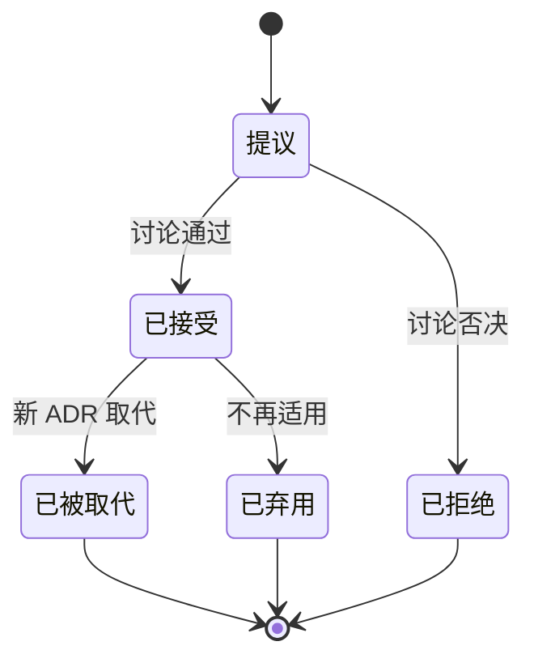

# 架构决策记录（ADR）

本目录存放项目的**架构决策记录**——为什么不那样做，而这样做了。

---

## 为什么需要 ADR

设计文档（`docs/DESIGN.md` 与 `docs/design/`）说明的是**系统现在长什么样**。它不解释**为什么不是另一个样子**。

结果就是：三个月后有人（可能就是你自己）看着一段奇怪的代码想「为什么要这么绕」，然后把它"简化"掉，破坏了一个不明显的约束。

ADR 解决这个问题。它记录：

- 当时面对什么问题
- 有哪些选项
- 为什么选了这一个
- 代价是什么

**ADR 的价值在"为什么"上，不在"是什么"上。** 如果一个 ADR 只是复述设计文档，那它没有价值。

---

## 什么时候写 ADR

| 写 ADR | 不写 ADR |
| --- | --- |
| 改变分层依赖方向 | 改一个函数内部实现 |
| 更换数据库 / LLM / Web 框架 / 语言 | 加一个插件 |
| 破坏插件 API 兼容性（提升 `api_version`） | 修 bug |
| 新增**必需**运行时依赖 | 重命名变量 |
| 改变核心行为语义（如降级策略、预算规则） | 调整提示词措辞 |
| 引入新的抽象层（如新的 Protocol） | 调整日志格式 |
| 明确决定**不做**某件事（非目标） | 加一个测试 |
| 推翻或修正一个已有的 ADR | |

**判断标准**：这个决策如果做错了，需要付出**超过一天**的返工成本吗？如果是，写 ADR。

**不确定的时候，写了不亏。** 一个多余的 ADR 只是浪费五分钟；一个缺失的 ADR 可能浪费三天。

---

## 文件命名

```
docs/adr/NNNN-<短横线描述>.md
```

- `NNNN` 四位数字，从 `0001` 开始，**连续不跳号**
- 描述用小写英文短横线连接，简洁（3–6 个词）
- 示例：`0003-use-sqlite-as-storage-backend.md`

**0000 保留给模板**，不要用。

---

## 状态流转



| 状态 | 含义 |
| --- | --- |
| **提议** | 正在讨论，尚未生效 |
| **已接受** | 已生效，必须遵守 |
| **已弃用** | 曾经生效，现在不再适用（但保留记录） |
| **已被取代** | 被新 ADR 取代（必须写明是哪个） |
| **已拒绝** | 讨论后决定不做（**也要保留**，避免以后重复讨论） |

---

## 不可变性

**ADR 一旦「已接受」就不可修改正文。**

需要改变时：

1. 写一个新 ADR，说明为什么要改
2. 新 ADR 的状态为「已接受」
3. 旧 ADR 的状态改为「已被取代（见 ADR-XXXX）」
4. 只在旧 ADR 的**状态行**做修改，正文一字不动

这样保留了完整的决策历史。看到旧 ADR 时能顺着链条找到最新结论。

**唯一的例外**：修正错别字、补充链接、修正明显的笔误。

---

## 与设计文档的关系

```
ADR            →  为什么这样设计（历史与权衡）
docs/design/   →  现在是怎么设计的（当前状态）
src/           →  实际实现
```

**三者必须一致。**

- 如果一个 ADR 被接受，对应的设计文档必须更新（ADR 模板里有 checklist）
- 如果设计文档与实现冲突，以设计文档为准，先改文档
- 如果要偏离设计文档，**先写 ADR**

维护 ADR 时同时更新设计文档是本项目的硬性要求，见 [`CONTRIBUTING.md § 文档纪律`](../../CONTRIBUTING.md#文档纪律)。

---

## 索引

| 编号 | 标题 | 状态 | 日期 |
| --- | --- | --- | --- |
| [0001](0001-record-architecture-decisions.md) | 采用架构决策记录（ADR）机制 | 已接受 | 2026-09-15 |
| [0002](0002-use-python-as-implementation-language.md) | 使用 Python 3.11+ 作为实现语言 | 已接受 | 2026-09-15 |
| [0003](0003-sqlite-as-sole-storage-backend.md) | 使用 SQLite 作为唯一存储后端 | 已接受 | 2026-09-15 |
| [0004](0004-im-channels-outbound-only-in-v1.md) | v1 的 IM 渠道仅支持单向出站 | 已接受 | 2026-09-15 |
| [0005](0005-downgrade-instead-of-discard-suppressed-intents.md) | 打扰预算耗尽时降级而非丢弃意图 | 已接受 | 2026-09-15 |
| [0006](0006-ship-implementation-choices-as-data.md) | 发行版选型写成数据文件，不写进内核代码 | 已接受 | 2026-09-15 |

> 新增 ADR 后请在此表补充一行。**忘记更新索引是最常见的疏漏。**

---

## 写作建议

### 好的 ADR

> **背景**
> Go 的 `plugin` 包在 Windows 上不支持（官方文档明确说明 `plugin` 仅在 Linux/macOS 可用）。
> Rust 的 `dlopen` 方案无法在保持类型安全的前提下做热重载。
> 而「插件式开发，后续好添加功能」是本项目的硬性需求。
>
> **决策**
> 使用 Python 3.11+ 实现。用「依赖最小化」而不是「换语言」来满足低内存、快启动的要求。
>
> **负面**
> 启动速度与内存占用不如 Go。实测启动 ~0.6s、常驻内存 ~80MB——
> 对于本地单人使用的场景可以接受。

### 不好的 ADR

> **决策**
> 用 Python。
>
> **理由**
> Python 好用。

第二个没有记录**约束**（"插件式开发是硬性需求"），所以未来有人看到"为什么不用 Go 重写"这个问题时，可以重新提出并且可能真的去重写——然后撞上同一个坑。

### 三条规则

1. **写约束，不只写结论。** 说清楚"为什么不能选别的"。
2. **诚实写代价。** "这个方案的问题是……"比"这个方案完美"可信得多。
3. **写清楚什么情况下应该重新审视。** 决策都有时效性。

---

## 链接

- [Michael Nygard · Documenting Architecture Decisions](https://cognitect.com/blog/2011/11/15/documenting-architecture-decisions)（ADR 概念的原始文章）
- [adr-tools](https://github.com/npryce/adr-tools)（命令行工具，可选）
- [Architecture Decision Record · GitHub](https://github.com/joelparkerhenderson/architecture-decision-record)（各种模板收集）
