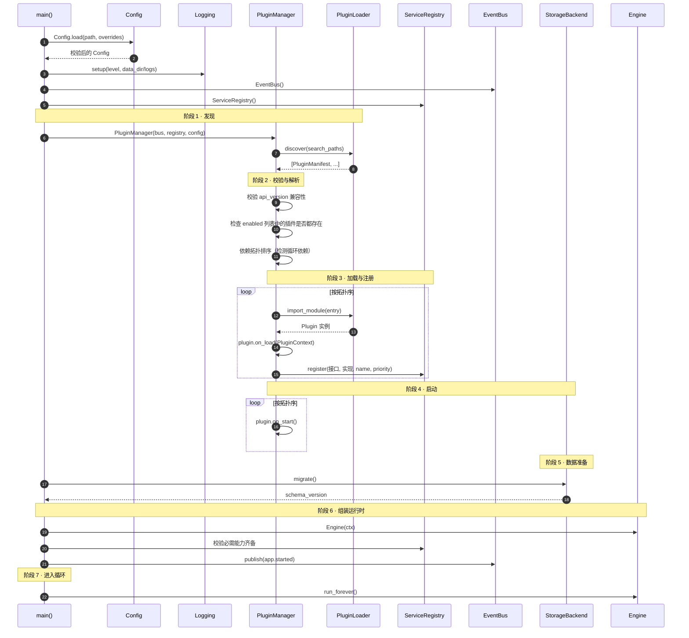
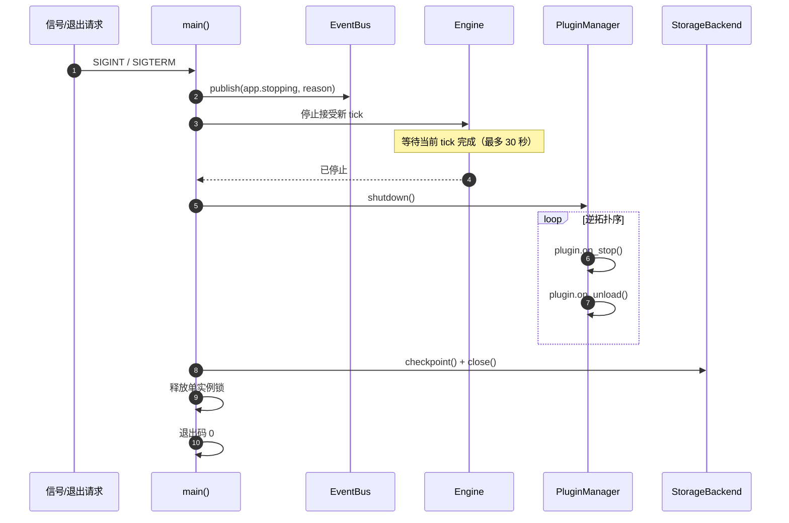

# 01 · 架构详解

> 上级文档：[DESIGN.md](../DESIGN.md) · 版本 v0.1.0
> 本文档面向**核心开发者**，描述各层内部结构、模块 API、交互协议与启动流程。

---

## 目录

1. [依赖方向与红线](#1-依赖方向与红线)
2. [内核层](#2-内核层)
3. [领域层](#3-领域层)
4. [推演层](#4-推演层)
5. [接入层](#5-接入层)
6. [启动与关闭时序](#6-启动与关闭时序)
7. [并发模型](#7-并发模型)
8. [错误处理与隔离](#8-错误处理与隔离)
9. [日志与可观测性](#9-日志与可观测性)

---

## 1. 依赖方向与红线

### 1.1 依赖矩阵

行 = 谁，列 = 可以依赖谁。`✅` 允许，`❌` 禁止。

| ↓依赖者 \ 被依赖者→ | kernel | domain | sim | llm | storage | channels | web | cli | plugins |
| --- | :-: | :-: | :-: | :-: | :-: | :-: | :-: | :-: | :-: |
| **kernel** | ✅ | ❌ | ❌ | ❌ | ❌ | ❌ | ❌ | ❌ | ❌ |
| **domain** | ✅ | ✅ | ❌ | ❌ | ❌ | ❌ | ❌ | ❌ | ❌ |
| **sim** | ✅ | ✅ | ✅ | ✅（接口） | ❌ | ❌ | ❌ | ❌ | ❌ |
| **llm** | ✅ | ✅ | ❌ | ✅ | ❌ | ❌ | ❌ | ❌ | ❌ |
| **storage** | ✅ | ✅ | ❌ | ❌ | ✅ | ❌ | ❌ | ❌ | ❌ |
| **channels** | ✅ | ✅ | ❌ | ❌ | ❌ | ✅ | ❌ | ❌ | ❌ |
| **web** | ✅ | ✅ | ✅ | ❌ | ✅（接口） | ✅（接口） | ✅ | ❌ | ❌ |
| **cli** | ✅ | ✅ | ✅ | ❌ | ✅（接口） | ❌ | ✅ | ✅ | ❌ |
| **plugins** | ✅ | ✅ | ✅（接口） | ❌ | ❌ | ❌ | ❌ | ❌ | ✅ |

**关键约束**：

- `kernel` 不依赖任何其他层 → 可独立测试、可独立发布
- `domain` 只依赖 `kernel`（用其 `errors`、`logging`）→ 纯逻辑，无 IO
- `sim` 通过**接口**调用 `llm` 与 `storage`，不直接 import 具体实现
- `plugins` 可以依赖任意层的**公开接口**，但禁止 import 其他插件的内部模块

### 1.2 自动化红线检查

CI 中执行以下检查，违反即构建失败：

```bash
# 红线 1：内核不得出现具体插件名
! grep -rEn "sqlite|openai|wecom|dingtalk|fastapi" src/alterego/kernel/

# 红线 2：领域层不得有 IO
! grep -rEn "open\(|sqlite3|requests|httpx|aiohttp" src/alterego/domain/

# 红线 3：推演层不得直接 import 具体存储实现
! grep -rEn "from alterego\.storage\.sqlite" src/alterego/sim/

# 红线 4：推演层不得直接 import 具体 LLM 实现
! grep -rEn "from alterego\.llm\.client" src/alterego/sim/
```

红线检查脚本置于 `scripts/check_architecture.sh`，`make lint` 与 CI 均调用。

---

## 2. 内核层

### 2.1 `errors.py` — 异常层次

```
AlterEgoError                    # 所有异常基类
├── ConfigError                  # 配置缺失/非法
├── PluginError                  # 插件相关
│   ├── PluginManifestError      # 清单解析失败
│   ├── PluginLoadError          # 导入/实例化失败
│   ├── PluginDependencyError    # 依赖缺失或循环
│   └── PluginRuntimeError       # 运行时异常
├── StorageError                 # 持久化失败
│   ├── MigrationError           # 迁移失败
│   └── IntegrityError           # 数据完整性
├── LLMError                     # 模型调用失败
│   ├── LLMRateLimitError        # 限流（可重试）
│   ├── LLMTimeoutError          # 超时（可重试）
│   ├── LLMResponseError         # 响应格式非法（可重试）
│   └── LLMBudgetExceeded        # 超出配额（不可重试）
└── SimulationError              # 推演失败
    ├── TickAborted              # 单次 tick 被中止（可恢复）
    └── IntentRejected           # 意图被预算/规则拒绝
```

**约定**：所有异常携带 `context: dict` 字段，便于日志与用户提示。

### 2.2 `config.py` — 配置

```python
@dataclass(frozen=True)
class CoreConfig:
    data_dir: Path
    log_level: str
    locale: str
    timezone: str
    random_seed: int | None

@dataclass(frozen=True)
class SimulationConfig:
    mode: Literal["realtime", "fast", "turbo"]
    tick_interval_minutes: int
    speed_multiplier: float
    npc_tick_interval_minutes: int
    enable_npc_conversations: bool

@dataclass(frozen=True)
class DisturbBudgetConfig:
    daily_message_limit: int
    daily_message_limit_urgent: int
    daily_post_limit: int
    quiet_hours: tuple[time, time]
    min_interval_minutes: int
    consecutive_no_reply_limit: int

@dataclass(frozen=True)
class Config:
    core: CoreConfig
    simulation: SimulationConfig
    disturb_budget: DisturbBudgetConfig
    llm: LLMConfig
    plugins: PluginsConfig
    web: WebConfig
    # ...

    @classmethod
    def load(cls, path: Path | None = None, overrides: dict | None = None) -> "Config": ...
```

**加载优先级**（后者覆盖前者）：

```
dataclass 默认值  →  alterego/defaults.toml  →  config/alterego.toml
                  →  环境变量 (ALTEREGO_*)  →  CLI 参数  →  测试注入
```

> **为什么第二层是数据文件而不是代码。** 「默认用哪个 LLM provider」「默认用哪个
> 存储后端」属于**发行版**的选择，不属于**内核**。如果把它们写成 dataclass 的
> 默认值，`kernel/config.py` 里就会出现具体技术名词，P1「内核无知」当场失效
> （`scripts/check_architecture.sh` 第 1 组会红）。因此这些值放在随包分发的
> `src/alterego/defaults.toml` 里，内核只认识字符串形式的 provider / backend 名。
> 换发行版 = 换一个数据文件，内核一行都不用改。见 ADR-0006。

**实现要点**：

| 要点 | 做法 |
| --- | --- |
| TOML 解析 | Python 3.11 内置 `tomllib`，无第三方依赖 |
| 密钥注入 | 配置值形如 `${ENV_VAR}` 时在加载阶段解析为环境变量内容；变量缺失直接失败并点名 |
| 校验 | `__post_init__` 中校验范围（如 `0 <= daily_message_limit <= 20`） |
| 不可变 | 全部 `frozen=True`，防止运行时被意外修改 |
| 脱敏 | `Config.redacted()` 返回密钥替换为 `***` 的副本，用于日志与 Web 展示 |
| 环境变量映射 | `ALTEREGO_CORE__LOG_LEVEL` 双下划线表示层级；只有一级的 `ALTEREGO_XXX` 忽略而非猜测 |
| 用户命名的段 | `[channels.<id>]` → `channels.options`、`[llm.<name>]` → `llm.providers`、`[plugins.config."<id>"]` → `plugins.config`（自动折叠） |
| 未知键 | 只记录进 `Config.unknown_keys` 并告警，不失败——插件可能需要它们（P4） |
| 权威参考 | `templates/alterego.toml` 必须覆盖所有键，测试断言其 `unknown_keys == ()` |

### 2.3 `bus.py` — 事件总线

```python
@dataclass(frozen=True)
class Event:
    topic: str                          # 点分主题，如 "tick.completed"
    payload: dict[str, Any]
    timestamp: datetime
    source: str                         # 发出者 id（插件 id 或 "kernel"）
    event_id: str                       # uuid4，用于去重与追踪
    correlation_id: str | None          # 同一 tick 内的事件共享，便于串联

class EventBus:
    def subscribe(
        self,
        topic: str,                     # 支持通配符："tick.*"、"*"
        handler: Callable[[Event], None | Awaitable[None]],
        *,
        priority: int = 0,              # 数值大者先执行
        once: bool = False,
    ) -> Subscription: ...

    def publish(self, event: Event) -> None: ...       # 同步派发
    async def publish_async(self, event: Event) -> None: ...  # 异步派发，等待全部完成

    def unsubscribe(self, sub: Subscription) -> None: ...
```

**设计要点**：

| 特性 | 说明 |
| --- | --- |
| 通配符 | `fnmatch` 风格：`tick.*` 匹配 `tick.started`、`tick.completed`；`*` 匹配全部 |
| 优先级 | 同主题多订阅者按 `priority` 降序执行；同优先级按注册顺序 |
| 同步 vs 异步 | 内核内部事件用同步派发（低延迟）；对外推送（渠道）用异步派发并 `gather` |
| 异常隔离 | 单个 handler 抛异常 → 记录日志 + 发 `bus.handler_failed` 事件，**继续调用其余 handler** |
| 重入保护 | 同步派发中若 handler 再次 publish，进入递归处理但限制深度（默认 8 层），超出则告警 |
| 事件日志 | 可选开启（`ALTEREGO_EVENT_LOG=1`），事件写入 `event_log` 表用于 Web 回放 |

**标准事件主题表**：

| 主题 | 发出者 | 载荷 | 订阅者示例 |
| --- | --- | --- | --- |
| `app.started` | Kernel | `{version, plugins}` | Web, 日志 |
| `app.stopping` | Kernel | `{reason}` | 各插件（清理） |
| `config.loaded` | Kernel | `{redacted_config}` | 日志 |
| `plugin.loaded` | PluginManager | `{plugin_id, version}` | 日志, Web |
| `plugin.failed` | PluginManager | `{plugin_id, error}` | 日志, Web, 告警 |
| `tick.started` | Engine | `{tick_id, virtual_time}` | Web(SSE), 日志 |
| `tick.completed` | Engine | `{tick_id, intent, duration_ms}` | Web, 日志, 统计 |
| `tick.failed` | Engine | `{tick_id, error}` | 日志, Web |
| `activity.started` | ActStage | `{activity_id, type, description}` | Web, 日志 |
| `emotion.changed` | ReflectStage | `{old, new, reason}` | Web |
| `memory.created` | ReflectStage | `{memory_id, content, importance}` | Web |
| `intent.selected` | IntentionStage | `{intent, motivation, params}` | Web |
| `intent.suppressed` | Budget | `{intent, reason, degraded_to}` | Web（「内心」页面） |
| `post.created` | ExpressStage | `{post_id, content}` | Channels |
| `message.created` | ExpressStage | `{message_id, conversation_id, content, direction}` | Channels |
| `message.received` | Channel | `{channel_id, content, from}` | Engine |
| `llm.requested` | LLMRouter | `{tier, model, prompt_hash}` | 计量 |
| `llm.responded` | LLMRouter | `{tier, tokens, latency_ms, cost}` | 计量, Web |
| `budget.exhausted` | Budget | `{kind, used, limit}` | 日志, Web |

### 2.4 `registry.py` — 服务注册表

内核不 import 具体实现，而是按**接口类型**查找实现：

```python
class ServiceRegistry:
    def register(self, interface: type[T], instance: T, *, name: str, priority: int = 0) -> None: ...
    def get(self, interface: type[T], name: str | None = None) -> T: ...
    def get_all(self, interface: type[T]) -> list[tuple[str, T]]: ...
    def get_optional(self, interface: type[T], name: str | None = None) -> T | None: ...
    def unregister(self, interface: type[T], name: str) -> None: ...
    def has(self, interface: type[T], name: str | None = None) -> bool: ...
```

**使用示例**（推演层，不认识 sqlite）：

```python
from alterego.interfaces import StorageBackend, LLMProvider, MemoryRepository

class ReflectStage(Stage):
    def __init__(self, ctx: PluginContext) -> None:
        self.storage = ctx.registry.get(StorageBackend)          # 拿到任意后端
        self.memory_repo = ctx.registry.get(MemoryRepository)
        self.llm = ctx.registry.get(LLMProvider, name="strong")  # 按档位取
```

**多实现解析规则**：

| 场景 | 行为 |
| --- | --- |
| 只有一个实现 | 直接返回 |
| 多个实现且未指定 `name` | 返回 `priority` 最高者；若并列则抛 `PluginError` 提示需显式指定 |
| 未指定 `name` 且无实现 | 抛 `PluginError`，提示需要哪个插件 |
| 用 `get_optional` | 无实现返回 `None`，调用方自行降级 |

**这样做的好处**：删除或替换任何插件都不会导致 `ImportError`，只会在启动时给出清晰的能力缺失提示。

### 2.5 `clock.py` — 时钟

```python
class Clock(Protocol):
    def now(self) -> datetime: ...              # 当前时间（UI 展示用）
    def virtual_now(self) -> datetime: ...      # Agent 感知的时间
    def advance(self, delta: timedelta) -> None: ...
    async def sleep_until(self, when: datetime) -> None: ...

class RealClock:
    """真实时钟，virtual_now() == now()"""
    ...

class VirtualClock:
    """虚拟时钟，支持倍速与跳转"""
    def __init__(self, start: datetime, speed: float = 1.0) -> None:
        self._virtual = start
        self._speed = speed
        self._real_start = datetime.now()

    def virtual_now(self) -> datetime:
        elapsed = datetime.now() - self._real_start
        return self._virtual + elapsed * self._speed

    def advance(self, delta: timedelta) -> None:
        """推演引擎调用：直接推进虚拟时间"""
        self._virtual += delta

    def set_speed(self, speed: float) -> None: ...
    def jump_to(self, when: datetime) -> None: ...
```

**关键语义**：

- `virtual_now()` 是**唯一**被 Agent 用来判断时间的方法。所有作息判定、时段计算、记忆衰减都基于它
- `RealClock.virtual_now()` 直接返回真实时间 → 运行时代码无需区分时钟类型
- **测试**用 `FrozenClock`（时间不再流动，只在 `advance()` 时前进）→ 推演完全确定

```python
class FrozenClock:
    """测试专用：虚拟时间完全由 advance() 控制"""
    def __init__(self, start: datetime) -> None:
        self._now = start
    def virtual_now(self) -> datetime: return self._now
    def advance(self, delta: timedelta) -> None: self._now += delta
```

### 2.6 `scheduler.py` — 调度器

```python
class Scheduler:
    def every(self, interval: timedelta, job: Callable[[], Awaitable[None]],
              *, name: str, jitter: timedelta = timedelta(0)) -> JobHandle: ...
    def at(self, when: datetime, job: Callable[[], Awaitable[None]], *, name: str) -> JobHandle: ...
    def at_time_of_day(self, t: time, job: Callable[[], Awaitable[None]],
                       *, name: str, tz: str = "Asia/Shanghai") -> JobHandle: ...
    def cancel(self, handle: JobHandle) -> None: ...
    async def run_forever(self) -> None: ...
```

**设计要点**：

| 要点 | 说明 |
| --- | --- |
| 基于 `Clock` | 所有时间判断用 `clock.virtual_now()` → 倍速下定时任务也会加速 |
| `jitter` | 加入随机抖动，避免多个任务在同一瞬间集中触发（拟人化：不会整点准时） |
| 任务隔离 | 单个任务异常不会中断调度器，记录后继续 |
| 错过补偿 | 若虚拟时间跳跃导致错过多个触发点，默认只执行一次（`coalesce=True`），避免倍速下任务风暴 |
| 取消安全 | `cancel` 后若任务正在执行，等待其结束 |

**内置任务**：

| 名称 | 频率 | 说明 |
| --- | --- | --- |
| `simulation_tick` | `tick_interval_minutes` | 推演引擎主循环 |
| `npc_tick` | `npc_tick_interval_minutes` | NPC 社交推演 |
| `memory_decay` | 每 6 虚拟小时 | 记忆强度衰减计算 |
| `budget_reset` | 每日 00:00 虚拟时间 | 重置打扰预算计数 |
| `db_checkpoint` | 每 30 真实分钟 | SQLite WAL checkpoint |
| `llm_usage_rollup` | 每小时 | 成本统计汇总 |

### 2.7 插件体系（`kernel/`）

插件契约与生命周期是本项目的核心，独立成册，详见 [02-plugin-api.md](02-plugin-api.md)。

模块划分：

| 模块 | 职责 |
| --- | --- |
| `manifest.py` | `plugin.toml` 的解析与校验、配置取值（`PluginManifest` / `ConfigField` / `resolve_config`） |
| `context.py` | 插件的运行期上下文：`PluginContext` / `PluginPaths` / `PluginState`，以及带归属的 `OwnedBus` / `OwnedRegistry` 视图 |
| `plugin.py` | 门面：`Plugin` 基类 + 转发上两者的全部公开名字。**插件只需要 import 这一个模块** |
| `loader.py` | 发现（本地目录 + pip entry points）、导入、依赖解析与拓扑排序 |
| `manager.py` | 生命周期编排、错误隔离、熔断、热重载 |

> **为什么 `plugin.py` 要拆**：它一度同时装着「怎么读清单」「怎么建上下文」「插件基类」
> 三件互相无关的事。拆开之后每个模块只需要更少的知识——`manifest.py` 甚至不知道
> 事件总线存在。这不是为了「文件小一点」，而是为了让 900 行红线与
> 架构红线脚本能真正约束住内核（见 `tests/test_architecture.py`）。

---

## 3. 领域层

领域层是**纯函数式**的：给定状态与事件，返回新状态，不修改输入、不做 IO、不调 LLM。

### 3.1 设计模式

```python
# 情绪更新：纯函数
def update_emotion(
    current: Emotion,
    events: list[EmotionEvent],
    baseline: EmotionBaseline,
    sensitivity: float,
    elapsed: timedelta,
) -> tuple[Emotion, str]:
    """返回 (新情绪, 变化原因说明)"""
```

**为什么返回「变化原因」**：写入 `emotion_log.reason`，让 Web 页面与 `alterego why` 能展示「它为什么心情不好」。

### 3.2 各模块职责

#### `persona.py`

```python
@dataclass(frozen=True)
class Persona:
    id: str
    name: str
    age: int
    gender: str
    city: str
    occupation: str
    # 性格
    big_five: BigFive               # openness/conscientiousness/extraversion/agreeableness/neuroticism
    traits: tuple[str, ...]         # 自由标签："话痨"、"社恐"、"强迫症"
    values: tuple[str, ...]
    # 表达
    tone: str                       # "轻松幽默带点自嘲"
    verbosity: Literal["terse", "normal", "chatty"]
    emoji_habit: Literal["never", "rare", "frequent"]
    catchphrases: tuple[str, ...]   # "绝了"、"绷不住了"
    typing_quirks: tuple[str, ...]  # "喜欢分多条短消息发"、"偶尔打错字再撤回"
    # 偏好
    likes: tuple[str, ...]
    dislikes: tuple[str, ...]
    habits: tuple[str, ...]
    fears: tuple[str, ...]
    desires: tuple[str, ...]
    # 背景
    backstory: str
    current_situation: str
    goals: tuple[str, ...]
    # 基线
    emotion_baseline: EmotionBaseline
    sensitivity: float              # 情绪敏感度 0~2

    def to_prompt(self, detail: Literal["minimal", "normal", "full"]) -> str:
        """渲染为提示词片段。detail 控制 token 消耗"""

    @classmethod
    def from_yaml(cls, path: Path) -> "Persona": ...
    def to_yaml(self, path: Path) -> None: ...
```

#### `emotion.py`

二维模型 + 离散标签，含自然回归、事件冲击、惯性、疲劳：

```python
@dataclass(frozen=True)
class Emotion:
    valence: float          # -1 ~ 1
    arousal: float          # 0 ~ 1
    label: str              # 开心/平静/烦躁/低落/兴奋/焦虑/疲惫/感动/委屈/恼火
    fatigue: float          # 0 ~ 1 累积疲劳
    updated_at: datetime

def decay_toward(current: Emotion, baseline: EmotionBaseline,
                 elapsed: timedelta, half_life_hours: float = 4.0) -> Emotion:
    """指数回归到基线"""

def apply_event(current: Emotion, event: EmotionEvent, sensitivity: float) -> Emotion:
    """事件冲击 + 惯性放大/削弱"""

LABEL_RULES: list[tuple[float, float, str]] = [
    # (valence_min, arousal_min, label) 用于无 LLM 时的降级标签推断
]

def infer_label(valence: float, arousal: float) -> str:
    """按象限推断粗粒度标签（LLM 不可用时的降级路径）"""
```

**降级策略**：LLM 不可用时，情绪更新退化为纯数学规则 + `infer_label()`，保证 Agent 仍能运转（只是不够细腻）。

#### `memory.py`

```python
@dataclass(frozen=True)
class Memory:
    id: str
    kind: Literal["episodic", "semantic", "emotional"]
    content: str
    summary: str                    # 一句话摘要，用于提示词注入
    importance: float               # 0 ~ 1，写入时评定
    strength: float                 # 当前强度，随时间衰减
    valence: float                  # 情绪色彩 -1 ~ 1
    entities: tuple[str, ...]       # 涉及的人物/地点，用于关系触发
    tags: tuple[str, ...]
    occurred_at: datetime
    last_recalled_at: datetime | None
    recall_count: int

def strength_at(memory: Memory, now: datetime, decay_rate: float = 0.05) -> float:
    """strength = importance * exp(-decay_rate * days) * (1 + log1p(recall_count))"""

def rank_memories(
    candidates: list[Memory],
    now: datetime,
    query_valence: float | None = None,
    weights: RetrievalWeights = RetrievalWeights(),
) -> list[tuple[Memory, float]]:
    """综合排序：相关性(由检索层提供) × 重要度 × 新近度 × 情绪一致度"""
```

**检索流程**（`sim/stages/reflect.py` 调用）：

1. 从 `TickContext` 取查询关键词（当前活动、意图、最近对话）
2. `MemoryRepository.search_fts(keywords, limit=50)` 召回候选（FTS5）
3. 可选：`EmbeddingProvider` 插件做语义召回并合并
4. `rank_memories()` 重排，取 Top-K（默认 8 条）
5. 更新被选中记忆的 `recall_count` 与 `last_recalled_at`（复习效应）

#### `relationship.py`

```python
@dataclass(frozen=True)
class Relationship:
    target_id: str                  # "user" 或 npc id
    target_name: str
    relation_type: Literal["user", "family", "friend", "close_friend",
                           "colleague", "acquaintance", "rival"]
    affinity: float                 # -100 ~ 100
    familiarity: float              # 0 ~ 100
    trust: float                    # 0 ~ 100
    tension: float                  # 0 ~ 100
    notes: str                      # LLM 生成的印象笔记
    last_contact_at: datetime | None
    interaction_count: int

def apply_interaction(rel: Relationship, kind: InteractionKind,
                      magnitude: float, now: datetime) -> Relationship:
    """根据互动类型调整各维度"""

def longing_score(rel: Relationship, now: datetime) -> float:
    """想念度：距离上次联系越久、好感度越高 → 越想联系
    这是 reach_out 意图中 miss_you 动机的量化依据
    """

def tone_hint(rel: Relationship) -> str:
    """根据关系状态给出语气提示，注入提示词（如紧张度高时会更客气）"""
```

#### `schedule.py`

```python
@dataclass(frozen=True)
class ScheduleBlock:
    start: datetime
    end: datetime
    activity: str                   # "工作"、"午餐"、"通勤"
    category: Literal["sleep", "work", "meal", "commute",
                      "leisure", "social", "chore", "other"]
    interruptible: bool
    location: str | None
    source: Literal["template", "llm", "manual"]

def generate_day(
    template: ScheduleTemplate, day: date, rng: random.Random,
    emotion: Emotion, weather: str | None = None,
) -> list[ScheduleBlock]:
    """从模板生成一天的日程：应用 flexible 抖动 + 情绪修正（低落时可能跳过健身）"""

def current_block(blocks: list[ScheduleBlock], now: datetime) -> ScheduleBlock | None: ...

def is_interruptible(blocks: list[ScheduleBlock], now: datetime) -> bool:
    """判断当前是否允许被主动联系打断（打扰预算的关键输入）"""
```

#### `world.py` / `post.py` / `conversation.py`

较为直白的数据模型与工具函数，细节见 [03-data-model.md](03-data-model.md)。

---

## 4. 推演层

详见 [04-simulation-loop.md](04-simulation-loop.md)。此处只描述结构。

```python
class Stage(Protocol):
    """推演阶段插件契约"""
    name: str
    order: int                      # 越小越先执行
    depends_on: tuple[str, ...]     # 依赖的其他阶段名（拓扑约束）
    enabled: bool

    async def run(self, ctx: TickContext) -> StageResult: ...

@dataclass
class StageResult:
    ok: bool
    changes: dict[str, Any]         # 对 ctx 的修改
    error: Exception | None = None

class Engine:
    def __init__(self, ctx: PluginContext) -> None: ...
    async def tick_once(self) -> TickResult: ...
    async def run_forever(self) -> None: ...
    async def run_until(self, when: datetime) -> None: ...
```

**`TickContext` 字段**：

| 字段 | 说明 |
| --- | --- |
| `tick_id` | uuid |
| `virtual_now` | 本 tick 的虚拟时间 |
| `correlation_id` | 贯穿本 tick 所有事件 |
| `state` | 状态快照：persona / emotion / relationships / current_block / recent_memories |
| `rng` | 本 tick 的随机源（由全局 seed 派生，保证可复现） |
| `percepts` | 感知阶段输出 |
| `candidates` | 候选意图列表 |
| `chosen_intent` | 最终选中的意图（含动机） |
| `suppressed` | 被预算拦截的意图及降级结果 |
| `actions` | 已执行的动作 |
| `expressions` | 生成的文本（动态/消息/独白） |
| `llm_calls` | 本 tick 的 LLM 调用记录 |
| `notes` | 各阶段追加的解释性说明，最终写入 `tick_log` |

---

## 5. 接入层

### 5.1 CLI 结构

`cli/main.py` 用 `argparse`（Python 内置，无第三方依赖）实现，子命令在 `cli/commands/` 下各自成模块：

```python
# cli/main.py
def build_parser() -> argparse.ArgumentParser:
    parser = argparse.ArgumentParser(prog="alterego", description="拟人 Agent 生活模拟器")
    sub = parser.add_subparsers(dest="command", required=True)
    for name in ("init", "run", "tick", "chat", "post", "state",
                 "timeline", "memory", "why", "serve", "plugins",
                 "persona", "world", "export", "import", "stats"):
        getattr(import_module(f"alterego.cli.commands.{name}"), "register")(sub)
    return parser
```

**为什么用 argparse 而非 Click/Typer**：零依赖，符合 P5「Stdlib First」原则。子命令模块化保证了可维护性。

### 5.2 Web 结构

```python
# web/app.py
def create_app(ctx: PluginContext) -> FastAPI:
    app = FastAPI(title="AlterEgo", version=__version__)

    @app.get("/api/state")
    async def get_state() -> dict: ...

    @app.get("/api/timeline")
    async def get_timeline(date: str) -> dict: ...

    @app.get("/api/posts")
    async def get_posts(limit: int = 50) -> list[dict]: ...

    @app.post("/api/chat")
    async def post_chat(body: ChatRequest) -> dict: ...      # 入站消息入口

    @app.get("/api/stream")                                  # SSE
    async def stream(request: Request) -> EventSourceResponse: ...

    @app.get("/api/plugins")
    async def list_plugins() -> list[dict]: ...

    app.mount("/", StaticFiles(directory=STATIC_DIR, html=True), name="static")
    return app
```

**SSE 实现**（`web/sse.py`）：

```python
class SSEHub:
    def __init__(self, bus: EventBus) -> None:
        self._queues: set[asyncio.Queue] = set()
        bus.subscribe("*", self._on_event)      # 订阅所有事件

    def _on_event(self, event: Event) -> None:
        for q in list(self._queues):
            if q.qsize() < 100:                 # 背压保护：队列满则丢事件
                q.put_nowait(event)

    async def stream(self, request: Request) -> AsyncIterator[str]:
        q: asyncio.Queue = asyncio.Queue()
        self._queues.add(q)
        try:
            while True:
                if await request.is_disconnected():
                    break
                try:
                    event = await asyncio.wait_for(q.get(), timeout=15.0)
                    yield format_sse(event)
                except asyncio.TimeoutError:
                    yield ": keepalive\n\n"     # 心跳防断连
        finally:
            self._queues.discard(q)
```

**前端**：原生 HTML + CSS + 少量 JS（`EventSource` 订阅 `/api/stream`，收到事件后更新 DOM）。无构建步骤、无 npm。

### 5.3 守护进程

```python
# daemon.py
async def run_daemon(config: Config) -> int:
    lock = acquire_single_instance_lock(config.core.data_dir / "alterego.lock")

    ctx = await bootstrap(config)               # 加载插件、迁移数据库
    try:
        async with asyncio.TaskGroup() as tg:
            tg.create_task(ctx.engine.run_forever())
            tg.create_task(ctx.scheduler.run_forever())
            if config.web.enabled:
                tg.create_task(run_web_server(ctx))
            tg.create_task(wait_for_shutdown_signal())
    except* KeyboardInterrupt:
        pass
    finally:
        await ctx.shutdown()
        lock.release()
    return 0
```

---

## 6. 启动与关闭时序

### 6.1 启动



**失败处理**：

| 失败点 | 行为 |
| --- | --- |
| 配置非法 | 打印具体错误与修复建议，退出码 2 |
| `api_version` 不兼容 | 该插件标记 `Failed`，继续（除非是必需插件） |
| `enabled` 中列出的插件不存在 | 明确报错退出，提示 `alterego plugins doctor` |
| 循环依赖 | 列出环上的插件名，退出码 3 |
| 插件 `on_load` 抛异常 | 隔离该插件，发 `plugin.failed`，继续 |
| 必需能力缺失（无 LLM / 无存储） | 报错退出，提示需要哪个插件 |
| 迁移失败 | 退出码 4，并提示备份路径 |

### 6.2 关闭



**「等待当前 tick 完成」很重要**：中途 kill 会留下半完成的写入（例如动态已生成但消息未发）。每个 tick 是一个事务，`PersistStage` 统一 commit。

---

## 7. 并发模型

单进程 + `asyncio` 事件循环 + 少量线程。

| 组件 | 执行方式 | 理由 |
| --- | --- | --- |
| Tick 循环 | asyncio 任务 | IO 密集（LLM 调用为主） |
| LLM 调用 | `httpx.AsyncClient` 并发 | 单 tick 内多个子任务可并行 |
| SQLite 操作 | `asyncio.to_thread` 包装同步 `sqlite3` | 避免阻塞事件循环；SQLite 单写者特性天然串行化写 |
| Web 服务器 | uvicorn（独立线程或同循环） | 复用事件循环更简单 |
| 文件监听（插件热重载） | 独立线程（轮询 mtime，无 watchdog 依赖） | 保持零额外依赖 |
| 渠道推送 | asyncio 任务，带超时与重试 | 失败不阻塞推演 |

**并发安全**：

| 资源 | 保护方式 |
| --- | --- |
| `ServiceRegistry` | 写入仅在启动阶段；运行时只读 → 无需锁 |
| `EventBus` 订阅表 | 启动阶段写入；运行时只读 → 无需锁 |
| SQLite 写 | 所有写操作经 `asyncio.Lock`（`StorageBackend._write_lock`）串行化 |
| 打扰预算计数 | 单线程事件循环内操作 → 无需锁 |
| 插件热重载 | `PluginManager._reload_lock` 保护，重载期间暂停 tick |

**背压**：SSE 队列、渠道发送队列均有容量上限，满时丢弃最旧事件并记录警告，绝不无限增长。

---

## 8. 错误处理与隔离

### 8.1 三级隔离

| 级别 | 范围 | 处理 |
| --- | --- | --- |
| **L1 · 插件级** | 单个插件加载/启动失败 | 标记 `Failed`，记录，继续启动其余插件 |
| **L2 · 阶段级** | 某个 Stage 在 tick 中抛异常 | 该阶段标记失败，**跳过后续依赖它的阶段**，tick 以 `partial` 状态结束并记录 |
| **L3 · Tick 级** | 整个 tick 异常 | 记录 `tick.failed`，回滚事务，**继续下一个 tick**（不中断进程） |

**为什么不用 L3 直接崩溃**：这是一个长期运行的守护进程。一次失败的 tick 只意味着「这一分钟它没做任何事」，而进程崩溃会导致它「死掉」。可恢复性优先。

**例外**：连续 N 次（默认 5）tick 失败 → 进入**降级模式**（关闭 LLM 依赖的重阶段，仅维持基础生活循环）并发告警事件。

### 8.2 LLM 重试策略

```python
RETRY_POLICY = {
    LLMRateLimitError: Retry(max_attempts=3, backoff="exponential", base=2.0),
    LLMTimeoutError:   Retry(max_attempts=3, backoff="exponential", base=1.0),
    LLMResponseError:  Retry(max_attempts=2, backoff="fixed", delay=0.5),
    LLMBudgetExceeded: NoRetry(),
}
```

结构化输出失败（JSON 解析错误）时，第二次尝试会在提示词中追加**失败原因与格式示例**（自修复重试）。

### 8.3 降级路径总表

| 组件不可用 | 降级行为 |
| --- | --- |
| LLM 完全不可用 | 情绪走数学规则；意图走权重随机；表达走模板库；不产生新人格/世界生成 |
| 便宜模型不可用 | 全部请求走强模型（成本上升，功能正常） |
| 强模型不可用 | 决策与表达走便宜模型（质量下降，仍可用） |
| 向量检索插件不可用 | 退回 FTS5 |
| 某渠道不可用 | 记录失败，其余渠道继续；Web 始终作为兜底（本地） |
| 存储不可用 | 无法降级，直接退出（数据安全优先） |

---

## 9. 日志与可观测性

### 9.1 日志格式

结构化 JSON Lines 输出到 `data/logs/alterego.log`，同时人类可读格式输出到 stderr：

```json
{"ts":"2026-09-15T14:32:11.234+08:00","level":"INFO","logger":"sim.intention",
 "msg":"意图已选定","tick_id":"a1b2...","intent":"reach_out",
 "motivation":"share_something","urgency":0.3,"budget_ok":true}
```

**关键约定**：`tick_id` 与 `correlation_id` 贯穿一次 tick 的所有日志 → 可用 `grep <tick_id>` 完整还原推演过程。

### 9.2 可解释性命令

```bash
$ alterego why
Tick a1b2c3d4 @ 2026-09-15 14:32 (虚拟时间)

【当时状态】
  情绪    valence=+0.42 arousal=0.55 label=开心
  日程    自由时间 (19:00-23:00 之外，实际 14:32 属于 工作，interruptible=false)
  关系    user affinity=72 familiarity=45 上次联系 3 小时前

【检索到的记忆】(Top 3 / 共 8 条)
  1. [0.81] 用户提到过在做 AI 项目 (semantic, 3 天前, strength=0.74)
  2. [0.66] 上周三聊到喜欢独立游戏 (episodic, 8 天前, strength=0.51)
  3. [0.43] 用户说过最近很累 (episodic, 3 天前, strength=0.68)

【候选意图】
  work          权重 0.35  当前日程为工作时段
  reach_out     权重 0.41  想念度 0.62；刚看到独立游戏视频触发
  entertain     权重 0.18
  rest          权重 0.06

【决策】
  选中 reach_out
  动机 share_something
  触发 "刚刷到一个关于独立游戏的视频，想起用户在做 AI 项目"
  urgency 0.3

【预算校验】
  今日已用 1/3 条  距上次 180 分钟 (>=90 ✓)
  当前时段 14:32  static quiet_hours=23:30-08:00 ✓
  当前日程 interruptible=false ✗  ← 工作时段，主动消息被拦截

【降级】
  reach_out → reflect_internal
  内心独白已写入 activity_log#8821（Web「内心」页面可见）

【LLM 消耗】
  3 次调用  1240 prompt + 328 completion tokens  耗时 2.1s
```

这个命令是本项目「可解释性」的集中体现——它让系统**可调试**，也让用户能看到 Agent 那些"想说但没说出口"的话，非常有拟人感。

### 9.3 指标

| 指标 | 采集方式 | 查看方式 |
| --- | --- | --- |
| Tick 平均耗时 | `tick_log.duration_ms` | `alterego stats` |
| 意图分布 | `tick_log.intent` 聚合 | `alterego stats` |
| LLM 调用量与成本 | `llm_usage` 表 | `alterego stats` |
| 主动消息实际发出次数 | `activity_log` 过滤 | Web 后台 |
| 预算拦截率 | `intent.suppressed` 事件计数 | Web 后台 |
| 插件失败次数 | `plugin.failed` 事件计数 | `alterego plugins doctor` |
| 记忆库规模与强度分布 | `memory` 表统计 | Web 记忆页 |

---

## 变更记录

| 日期 | 版本 | 变更 | 作者 |
| --- | --- | --- | --- |
| 2026-09-15 | v0.1.0 | 初版 | LMG-arch |
| 2026-09-15 | v0.1.1 | § 4 的 `Stage` 补上 `depends_on`；§ 2.7 补充内核插件模块的拆分与理由（对齐实现） | LMG-arch |
