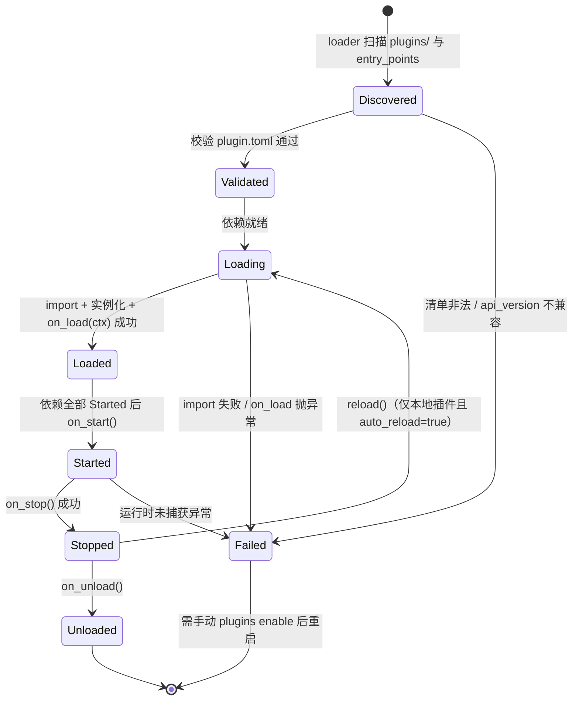
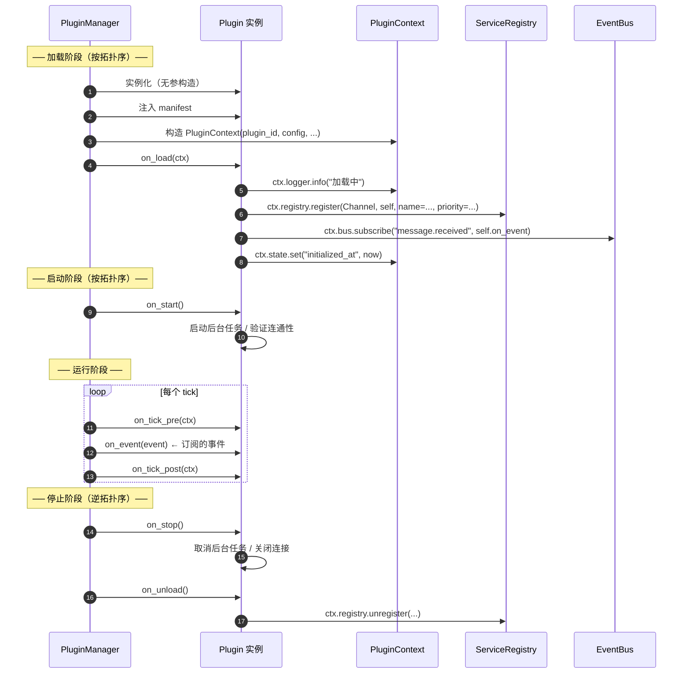
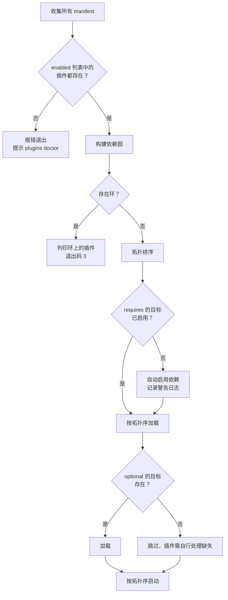
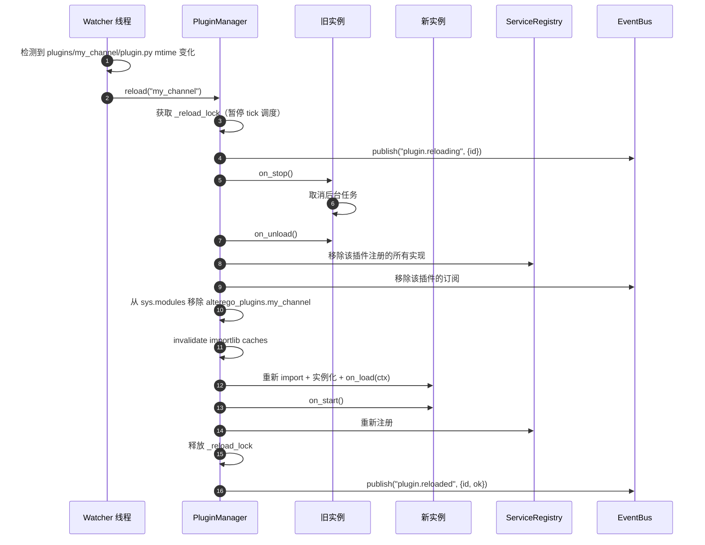

# 02 · 插件 API 规范

> 上级文档：[DESIGN.md](../DESIGN.md) · 版本 v0.1.0 · **api_version = 1**
>
> ⚠️ **本文档回答「为什么这样设计」，不回答「现在能怎么写」。**
> 它保留完整的设想想与后备方案，因此会描述**尚未实现**的东西。
>
> 要写插件，请读 **[`docs/guide/plugin-development.md`](../guide/plugin-development.md)**——
> 那里的每一条命令、每一个字段都对着当时代码验过。两者矛盾时以指南为准，
> **并且把矛盾报出来**（那说明有一边过时了）。差异清单与逐条依据见
> [`13-interface-consistency.md`](13-interface-consistency.md)。
>
> 本文档面向**插件开发者**。项目的一切可变部分都通过插件实现——LLM、存储、渠道、行为、推演阶段。

---

## 目录

1. [插件哲学](#1-插件哲学)
2. [插件类型（kind）](#2-插件类型kind)
3. [插件清单 plugin.toml](#3-插件清单-plugintoml)
4. [生命周期](#4-生命周期)
5. [PluginContext](#5-plugincontext)
6. [能力接口定义](#6-能力接口定义)
7. [扩展点（Hook）](#7-扩展点hook)
8. [依赖管理](#8-依赖管理)
9. [加载来源](#9-加载来源)
10. [热重载](#10-热重载)
11. [错误隔离](#11-错误隔离)
12. [插件状态持久化](#12-插件状态持久化)
13. [完整示例：钉钉渠道插件](#13-完整示例钉钉渠道插件)
14. [完整示例：自定义推演阶段](#14-完整示例自定义推演阶段)
15. [完整示例：新增意图类型](#15-完整示例新增意图类型)
16. [开发 Checklist](#16-开发-checklist)

---

## 1. 插件哲学

### 1.1 三条原则

| 原则 | 含义 |
| --- | --- |
| **内核无知** | 内核不认识任何具体插件，只认识接口。插件出错不影响内核 |
| **声明式契约** | 插件在 `plugin.toml` 中声明「我提供什么能力、我依赖什么」，内核据此编排 |
| **零内核修改** | 新增功能 = 新增插件目录。如果必须改内核，说明抽象有误 |

### 1.2 什么该做成插件

| 场景 | 是否插件 |
| --- | --- |
| 接入新的 LLM 供应商 | ✅ `kind = "llm"` |
| 换用 Postgres / MongoDB 存储 | ✅ `kind = "storage"` |
| 增加 Telegram / QQ 渠道 | ✅ `kind = "channel"` |
| 增加「拍照发动态」能力 | ✅ `kind = "capability"` |
| 在推演循环中插入自定义阶段 | ✅ `kind = "stage"` |
| 给 LLM 增加可调用工具 | ✅ `kind = "tool"` |
| 修改核心人格数据结构 | ❌ 这是内核/领域层的职责，需走 ADR |

### 1.3 版本兼容

`plugin.toml` 中的 `api_version` 声明插件面向的插件 API 版本。

| 插件 api_version | 内核 api_version | 结果 |
| --- | --- | --- |
| `1` | `1` | ✅ 兼容 |
| `1` | `2` | ✅ 兼容（内核保证向后兼容 1 个大版本） |
| `2` | `1` | ❌ 不兼容，插件标记 `Failed`，提示内核版本过低 |
| `1` | `3` | ❌ 不兼容，超出兼容窗口 |

**内核承诺**：`api_version` 的 `MAJOR` 递增即代表不兼容变更。这对应 SemVer 中项目版本的 `MAJOR`。

---

## 2. 插件类型（kind）

| kind | 必须实现 | 典型文件 | 内置实现 |
| --- | --- | --- | --- |
| `llm` | `on_load` 中注册 `LLMProvider` | `plugin.py` | `llm.openai_compatible` |
| `storage` | `on_load` 中注册 `StorageBackend` 及 `*Repository` | `plugin.py`, `repo/` | `storage.sqlite` |
| `channel` | 实现 `Channel` 协议并注册 | `plugin.py` | `channel.file`、`channel.web`、`channel.wecom_webhook`、`channel.dingtalk_webhook` |
| `capability` | 实现 `Capability` 协议并注册 | `plugin.py` | `capability.activity`、`capability.post`、`capability.chat` |
| `stage` | 实现 `Stage` 协议并注册到 pipeline | `plugin.py` | `stage.sense/reflect/intention/act/express/persist` |
| `tool` | 实现 `Tool` 协议并注册 | `plugin.py` | `tool.time_query` |
| `image` | 实现 `ImageProvider` 协议并注册 | `plugin.py` | `image.openai_compatible`、`image.local_sd` |
| `source` | 实现 `SearchProvider` / `FeedReader` / `PageFetcher` 并注册 | `plugin.py` | `source.tavily`、`source.rss`、`source.http_fetch` |

一个插件**只能声明一个 kind**。若需要提供多种能力，拆成多个插件（内聚性更好，也便于单独启停）。

> ⚠️ **今天只有六种 `kind` 有对应的接口。** `capability` / `tool` / `stage` /
> `channel` / `llm` / `storage` 的契约都在代码里（`interfaces/`）。
> `image` 与 `source` **只有清单层面被接受**——`plugin.toml` 里写
> `kind = "image"` 不会报错（`PluginKind` 是八值的），但
> `interfaces/image.py` 与 `interfaces/source.py` **尚未落地**，
> 内核也不会用这个 `kind` 做任何事（它目前是纯元数据，只用于展示与措辞）。
> 落地版本是 v0.2.0 / v0.3.0，见 [06-roadmap.md § 2.2](06-roadmap.md)。
> 判断依据见 [13-interface-consistency.md](13-interface-consistency.md) § 3.4。
>
> 也就是说，上表 `image` / `source` 两行的「必须实现」与「内置实现」是**设计目标**，
> 不是今天的事实。

### 2.1 为什么 `image` 与 `source` 不复用 `tool`

`tool` 的语义是「**LLM 可以主动调用的事情**」——它会被写进 function calling 列表，
由模型决定什么时候用。而生图与检索与此不同：它们是**推演循环自己决定要做的事**
（角色想拍张照、想去读点东西），决策权在 `intention` 阶段，不在 LLM 的工具选择环节。

如果把它们做成 `tool`，就会产生一个严重的副作用：

> **LLM 将有能力直接调用生图与联网，绕过打扰预算与成本闸门。**

这是 P3（机制约束优于提示词祈祷）明确反对的。所以它们各自成为独立的 kind，
只由推演层调用，绝不出现在任何 function calling 列表里。

### 2.2 `image` 的额外约束（引用 ADR-0008）

`image` 插件的清单必须显式声明是否支持参考图：

```toml
[plugin]
id = "image.openai_compatible"
kind = "image"
capabilities = ["reference"]        # 声明支持参考图；不声明 = 不支持
```

**不支持参考图的 `image` 插件会被拒绝生成人物图**（只允许风景/物品）。
这是角色形象一致性的硬要求，见 [07-model-routing-and-media.md § 5](07-model-routing-and-media.md#5-角色一致性机制而非提示词)。

### 2.3 `source` 的三个独立契约

`source` 是三选一的：一个插件至少实现一个，也可以只实现一个。

| 契约 | 用途 | 对应插件 |
| --- | --- | --- |
| `SearchProvider` | 关键词搜索 | `source.tavily` |
| `FeedReader` | 订阅固定源（带 `etag`，304 不消耗流量） | `source.rss` |
| `PageFetcher` | 抓取单个 URL 正文 | `source.http_fetch` |

搜不到就退化 RSS，全都不可用就降级为 `reflect_internal`——**绝不中断生活**。
详见 [08-external-sources.md § 3](08-external-sources.md#3-接口契约)。

---

## 3. 插件清单 plugin.toml

### 3.1 完整字段参考

> ⚠️ 下面这份清单是**一份可用的完整示范**：`api_version` 用裸整数，
> 配置字段写成 `[plugin.config.<字段名>]` 子表。两层细节都对齐过代码。

```toml
[plugin]
# ── 必填 ──────────────────────────────────────────────
id          = "channel.dingtalk_webhook"   # 全局唯一。约定 "<kind>.<name>"，全小写+下划线
version     = "0.1.0"                       # 插件自身版本，SemVer
api_version = 1                             # 裸整数；字符串 "1" 也接受，但整数才是规范形态
kind        = "channel"                     # 八种之一，见 § 2
entry       = "plugin:DingtalkWebhookChannel"  # "<模块>:<类名>"，模块路径相对于插件根目录

# ── 选填（推荐填写） ──────────────────────────────────
name        = "钉钉自定义机器人"              # 人类可读名称（缺省用 id）
description = "通过钉钉自定义机器人 Webhook 推送消息，支持 Markdown 与 @ 提醒"
authors     = ["LMG-arch"]
license     = "MIT"
homepage    = "https://github.com/LMG-arch/alter-ego"
tags        = ["im", "china", "webhook", "outbound"]

# ── 依赖与提供 ────────────────────────────────────────
requires    = ["storage.sqlite >= 0.1.0"]   # 依赖的插件 id + 版本约束
provides    = ["channel"]                   # 提供的接口名（用于依赖解析）
optional    = ["llm.openai_compatible"]     # 可选依赖：缺失时插件仍需能加载

# ── 运行控制 ──────────────────────────────────────────
enabled_by_default = true
priority           = 10                     # 同接口多实现时的选中优先级，数值大者优先
auto_reload        = true                   # 是否支持文件变化热重载（仅本地插件有效）

# ── 配置字段 ──────────────────────────────────────────
# 每个字段一张子表，键就是字段名；表头必须带 plugin. 前缀，
# 漏写（写成顶层 [config]）会当场报错，不会被静默忽略。
# 每个字段：type / required / default / description / secret / env
#           / choices / min / max / min_length / max_length / pattern
#           / item_type / min_items / max_items / must_exist

[plugin.config.webhook_url]
type        = "string"
required    = true
secret      = true
env         = "DINGTALK_WEBHOOK"
description = "钉钉机器人 Webhook 地址"

[plugin.config.secret]
type        = "string"
required    = true
secret      = true
env         = "DINGTALK_SECRET"
description = "加签密钥，以 SEC 开头"

[plugin.config.at_mobiles]
type        = "array"
item_type   = "string"
default     = []
description = "需要 @ 的手机号列表"

[plugin.config.at_all]
type    = "boolean"
default = false

[plugin.config.timeout_sec]
type    = "integer"
default = 10
min     = 1
max     = 60

[plugin.config.max_retry]
type    = "integer"
default = 3
min     = 0
max     = 5
```

### 3.2 配置字段类型

| type | 映射的 Python 类型 | 额外约束键 |
| --- | --- | --- |
| `string` | `str` | `pattern`, `min_length`, `max_length`, `choices` |
| `integer` | `int` | `min`, `max`, `choices` |
| `number` | `float` | `min`, `max`, `choices` |
| `boolean` | `bool` | — |
| `array` | `list` | `item_type`, `min_items`, `max_items` |
| `object` | `dict` | —（**v1 不支持负嵌 `schema`**） |
| `duration` | `timedelta` | 支持 `"30s"`, `"5m"`, `"2h"`, `"1d"` |
| `path` | `Path` | `must_exist` |

> `object` 的 `schema` 子键**已被实现明确拒绝**（报「v1 尚不支持嵌套的
> object.schema」）。嵌套结构请拆成多个平铺字段，或用 `type = "string"`
> 存 JSON 字符串。这与本文档早期版本的描述不同，以这里为准。

### 3.3 特殊配置键

| 键 | 说明 |
| --- | --- |
| `secret = true` | 该字段在任何日志输出、CLI 展示、Web 界面中**永远脱敏**为 `***` |
| `env = "VAR"` | 从环境变量读取。若用户 config 中也提供了值，**环境变量优先**（便于容器部署） |
| `required = true` | 缺失则插件加载失败，错误信息会明确指出缺少哪个配置项 |
| `default` | 缺省值。与 `required = true` 互斥 |

### 3.4 清单校验

`PluginLoader` 在加载前校验：

1. `id` 符合 `^[a-z][a-z0-9_]*\.[a-z][a-z0-9_]*$`
2. `kind` 在允许枚举内（**八种**，见 § 2）
3. `api_version` 与内核兼容
4. `entry` 格式为 `模块:类名`，且模块可导入、类可解析
5. `config` 中每个字段的 `type` 合法，且 `required` 与 `default` 不同时存在
6. `requires` 中每个 id 在已发现插件集合中（或可通过 pip 安装）

另外三条**「写错了不许静默通过」**的检查（均已于 v0.1.2 落地）：

7. `[plugin]` 里有**认不得的顶层键**（`enabledByDefault`）→ 报错并列出支持的键
8. 顶层有 **`[plugin]` 之外的表**（漏写前缀的 `[config]`）→ 报错；
   否则那整段配置会被静默忽略，插件带着一份「你以为配了」的清单跑起来
9. `[plugin.config.<字段>]` 里有认不得的键（`requierd`、`defualt`）→ 报错

这三条是同一个判断：**静默忽略一个键，等于允许插件带着一份没真正配上的清单
跑起来**。这类「配错了反而更宽松」的降级最难发现，所以宁可当场报错。

校验失败 → 该插件标记 `Failed` 并给出精确到字段的错误信息：

```
✗ 插件 channel.dingtalk_webhook 加载失败
  plugin.toml:14  config.webhook_url
  错误: required = true 的字段缺少值
  修复: 在 config/alterego.toml 的 [plugins.channel.dingtalk_webhook] 中设置，
        或设置环境变量 DINGTALK_WEBHOOK
```

---

## 4. 生命周期

### 4.1 基类

```python
# alterego/kernel/plugin.py（内核提供，插件只需 import 这一个模块）
#
# 跨层的纯数据契约与 Protocol（LLMProvider / Channel / StorageBackend …）
# 定义在 alterego/interfaces/ 包中，由本模块转发导出。

class Plugin(ABC):
    """所有插件的基类"""

    manifest: PluginManifest        # 由 PluginManager 在实例化后注入

    def on_load(self, ctx: "PluginContext") -> None:
        """加载阶段。在此注册能力、订阅事件、读取配置。
        此时不要做网络请求或长时间操作。
        此阶段抛异常 → 插件标记 Failed，其余插件继续启动。"""

    def on_start(self) -> None:
        """启动阶段。依赖此插件的所有插件均已 load 完成。
        可以在此启动后台任务、建立连接。"""

    def on_stop(self) -> None:
        """停止阶段（逆拓扑序）。释放连接、停止后台任务。
        必须幂等，可能被调用多次。"""

    def on_unload(self) -> None:
        """卸载阶段。清理注册表引用。"""

    def on_config_changed(self, new_config: dict) -> None:
        """配置热更新回调（可选实现）。"""

    def on_tick_pre(self, ctx: "TickContext") -> None:
        """每个 tick 开始时调用（可选实现）。"""

    def on_tick_post(self, ctx: "TickContext") -> None:
        """每个 tick 结束时调用（可选实现）。"""

    def on_event(self, event: "Event") -> None:
        """收到订阅的事件（可选实现）。通常直接用 ctx.bus.subscribe。"""

    def health(self) -> "HealthStatus":
        """健康检查（可选实现）。alterego plugins doctor 会调用。"""
```

**钩子的签名固定，用不用某个参数由插件自己决定。** 这不是疏忽：`execute(intent, ctx)`
里「只报一句状态」的实现两个参数都用不上，`on_load(ctx)` 也有只用 `ctx.logger` 的写法。
`pyproject.toml` 因此对 `plugins/*/plugin.py` 关掉 `ARG002`（未使用的参数）。
**不给参数名加下划线前缀**——mypy 检查协议一致性时认的就是参数名
（实现方可能被按关键字调用），改名字等于把一个 lint 警告换成一个类型错误。

> ⚠️ **`on_tick_pre` / `on_tick_post` 的实际标注是 `ctx: Any`，不是 `"TickContext"`。**
> 原因是硬的：`TickContext` 属于 `sim/`，而架构红线第 1 组禁止 `kernel/` 导入 `sim/`。
> 内核一旦为了类型标注认识 `sim`，「内核无知」（P1）就只剩一句口号。
> 运行时传进来的确实是 `sim.TickContext`——**能用的字段见
> [`04-simulation-loop.md`](04-simulation-loop.md)**，但你在内核这一侧拿不到它的类型。

### 4.2 状态机



### 4.3 时序



---

## 5. PluginContext

`PluginContext` 是插件访问系统的**唯一入口**。插件不得直接 `import` 内核的其他模块或全局单例。

**十一个字段 + 五个便捷方法**（下面是逐字段对齐代码的版本）：

```python
class PluginContext:
    # ── 身份 ──
    plugin_id: str
    manifest: PluginManifest

    # ── 配置 ──
    config: Mapping[str, Any]
    """已校验、已填充默认值、**已解析 env** 的插件配置。
    密钥字段也在其中（插件自己需要真实值）。用 ctx.config["键"] 取。"""

    # ── 基础设施 ──
    logger: logging.Logger
    """已绑定插件 id 的 logger，输出自动带 plugin_id 字段。
    不要自己建 handler——脱敏与轮转由内核负责。"""

    bus: OwnedBus
    """事件总线：订阅与发布。运行期类型是 OwnedBus——订阅自动记在本插件名下。"""

    registry: OwnedRegistry
    """能力注册表：注册自己提供的实现，获取自己依赖的实现。
    运行期类型是 OwnedRegistry——注册自动记在本插件名下。"""

    clock: Clock
    """时钟：所有时间判断必须用它，保证倍速仿真正确"""

    scheduler: Scheduler
    """调度器：注册周期任务"""

    state: PluginState
    """插件 KV 状态。⚠️ 今天不跨重启，见 § 5.2"""

    paths: PluginPaths
    """路径工具：data_dir / cache_dir / config_dir / plugin_dir / alterego_dir"""

    rng: random.Random
    """插件专属随机源（由全局 seed 派生），保证可复现。
    **不要 import random。**"""

    # ── 便捷方法（只有这五个）──
    def get_service(self, interface: type[T], name: str | None = None) -> T: ...
        """取不到就抛。"""
    def get_optional_service(self, interface: type[T], name: str | None = None) -> T | None: ...
        """取不到返回 None。"""
    def publish(self, topic: str, payload: Any = None, *, correlation_id: str | None = None) -> None: ...
    def now(self) -> datetime: ...            # == clock.now()
    def config_value(self, key: str, default: Any = None) -> Any: ...
        """带默认值的配置读取——与 ctx.config["键"] 的区别是缺键不报错。"""
```

> ❌ **没有 `ctx.provide()`。** 注册只有一条路：
> `ctx.registry.register(接口, 实例, name=..., priority=...)`。
> 早期设计稿里的 `provide_llm` / `provide_channel` 之类的方法**从未实现**，
> 详见 § 7 与 [`plugin-development.md` § 5](../guide/plugin-development.md)。

#### `bus` 与 `registry` 是「带归属的视图」

`ctx.bus` 与 `ctx.registry` 的运行期类型是 `OwnedBus` / `OwnedRegistry`：它们是
`EventBus` / `ServiceRegistry` 的薄代理，区别只有一个——**自动把归属记成当前插件**。

```python
# 插件作者的写法：不传 owner
ctx.registry.register(Channel, self, name="dingtalk")
ctx.bus.subscribe("message.received", self.on_event)

# 内核实际收到的调用，等价于：
registry.register(Channel, self, name="dingtalk", owner="channel.dingtalk")
bus.subscribe("message.received", self.on_event, owner="channel.dingtalk")
```

**为什么必须这样做**：§ 11.1 承诺「`on_load` 抛异常 → 卸载已注册的实现（回滚）」，
§ 10.3 承诺「热重载时清掉旧实例的订阅」。如果归属要靠插件作者记得填 `owner=`，
漏填的插件会在热重载后留下**指向半死对象的悬空引用**，而且没人会立刻发现——
这类 bug 只在长时间运行后才显形，排查成本极高。

把归属变成机制的一部分之后，作者**没法**写错。这是设计原则 P3（机制约束优于
提示词祈祷）在本项目里最典型的一次应用，决策记录见
[ADR-0007](../adr/0007-auto-owning-plugin-context-views.md)。

> 其余方法（`get` / `has` / `get_all` / `names` / `publish` …）原样转发，
> 所以对使用者而言它和 `EventBus` / `ServiceRegistry` 没有区别。

### 5.1 `PluginPaths`

```python
@dataclass(frozen=True)
class PluginPaths:
    data_dir: Path      # data/plugins/<plugin_id>/（自动创建，可写）
    cache_dir: Path     # data/plugins/<plugin_id>/cache/（可清理）
    config_dir: Path    # config/
    plugin_dir: Path    # 插件自身所在目录（只读）
    alterego_dir: Path  # 项目根
```

### 5.2 `PluginState`

```python
class PluginState:
    def get(self, key: str, default: Any = None) -> Any: ...
    def set(self, key: str, value: Any) -> None: ...      # 值必须 JSON 可序列化，否则当场抛
    def delete(self, key: str) -> None: ...
    def update(self, mapping: dict[str, Any]) -> None: ...  # 批量
    def keys(self) -> list[str]: ...
    def clear(self) -> None: ...
    def snapshot(self) -> dict[str, Any]: ...
    def has_pending_writes(self) -> bool: ...
    def take_pending(self) -> dict[str, Any]: ...          # 删除以 None 编码
```

> **实现提示**：`set()` 不会立即写盘。`PluginManager` 在每个 tick 结束时批量 flush，减少 SQLite 写入次数。
>
> ⚠️ **这条链今天没有接线（已知缺口）。** `plugin_state` 表、`PluginState`、
> `flush_state()` 都在，但**没有任何组装根**把 `state_loader` / `state_sink`
> 传给 `PluginManager`，`storage/sqlite/` 里也没有对应的仓储。
> 后果具体而隐蔽：**今天能正常读写，但进程重启后拿不回来**——
> 没有 sink 时挂起的写入会被直接丢弃。
>
> 跨重启要留下的东西请放数据库或 `config_dir` 下的用户配置。
> 跟踪项：[`13-interface-consistency.md`](13-interface-consistency.md) § 5.2。

---

## 6. 能力接口定义

接口定义在 `alterego/interfaces/` 包中（内核提供），插件实现并注册。

> **为什么是包而不是单个模块**：每个能力接口都要 `import` 自己的数据契约，
> 拆开之后 ``channel.py`` 不必认得 ``LLMRequest``，依赖关系在图上一眼可见。
> 这也让「谁引用了谁」能被架构红线脚本逐文件检查。

### 6.1 `LLMProvider`

```python
@dataclass(frozen=True)
class LLMRequest:
    prompt: str
    system: str | None = None
    temperature: float = 0.8
    max_tokens: int = 1024
    stop: tuple[str, ...] = ()
    response_format: Literal["text", "json"] = "text"
    json_schema: dict | None = None
    timeout_sec: float = 60.0
    metadata: dict[str, Any] = field(default_factory=dict)   # tier / purpose，用于计量

@dataclass(frozen=True)
class LLMResponse:
    text: str
    model: str
    prompt_tokens: int
    completion_tokens: int
    finish_reason: str
    latency_ms: int
    raw: dict | None = None

class LLMProvider(Protocol):
    id: str
    tier: Literal["strong", "cheap", "custom"]
    models: tuple[str, ...]

    async def complete(self, req: LLMRequest) -> LLMResponse: ...
    async def aclose(self) -> None: ...
    def health_check(self) -> "HealthStatus": ...
```

### 6.2 `Channel`

```python
@dataclass(frozen=True)
class OutboundMessage:
    kind: Literal["text", "markdown", "image", "card"]
    content: str
    title: str | None = None
    image_path: Path | None = None
    mention: tuple[str, ...] = ()          # 用户标识，语义由渠道解释
    mention_all: bool = False
    metadata: dict[str, Any] = field(default_factory=dict)

@dataclass(frozen=True)
class InboundMessage:
    channel_id: str
    sender_id: str
    sender_name: str
    content: str
    received_at: datetime
    raw: dict | None = None

@dataclass(frozen=True)
class SendResult:
    ok: bool
    error: str | None = None
    retryable: bool = False
    message_id: str | None = None

class Channel(Protocol):
    id: str
    direction: frozenset[Literal["in", "out"]]
    capabilities: frozenset[str]        # "text" | "markdown" | "image" | "mention" | "card" | "long_text"

    async def send(self, msg: OutboundMessage) -> SendResult: ...
    def on_receive(self, handler: Callable[[InboundMessage], None]) -> None: ...
    async def aclose(self) -> None: ...
    def health_check(self) -> "HealthStatus": ...
```

### 6.3 `StorageBackend`

```python
class StorageBackend(Protocol):
    def migrate(self) -> str: ...                       # 返回应用后的 schema_version
    def transaction(self) -> ContextManager[None]: ...
    def flush(self) -> None: ...
    def checkpoint(self) -> None: ...
    def close(self) -> None: ...

    # 各 Repository 通过 registry 单独获取
```

### 6.4 `Capability`

```python
class Capability(Protocol):
    id: str
    intent_types: frozenset[str]        # 该能力可以执行哪些意图，如 {"post_moment"}

    async def execute(self, intent: "Intent", ctx: "TickContext") -> "CapabilityResult": ...

@dataclass
class CapabilityResult:
    ok: bool
    summary: str                        # 一句话描述做了什么，写入 activity_log
    artifacts: dict[str, Any] = field(default_factory=dict)
    error: str | None = None
```

### 6.5 `Stage`

```python
class Stage(Protocol):
    name: str
    order: int                          # 决定在流水线中的位置
    depends_on: tuple[str, ...]         # 依赖的其他阶段名
    enabled: bool

    async def run(self, ctx: "TickContext") -> "StageResult": ...
```

### 6.6 `Tool`

```python
class Tool(Protocol):
    name: str                           # LLM function calling 用的名字
    description: str                    # 给 LLM 看的说明
    parameters: dict                    # JSON Schema

    async def invoke(self, **kwargs: Any) -> Any: ...
```

### 6.7 `EmbeddingProvider`（可选）

```python
class EmbeddingProvider(Protocol):
    id: str
    dimensions: int

    async def embed(self, texts: list[str]) -> list[list[float]]: ...
```

---

## 7. 扩展点（Hook）

内核在固定位置调用插件。这是「不改内核就能扩展行为」的机制。

### 7.1 两种扩展方式

**方式一：实现钩子**——内核在固定时机调你的方法。

| 钩子 | 触发时机 | 典型用途 |
| --- | --- | --- |
| `on_load(ctx)` | 装进来时（一次性） | 注册服务、订阅事件、读配置 |
| `on_start()` | 所有依赖 load 完之后 | 建连接、起后台任务 |
| `on_stop()` | 停机与热重载时（**必须幂等**） | 释放连接 |
| `on_unload()` | `on_stop` 之后 | 清自己申请的资源 |
| `on_config_changed(new)` | 用户改配置或热重载 | 重新读配置 |
| `on_tick_pre(ctx)` / `on_tick_post(ctx)` | 每 tick 前后 | 采集指标、上报、清理 |
| `on_event(event)` | 事件发布时 | 响应系统事件 |
| `health()` | `alterego plugins doctor` | 自报健康状态 |

**方式二：在 `on_load` 里注册接口实现**——内核不调你，而是在需要时从注册表里取。

| 注册的接口 | import 自 | 典型用途 | 内置实现 |
| --- | --- | --- | --- |
| `LLMProvider` | `interfaces.llm` | 接入新模型供应商 | `llm.openai_compatible` |
| `EmbeddingProvider` | `interfaces.llm` | 语义检索 | — |
| `StorageBackend` | `interfaces.storage` | 换数据库 | `storage.sqlite` |
| `Channel` | `interfaces.channel` | 接入新消息渠道 | `channel.web` |
| `Capability` | `interfaces.simulation` | 新增行为类型的**执行方式** | — |
| `Tool` | `interfaces.simulation` | 给 LLM 新工具 | — |
| `Stage` | `interfaces.simulation` | 插入推演阶段 | Sense / Reflect / Intention / Act / Express / Persist |
| `IntentType` | `interfaces.simulation` | 新增**意图类型**（想做什么） | `reach_out` / `post_moment` / … |
| `PromptSource` | `interfaces.simulation` | 从数据库/远程加载提示词 | — |

> ❌ **没有 `provide_llm` / `provide_channel` / `provide_capability` 这些方法。**
> 早期设计稿里有十二个 `provide_*` 扩展点，实现时没有采用——因为那是十二个
> 只差一个类型的重复方法。**统一成一条** `ctx.registry.register(接口, 实例, name=…)` 之后，
> 新增一种接口不再需要改内核，也不需要新增一个 `provide_*`。这是 P4（可插拔优于可配置）
> 的直接推论，已记入 [`13-interface-consistency.md`](13-interface-consistency.md) § 2 第 2 行。

### 7.2 注册示例

```python
def on_load(self, ctx: PluginContext) -> None:
    # 注册渠道（name 约定就是插件 id）
    ctx.registry.register(Channel, self, name=self.id)

    # 注册推演阶段
    ctx.registry.register(Stage, MyCustomStage(ctx), name="stage.mood_weather")

    # 注册意图类型
    ctx.registry.register(IntentType, TakePhotoIntent(), name="intent.take_photo")

    # 订阅事件
    ctx.bus.subscribe("post.created", self._on_post_created)

    # 注册定时任务
    ctx.scheduler.every(timedelta(hours=1), self._hourly, name=f"{self.id}.hourly")
```

> 不要自己传 `owner=`。`OwnedRegistry` / `OwnedBus` 会自动把归属记成你的插件 id
> （[ADR-0007](../adr/0007-auto-owning-plugin-context-views.md)），
> 自己填只会填错，而填错的表现是「插件卸载后服务还在」。

### 7.3 完整扩展点契约

```python
class PromptSource(Protocol):
    """允许从数据库、远程服务等加载提示词模板"""
    id: str
    priority: int
    def load(self, name: str) -> str | None: ...
    def list_names(self) -> list[str]: ...

@dataclass(frozen=True)
class IntentType:
    """意图类型定义"""
    name: str                           # "reach_out"
    description: str                    # 给 LLM 看的说明
    category: Literal["internal", "social", "outbound"]
    default_weight: float
    requires_capability: str | None     # 需要哪个 capability 执行
    parameters_schema: dict             # LLM 输出该意图时必须提供的参数 schema
    outbound: bool                      # 是否会产生对用户可见的内容
    budget_kind: str | None             # "message" | "post" | None，对应打扰预算类别
```

---

## 8. 依赖管理

### 8.1 声明

```toml
requires = ["storage.sqlite >= 0.1.0", "llm.openai_compatible"]
optional = ["channel.web"]
```

支持版本约束：`>=`、`<=`、`==`、`~=`（兼容版本）、无约束。

> 上面这两个 id 是**语法示例**，两个插件都还不存在。今天随内核一起发的只有
> `capability.example`（示例）、`capability.obsidian_vault`（知识库）与
> `capability.dataset_exporter`（训练数据集，它只**声明**这个实例会导出训练集，
> 真正的取数／脱敏／落盘在 `sim/dataset.py`，由 `alterego dataset` 驱动）；
> 存储后端与 LLM provider 都是内核自带的，不走插件。
>
> **三个插件都是 `enabled_by_default = false`。** 插件不许替用户做决定——
> 尤其是 `dataset_exporter` 这种会把对话写成文件的。
>
> **专项学习（`alterego study`）刻意没有对应的插件。** 它长得像一条
> `capability.study`——有状态、有配置、有自己的命令——但它要做的事
> 一件都离不开内核：写知识库笔记要跨目录白名单，召回要用内核自己的切词，
> 记进度要接下一次命令。插件拿不到这些东西（第 3/4 组红线），
> 硬做成插件只会把它自己劈成两半。**判断标准不是「长得像不像」，
> 而是「拆出去之后两边是不是都还得认识同一个内核数据结构」**——
> 是，就不该拆。理由与八个备选方案见
> [ADR-0012](../adr/0012-specialized-study-is-a-curriculum-not-a-prompt.md) 决策八。

### 8.2 解析流程



### 8.3 依赖缺失的降级

`optional` 中的依赖缺失时，插件**必须仍能加载并运行**，只是功能降级：

```python
def on_load(self, ctx: PluginContext) -> None:
    web = ctx.get_optional_service(Channel, name="channel.web")
    if web is None:
        ctx.logger.warning("channel.web 不可用，长文本将截断发送")
        self.supports_long_text = False
    else:
        self.supports_long_text = True
```

---

## 9. 加载来源

### 9.1 本地 drop-in

扫描 `config.plugins.search_paths`（默认 `["plugins", "~/.alterego/plugins"]`）下的每个一级子目录，要求包含 `plugin.toml`。

```
plugins/
├── my_channel/
│   ├── plugin.toml       ← 必需
│   ├── plugin.py         ← entry 指向它
│   └── helpers.py        ← 可选，同目录可互相 import
```

**导入机制**（实现细节，看源码时对不上会怀疑自己）：不直接用
`importlib.util.spec_from_file_location` 加进 `sys.modules` 就完事，而是两步：

1. `_install_package()` 以 `alterego_plugins.<id>` 为名建一个包模块，
   把它的 `__path__` 指向插件目录，并把它沿途的父包（`alterego_plugins`）
   也建成空的命名空间包；
2. `importlib.import_module(f"{package_name}.{module_path}")` 导入 `entry` 指的那个模块。

这样插件内部的 `import helpers` 会解析成 `alterego_plugins.<id>.helpers`——
既不会污染全局命名空间，也不会和 pip 包撞名。

> `entry` 里的模块路径**相对插件根目录**，不是插件 id。写成插件 id 时
> 报错会明确提醒这一点（`_entry_hint`）。

### 9.2 pip 分发（entry_points）

```toml
# 第三方插件的 pyproject.toml
[project.entry-points."alterego.plugins"]
dingtalk = "alterego_dingtalk.plugin:DingtalkWebhookChannel"
```

通过 `importlib.metadata.entry_points(group="alterego.plugins")` 发现。

**清单从哪来**（两种都行，优先前者）：

1. 模块旁边放一个 `plugin.toml`（与本地插件同一套写法，含 `[plugin]` 与
   `[plugin.config.*]`）；
2. 没有 `plugin.toml` 时退回读**模块级的 `MANIFEST` 字典**：

```python
MANIFEST = {
    "id": "channel.dingtalk_webhook",
    "version": "0.1.0",
    "api_version": 1,
    "kind": "channel",
    "entry": "alterego_dingtalk.plugin:DingtalkWebhookChannel",
}
```

两种都没有就报错——**不猜**一个清单出来（P2 显式优于隐式）。

> ⚠️ entry point 的名字（上面例子里的 `dingtalk`）只是**注册表的键**，
> 不是插件 id。插件 id 必须写在 `plugin.toml` / `MANIFEST` 的 `id` 里。
>
> ⚠️ entry point 插件**不支持热重载**，只能重装包。

### 9.3 优先级与冲突

| 情况 | 行为 |
| --- | --- |
| 同一 `id` 在本地目录和 entry_points 都存在 | **本地优先**（便于覆盖调试），记录警告 |
| 本地两个 search_path 都有同一 `id` | 按 `search_paths` 顺序，前者优先 |
| 两个插件提供同一接口、且都没指定 `name` | 取 `priority` 最大者 |
| 两个插件提供同一接口、**`priority` 并列最高** | **抛 `PluginError`**，报出并列的名字。不做「随便挑一个」——挑错的后果是运行时行为随机变化 |

> 想避开最后一行只有两条路：给 `name` 并用 `get_service(接口, name=...)` 显式取，
> 或调 `priority` 分出高下。注册表本身是
> **按 `(priority 降序, 注册顺序)` 排序**的，所以 `get_all()` 的顺序是可复现的。

---

## 10. 热重载

### 10.1 触发条件

- 插件位于本地 drop-in 目录（entry_points 插件不支持热重载）
- `auto_reload = true`
- 文件 mtime 变化（插件目录下任意 `.py` 或 `.toml`）

### 10.2 实现

无 `watchdog` 依赖，用一个后台线程**每 1 秒轮询**插件目录的 mtime（对少量插件而言开销可忽略）。



### 10.3 关键约束

| 约束 | 说明 |
| --- | --- |
| **重载失败回滚** | 新实例 `on_load` 失败 → 保留卸载状态，标记 `Failed`，发出告警；**不恢复旧实例**（状态可能已不一致） |
| **状态不丢失** | `ctx.state` 的数据在 `on_stop` 前已 flush 到库，重载后重新读取 |
| **重载期间暂停 tick** | 保证不出现「一半旧插件一半新插件」的中间态 |
| **手动触发** | `alterego plugins reload <id>` |

---

## 11. 错误隔离

### 11.1 隔离级别

| 阶段 | 异常处理 |
| --- | --- |
| 清单校验 | 无副作用，直接标记 `Failed` |
| `import` 模块 | 捕获 `ImportError`/`SyntaxError`，标记 `Failed`，**其余插件继续加载** |
| 实例化 | 同上 |
| `on_load` | 卸载已注册的实现（回滚），标记 `Failed`，继续 |
| `on_start` | 标记 `Failed`，尝试 `on_stop` 清理，继续 |
| 运行时 `on_event` | 记录 + 发 `plugin.failed`，**继续派发给其他订阅者** |
| 运行时 `Stage.run` | 该阶段失败 → 标记 tick 为 `partial`，跳过后续依赖它的阶段 |
| 运行时渠道 `send` | 记录失败，重试（若 `retryable`），不影响其他渠道 |

### 11.2 熔断

连续失败超过阈值（默认 5 次）的插件自动进入**熔断状态**，不再被调用，直到：

- `alterego plugins reset <id>` 手动重置
- 或进程重启

发出 `plugin.circuit_opened` 事件，Web 后台红色告警。

### 11.3 失败信息质量

失败信息必须包含**可操作的修复建议**：

```
✗ 插件 channel.dingtalk_webhook 运行时错误（第 3 次）
  错误: httpx.ConnectError: 无法连接到 oapi.dingtalk.com

  可能原因:
    1. 网络不可达或需要代理
    2. Webhook URL 已失效（钉钉机器人被删除或重置）

  建议操作:
    · 检查网络: curl -I https://oapi.dingtalk.com
    · 在钉钉群重新创建机器人并更新 DINGTALK_WEBHOOK
    · 如需代理: 在 config/alterego.toml 设置 [network] proxy = "http://..."

  该插件已连续失败 3 次，达到 5 次后将自动熔断。
```

---

## 12. 插件状态持久化

### 12.1 表结构

```sql
CREATE TABLE plugin_state (
    plugin_id   TEXT NOT NULL,
    key         TEXT NOT NULL,
    value       TEXT NOT NULL,          -- JSON 序列化
    updated_at  TEXT NOT NULL,
    PRIMARY KEY (plugin_id, key)
);
```

### 12.2 使用

```python
# 简单值
ctx.state.set("last_post_at", ctx.now().isoformat())
last_post = ctx.state.get("last_post_at")

# 复杂结构（自动 JSON 序列化）
ctx.state.set("retry_queue", [{"id": "m1", "attempts": 2, "next_at": "..."}])
queue = ctx.state.get("retry_queue", [])

# 批量（单事务）
ctx.state.update({"a": 1, "b": 2})
```

### 12.3 约定

| 约定 | 说明 |
| --- | --- |
| 值必须 JSON 可序列化 | 不支持的对象请自行转换 |
| 不要存大量数据 | 这是 KV 状态存储，不是数据仓库。大数据请用 `ctx.paths.data_dir` 下的文件 |
| 不要存密钥 | 密钥通过 config 注入，不落库 |
| 写入延迟 | `set()` 在内存中立即生效，磁盘写入在每个 tick 结束时批量 flush（可用 `ctx.state.flush()` 强制） |
| 卸载清理 | `alterego plugins uninstall <id>` 会询问是否一并删除其状态数据 |

---

## 13. 完整示例：钉钉渠道插件

展示一个**完整可运行**的渠道插件，涵盖配置、加签、重试、健康检查。

### 13.1 目录结构

```
plugins/dingtalk/
├── plugin.toml
└── plugin.py
```

### 13.2 `plugin.toml`

```toml
[plugin]
id          = "channel.dingtalk_webhook"
version     = "0.1.0"
api_version = "1"
kind        = "channel"
entry       = "plugin:DingtalkWebhookChannel"
name        = "钉钉自定义机器人"
description = "通过钉钉自定义机器人 Webhook 推送消息（单向出站），支持 Markdown 与 @ 提醒"
authors     = ["LMG-arch"]
license     = "MIT"
tags        = ["im", "china", "webhook", "outbound"]
provides    = ["channel"]
priority    = 10

[config]
webhook_url = { type = "string",  required = true, secret = true, env = "DINGTALK_WEBHOOK",
                description = "钉钉机器人 Webhook 地址" }
secret      = { type = "string",  required = true, secret = true, env = "DINGTALK_SECRET",
                description = "加签密钥，以 SEC 开头" }
at_mobiles  = { type = "array",   default = [],  description = "需要 @ 的手机号列表" }
at_all      = { type = "boolean", default = false }
timeout_sec = { type = "integer", default = 10, min = 1, max = 60 }
max_retry   = { type = "integer", default = 3,  min = 0, max = 5 }
enabled_for = { type = "array",   default = ["post", "message"],
                choices = ["post", "message"],
                description = "哪些内容类型推送于此渠道" }
```

### 13.3 `plugin.py`

```python
"""钉钉自定义机器人渠道插件。

单向出站渠道：只能推送消息，无法接收用户回复。
双向对话请使用 channel.web（v1）或 channel.wecom_app（v2）。

钉钉自定义机器人安全设置需选择「加签」，签名算法：
    string_to_sign = f"{timestamp}\n{secret}"
    sign = urlsafe_b64encode(hmac_sha256(secret, string_to_sign))
"""
from __future__ import annotations

import base64
import hashlib
import hmac
import time
from datetime import timedelta
from typing import Any
from urllib.parse import quote_plus

import httpx

from alterego.interfaces import (
    Channel, HealthStatus, OutboundMessage, SendResult,
)
from alterego.kernel.plugin import Plugin, PluginContext


class DingtalkWebhookChannel(Plugin, Channel):
    """钉钉自定义机器人渠道"""

    id = "channel.dingtalk_webhook"
    direction = frozenset({"out"})              # 只出站
    capabilities = frozenset({"text", "markdown", "mention"})

    # ── 生命周期 ────────────────────────────────────────

    def on_load(self, ctx: PluginContext) -> None:
        self._ctx = ctx
        cfg = ctx.config

        self._webhook_url: str = cfg["webhook_url"]
        self._secret: str = cfg["secret"]
        self._at_mobiles: list[str] = cfg["at_mobiles"]
        self._at_all: bool = cfg["at_all"]
        self._max_retry: int = cfg["max_retry"]
        self._enabled_for: set[str] = set(cfg["enabled_for"])

        self._client = httpx.AsyncClient(
            timeout=cfg["timeout_sec"],
            headers={"Content-Type": "application/json"},
        )

        # 失败计数用于熔断
        self._consecutive_failures: int = 0
        self._circuit_open: bool = False

        ctx.registry.register(Channel, self, name=self.id, priority=self.manifest.priority)

        # 订阅需要推送的事件
        if "post" in self._enabled_for:
            ctx.bus.subscribe("post.created", self._on_post_created, priority=10)
        if "message" in self._enabled_for:
            ctx.bus.subscribe("message.created", self._on_message_created, priority=10)

        ctx.logger.info(
            "钉钉渠道已加载",
            extra={"enabled_for": sorted(self._enabled_for), "at_count": len(self._at_mobiles)},
        )

    def on_start(self) -> None:
        # 启动时不做连通性探测（避免打扰群），仅记录
        self._ctx.logger.info("钉钉渠道已就绪")

    def on_stop(self) -> None:
        # 同步方法中无法 await，交由 aclose
        pass

    async def aclose(self) -> None:
        await self._client.aclose()

    # ── 事件处理 ────────────────────────────────────────

    def _on_post_created(self, event) -> None:
        content = event.payload.get("content", "")
        if not content:
            return
        self._ctx.scheduler.at(
            self._ctx.now(),
            lambda: self._send_safe(OutboundMessage(kind="markdown", content=content, title="动态")),
            name=f"{self.id}.post.{event.event_id}",
        )

    def _on_message_created(self, event) -> None:
        # 只推送 Agent 主动发出的消息，不推送用户的
        if event.payload.get("direction") != "outbound":
            return
        content = event.payload.get("content", "")
        if not content:
            return
        self._ctx.scheduler.at(
            self._ctx.now(),
            lambda: self._send_safe(OutboundMessage(
                kind="text", content=content,
                mention=tuple(self._at_mobiles), mention_all=self._at_all,
            )),
            name=f"{self.id}.msg.{event.event_id}",
        )

    async def _send_safe(self, msg: OutboundMessage) -> None:
        """调度器回调：内部消化异常，避免污染调度器"""
        result = await self.send(msg)
        if not result.ok:
            self._ctx.logger.warning("钉钉推送失败", extra={"error": result.error})

    # ── Channel 实现 ────────────────────────────────────

    async def send(self, msg: OutboundMessage) -> SendResult:
        if self._circuit_open:
            return SendResult(ok=False, error="渠道已熔断，等待重置", retryable=False)

        body = self._build_body(msg)

        last_error: str | None = None
        for attempt in range(self._max_retry + 1):
            try:
                resp = await self._client.post(self._signed_url(), json=body)
                data = resp.json()

                if data.get("errcode") == 0:
                    self._consecutive_failures = 0
                    return SendResult(ok=True, message_id=f"dt_{int(time.time()*1000)}")

                errcode = data.get("errcode")
                errmsg = data.get("errmsg", "未知错误")
                last_error = f"errcode={errcode} errmsg={errmsg}"

                # 310000 = 加签校验失败，不可重试
                if errcode == 310000:
                    return SendResult(ok=False, error=last_error, retryable=False)

                # 限流可重试
                if errcode in (130101, 410100):
                    self._ctx.logger.warning(f"钉钉限流，第 {attempt+1} 次重试")
                    await self._sleep_backoff(attempt)
                    continue

                return SendResult(ok=False, error=last_error, retryable=False)

            except httpx.TimeoutException:
                last_error = "请求超时"
                await self._sleep_backoff(attempt)
            except httpx.HTTPError as exc:
                last_error = f"网络错误: {exc}"
                await self._sleep_backoff(attempt)

        self._record_failure(last_error)
        return SendResult(ok=False, error=last_error, retryable=True)

    def on_receive(self, handler) -> None:
        # 单向渠道，不支持接收
        raise NotImplementedError("钉钉自定义机器人不支持接收消息")

    def health_check(self) -> HealthStatus:
        if self._circuit_open:
            return HealthStatus(ok=False, detail="已熔断", hint="运行 alterego plugins reset channel.dingtalk_webhook")
        if self._consecutive_failures > 0:
            return HealthStatus(
                ok=False,
                detail=f"连续失败 {self._consecutive_failures} 次",
                hint="检查网络与 Webhook 是否有效",
            )
        return HealthStatus(ok=True, detail="正常")

    # ── 内部工具 ────────────────────────────────────────

    def _signed_url(self) -> str:
        """钉钉加签：timestamp 与 sign 作为 query 参数附加"""
        timestamp = str(round(time.time() * 1000))
        string_to_sign = f"{timestamp}\n{self._secret}"
        digest = hmac.new(
            self._secret.encode("utf-8"),
            string_to_sign.encode("utf-8"),
            digestmod=hashlib.sha256,
        ).digest()
        sign = quote_plus(base64.b64encode(digest).decode("utf-8"))
        sep = "&" if "?" in self._webhook_url else "?"
        return f"{self._webhook_url}{sep}timestamp={timestamp}&sign={sign}"

    def _build_body(self, msg: OutboundMessage) -> dict[str, Any]:
        at = {"atMobiles": list(msg.mention or self._at_mobiles),
              "isAtAll": msg.mention_all or self._at_all}

        if msg.kind == "markdown":
            title = msg.title or "AlterEgo"
            return {"msgtype": "markdown",
                    "markdown": {"title": title, "text": msg.content},
                    "at": at}

        # 默认 text
        return {"msgtype": "text", "text": {"content": msg.content}, "at": at}

    async def _sleep_backoff(self, attempt: int) -> None:
        import asyncio
        await asyncio.sleep(min(2 ** attempt * 0.5, 8.0))

    def _record_failure(self, error: str | None) -> None:
        self._consecutive_failures += 1
        if self._consecutive_failures >= 5:
            self._circuit_open = True
            self._ctx.publish("plugin.circuit_opened",
                              {"plugin_id": self.id, "error": error})
            self._ctx.logger.error(
                "钉钉渠道已熔断（连续失败 5 次）",
                extra={"error": error, "hint": "alterego plugins reset channel.dingtalk_webhook"},
            )
```

### 13.4 本示例演示的要点

| 要点 | 位置 |
| --- | --- |
| 配置读取与校验 | `on_load` 开头 |
| 注册到 registry | `ctx.registry.register(Channel, ...)` |
| 订阅事件 | `ctx.bus.subscribe("post.created", ...)` |
| 用调度器异步执行 IO | `ctx.scheduler.at(...)` |
| 指数退避重试 | `send()` 中的 `for attempt` 循环 |
| 可重试 vs 不可重试错误 | `retryable` 标志 |
| 熔断机制 | `_record_failure` / `_circuit_open` |
| 健康检查 | `health_check` |
| 加签算法 | `_signed_url` |
| 资源清理 | `aclose` |
| 结构化日志 | 所有 `ctx.logger.*` 带 `extra` |
| 单向渠道明确拒绝入站 | `on_receive` 抛 `NotImplementedError` |

---

## 14. 完整示例：自定义推演阶段

在推演流水线中插入一个「天气影响情绪」的阶段。

```toml
# plugins/weather_mood/plugin.toml
[plugin]
id          = "stage.weather_mood"
version     = "0.1.0"
api_version = "1"
kind        = "stage"
entry       = "plugin:WeatherMoodStage"
name        = "天气影响心情"
description = "根据天气调整情绪效价，阴雨天更容易低落"
provides    = ["stage"]
requires    = ["storage.sqlite"]

[config]
api_url     = { type = "string", default = "", description = "天气 API 地址，留空则用内置随机模拟" }
city        = { type = "string", default = "杭州" }
rain_effect = { type = "number", default = -0.12, min = -1.0, max = 0.0,
                description = "下雨对效价的影响幅度" }
```

```python
# plugins/weather_mood/plugin.py
"""天气影响情绪阶段。

插入位置：order = 25，位于 Sense(10) 之后、Reflect(30) 之前，
这样 Reflect 阶段能读取到被天气修正后的情绪。
"""
from __future__ import annotations

import random
from datetime import datetime

from alterego.interfaces import HealthStatus, Stage, StageResult, TickContext
from alterego.kernel.plugin import Plugin, PluginContext

WEATHERS = [
    ("晴", +0.08), ("多云", 0.0), ("阴", -0.03),
    ("小雨", "rain"), ("中雨", "rain"), ("大雨", "rain"),
]


class WeatherMoodStage(Plugin, Stage):
    name = "weather_mood"
    order = 25                                  # Sense=10 → 本阶段=25 → Reflect=30
    depends_on = ("sense",)
    enabled = True

    def on_load(self, ctx: PluginContext) -> None:
        self._ctx = ctx
        self._rain_effect: float = ctx.config["rain_effect"]
        self._city: str = ctx.config["city"]

        # 持久化当前天气，避免同一 tick 内多次查询
        self._today: str | None = None
        self._weather: str = "多云"

        ctx.registry.register(Stage, self, name=self.name)
        ctx.logger.info("天气情绪阶段已加载", extra={"city": self._city})

    async def run(self, ctx: TickContext) -> StageResult:
        now = ctx.virtual_now
        day_key = now.strftime("%Y-%m-%d")

        # 每天只决定一次天气；同一天内保持稳定
        if self._today != day_key:
            rng = random.Random(f"{ctx.rng.random()}:{day_key}")
            self._weather, self._effect = rng.choice(
                [(w, e if isinstance(e, float) else None) for w, e in WEATHERS]
            )
            self._today = day_key
            self._ctx.state.set("today_weather", {"date": day_key, "weather": self._weather})
            ctx.notes.append(f"今日天气：{self._weather}")

        effect = self._rain_effect if self._effect is None else self._effect

        if effect != 0.0:
            emo = ctx.state.emotion
            new_valence = max(-1.0, min(1.0, emo.valence + effect))
            ctx.state = ctx.state.evolve(
                emotion=emo.evolve(valence=new_valence, updated_at=now)
            )
            ctx.notes.append(
                f"天气「{self._weather}」使效价 {emo.valence:+.3f} → {new_valence:+.3f}"
            )

        return StageResult(
            ok=True,
            changes={"weather": self._weather, "valence_delta": effect},
        )

    def health(self) -> HealthStatus:
        return HealthStatus(ok=True, detail=f"当前天气 {self._weather}")


# 说明：
# - 通过 ctx.registry.register(Stage, ...) 自动加入流水线，无需修改引擎
# - order=25 决定它插在 Sense 与 Reflect 之间
# - depends_on 保证 Sense 已执行
# - 修改情绪写入 ctx.state，后续阶段可见
# - ctx.notes 的内容会写入 tick_log，alterego why 可展示
```

**引擎侧的发现逻辑**（已有，无需修改）：

```python
# sim/engine.py 中已有代码
stages = [s for _, s in sorted(
    ctx.registry.get_all(Stage), key=lambda kv: kv[1].order
) if s.enabled]
```

---

## 15. 完整示例：新增意图类型

给 Agent 增加「拍照发动态」的意图。

```toml
# plugins/photo_intent/plugin.toml
[plugin]
id          = "capability.photo_intent"
version     = "0.1.0"
api_version = "1"
kind        = "capability"
entry       = "plugin:PhotoIntentCapability"
name        = "拍照发动态"
description = "让 Agent 能够拍摄照片并发布带图动态"
provides    = ["capability", "intent_catalog"]
requires    = ["channel.web"]

[config]
image_generator = { type = "string", default = "none",
                    choices = ["none", "placeholder", "stable_diffusion"],
                    description = "图像生成方式，none 则只发文字" }
```

```python
# plugins/photo_intent/plugin.py
from __future__ import annotations

from dataclasses import dataclass

from alterego.interfaces import (
    Capability, CapabilityResult, HealthStatus, Intent, IntentType,
    TickContext, Tool,
)
from alterego.kernel.plugin import Plugin, PluginContext


@dataclass(frozen=True)
class TakePhotoIntent:
    """意图类型定义：拍照"""


class PhotoIntentCapability(Plugin, Capability):
    id = "capability.photo_intent"
    intent_types = frozenset({"take_photo"})

    def on_load(self, ctx: PluginContext) -> None:
        self._ctx = ctx
        self._mode: str = ctx.config["image_generator"]

        # 1) 注册意图类型 → LLM 会在决策时看到这个选项
        ctx.registry.register(IntentType, IntentType(
            name="take_photo",
            description="拍一张照片并配文发布，适合遇到好看的风景、好玩的场景、值得记录的瞬间",
            category="outbound",
            default_weight=0.08,
            requires_capability=self.id,
            parameters_schema={
                "type": "object",
                "properties": {
                    "subject":   {"type": "string", "description": "拍摄对象"},
                    "caption":   {"type": "string", "description": "配文，第一人称"},
                    "location":  {"type": "string", "description": "拍摄地点"},
                    "mood":      {"type": "string", "description": "拍摄时的心情"},
                },
                "required": ["subject", "caption"],
            },
            outbound=True,
            budget_kind="post",                 # 计入每日动态配额
        ), name="intent.take_photo")

        # 2) 注册执行能力
        ctx.registry.register(Capability, self, name=self.id)

        # 3) 给 LLM 一个可调用工具（可选，让 Agent 能主动"查询相机状态"）
        ctx.registry.register(Tool, CameraStatusTool(), name="tool.camera_status")

        ctx.logger.info("拍照意图已注册", extra={"mode": self._mode})

    async def execute(self, intent: Intent, ctx: TickContext) -> CapabilityResult:
        subject = intent.params.get("subject", "")
        caption = intent.params.get("caption", "")
        location = intent.params.get("location")

        image_path = None
        if self._mode != "none":
            image_path = await self._generate_image(subject, ctx)

        # 交给 post 能力统一发布（复用现有渠道分发逻辑）
        post_cap = ctx_registry_get_post_capability(self._ctx, ctx)
        result = await post_cap.execute(
            Intent(name="post_moment",
                   params={"content": caption, "image_path": image_path,
                           "location": location},
                   motivation=intent.motivation),
            ctx,
        )

        return CapabilityResult(
            ok=result.ok,
            summary=f"拍下了「{subject}」并发布" + (f"，地点：{location}" if location else ""),
            artifacts={"image_path": str(image_path) if image_path else None},
        )

    async def _generate_image(self, subject: str, ctx: TickContext):
        from pathlib import Path
        out_dir = self._ctx.paths.data_dir / "images"
        out_dir.mkdir(parents=True, exist_ok=True)
        path = out_dir / f"{ctx.tick_id}.png"

        if self._mode == "placeholder":
            _write_placeholder_png(path, subject)
            return path

        # stable_diffusion: 通过其他插件提供的 ImageGenerator 接口
        gen = self._ctx.get_optional_service(ImageGenerator)
        if gen is None:
            self._ctx.logger.warning("ImageGenerator 不可用，降级为占位图")
            _write_placeholder_png(path, subject)
            return path

        await gen.generate(prompt=f"照片：{subject}", out_path=path)
        return path

    def health(self) -> HealthStatus:
        return HealthStatus(ok=True, detail=f"图像模式 {self._mode}")


class CameraStatusTool:
    name = "check_camera"
    description = "查询「手机」相机是否可用，以及电量情况"
    parameters = {"type": "object", "properties": {}, "required": []}

    async def invoke(self) -> dict:
        return {"available": True, "battery": 0.72}
```

**新增一个意图需要做的三件事**（全部在插件内完成，不碰内核）：

1. 注册 `IntentType` → LLM 决策时能看到这个选项
2. 注册 `Capability` → 意图被选中后有人执行
3. （可选）注册 `Tool` → 让 LLM 能查询相关状态

另外需要在 `prompts/intention.md` 中**不需要**做任何修改——意图列表由 `intent_catalog` 动态渲染进提示词。

---

## 16. 开发 Checklist

### 16.1 新建插件

- [ ] 在 `plugins/<name>/` 下创建目录
- [ ] 编写 `plugin.toml`：`id` 符合命名规范、`api_version = 1`（**整数，不是字符串**）、`kind` 正确、`entry` 可解析
- [ ] `config` 中每个字段都有 `type` 与 `description`；密钥字段标 `secret = true` 并配 `env`
- [ ] `requires` 只列出真正必需的依赖；能可选的放 `optional`
- [ ] 实现 `Plugin` 子类，在 `on_load` 中注册能力
- [ ] 所有时间判断使用 `ctx.now()` / `ctx.clock`，**不要用 `datetime.now()`**
- [ ] 所有随机性使用 `ctx.rng` 或 tick 的 `ctx.rng`，**不要用全局 `random`**
- [ ] 所有日志使用 `ctx.logger`，**不要用 `print`**
- [ ] 所有配置从 `ctx.config` 读取，**不要自己读环境变量或文件**
- [ ] `on_stop` 幂等，释放所有资源（HTTP 客户端、文件句柄、后台任务）
- [ ] 实现 `health_check()`，给出可操作的 `hint`
- [ ] 网络请求有超时；区分可重试与不可重试错误
- [ ] 大量 IO 用 `ctx.scheduler` 异步执行，不要阻塞 tick

### 16.2 测试

- [ ] 单元测试：`on_load` 能正确注册能力（用 `ServiceRegistry`）
- [ ] 单元测试：核心逻辑用 `FrozenClock` + 固定 seed 验证确定性
- [ ] 集成测试：能被 `PluginManager` 正常加载、启动、停止、重载
- [ ] 异常测试：依赖缺失时的降级行为
- [ ] 异常测试：`on_load` 抛异常时不影响其他插件

可用的测试积木（全部是真实存在的）：

```python
from alterego.kernel.clock import FrozenClock
from alterego.kernel.bus import EventBus
from alterego.kernel.registry import ServiceRegistry
```

`tests/conftest.py` 已经提供了 `clock` / `hour` / `bus` / `registry` 四个夹具。

> ⚠️ **曾经展示的 `alterego.testing` 模块不存在。**
> `FakeRegistry` / `FakeBus` / `FakeLLM` / `FakeChannel` / `make_context` /
> `load_plugin_for_test` 一个都没有写，照着 import 会 `ModuleNotFoundError`。

想要一份「真的会被 CI 跑」的插件测试模版，看
[`tests/test_example_plugin.py`](../../tests/test_example_plugin.py)：
它用真实路径把发现、清单校验、依赖解析、导入、注册、执行、卸载全走一遍，
示例插件一旦腐烂就变红。

### 16.3 文档

- [ ] 插件目录下有 `README.md`，说明用途、配置项、使用示例
- [ ] 若插件引入了新的用户可见行为 → 更新 `CHANGELOG.md`
- [ ] 若插件定义了新的公开接口 → 更新 `docs/design/02-plugin-api.md`
- [ ] 若插件带来重要架构变化 → 新增 `docs/adr/NNNN-*.md`

### 16.4 常见错误

| 错误 | 后果 | 正确做法 |
| --- | --- | --- |
| 用 `datetime.now()` | 倍速仿真下时间错乱 | `ctx.now()` |
| 用全局 `random` | 结果不可复现，测试不稳定 | `ctx.rng` |
| 在 `on_load` 中发网络请求 | 启动变慢，离线环境下启动失败 | 放 `on_start` 或用 `ctx.scheduler` |
| 在 `on_event` 中做耗时同步 IO | 阻塞事件总线的其他订阅者 | 用 `ctx.scheduler` 异步执行 |
| 直接 `import` 另一个插件 | 破坏插件隔离，卸载时崩溃 | 通过 `ctx.registry` 获取接口 |
| 在 `on_load` 中忘记注册能力 | 静默失效，难以排查 | 参考本 Checklist |
| `on_stop` 中抛异常 | 影响逆拓扑序的后续停止 | 内部 try/except，只记录日志 |
| 存密钥到 `ctx.state` | 明文落库 | 只用 `ctx.config` |

---

## 变更记录

| 日期 | 版本 | 变更 | 作者 |
| --- | --- | --- | --- |
| 2026-09-15 | v0.1.0 | 初版，api_version = 1 | LMG-arch |
| 2026-09-15 | v0.1.1 | 修正接口包位置（`alterego/interfaces/`）；§ 5 补充 `ctx.bus` / `ctx.registry` 的归属视图（[ADR-0007](../adr/0007-auto-owning-plugin-context-views.md)） | LMG-arch |
| 2026-09-16 | v0.1.2 | § 8.1 补一条「为什么专项学习不做成插件」：判断标准是「拆出去之后两边是不是都还得认识同一个内核数据结构」，并指向 [ADR-0012](../adr/0012-specialized-study-is-a-curriculum-not-a-prompt.md) 决策八 | LMG-arch |
