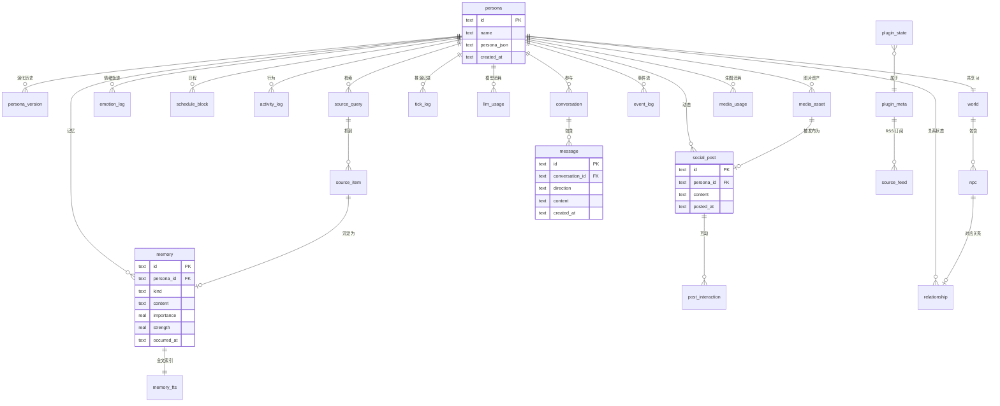
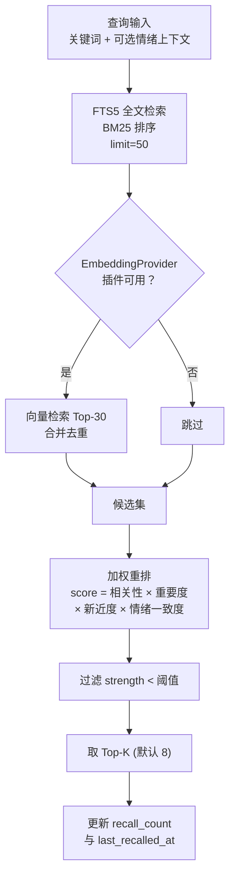
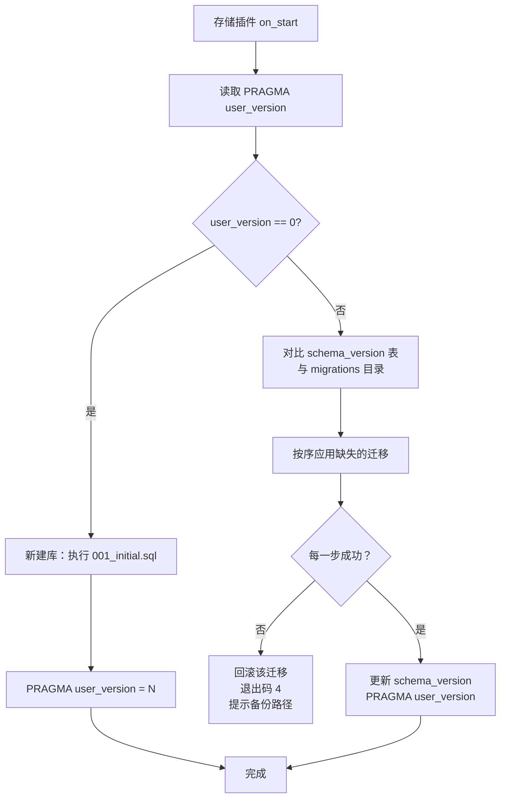

# 03 · 数据模型与存储

> 上级文档：[DESIGN.md](../DESIGN.md) · 版本 v0.1.0 · schema_version = 1
> 本文档描述完整的 ER 模型、DDL、索引策略、检索算法与迁移机制。

---

## 目录

1. [设计决策](#1-设计决策)
2. [ER 总览](#2-er-总览)
3. [完整 DDL](#3-完整-ddl)
4. [表字段说明](#4-表字段说明)
5. [索引策略](#5-索引策略)
6. [记忆检索算法](#6-记忆检索算法)
7. [Repository 接口](#7-repository-接口)
8. [迁移机制](#8-迁移机制)
9. [备份与导出](#9-备份与导出)
10. [容量估算](#10-容量估算)

---

## 1. 设计决策

| 决策 | 选择 | 理由 |
| --- | --- | --- |
| 数据库 | SQLite 3.35+ | 零运维、单文件、Python 内置驱动、支持 FTS5 |
| 日志模式 | WAL | 支持 Web 线程与 Tick 线程并发读写 |
| 复杂结构 | JSON 字符串列 | 人格、世界设定是深度嵌套结构，拆表得不偿失；SQLite 有 `json_extract` 可查询 |
| 时间存储 | ISO 8601 TEXT | 可读、可排序、SQLite 日期函数直接支持；统一存 **UTC+08:00 带时区** |
| 主键 | TEXT (uuid4 hex) | 便于导出合并；避免 AUTOINCREMENT 的跨库冲突 |
| 字段命名 | snake_case | SQL 惯例 |
| 布尔 | INTEGER 0/1 | SQLite 无原生布尔 |
| 数组 | JSON 字符串 | 同上 |
| 向量 | ❌ v1 不支持 | 零依赖优先；作为插件额外建表 |

### 1.1 时间表示规范

所有时间字段统一为 **ISO 8601 带时区偏移** 的字符串：

```
2026-09-15T14:32:11+08:00
```

**为什么带时区**：Agent 的作息依赖当地时间。存储时不带时区会在跨时区或夏令时场景下出错。

**索引友好性**：ISO 8601 的字典序与时间序一致，`ORDER BY occurred_at DESC` 可直接用索引。

### 1.2 JSON 列的使用规范

标记为 `JSON` 的列，内容为 JSON 对象/数组的字符串。约定：

- 始终是**对象或数组**，不是裸标量（`{}`/`[]` 而非 `null`）
- 空值用 `'{}'` / `'[]'` 而非 `NULL`（避免 `json.loads(NULL)` 报错）
- 提供 `CHECK (json_valid(列名))` 约束保证写入合法

---

## 2. ER 总览



---

## 3. 完整 DDL

> **表共 26 张**（21–26 为 v0.2.0/v0.3.0 新增，见 `migrations/002_media.sql`、`003_sources.sql`、`004_observability.sql`），
> 另有 2 个视图（`v_cost_daily` / `v_trace`）。
> `log_entry` 与 `schema_version` 不挂在 persona 上（前者是全局运行日志，后者是迁移元数据）。
> **每张可观测表都必须有 `correlation_id` 列**，同一次推演内共享同一个值——
> 这是「从一条错误跳回那次推演」的实现基础，见 [09-observability.md § 1.2](09-observability.md#12-核心洞察一切都要能串起来)。

```sql
-- ============================================================
-- AlterEgo 数据库 Schema
-- schema_version: 1（迁移 002/003 后为 3）
-- 约定：所有时间字段为 ISO 8601 带时区字符串
-- ============================================================

PRAGMA foreign_keys = ON;
PRAGMA journal_mode = WAL;
PRAGMA synchronous = NORMAL;
PRAGMA busy_timeout = 5000;
PRAGMA temp_store = MEMORY;

-- ────────────────────────────────────────────────────────────
-- 迁移版本
-- ────────────────────────────────────────────────────────────
CREATE TABLE IF NOT EXISTS schema_version (
    version     INTEGER PRIMARY KEY,
    applied_at  TEXT NOT NULL,
    description TEXT NOT NULL
);

-- ────────────────────────────────────────────────────────────
-- 1. persona · 人格主表（当前生效版本）
-- ────────────────────────────────────────────────────────────
CREATE TABLE IF NOT EXISTS persona (
    id              TEXT PRIMARY KEY,
    name            TEXT NOT NULL,
    age             INTEGER,
    gender          TEXT,
    city            TEXT,
    occupation      TEXT,
    -- 完整人格数据（含性格/表达/偏好/背景/情绪基线）
    persona_json    TEXT NOT NULL CHECK (json_valid(persona_json)),
    -- 当前人格版本号，对应 persona_version.version
    current_version INTEGER NOT NULL DEFAULT 1,
    created_at      TEXT NOT NULL,
    updated_at      TEXT NOT NULL
);

-- ────────────────────────────────────────────────────────────
-- 2. persona_version · 人格版本历史（支持回滚与演化追踪）
-- ────────────────────────────────────────────────────────────
CREATE TABLE IF NOT EXISTS persona_version (
    id          TEXT PRIMARY KEY,
    persona_id  TEXT NOT NULL REFERENCES persona(id) ON DELETE CASCADE,
    version     INTEGER NOT NULL,
    persona_json TEXT NOT NULL CHECK (json_valid(persona_json)),
    change_type TEXT NOT NULL,          -- init | manual_edit | llm_refine | evolution
    change_note TEXT,                   -- 变更说明（如"更毒舌一点"）
    diff_json   TEXT CHECK (diff_json IS NULL OR json_valid(diff_json)),
    created_at  TEXT NOT NULL,
    UNIQUE (persona_id, version)
);

CREATE INDEX IF NOT EXISTS idx_persona_version_pid
    ON persona_version(persona_id, version DESC);

-- ────────────────────────────────────────────────────────────
-- 3. world · 世界设定
-- ────────────────────────────────────────────────────────────
CREATE TABLE IF NOT EXISTS world (
    id              TEXT PRIMARY KEY,
    persona_id      TEXT NOT NULL REFERENCES persona(id) ON DELETE CASCADE,
    setting         TEXT NOT NULL,      -- 时代/城市/行业/社会背景（长文本）
    locations_json  TEXT NOT NULL DEFAULT '[]' CHECK (json_valid(locations_json)),
    events_json     TEXT NOT NULL DEFAULT '[]' CHECK (json_valid(events_json)),
    weather_json    TEXT NOT NULL DEFAULT '{}' CHECK (json_valid(weather_json)),
    created_at      TEXT NOT NULL,
    updated_at      TEXT NOT NULL
);

CREATE UNIQUE INDEX IF NOT EXISTS idx_world_persona ON world(persona_id);

-- ────────────────────────────────────────────────────────────
-- 4. npc · NPC 档案（Agent 社交圈）
-- ────────────────────────────────────────────────────────────
CREATE TABLE IF NOT EXISTS npc (
    id              TEXT PRIMARY KEY,
    world_id        TEXT NOT NULL REFERENCES world(id) ON DELETE CASCADE,
    name            TEXT NOT NULL,
    relation        TEXT NOT NULL,      -- family | friend | close_friend | colleague | acquaintance | rival
    profile_json    TEXT NOT NULL CHECK (json_valid(profile_json)),
    -- 简化人格：性格标签、说话风格、口头禅
    emotion_json    TEXT NOT NULL DEFAULT '{}' CHECK (json_valid(emotion_json)),
    active          INTEGER NOT NULL DEFAULT 1,   -- 是否参与推演
    npc_tick_interval_minutes INTEGER NOT NULL DEFAULT 30,
    created_at      TEXT NOT NULL,
    updated_at      TEXT NOT NULL
);

CREATE INDEX IF NOT EXISTS idx_npc_world ON npc(world_id, active);

-- ────────────────────────────────────────────────────────────
-- 5. relationship · 关系状态
-- ────────────────────────────────────────────────────────────
CREATE TABLE IF NOT EXISTS relationship (
    id                  TEXT PRIMARY KEY,
    persona_id          TEXT NOT NULL REFERENCES persona(id) ON DELETE CASCADE,
    target_id           TEXT NOT NULL,      -- 'user' 或 npc.id
    target_name         TEXT NOT NULL,
    target_kind         TEXT NOT NULL,      -- user | npc
    relation_type       TEXT NOT NULL,
    affinity            REAL NOT NULL DEFAULT 0,     -- -100 ~ 100
    familiarity         REAL NOT NULL DEFAULT 0,     -- 0 ~ 100
    trust               REAL NOT NULL DEFAULT 50,    -- 0 ~ 100
    tension             REAL NOT NULL DEFAULT 0,     -- 0 ~ 100
    notes               TEXT NOT NULL DEFAULT '',    -- LLM 生成的印象笔记
    interaction_count   INTEGER NOT NULL DEFAULT 0,
    last_contact_at     TEXT,
    created_at          TEXT NOT NULL,
    updated_at          TEXT NOT NULL,
    UNIQUE (persona_id, target_id)
);

CREATE INDEX IF NOT EXISTS idx_relationship_persona
    ON relationship(persona_id, affinity DESC);

-- ────────────────────────────────────────────────────────────
-- 6. emotion_log · 情绪时间序列
-- ────────────────────────────────────────────────────────────
CREATE TABLE IF NOT EXISTS emotion_log (
    id          TEXT PRIMARY KEY,
    persona_id  TEXT NOT NULL REFERENCES persona(id) ON DELETE CASCADE,
    valence     REAL NOT NULL CHECK (valence >= -1.0 AND valence <= 1.0),
    arousal     REAL NOT NULL CHECK (arousal >= 0.0 AND arousal <= 1.0),
    fatigue     REAL NOT NULL DEFAULT 0 CHECK (fatigue >= 0.0 AND fatigue <= 1.0),
    label       TEXT NOT NULL,
    reason      TEXT NOT NULL DEFAULT '',    -- 变化原因（可解释性）
    causes_json TEXT NOT NULL DEFAULT '[]' CHECK (json_valid(causes_json)),
    tick_id     TEXT,
    recorded_at TEXT NOT NULL
);

CREATE INDEX IF NOT EXISTS idx_emotion_persona_time
    ON emotion_log(persona_id, recorded_at DESC);

-- ────────────────────────────────────────────────────────────
-- 7. memory · 记忆
-- ────────────────────────────────────────────────────────────
CREATE TABLE IF NOT EXISTS memory (
    id                  TEXT PRIMARY KEY,
    persona_id          TEXT NOT NULL REFERENCES persona(id) ON DELETE CASCADE,
    kind                TEXT NOT NULL,      -- episodic | semantic | emotional
    content             TEXT NOT NULL,      -- 完整内容
    summary             TEXT NOT NULL,      -- 一句话摘要，注入提示词用
    importance          REAL NOT NULL DEFAULT 0.5 CHECK (importance >= 0 AND importance <= 1),
    strength            REAL NOT NULL DEFAULT 1.0 CHECK (strength >= 0),
    valence             REAL NOT NULL DEFAULT 0 CHECK (valence >= -1 AND valence <= 1),
    entities_json       TEXT NOT NULL DEFAULT '[]' CHECK (json_valid(entities_json)),
    tags_json           TEXT NOT NULL DEFAULT '[]' CHECK (json_valid(tags_json)),
    source              TEXT NOT NULL DEFAULT 'tick',   -- tick | conversation | consolidation | manual | npc
    source_ref          TEXT,               -- 来源 id（tick_id / message_id / memory_id）
    occurred_at         TEXT NOT NULL,
    last_recalled_at    TEXT,
    recall_count        INTEGER NOT NULL DEFAULT 0,
    forgotten           INTEGER NOT NULL DEFAULT 0,     -- 是否已标记遗忘（不删除，仅降权）
    created_at          TEXT NOT NULL
);

CREATE INDEX IF NOT EXISTS idx_memory_persona_time
    ON memory(persona_id, occurred_at DESC);
CREATE INDEX IF NOT EXISTS idx_memory_strength
    ON memory(persona_id, strength DESC) WHERE forgotten = 0;
CREATE INDEX IF NOT EXISTS idx_memory_kind
    ON memory(persona_id, kind, occurred_at DESC);

-- ────────────────────────────────────────────────────────────
-- 8. memory_fts · 记忆全文索引（FTS5）
-- ────────────────────────────────────────────────────────────
CREATE VIRTUAL TABLE IF NOT EXISTS memory_fts USING fts5(
    memory_id UNINDEXED,
    content,
    summary,
    tags,
    tokenize = 'unicode61 remove_diacritics 2'
);

-- 保持 FTS 与主表同步的触发器
CREATE TRIGGER IF NOT EXISTS trg_memory_ai
AFTER INSERT ON memory BEGIN
    INSERT INTO memory_fts(memory_id, content, summary, tags)
    VALUES (new.id, new.content, new.summary, new.tags_json);
END;

CREATE TRIGGER IF NOT EXISTS trg_memory_au
AFTER UPDATE OF content, summary, tags_json ON memory BEGIN
    DELETE FROM memory_fts WHERE memory_id = old.id;
    INSERT INTO memory_fts(memory_id, content, summary, tags)
    VALUES (new.id, new.content, new.summary, new.tags_json);
END;

CREATE TRIGGER IF NOT EXISTS trg_memory_ad
AFTER DELETE ON memory BEGIN
    DELETE FROM memory_fts WHERE memory_id = old.id;
END;

-- ────────────────────────────────────────────────────────────
-- 9. conversation · 会话
-- ────────────────────────────────────────────────────────────
CREATE TABLE IF NOT EXISTS conversation (
    id              TEXT PRIMARY KEY,
    persona_id      TEXT NOT NULL REFERENCES persona(id) ON DELETE CASCADE,
    counterpart_id  TEXT NOT NULL,          -- 'user' 或 npc.id
    counterpart_kind TEXT NOT NULL,         -- user | npc
    title           TEXT,
    message_count   INTEGER NOT NULL DEFAULT 0,
    last_message_at TEXT,
    created_at      TEXT NOT NULL,
    UNIQUE (persona_id, counterpart_id)
);

CREATE INDEX IF NOT EXISTS idx_conversation_persona
    ON conversation(persona_id, last_message_at DESC);

-- ────────────────────────────────────────────────────────────
-- 10. message · 消息
-- ────────────────────────────────────────────────────────────
CREATE TABLE IF NOT EXISTS message (
    id              TEXT PRIMARY KEY,
    conversation_id TEXT NOT NULL REFERENCES conversation(id) ON DELETE CASCADE,
    direction       TEXT NOT NULL,          -- inbound（用户→Agent）| outbound（Agent→用户）
    sender_id       TEXT NOT NULL,          -- 'user' / persona.id / npc.id
    content         TEXT NOT NULL,
    content_type    TEXT NOT NULL DEFAULT 'text',  -- text | markdown | image
    -- 主动消息的动机（仅 outbound 且为主动发起时填写）
    initiative      INTEGER NOT NULL DEFAULT 0,    -- 是否主动发起（非回复）
    motivation      TEXT,                   -- share_something | miss_you | need_comfort | ...
    trigger_note    TEXT,                   -- 触发原因描述
    -- 分发状态
    delivered_channels_json TEXT NOT NULL DEFAULT '[]' CHECK (json_valid(delivered_channels_json)),
    read_at         TEXT,
    replied_at      TEXT,
    tick_id         TEXT,
    created_at      TEXT NOT NULL
);

CREATE INDEX IF NOT EXISTS idx_message_conv_time
    ON message(conversation_id, created_at DESC);
CREATE INDEX IF NOT EXISTS idx_message_unread
    ON message(conversation_id, direction, read_at) WHERE read_at IS NULL;
CREATE INDEX IF NOT EXISTS idx_message_initiative
    ON message(direction, initiative, created_at DESC);

-- ────────────────────────────────────────────────────────────
-- 11. social_post · 动态（朋友圈）
-- ────────────────────────────────────────────────────────────
CREATE TABLE IF NOT EXISTS social_post (
    id              TEXT PRIMARY KEY,
    persona_id      TEXT NOT NULL REFERENCES persona(id) ON DELETE CASCADE,
    content         TEXT NOT NULL,
    image_paths_json TEXT NOT NULL DEFAULT '[]' CHECK (json_valid(image_paths_json)),
    location        TEXT,
    mood_label      TEXT,
    mood_valence    REAL,
    mood_arousal    REAL,
    -- 生成溯源
    intent_motivation TEXT,
    trigger_note    TEXT,
    activity_ref    TEXT,                   -- 关联的 activity_log.id
    -- 统计
    like_count      INTEGER NOT NULL DEFAULT 0,
    comment_count   INTEGER NOT NULL DEFAULT 0,
    visible         INTEGER NOT NULL DEFAULT 1,
    tick_id         TEXT,
    posted_at       TEXT NOT NULL
);

CREATE INDEX IF NOT EXISTS idx_post_persona_time
    ON social_post(persona_id, posted_at DESC);

-- ────────────────────────────────────────────────────────────
-- 12. post_interaction · 动态互动
-- ────────────────────────────────────────────────────────────
CREATE TABLE IF NOT EXISTS post_interaction (
    id          TEXT PRIMARY KEY,
    post_id     TEXT NOT NULL REFERENCES social_post(id) ON DELETE CASCADE,
    actor_id    TEXT NOT NULL,          -- 'user' 或 npc.id
    actor_kind  TEXT NOT NULL,          -- user | npc
    actor_name  TEXT NOT NULL,
    kind        TEXT NOT NULL,          -- like | comment
    content     TEXT,                   -- 评论内容
    -- 该互动对 Agent 产生的影响
    emotion_impact REAL NOT NULL DEFAULT 0,
    affinity_impact REAL NOT NULL DEFAULT 0,
    created_at  TEXT NOT NULL
);

CREATE INDEX IF NOT EXISTS idx_post_interaction_post
    ON post_interaction(post_id, created_at);

-- ────────────────────────────────────────────────────────────
-- 13. schedule_block · 日程块
-- ────────────────────────────────────────────────────────────
CREATE TABLE IF NOT EXISTS schedule_block (
    id              TEXT PRIMARY KEY,
    persona_id      TEXT NOT NULL REFERENCES persona(id) ON DELETE CASCADE,
    day             TEXT NOT NULL,          -- YYYY-MM-DD（虚拟时间当地日期）
    start_at        TEXT NOT NULL,
    end_at          TEXT NOT NULL,
    activity        TEXT NOT NULL,
    category        TEXT NOT NULL,          -- sleep|work|meal|commute|leisure|social|chore|other
    location        TEXT,
    interruptible   INTEGER NOT NULL DEFAULT 1,
    source          TEXT NOT NULL DEFAULT 'template',  -- template|llm|manual
    actual_start_at TEXT,                   -- 实际执行时间（可能与计划不同）
    actual_end_at   TEXT,
    deviation_note  TEXT,                   -- 偏离原因
    created_at      TEXT NOT NULL
);

CREATE INDEX IF NOT EXISTS idx_schedule_persona_day
    ON schedule_block(persona_id, day, start_at);

-- ────────────────────────────────────────────────────────────
-- 14. activity_log · 行为日志
-- ────────────────────────────────────────────────────────────
CREATE TABLE IF NOT EXISTS activity_log (
    id              TEXT PRIMARY KEY,
    persona_id      TEXT NOT NULL REFERENCES persona(id) ON DELETE CASCADE,
    actor_kind      TEXT NOT NULL DEFAULT 'persona',  -- persona | npc
    actor_id        TEXT,
    intent          TEXT NOT NULL,
    category        TEXT NOT NULL,          -- internal | social | outbound
    description     TEXT NOT NULL,          -- 一句话描述做了什么
    detail_json     TEXT NOT NULL DEFAULT '{}' CHECK (json_valid(detail_json)),
    location        TEXT,
    -- 是否产生对外内容
    outbound        INTEGER NOT NULL DEFAULT 0,
    outbound_ref    TEXT,                   -- post_id 或 message_id
    -- 预算拦截记录：意图被降级时，原始意图记在此
    suppressed_intent TEXT,
    suppress_reason TEXT,
    -- 内心独白（含被拦截的"想说但没说"）
    inner_voice     TEXT,
    duration_minutes INTEGER,
    tick_id         TEXT,
    started_at      TEXT NOT NULL,
    ended_at        TEXT
);

CREATE INDEX IF NOT EXISTS idx_activity_persona_time
    ON activity_log(persona_id, started_at DESC);
CREATE INDEX IF NOT EXISTS idx_activity_intent
    ON activity_log(persona_id, intent, started_at DESC);
CREATE INDEX IF NOT EXISTS idx_activity_suppressed
    ON activity_log(persona_id, started_at DESC) WHERE suppressed_intent IS NOT NULL;

-- ────────────────────────────────────────────────────────────
-- 15. tick_log · 推演日志（可解释性的核心）
-- ────────────────────────────────────────────────────────────
CREATE TABLE IF NOT EXISTS tick_log (
    id              TEXT PRIMARY KEY,       -- tick_id
    persona_id      TEXT NOT NULL REFERENCES persona(id) ON DELETE CASCADE,
    virtual_time    TEXT NOT NULL,
    real_duration_ms INTEGER NOT NULL,
    status          TEXT NOT NULL,          -- ok | partial | failed | interrupted | skipped
    -- 决策溯源
    state_snapshot_json TEXT NOT NULL DEFAULT '{}' CHECK (json_valid(state_snapshot_json)),
    percepts_json   TEXT NOT NULL DEFAULT '{}' CHECK (json_valid(percepts_json)),
    candidates_json TEXT NOT NULL DEFAULT '[]' CHECK (json_valid(candidates_json)),
    chosen_intent   TEXT,
    motivation      TEXT,
    trigger_note    TEXT,
    suppressed_json TEXT NOT NULL DEFAULT '[]' CHECK (json_valid(suppressed_json)),
    memories_json   TEXT NOT NULL DEFAULT '[]' CHECK (json_valid(memories_json)),
    notes_json      TEXT NOT NULL DEFAULT '[]' CHECK (json_valid(notes_json)),
    stage_results_json TEXT NOT NULL DEFAULT '{}' CHECK (json_valid(stage_results_json)),
    llm_calls       INTEGER NOT NULL DEFAULT 0,
    llm_tokens      INTEGER NOT NULL DEFAULT 0,
    error           TEXT,
    created_at      TEXT NOT NULL
);

CREATE INDEX IF NOT EXISTS idx_tick_persona_time
    ON tick_log(persona_id, virtual_time DESC);
CREATE INDEX IF NOT EXISTS idx_tick_status
    ON tick_log(status, virtual_time DESC);

-- ────────────────────────────────────────────────────────────
-- 16. llm_usage · LLM 调用计量
-- ────────────────────────────────────────────────────────────
CREATE TABLE IF NOT EXISTS llm_usage (
    id                  TEXT PRIMARY KEY,
    persona_id          TEXT REFERENCES persona(id) ON DELETE SET NULL,
    tick_id             TEXT,
    purpose             TEXT NOT NULL,      -- intention|emotion|memory|post|chat|reach_out|npc|persona_gen
    tier                TEXT NOT NULL,      -- strong | cheap | custom
    provider_id         TEXT NOT NULL,
    model               TEXT NOT NULL,
    prompt_tokens       INTEGER NOT NULL DEFAULT 0,
    completion_tokens   INTEGER NOT NULL DEFAULT 0,
    total_tokens        INTEGER NOT NULL DEFAULT 0,
    latency_ms          INTEGER NOT NULL DEFAULT 0,
    cost_usd            REAL NOT NULL DEFAULT 0,
    cache_hit           INTEGER NOT NULL DEFAULT 0,
    retry_count         INTEGER NOT NULL DEFAULT 0,
    success             INTEGER NOT NULL DEFAULT 1,
    error               TEXT,
    created_at          TEXT NOT NULL
);

CREATE INDEX IF NOT EXISTS idx_llm_usage_time
    ON llm_usage(created_at DESC);
CREATE INDEX IF NOT EXISTS idx_llm_usage_purpose
    ON llm_usage(purpose, created_at DESC);

-- ────────────────────────────────────────────────────────────
-- 17. plugin_state · 插件 KV 状态
-- ────────────────────────────────────────────────────────────
CREATE TABLE IF NOT EXISTS plugin_state (
    plugin_id   TEXT NOT NULL,
    key         TEXT NOT NULL,
    value       TEXT NOT NULL CHECK (json_valid(value)),
    updated_at  TEXT NOT NULL,
    PRIMARY KEY (plugin_id, key)
);

-- ────────────────────────────────────────────────────────────
-- 18. plugin_meta · 插件元信息（用于 plugins doctor）
-- ────────────────────────────────────────────────────────────
CREATE TABLE IF NOT EXISTS plugin_meta (
    plugin_id       TEXT PRIMARY KEY,
    version         TEXT NOT NULL,
    kind            TEXT NOT NULL,
    source          TEXT NOT NULL,          -- local | entry_point
    source_path     TEXT,
    enabled         INTEGER NOT NULL DEFAULT 1,
    last_loaded_at  TEXT,
    last_error      TEXT,
    failure_count   INTEGER NOT NULL DEFAULT 0,
    created_at      TEXT NOT NULL,
    updated_at      TEXT NOT NULL
);

-- ────────────────────────────────────────────────────────────
-- 19. event_log · 事件流（Web 回放与调试）
-- ────────────────────────────────────────────────────────────
CREATE TABLE IF NOT EXISTS event_log (
    id              TEXT PRIMARY KEY,
    topic           TEXT NOT NULL,
    payload_json    TEXT NOT NULL DEFAULT '{}' CHECK (json_valid(payload_json)),
    source          TEXT NOT NULL,
    correlation_id  TEXT,
    occurred_at     TEXT NOT NULL
);

CREATE INDEX IF NOT EXISTS idx_event_topic_time
    ON event_log(topic, occurred_at DESC);
CREATE INDEX IF NOT EXISTS idx_event_correlation
    ON event_log(correlation_id);

-- ────────────────────────────────────────────────────────────
-- 20. budget_usage · 打扰预算每日用量
-- ────────────────────────────────────────────────────────────
CREATE TABLE IF NOT EXISTS budget_usage (
    persona_id          TEXT NOT NULL REFERENCES persona(id) ON DELETE CASCADE,
    day                 TEXT NOT NULL,      -- YYYY-MM-DD 虚拟时间当地日期
    messages_sent       INTEGER NOT NULL DEFAULT 0,
    posts_sent          INTEGER NOT NULL DEFAULT 0,
    messages_suppressed INTEGER NOT NULL DEFAULT 0,
    posts_suppressed    INTEGER NOT NULL DEFAULT 0,
    consecutive_no_reply INTEGER NOT NULL DEFAULT 0,
    circuit_until       TEXT,               -- 熔断截止时间（连续未回复触发）
    last_message_at     TEXT,
    last_post_at        TEXT,
    updated_at          TEXT NOT NULL,
    PRIMARY KEY (persona_id, day)
);

-- ────────────────────────────────────────────────────────────
-- 初始数据
-- ────────────────────────────────────────────────────────────
INSERT OR IGNORE INTO schema_version (version, applied_at, description)
VALUES (1, '2026-09-15T00:00:00+08:00', '初始 schema');
```

### 3.1 v0.2.0 新增：图片资产与生图计量

```sql
-- 迁移文件：migrations/002_media.sql

-- ────────────────────────────────────────────────────────
-- 21. media_asset · 图片资产
-- role='canonical' 的行是**角色形象一致性的唯一真源**（ADR-0008）
-- ────────────────────────────────────────────────────────
CREATE TABLE IF NOT EXISTS media_asset (
    id                  TEXT PRIMARY KEY,
    persona_id          TEXT NOT NULL REFERENCES persona(id) ON DELETE CASCADE,
    -- canonical = 定妆照（全库唯一且仅一张）
    -- selfie    = 角色自拍（多为人物图，受一致性约束）
    -- scenery   = 风景/物品/抽象图（无人物，不要求参考图）
    -- user_upload = 用户手动放入相册的图
    role                TEXT NOT NULL CHECK (role IN ('canonical','selfie','scenery','user_upload')),
    file_path           TEXT NOT NULL,          -- 相对 data/media/ 的路径
    mime_type           TEXT NOT NULL DEFAULT 'image/png',
    width               INTEGER NOT NULL DEFAULT 0,
    height              INTEGER NOT NULL DEFAULT 0,
    bytes               INTEGER NOT NULL DEFAULT 0,
    -- 生成溯源：没有这几列，定妆照就无法复现，一致性链条当场断掉
    provider_id         TEXT,
    model               TEXT,
    prompt              TEXT,                   -- 实际发出的提示词（含骨架与四槽位展开后的完整文本）
    negative_prompt     TEXT,
    seed                INTEGER,
    reference_asset_id  TEXT REFERENCES media_asset(id) ON DELETE SET NULL,
    appearance_brief    TEXT,                   -- 仅 canonical：人工可编辑的外貌描述
    -- 四槽位原值，供重新生成同一构图时复用
    outfit              TEXT,
    scene               TEXT,
    mood                TEXT,
    lighting            TEXT,
    -- 可见性：未发布的图也必须可见（ADR-0008 的诚实要求）
    visibility          TEXT NOT NULL DEFAULT 'private'
                        CHECK (visibility IN ('private','posted','discarded')),
    cost_usd            REAL NOT NULL DEFAULT 0,
    tick_id             TEXT,
    correlation_id      TEXT,
    created_at          TEXT NOT NULL,
    updated_at          TEXT NOT NULL
);

-- 定妆照全库唯一（部分唯一索引——只约束 role='canonical' 的行）
CREATE UNIQUE INDEX IF NOT EXISTS idx_media_canonical
    ON media_asset(persona_id) WHERE role = 'canonical';
CREATE INDEX IF NOT EXISTS idx_media_time ON media_asset(created_at DESC);
CREATE INDEX IF NOT EXISTS idx_media_role ON media_asset(persona_id, role, created_at DESC);
CREATE INDEX IF NOT EXISTS idx_media_visibility ON media_asset(visibility, created_at DESC);

-- ────────────────────────────────────────────────────────
-- 22. media_usage · 生图消耗明细
-- 为什么不塞进 llm_usage：那张表的语义是 **token 计量**，
-- 生图既无 prompt_tokens 也无 completion_tokens，混进去会让两边的聚合都变脏
-- ────────────────────────────────────────────────────────
CREATE TABLE IF NOT EXISTS media_usage (
    id                  TEXT PRIMARY KEY,
    persona_id          TEXT REFERENCES persona(id) ON DELETE SET NULL,
    asset_id            TEXT REFERENCES media_asset(id) ON DELETE SET NULL,
    tick_id             TEXT,
    purpose             TEXT NOT NULL,          -- selfie|scenery|canonical|regenerate
    provider_id         TEXT NOT NULL,
    model               TEXT NOT NULL,
    image_count         INTEGER NOT NULL DEFAULT 1,
    width               INTEGER NOT NULL DEFAULT 0,
    height              INTEGER NOT NULL DEFAULT 0,
    used_reference      INTEGER NOT NULL DEFAULT 0,
    latency_ms          INTEGER NOT NULL DEFAULT 0,
    cost_usd            REAL NOT NULL DEFAULT 0,
    retry_count         INTEGER NOT NULL DEFAULT 0,
    success             INTEGER NOT NULL DEFAULT 1,
    error               TEXT,
    correlation_id      TEXT,
    created_at          TEXT NOT NULL
);
CREATE INDEX IF NOT EXISTS idx_media_usage_time ON media_usage(created_at DESC);
CREATE INDEX IF NOT EXISTS idx_media_usage_purpose ON media_usage(purpose, created_at DESC);
```

### 3.2 v0.3.0 新增：外部信息来源

```sql
-- 迁移文件：migrations/003_sources.sql

-- ────────────────────────────────────────────────────────
-- 23. source_item · 检索到的外部条目
-- 不存网页正文：版权、体积、检索质量（见 ADR-0009）
-- ────────────────────────────────────────────────────────
CREATE TABLE IF NOT EXISTS source_item (
    id                  TEXT PRIMARY KEY,
    query_id            TEXT REFERENCES source_query(id) ON DELETE CASCADE,
    persona_id          TEXT REFERENCES persona(id) ON DELETE SET NULL,
    url                 TEXT NOT NULL,
    url_hash            TEXT NOT NULL,          -- normalize 后取 SHA-256 前 16 字节，用于去重
    title               TEXT NOT NULL DEFAULT '',
    summary             TEXT NOT NULL DEFAULT '',
    lang                TEXT,
    published_at        TEXT,
    fetched_at          TEXT NOT NULL,
    source_kind         TEXT NOT NULL DEFAULT 'search'   -- search|feed|direct
                        CHECK (source_kind IN ('search','feed','direct')),
    feed_id             TEXT REFERENCES source_feed(id) ON DELETE SET NULL,
    content_chars       INTEGER NOT NULL DEFAULT 0,
    dropped             INTEGER NOT NULL DEFAULT 0,
    dropped_reason      TEXT,                   -- injection|too_long|duplicate|blocked
    memory_id           TEXT REFERENCES memory(id) ON DELETE SET NULL,
    interest_delta      REAL NOT NULL DEFAULT 0,
    correlation_id      TEXT,
    created_at          TEXT NOT NULL
);
CREATE UNIQUE INDEX IF NOT EXISTS idx_source_item_hash ON source_item(url_hash);
CREATE INDEX IF NOT EXISTS idx_source_item_time ON source_item(fetched_at DESC);
CREATE INDEX IF NOT EXISTS idx_source_item_dropped ON source_item(dropped, fetched_at DESC);

-- ────────────────────────────────────────────────────────
-- 24. source_feed · RSS 订阅源
-- ────────────────────────────────────────────────────────
CREATE TABLE IF NOT EXISTS source_feed (
    id                  TEXT PRIMARY KEY,
    persona_id          TEXT REFERENCES persona(id) ON DELETE CASCADE,
    url                 TEXT NOT NULL,
    title               TEXT NOT NULL DEFAULT '',
    category            TEXT,
    etag                TEXT,                   -- 304 时不消耗流量也不消耗 LLM
    last_modified       TEXT,
    last_checked_at     TEXT,
    last_success_at     TEXT,
    failure_count       INTEGER NOT NULL DEFAULT 0,
    enabled             INTEGER NOT NULL DEFAULT 1,
    created_at          TEXT NOT NULL,
    updated_at          TEXT NOT NULL
);
CREATE UNIQUE INDEX IF NOT EXISTS idx_source_feed_url ON source_feed(persona_id, url);

-- ────────────────────────────────────────────────────────
-- 25. source_query · 一次检索
-- 存 emotion_label 是为了能按情绪回顾「它最近在关心什么」
-- ────────────────────────────────────────────────────────
CREATE TABLE IF NOT EXISTS source_query (
    id                  TEXT PRIMARY KEY,
    persona_id          TEXT REFERENCES persona(id) ON DELETE SET NULL,
    tick_id             TEXT,
    query_text          TEXT NOT NULL,
    query_kind          TEXT NOT NULL DEFAULT 'search'
                        CHECK (query_kind IN ('search','feed')),
    interest_key        TEXT,                   -- 命中的兴趣项 key
    emotion_label       TEXT,                   -- 当时的情绪标签
    result_count        INTEGER NOT NULL DEFAULT 0,
    kept_count          INTEGER NOT NULL DEFAULT 0,
    dropped_count       INTEGER NOT NULL DEFAULT 0,
    degraded            INTEGER NOT NULL DEFAULT 0,   -- 是否发生了降级
    degrade_reason      TEXT,
    cost_usd            REAL NOT NULL DEFAULT 0,
    correlation_id      TEXT,
    created_at          TEXT NOT NULL
);
CREATE INDEX IF NOT EXISTS idx_source_query_time ON source_query(created_at DESC);
CREATE INDEX IF NOT EXISTS idx_source_query_interest ON source_query(interest_key, created_at DESC);
```

### 3.3 v0.3.0 新增：结构化日志

```sql
-- 迁移文件：migrations/004_observability.sql

-- ────────────────────────────────────────────────────────
-- 26. log_entry · 结构化运行日志
-- 只落 WARNING 及以上（全量日志在 logs/ 下的文件里）
-- ────────────────────────────────────────────────────────
CREATE TABLE IF NOT EXISTS log_entry (
    id                  INTEGER PRIMARY KEY AUTOINCREMENT,
    level               TEXT NOT NULL,          -- WARNING|ERROR|CRITICAL
    logger              TEXT NOT NULL DEFAULT '',
    message             TEXT NOT NULL,
    module              TEXT,
    function            TEXT,
    line                INTEGER,
    plugin_id           TEXT,
    tick_id             TEXT,
    correlation_id      TEXT,
    exc_type            TEXT,
    exc_text            TEXT,                   -- 含堆栈；**不落库就无法排查**（这是与 event_log 的关键区别）
    extra_json          TEXT CHECK(extra_json IS NULL OR json_valid(extra_json)),
    created_at          TEXT NOT NULL
);
CREATE INDEX IF NOT EXISTS idx_log_time ON log_entry(created_at DESC);
CREATE INDEX IF NOT EXISTS idx_log_level_time ON log_entry(level, created_at DESC);
CREATE INDEX IF NOT EXISTS idx_log_correlation ON log_entry(correlation_id);

-- 给已有可观测表补 correlation_id（幂等：SQLite 无 ADD COLUMN IF NOT EXISTS，
-- 迁移脚本先查 PRAGMA table_info 再决定是否执行）
ALTER TABLE tick_log     ADD COLUMN correlation_id TEXT;
ALTER TABLE activity_log ADD COLUMN correlation_id TEXT;
ALTER TABLE llm_usage    ADD COLUMN correlation_id TEXT;

CREATE INDEX IF NOT EXISTS idx_tick_log_correlation ON tick_log(correlation_id);

-- ────────────────────────────────────────────────────────
-- 视图（不是表）：成本合并与链路追踪
-- 为什么用视图而不是汇总表：汇总表要么有两个写入点（必然漂移），
-- 要么定期重算（预算检查会读到过期数据）
-- ────────────────────────────────────────────────────────
CREATE VIEW IF NOT EXISTS v_cost_daily AS
    SELECT persona_id, substr(created_at, 1, 10) AS day,
           purpose, 'llm'   AS cost_kind, cost_usd, 1 AS call_count
      FROM llm_usage WHERE success = 1
    UNION ALL
    SELECT persona_id, substr(created_at, 1, 10) AS day,
           purpose, 'media' AS cost_kind, cost_usd, 1 AS call_count
      FROM media_usage WHERE success = 1;

CREATE VIEW IF NOT EXISTS v_trace AS
    SELECT correlation_id, 'tick'   AS step, '推演' AS label, occurred_at AS at,
           tick_id, NULL AS detail, payload_json
      FROM event_log WHERE correlation_id IS NOT NULL
    UNION ALL
    SELECT correlation_id, 'llm', '模型调用', created_at, tick_id,
           model || ' · ' || purpose || ' · ' || total_tokens || ' tok', NULL
      FROM llm_usage WHERE correlation_id IS NOT NULL
    UNION ALL
    SELECT correlation_id, 'media', '生图', created_at, tick_id,
           model || ' · ' || purpose, NULL
      FROM media_usage WHERE correlation_id IS NOT NULL
    UNION ALL
    SELECT correlation_id, 'source', '检索', created_at, tick_id,
           query_text || ' · 保留 ' || kept_count, NULL
      FROM source_query WHERE correlation_id IS NOT NULL
    UNION ALL
    SELECT correlation_id, 'log', level, created_at, tick_id,
           message || COALESCE(' · ' || exc_text, ''), NULL
      FROM log_entry WHERE correlation_id IS NOT NULL;

INSERT OR IGNORE INTO schema_version (version, applied_at, description)
VALUES (4, '2026-09-15T00:00:00+08:00', '多媒体与可观测性');
```

> **`event_log` 与 `log_entry` 为什么不合并**：`event_log` 是**可回放**的结构化事件流
> （它的 payload 能被重新投回总线），而 `log_entry` 含第三方库的输出与堆栈，**不可回放**。
> 两者受众也不同。`event_log` 保持默认关闭。

---

## 4. 表字段说明

### 4.1 需重点说明的字段

#### `memory.importance` 与 `memory.strength` 的区别

| 字段 | 含义 | 是否变化 |
| --- | --- | --- |
| `importance` | 写入时评定的**固有重要度**（0~1）。由 LLM 或规则评定，之后**不再改变** | ❌ 不变 |
| `strength` | **当前可召回强度**。随时间指数衰减，被回忆时回升 | ✅ 每 6 虚拟小时重算 |

分离两者的原因：一条记忆「很重要」（importance=0.9），但太久没想起来会「暂时想不起来」（strength 降到 0.2）。如果合并为一个字段，就无法表达「重要但不记得」这种真实状态。

#### `activity_log.suppressed_intent` / `suppress_reason`

当打扰预算拦截了一个 `reach_out` 意图时：

```
intent            = 'reflect_internal'      ← 实际执行（降级后）
suppressed_intent = 'reach_out'             ← 原本想做的
suppress_reason   = '当前日程不可打断（工作时段）'
inner_voice       = '刚看到那个独立游戏的视频，好想跟他说一声，算了他在上班'
```

这让 Web 的「内心」页面能展示 Agent「想说但没说出口的话」——这是本项目**最具拟人感的设计之一**。

#### `message.initiative` 与 `motivation`

| `initiative` | `motivation` | 含义 |
| --- | --- | --- |
| 0 | NULL | 回复用户消息 |
| 1 | `share_something` | 主动分享 |
| 1 | `miss_you` | 想念 |
| 1 | `need_comfort` | 求安慰 |
| 1 | `ask_question` | 求助 |
| 1 | `follow_up` | 跟进之前的话题 |
| 1 | `just_bored` | 无聊 |

统计动机分布是调优 Agent 拟人度的重要依据：如果 90% 都是 `just_bored`，说明人设需要调整。

#### `schedule_block.actual_start_at` vs `start_at`

计划与实际分离，用于计算「作息规律度」。长期偏离（如总是熬夜）可以作为 LLM 反思的输入：「最近一周有 5 天都是凌晨 2 点才睡，有点担心」。

#### `tick_log.state_snapshot_json`

保存 tick 开始时的关键状态片段（情绪、当前日程、关系摘要）。这让 `alterego why <tick_id>` 能完整还原当时的决策上下文，即使后续状态已变化。

### 4.2 枚举值汇总

| 表.字段 | 允许值 |
| --- | --- |
| `memory.kind` | `episodic`, `semantic`, `emotional` |
| `memory.source` | `tick`, `conversation`, `consolidation`, `manual`, `npc` |
| `relationship.relation_type` | `user`, `family`, `friend`, `close_friend`, `colleague`, `acquaintance`, `rival` |
| `npc.relation` | 同上（除 `user`） |
| `message.direction` | `inbound`, `outbound` |
| `message.motivation` | `share_something`, `miss_you`, `need_comfort`, `ask_question`, `follow_up`, `just_bored` |
| `social_post` 无枚举 | `mood_label` 为自由文本 |
| `schedule_block.category` | `sleep`, `work`, `meal`, `commute`, `leisure`, `social`, `chore`, `other` |
| `activity_log.category` | `internal`, `social`, `outbound` |
| `tick_log.status` | `ok`, `partial`, `failed`, `interrupted`, `skipped` |
| `llm_usage.purpose` | `intention`, `emotion`, `memory`, `post`, `chat`, `reach_out`, `npc`, `persona_gen`, `other` |
| `llm_usage.tier` | `strong`, `cheap`, `custom` |
| `post_interaction.kind` | `like`, `comment` |
| `persona_version.change_type` | `init`, `manual_edit`, `llm_refine`, `evolution` |

---

## 5. 索引策略

### 5.1 已建索引的设计意图

| 索引 | 支撑的查询 |
| --- | --- |
| `idx_memory_persona_time` | Web 记忆页按时间浏览 |
| `idx_memory_strength`（部分索引 `forgotten=0`） | 检索时按强度过滤，部分索引避免扫描已遗忘记忆 |
| `idx_message_unread`（部分索引 `read_at IS NULL`） | Sense 阶段拉取未读消息——高频查询，部分索引显著减小体积 |
| `idx_activity_suppressed`（部分索引） | Web「内心」页只查被拦截的意图 |
| `idx_tick_status` | 启动时查找 `interrupted` 状态的 tick |
| `idx_llm_usage_purpose` | `alterego stats` 按用途聚合成本 |
| `idx_event_correlation` | 按 correlation_id 还原一次完整 tick 的事件流 |

### 5.2 未建索引的取舍

| 字段 | 为何不建索引 |
| --- | --- |
| `memory.tags_json` | JSON 数组无法直接索引。需要标签检索时用 FTS5 的 `tags` 列 |
| `social_post.content` | 动态不需要全文检索（数量少，直接扫描） |
| `plugin_state.value` | KV 查询总是带 `plugin_id + key` 主键 |

### 5.3 写入放大控制

| 表 | 预估日增行数 | 控制策略 |
| --- | --- | --- |
| `tick_log` | 288（5 分钟粒度） | 保留 90 天后归档到 `tick_log_archive` 或直接删除 |
| `emotion_log` | 288 | 同上 |
| `event_log` | ~1500 | 默认关闭（`ALTEREGO_EVENT_LOG=1` 才写）；保留 7 天 |
| `activity_log` | ~288 | 保留 180 天 |
| `llm_usage` | ~400 | 永久保留（用于成本分析），行小 |
| `memory` | ~20 | 永久保留 |

**清理任务**：`alterego retention --apply` 按上述策略清理；`data_dir` 下的 `retention.toml` 可配置。

---

## 6. 记忆检索算法

### 6.1 完整流程



### 6.2 排序公式

$$
\text{score} = w_r \cdot R + w_i \cdot I + w_n \cdot N + w_e \cdot E
$$

其中：

| 符号 | 含义 | 计算方式 | 默认权重 |
| --- | --- | --- | --- |
| $R$ | 相关性 | FTS5 BM25 分数归一化到 [0,1]；若来自向量检索则为余弦相似度 | $w_r = 0.40$ |
| $I$ | 重要度 | `memory.importance` | $w_i = 0.25$ |
| $N$ | 新近度 | $e^{-\lambda_n \cdot \text{days}}$，$\lambda_n = 0.03$ | $w_n = 0.20$ |
| $E$ | 情绪一致度 | $1 - \frac{|\text{memory.valence} - \text{current.valence}|}{2}$ | $w_e = 0.15$ |

**情绪一致度（$E$）的作用**：心情好的时候更容易想起开心的事，心情差的时候更容易想起不开心的事。这是心理学上的「心境一致性记忆」，让 Agent 的记忆检索有情绪色彩，而非机械匹配。

**强度门槛**：$I$ 项实际使用 $\text{importance} \times \text{strength\_at}(now)$，即同时考虑固有重要度与当前可召回度。

### 6.3 SQL 实现

```sql
-- 第 1 步：FTS5 召回
SELECT m.id, m.kind, m.content, m.summary, m.importance, m.strength,
       m.valence, m.entities_json, m.tags_json, m.occurred_at,
       m.recall_count, m.last_recalled_at,
       bm25(memory_fts, 1.0, 2.0, 1.5) AS bm25_score
FROM memory_fts
JOIN memory m ON m.id = memory_fts.memory_id
WHERE memory_fts MATCH :query
  AND m.persona_id = :persona_id
  AND m.forgotten = 0
ORDER BY bm25_score
LIMIT 50;
```

> `bm25(memory_fts, 1.0, 2.0, 1.5)` 中的权重分别对应 `content`、`summary`、`tags` 列。`summary` 权重最高（2.0），因为摘要是最精炼的语义表达。

```sql
-- 第 2 步：在 Python 中重排（领域层纯函数 rank_memories）
-- 不在 SQL 里算的原因：公式需要当前情绪状态等运行时参数，
-- 且要便于单元测试与调整权重
```

### 6.4 中文分词

SQLite FTS5 内置 `unicode61` 分词器对中文按**单字**切分，效果一般。两个改进选项：

| 方案 | 效果 | 代价 |
| --- | --- | --- |
| **默认**：`unicode61` 单字切分 | 能召回，但精度一般（"火锅" 会匹配含"火"或"锅"的记忆） | 零依赖 |
| **推荐**：`plugins/tokenizer_jieba/` 自定义 FTS5 分词器 | 精度显著提升 | 需安装 `jieba` + 编译扩展 |

**v1 折中方案**：写入 `memory_fts.content` 时，用 Python 侧的 `jieba`（若可用）预分词，用空格连接后存入；查询时同样处理。这不需要编译 SQLite 扩展：

```python
def preprocess_for_fts(text: str) -> str:
    try:
        import jieba
        return " ".join(jieba.cut_for_search(text))
    except ImportError:
        return text          # 降级：原样存储，FTS5 按单字切分
```

**索引一致性注意**：预处理必须**写入时与查询时使用同一函数**，否则匹配失败。`MemoryRepository` 统一封装这个逻辑。

### 6.5 记忆巩固

每 6 虚拟小时执行一次，把零散的 `episodic` 记忆压缩成 `semantic` 记忆：

```python
async def consolidate(repo: MemoryRepository, llm: LLMProvider, now: datetime) -> list[Memory]:
    """取最近 6 小时未巩固的 episodic 记忆 → LLM 归纳 → 写入 semantic 记忆"""

    recent = repo.list_recent(kind="episodic", since=now - timedelta(hours=6),
                              not_consolidated=True)
    if len(recent) < 3:
        return []       # 太少不值得归纳

    prompt = render("memory_consolidate", memories=recent)
    result = await llm.complete(LLMRequest(prompt=prompt, response_format="json"))
    # 期望输出: [{"summary": "...", "importance": 0.7, "tags": [...]}]

    created = []
    for item in json.loads(result.text)["memories"]:
        mem = Memory(
            kind="semantic",
            content=item["summary"],
            summary=item["summary"],
            importance=item["importance"],
            source="consolidation",
            source_ref=",".join(m.id for m in recent),
            entities=tuple(item.get("entities", [])),
            occurred_at=now,
            ...
        )
        repo.save(mem)
        created.append(mem)

    repo.mark_consolidated([m.id for m in recent])
    return created
```

**副作用**：巩固后原始 episodic 记忆的 `strength` 会被降低（信息已上提），模拟「细节模糊了但记住了大概」。

---

## 7. Repository 接口

存储层的 Repository 是**接口**，具体实现由 storage 插件提供。

```python
class PersonaRepository(Protocol):
    def get(self, persona_id: str) -> Persona | None: ...
    def save(self, persona: Persona) -> None: ...
    def list_versions(self, persona_id: str) -> list[PersonaVersion]: ...
    def rollback(self, persona_id: str, version: int) -> Persona: ...

class WorldRepository(Protocol):
    def get_by_persona(self, persona_id: str) -> World | None: ...
    def save(self, world: World) -> None: ...
    def list_npcs(self, world_id: str, active_only: bool = True) -> list[NPC]: ...
    def save_npc(self, npc: NPC) -> None: ...

class EmotionRepository(Protocol):
    def append(self, entry: EmotionEntry) -> None: ...
    def latest(self, persona_id: str) -> EmotionEntry | None: ...
    def history(self, persona_id: str, since: datetime, until: datetime | None = None) -> list[EmotionEntry]: ...

class MemoryRepository(Protocol):
    def save(self, memory: Memory) -> None: ...
    def save_many(self, memories: list[Memory]) -> None: ...
    def get(self, memory_id: str) -> Memory | None: ...
    def search_fts(self, query: str, persona_id: str, limit: int = 50) -> list[MemorySearchHit]: ...
    def list_recent(self, persona_id: str, since: datetime, *, kind: str | None = None,
                    not_consolidated: bool = False, limit: int = 100) -> list[Memory]: ...
    def update_strength(self, updates: list[tuple[str, float]]) -> None: ...
    def mark_recalled(self, memory_ids: list[str], at: datetime) -> None: ...
    def mark_forgotten(self, memory_ids: list[str]) -> None: ...
    def mark_consolidated(self, memory_ids: list[str]) -> None: ...
    def stats(self, persona_id: str) -> MemoryStats: ...

class RelationshipRepository(Protocol):
    def get(self, persona_id: str, target_id: str) -> Relationship | None: ...
    def get_all(self, persona_id: str) -> list[Relationship]: ...
    def upsert(self, rel: Relationship) -> None: ...
    def touch_contact(self, persona_id: str, target_id: str, at: datetime) -> None: ...

class ScheduleRepository(Protocol):
    def save_day(self, persona_id: str, day: date, blocks: list[ScheduleBlock]) -> None: ...
    def get_day(self, persona_id: str, day: date) -> list[ScheduleBlock]: ...
    def get_current(self, persona_id: str, at: datetime) -> ScheduleBlock | None: ...
    def update_actual(self, block_id: str, actual_start: datetime,
                      actual_end: datetime | None, note: str | None) -> None: ...

class ActivityRepository(Protocol):
    def append(self, activity: Activity) -> None: ...
    def list_range(self, persona_id: str, start: datetime, end: datetime,
                   *, outbound_only: bool = False) -> list[Activity]: ...
    def suppressed_only(self, persona_id: str, limit: int = 50) -> list[Activity]: ...

class PostRepository(Protocol):
    def save(self, post: SocialPost) -> None: ...
    def list_feed(self, persona_id: str, limit: int = 50, offset: int = 0) -> list[SocialPost]: ...
    def add_interaction(self, interaction: PostInteraction) -> None: ...
    def list_interactions(self, post_id: str) -> list[PostInteraction]: ...
    def count_today(self, persona_id: str, day: date) -> int: ...

class ConversationRepository(Protocol):
    def get_or_create(self, persona_id: str, counterpart_id: str,
                      counterpart_kind: str) -> Conversation: ...
    def append_message(self, message: Message) -> None: ...
    def list_messages(self, conversation_id: str, limit: int = 100,
                      before: datetime | None = None) -> list[Message]: ...
    def unread(self, persona_id: str) -> list[Message]: ...
    def mark_read(self, message_ids: list[str], at: datetime) -> None: ...

class TickRepository(Protocol):
    def save(self, tick: TickLog) -> None: ...
    def get(self, tick_id: str) -> TickLog | None: ...
    def latest(self, persona_id: str, limit: int = 1) -> list[TickLog]: ...
    def find_interrupted(self, persona_id: str) -> list[TickLog]: ...
    def mark_interrupted(self, tick_ids: list[str]) -> None: ...

class UsageRepository(Protocol):
    def record(self, usage: LLMUsage) -> None: ...
    def summary(self, since: datetime, until: datetime | None = None) -> UsageSummary: ...
    def daily_series(self, days: int = 30) -> list[UsageDaily]: ...

class BudgetRepository(Protocol):
    def get_today(self, persona_id: str, day: date) -> BudgetUsage: ...
    def increment(self, persona_id: str, day: date, *, kind: Literal["message", "post"],
                  suppressed: bool = False) -> None: ...
    def reset_no_reply(self, persona_id: str, day: date) -> None: ...
    def bump_no_reply(self, persona_id: str, day: date) -> int: ...
    def set_circuit(self, persona_id: str, until: datetime | None) -> None: ...
```

**约定**：

- 所有方法可能抛 `StorageError`
- 所有写操作在调用方的 `with storage.transaction():` 内执行时会被合并为单事务
- Repository 实现不得包含业务逻辑（如「重要度如何计算」属于领域层）

---

## 8. 迁移机制

### 8.1 文件组织

```
src/alterego/storage/sqlite/migrations/
├── 001_initial.sql
├── 002_add_mood_tags.sql
└── 003_...
```

命名规范：`NNN_description.sql`，`NNN` 为三位数字，严格递增。

### 8.2 迁移应用流程



### 8.3 迁移文件规范

每个迁移文件必须是**幂等**的，且自带元数据：

```sql
-- migration: 002
-- description: 为动态增加心情标签
-- destructive: false
-- reversible: true

BEGIN;

ALTER TABLE social_post ADD COLUMN mood_tags_json TEXT NOT NULL DEFAULT '[]'
    CHECK (json_valid(mood_tags_json));

CREATE INDEX IF NOT EXISTS idx_post_mood
    ON social_post(persona_id, posted_at DESC)
    WHERE mood_labels IS NOT NULL;

UPDATE schema_version
SET version = 2, applied_at = datetime('now'), description = '为动态增加心情标签'
WHERE version = 1;

PRAGMA user_version = 2;

COMMIT;
```

**`destructive: true` 的迁移**（如删列、改类型）在应用前会：

1. 自动备份数据库到 `data/backups/alterego_before_v{N}_{timestamp}.db`
2. 要求用户确认（非交互模式下需 `--yes` 参数）

### 8.4 版本兼容检查

插件启动时声明其要求的 `schema_version`：

```python
class SqliteStorage(Plugin, StorageBackend):
    REQUIRED_SCHEMA_VERSION = 1
    MIN_COMPATIBLE_VERSION = 1

    def on_start(self) -> None:
        current = self._read_user_version()
        if current < self.MIN_COMPATIBLE_VERSION:
            raise StorageError(
                f"数据库 schema 版本 {current} 过低，本插件需要 >= {self.MIN_COMPATIBLE_VERSION}",
                context={"hint": "运行 alterego db migrate"},
            )
        if current > self.REQUIRED_SCHEMA_VERSION:
            raise StorageError(
                f"数据库 schema 版本 {current} 高于本插件支持的 {self.REQUIRED_SCHEMA_VERSION}",
                context={"hint": "请升级 alterego 到最新版本"},
            )
```

这样用户升级插件后忘记迁移、或降级 AlterEgo 版本时，会得到清晰提示而非数据损坏。

### 8.5 命令

```bash
alterego db migrate              # 应用所有待执行迁移
alterego db migrate --dry-run    # 只显示将要执行的内容
alterego db status               # 显示当前版本与待执行迁移
alterego db backup               # 手动备份
alterego db rollback --to 1      # 回滚到指定版本（需迁移可逆）
```

---

## 9. 备份与导出

### 9.1 备份

```bash
alterego db backup                          # → data/backups/alterego_20260915_143211.db
alterego db backup --dest /path/to/backup
```

使用 SQLite 的 `VACUUM INTO`（在线安全备份，无需停止进程）：

```sql
VACUUM INTO 'data/backups/alterego_20260915_143211.db';
```

### 9.2 导出

```bash
alterego export --format json --out backup.json
alterego export --format jsonl --since 2026-09-01
alterego export --include-usage --include-tick-log
```

JSON 导出格式：

```json
{
  "format_version": 1,
  "schema_version": 1,
  "exported_at": "2026-09-15T14:32:11+08:00",
  "persona": { "...": "..." },
  "world": { "...": "..." },
  "npcs": [ "..." ],
  "relationships": [ "..." ],
  "memories": [ "..." ],
  "posts": [ "..." ],
  "conversations": [ "..." ],
  "schedule": [ "..." ],
  "activities": [ "..." ],
  "emotion_log": [ "..." ]
}
```

**导出用途**：
- 迁移到另一台机器
- 分享人格设定（可 `--anonymize` 脱敏用户对话内容）
- 数据分析（导出为 CSV 后外部处理）

### 9.3 导入

```bash
alterego import backup.json              # 合并到现有数据
alterego import backup.json --replace    # 清空后导入
```

导入时校验 `schema_version`，不兼容则尝试自动迁移。

---

## 10. 容量估算

以 5 分钟 tick 粒度、1 个主角 + 8 个 NPC、运行 1 年为例：

| 表 | 行数/年 | 平均行大小 | 数据量 |
| --- | --- | --- | --- |
| `tick_log` | 105,120 | ~2 KB | ~210 MB |
| `emotion_log` | 105,120 | ~200 B | ~21 MB |
| `activity_log` | 105,120 | ~500 B | ~53 MB |
| `event_log` | 关闭则不占 | — | 0 |
| `llm_usage` | 146,000 | ~200 B | ~29 MB |
| `media_usage` | ~1,200 | ~200 B | ~0.3 MB |
| `log_entry` | ~11,000 | ~1 KB | ~11 MB |
| `source_item` | ~3,000 | ~700 B | ~2 MB |
| `source_query` | ~500 | ~300 B | ~0.2 MB |
| `memory` | 7,300 | ~600 B | ~4.4 MB |
| `message` | 5,000 | ~400 B | ~2 MB |
| `social_post` | 1,460 | ~600 B | ~0.9 MB |
| 其余小表 | — | — | ~5 MB |
| **合计** | | | **~339 MB/年** |

**图片文件不计入本表**（存在文件系统而非数据库）：1024×1024 PNG 约 1.2 MB / WebP 约 180 KB，
每天 3–8 张 → **~180–550 MB/年**。若只保留 WebP，约 200 MB/年。

**优化建议**：

1. `tick_log` 占 62%（约 210 MB / 339 MB）。若不需要完整决策溯源，可设 `[retention] tick_log_detail = "summary"`，只保留 intent + 耗时，体积降至 1/20
2. 图片是**唯一无上限增长**的部分。`[retention] media_keep_days` 与 `media_private_keep_days` 应默认开启
3. 定期 `VACUUM` 回收空间（`alterego db vacuum`）
4. 归档策略：`alterego db archive --before 2026-06-01` 把老数据移到独立文件

**关键约束**：SQLite 在单库 < 10 GB 时性能优良。上述规模即使运行 10 年也在安全范围。

---

## 11. 数据一致性硬要求

| 要求 | 理由 | 强制方式 |
| --- | --- | --- |
| 所有可观测表必须有 `correlation_id` | 没有它就无法把一次推演的全部痕迹串起来 | 迁移脚本 + 新增表时的 checklist |
| 同一次推演内 `correlation_id` 必须相同 | 否则「链路追踪」是假的 | `Event.correlation_id` 已存在，各表写入时统一取用 |
| `media_asset` 中 `role='canonical'` 每个 persona 恰有一行 | 定妆照是形象一致性的单点真源（ADR-0008） | 部分唯一索引 `idx_media_canonical` |
| `source_item.url_hash` 全局唯一 | 防止同一文章反复进记忆、重复消耗 LLM | UNIQUE 索引 + 写入前 `normalize_url()` |
| `llm_usage` / `media_usage` 只记计量，不记业务语义 | 语义混入计量表会让两边聚合都变脏 | 评审约定；统计一律走 `v_cost_daily` |

---

## 变更记录

| 日期 | 版本 | 变更 | 作者 |
| --- | --- | --- | --- |
| 2026-09-15 | v0.1.0 | 初版，schema_version = 1 | LMG-arch |
| 2026-09-15 | v0.2.0 | 新增表 21–26（`media_asset` / `media_usage` / `source_item` / `source_feed` / `source_query` / `log_entry`）；新增视图 `v_cost_daily` / `v_trace`；`tick_log`/`activity_log`/`llm_usage` 补 `correlation_id`；新增 § 11 数据一致性硬要求；容量估算 325→339 MB/年 | LMG-arch |
