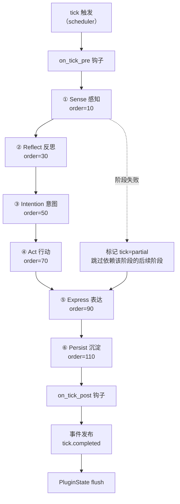
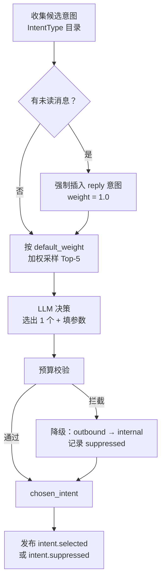

# 04 · 推演循环

> 上级文档：[DESIGN.md](../DESIGN.md) · 版本 v0.1.0
> 本文档描述 Agent 的「思维过程」——从感知到行动到表达的完整循环。面向核心开发者与 Prompt 工程师。

---

## 目录

1. [时间模型](#1-时间模型)
2. [Tick 流水线总览](#2-tick-流水线总览)
3. [六阶段详解](#3-六阶段详解)
4. [意图系统](#4-意图系统)
5. [打扰预算](#5-打扰预算)
6. [情绪模型](#6-情绪模型)
7. [记忆模型](#7-记忆模型)
8. [人设生成与演化](#8-人设生成与演化)
9. [NPC 推演](#9-npc-推演)
10. [成本控制](#10-成本控制)
11. [Prompt 工程](#11-prompt-工程)
12. [可解释性](#12-可解释性)

---

## 1. 时间模型

### 1.1 三个时间维度

| 维度 | 含义 | 用途 |
| --- | --- | --- |
| **真实时间** | 物理时钟 | 日志时间戳、LLM 调用计量、性能指标 |
| **虚拟时间** | Agent 主观时间，可倍速 | 所有日程、记忆衰减、情绪变化 |
| **Tick** | 推演的最小步进单位 | 流水线执行粒度 |

**默认**：虚拟时间与真实时间 1:1 同步。

**倍速模式**：`60x` 表示 1 真实分钟 = 1 虚拟小时。用于快速验证「运行 30 天是否人格漂移」。

### 1.2 频率模式

| 模式 | 虚拟时间粒度 | 倍速 | 1 天 tick 数 | 用途 |
| --- | --- | --- | --- | --- |
| `realtime` | 5 分钟 | 1x | 288 | 生产环境 |
| `fast` | 5 分钟 | 60x | 288 | 快速验证（1 天 = 24 分钟） |
| `turbo` | 15 分钟 | 300x | 96 | 压测（1 天 = 4.8 分钟） |

配置：

```toml
[simulation]
mode = "realtime"          # realtime | fast | turbo
tick_interval_minutes = 5  # 虚拟时间粒度
time_scale = 1.0           # 1.0 = 实时；60.0 = 60 倍速
```

### 1.3 实现

```python
class VirtualClock:
    """虚拟时钟：倍速推进，可暂停/快进"""

    def __init__(self, start: datetime, time_scale: float = 1.0):
        self._start_real = time.monotonic()
        self._start_virtual = start
        self._time_scale = time_scale

    def virtual_now(self) -> datetime:
        elapsed_real = time.monotonic() - self._start_real
        return self._start_virtual + timedelta(seconds=elapsed_real * self._time_scale)
```

**关键约束**：所有业务代码必须通过 `ctx.clock` / `ctx.now()` 获取时间。禁止 `datetime.now()`。

### 1.4 时间不连续的处理

倍速模式下，虚拟时间可能「跨越」日程块的边界。例如一个 tick 开始时还在工作，结束时已经下班。

处理方式：**以 tick 的虚拟时间为准做快照，在 tick 内视为时间静止**。

```
tick 开始: virtual_now = 17:58 → 快照 current_block = "工作"
  ... 处理中虚拟时间推进到 18:03 ...
tick 结束: 仍认为当前在"工作"块
下一个 tick: virtual_now = 18:03 → 快照 current_block = "通勤"
```

这保证单个 tick 内的决策一致性，代价是行为切换最多延迟一个 tick（可接受，因为 tick 间是连续的）。

---

## 2. Tick 流水线总览



阶段之间通过 `TickContext` 传递数据，每个阶段都是可替换的插件。

### 2.1 阶段插入点

`order` 值预留间隔（10 的倍数），便于插件插入。示例：

| order | 阶段 | 来源 |
| --- | --- | --- |
| 10 | `sense` | 内置 |
| 20 | `sense.weather` | **插件可插入** |
| 25 | `weather_mood` | **插件可插入** |
| 30 | `reflect` | 内置 |
| 40 | `reflect.self_critique` | **插件可插入** |
| 50 | `intention` | 内置 |
| 60 | `intention.constraint` | **插件可插入**（如「今天别聊工作」） |
| 70 | `act` | 内置 |
| 80 | `act.post_process` | **插件可插入** |
| 90 | `express` | 内置 |
| 110 | `persist` | 内置 |

### 2.2 TickContext

```python
@dataclass
class TickContext:
    # ── 身份与时间 ──
    tick_id: str
    virtual_now: datetime
    correlation_id: str             # 用于串联日志与事件

    # ── 状态快照（tick 内视为不变）──
    state: StateSnapshot

    # ── 随机源（tick 内固定种子，保证可复现）──
    rng: random.Random

    # ── 数据流（各阶段读写）──
    percepts: Percepts              # ← Sense 写入
    reflections: list[str]          # ← Reflect 写入
    candidates: list[Intent]        # ← Intention 写入（含权重）
    chosen_intent: Intent | None    # ← Intention 写入（选中）
    suppressed: list[Suppressed]    # ← Intention/预算校验写入
    actions: list[Activity]         # ← Act 写入
    expressions: list[Expression]   # ← Express 写入
    llm_calls: list[UsageRecord]    # ← 各阶段追加
    notes: list[str]                # ← 任意阶段追加，用于可解释性

    # ── 便捷方法 ──
    def note(self, text: str) -> None: ...
    async def llm(self, purpose: str, prompt: str, tier: str = "strong", **kw) -> str: ...
```

`StateSnapshot`：

```python
@dataclass(frozen=True)
class StateSnapshot:
    persona: Persona
    emotion: Emotion
    relationships: Mapping[str, Relationship]
    current_block: ScheduleBlock | None
    recent_memories: tuple[Memory, ...]
    today_activity: tuple[Activity, ...]
    budget: BudgetUsage
    world: World

    def evolve(self, **changes) -> "StateSnapshot": ...
```

---

## 3. 六阶段详解

### 3.1 ① Sense · 感知（order=10）

**职责**：收集「现在发生了什么」，形成 `Percepts`。**不做判断和决策**。

```python
@dataclass
class Percepts:
    now: datetime
    time_of_day: str                # dawn | morning | noon | afternoon | evening | night
    weekday: int
    is_weekend: bool
    weather: str | None
    location: str | None            # 当前应在的地点（来自日程）
    schedule_block: ScheduleBlock | None
    next_block_in_minutes: int | None

    unread_messages: list[Message]          # 用户未读消息
    recent_user_messages: list[Message]     # 最近 2 小时用户消息
    pending_post_interactions: list[PostInteraction]

    minutes_since_last_contact: int | None
    minutes_since_last_post: int | None
    minutes_since_last_activity: int | None

    external: dict[str, Any]        # 插件注入的外部感知（天气 API、日历等）
```

**内置感知逻辑**（纯代码，不调 LLM）：

```python
class SenseStage(Plugin, Stage):
    name, order, depends_on = "sense", 10, ()

    async def run(self, ctx: TickContext) -> StageResult:
        snap = ctx.state
        now = ctx.virtual_now
        p = Percepts(now=now, time_of_day=_classify_time(now.hour), ...)

        # 未读消息（高频查询，用部分索引）
        p.unread_messages = ctx.storage.message.unread(snap.persona.id)

        # 距上次联系
        rel = snap.relationships.get("user")
        if rel and rel.last_contact_at:
            p.minutes_since_last_contact = int(
                (now - rel.last_contact_at).total_seconds() // 60)

        # 插件注入的外部感知
        for provider in ctx.registry.get_all(PerceptProvider):
            p.external[provider.id] = await provider.poll(ctx)

        return StageResult(ok=True, output=p)
```

**为什么先做感知而不直接问 LLM**：大部分 tick（约 85%）在感知后就能确定「没什么特别的」，可以直接走轻量路径，避免 LLM 调用。这是成本控制的第一道闸门。

### 3.2 ② Reflect 反思（order=30）

**职责**：把感知转成「这意味着什么」，更新情绪。**输出一段内部思考，不产生对外行为**。

**两条路径**：

| 条件 | 路径 | LLM 调用 |
| --- | --- | --- |
| 感知中无特殊事件，且距上次反思 < 2 虚拟小时 | **轻量路径**：只做情绪自然衰减 | ❌ 无 |
| 有未读消息 / 有特殊事件 / 到反思周期 | **完整路径**：调 LLM 生成反思 | ✅ 1 次（cheap 模型） |

**轻量路径**（纯数学）：

```python
async def _lightweight_reflect(self, ctx: TickContext) -> list[str]:
    """无事件时的情绪自然衰减，不调用 LLM"""
    emo = ctx.state.emotion
    elapsed = ctx.virtual_now - emo.updated_at

    new_valence = decay_toward(emo.valence, BASELINE.valence,
                               elapsed, half_life_hours=4.0)
    new_arousal = decay_toward(emo.arousal, BASELINE.arousal,
                               elapsed, half_life_hours=2.0)

    ctx.state = ctx.state.evolve(emotion=emo.evolve(
        valence=new_valence, arousal=new_arousal, updated_at=ctx.virtual_now))

    return [f"情绪自然回落：效价 {emo.valence:+.2f} → {new_valence:+.2f}"]
```

**完整路径**（LLM）：

```python
REFLECT_PROMPT = """你是 {name}，{age}岁，{occupation}，住在{city}。

【你的性格】{traits}
【你现在的状态】
- 时间：{now}（{time_of_day}，{weekday_cn}）
- 地点/活动：{location} / {activity}
- 情绪：{emotion_label}（愉悦度 {valence:+.2f}，唤醒度 {arousal:.2f}）

【刚才发生了什么】
{percepts_summary}

【你记得的相关事情】
{memories}

【你和用户的关系】亲密度 {affinity}，最近联系 {minutes_since} 分钟前

请以第一人称，用 2-4 句话写下你此刻的内心活动。
要求：
- 口语化，不要书面语，不要罗列
- 如果没什么特别的，就说没什么特别的，不要强行编造事件
- 只输出内心独白本身，不要任何前缀或解释

内心独白："""
```

**输出处理**：

```python
reflection = await ctx.llm("reflection", prompt, tier="cheap")

# 从反思中提取情绪变化（第二次 LLM 调用，或用规则）
emo_delta = await self._infer_emotion_delta(reflection, ctx)

# 写入
ctx.reflections.append(reflection)
ctx.note(f"反思：{reflection[:40]}...")
ctx.state = ctx.state.evolve(emotion=new_emotion)
ctx.storage.emotion.append(EmotionEntry(
    valence=new_emotion.valence, arousal=new_emotion.arousal,
    label=infer_label(new_emotion.valence, new_emotion.arousal),
    reason=reflection[:120],            # 原因写进日志，供 alterego why 展示
    tick_id=ctx.tick_id, recorded_at=ctx.virtual_now))
```

**情绪推断的方式**（避免额外 LLM 调用）：让 `Reflect` 的 LLM 输出 JSON：

```python
REFLECT_PROMPT_JSON = """...
请输出 JSON：
{
  "inner_voice": "你的内心独白，2-4 句第一人称口语",
  "emotion": {
    "valence_delta": -0.15,     // -1 到 1，情绪愉悦度的变化量
    "arousal_delta": 0.1,       // -1 到 1
    "reason": "简短说明为什么情绪这样变化"
  }
}
"""
```

这样一次调用同时得到反思文本和情绪变化，成本减半。

### 3.3 ③ Intention 意图（order=50）

**职责**：决定「接下来做什么」。这是**唯一产生对外行为的决策点**。

**流程**：



**候选集生成**（代码 + 权重）：

```python
def build_candidates(ctx: TickContext) -> list[Intent]:
    types = ctx.registry.get_all(IntentType)
    cands = []

    for it in types:
        weight = it.default_weight

        # ── 上下文调整权重 ──
        if it.name == "reply" and ctx.percepts.unread_messages:
            weight = 1.0                                    # 必选
        if it.name == "work" and ctx.percepts.schedule_block?.category == "work":
            weight *= 3.0
        if it.name == "rest" and ctx.state.emotion.fatigue > 0.7:
            weight *= 2.5
        if it.name in ("post_moment", "reach_out"):
            # 距上次行为越久，权重越高
            hours = ctx.percepts.minutes_since_last_post / 60
            weight *= min(1.0 + hours / 12, 3.0)

        # ── 能力可用性过滤 ──
        if it.requires_capability and not ctx.has_capability(it.requires_capability):
            continue

        cands.append(Intent(type=it, weight=weight, params={}))

    return sorted(cands, key=lambda c: -c.weight)[:5]
```

**LLM 决策 Prompt**：

```python
INTENTION_PROMPT = """你是 {name}。

【你的性格】{traits}
【现在的状况】
时间 {now}，{weekday_cn}，你正在{activity}（地点：{location}）
情绪：{emotion_label}
{weather_note}

【最近的内心活动】
{reflections}

【你记得的事】
{memories}

【近期状态】
- 距离上次跟{user_name}说话：{minutes_since_contact} 分钟
- 距离上次发动态：{minutes_since_post} 分钟
- 今天已发消息 {messages_sent}/3 条，已发动态 {posts_sent}/4 条

【你可以做的事】（选一个最符合你当下状态和性格的）
{intent_catalog}

【用户的未读消息】
{unread_messages}

请输出 JSON：
{{
  "intent": "意图名称",
  "reason": "为什么会想做这件事，一句话，用第一人称",
  "params": {{ ... 该意图要求的参数 ... }}
}}

要求：
- 选最符合你性格和当下情境的，不要总是选"工作"
- 如果你是内向的人，主动找人说话的概率应该低一些
- 如果刚跟{user_name}聊过，不要马上又找他
- reason 必须是你真实的心理活动，不要写"因为要达到XX目标"
"""
```

**`intent_catalog` 由 `IntentType` 动态渲染**：

```
- work：处理工作任务。参数：{"task": "具体做什么"}
- rest：休息放松，可能是刷手机、睡觉、发呆。参数：{"how": "具体方式"}
- eat：吃东西。参数：{"what": "吃什么", "where": "在哪吃"}
- entertain：娱乐，看电影、玩游戏、听音乐。参数：{"what": "娱乐内容"}
- socialize：和现实中的朋友/同事互动（不是线上的）。参数：{"with_whom": "谁", "how": "做什么"}
- post_moment：发一条动态到朋友圈。参数：{"content": "文案，第一人称", "location": "地点（可选）"}
- reach_out：主动给{user_name}发消息。参数：{"motivation": "share_something|miss_you|need_comfort|ask_question|follow_up|just_bored", "content": "想说什么"}
- reply：回复{user_name}的消息。参数：{"content": "回复内容"}
- reflect_internal：什么都不做，想想事情。参数：{"about": "在想什么"}
- commute：通勤移动。参数：{"from": "起点", "to": "终点"}
```

> 插件新增 `IntentType` 后，这段目录会自动扩展，**无需修改提示词文件**。

### 3.4 ④ Act 行动（order=70）

**职责**：执行选中的意图，产生 `Activity`（行为记录）。

```python
class ActStage(Plugin, Stage):
    name, order, depends_on = "act", 70, ("intention",)

    async def run(self, ctx: TickContext) -> StageResult:
        intent = ctx.chosen_intent
        if intent is None:
            return StageResult(ok=True, output=[])

        # 纯内部意图无需 capability
        if intent.category == "internal":
            activity = Activity(
                intent=intent.name,
                category="internal",
                description=self._describe_internal(intent),
                inner_voice=intent.reason,
                duration_minutes=self._estimate_duration(intent, ctx),
                started_at=ctx.virtual_now,
                tick_id=ctx.tick_id,
            )
            ctx.actions.append(activity)
            return StageResult(ok=True, output=[activity])

        # 需要 capability
        cap = ctx.registry.get_optional(
            Capability, name=intent.type.requires_capability)
        if cap is None:
            ctx.note(f"能力 {intent.type.requires_capability} 不可用，跳过")
            return StageResult(ok=True, output=[])

        result = await cap.execute(intent, ctx)

        activity = Activity(
            intent=intent.name,
            category=intent.category,
            description=result.summary,
            detail=result.artifacts,
            outbound=intent.type.outbound,
            outbound_ref=result.artifacts.get("post_id") or result.artifacts.get("message_id"),
            inner_voice=intent.reason,
            location=ctx.percepts.location,
            started_at=ctx.virtual_now,
            duration_minutes=self._estimate_duration(intent, ctx),
            tick_id=ctx.tick_id,
        )
        ctx.actions.append(activity)
        return StageResult(ok=True, output=[activity])
```

**时长估算**：让意图的 `parameters_schema` 可含 `duration_minutes` 字段，由 LLM 填入；缺省时按类别给默认值：

| 意图 | 默认时长 |
| --- | --- |
| `work` | 到当前 schedule_block 结束 |
| `rest` | 30 分钟 |
| `eat` | 40 分钟 |
| `commute` | 到下一个 block 开始 |
| `entertain` | 60 分钟 |
| `socialize` | 90 分钟 |
| `reflect_internal` | 5 分钟（tick 间隔） |
| `post_moment` / `reach_out` / `reply` | 2 分钟 |

**时长影响的下一个 tick**：如果在「看电影」且有 60 分钟时长，后续 tick 会感知到 `minutes_since_last_activity < 60`，从而倾向于 `reflect_internal`（继续在做同一件事），避免每 5 分钟换一个活动。

### 3.5 ⑤ Express 表达（order=90）

**职责**：把行为转成对外表达——发消息、发动态时的**文案生成**。

**为什么与 Act 分离**：Act 决定「做什么」（语义），Express 决定「怎么说」（措辞）。两者可独立替换：想换说话风格只需替换 Express 插件。

> 注意：`capability.post` 和 `capability.chat` 已经生成了文案（在 `Act` 阶段）。`Express` 阶段主要处理两种补充情况：
> 1. **跨渠道适配**：同一内容在 Web 显示完整版、在钉钉截断为前 200 字
> 2. **时机微调**：不立即发送，而是在 30-120 秒后发送（更像真人打字）

```python
class ExpressStage(Plugin, Stage):
    name, order, depends_on = "express", 90, ("act",)

    async def run(self, ctx: TickContext) -> StageResult:
        for activity in ctx.actions:
            if not activity.outbound:
                continue

            if activity.outbound_ref.startswith("msg_"):
                await self._express_message(activity, ctx)
            elif activity.outbound_ref.startswith("post_"):
                await self._express_post(activity, ctx)

        return StageResult(ok=True, output=ctx.expressions)

    async def _express_message(self, activity, ctx):
        msg = ctx.storage.message.get(activity.outbound_ref)

        # 1) 打字延迟：按文本长度模拟真人输入速度（约 3 字/秒）
        typing_seconds = len(msg.content) / 3.0
        delay = min(typing_seconds * ctx.rng.uniform(0.6, 1.4), 30.0)

        # 2) 分句发送：长消息拆成多条（真人不会一口气发 200 字）
        parts = self._split_into_parts(msg.content, ctx.state.persona)
        for i, part in enumerate(parts):
            self._schedule_send(part, delay + i * (0.8 + len(part) / 8), msg.id, ctx)

        ctx.expressions.append(Expression(kind="message", ref=msg.id, parts=len(parts)))
        ctx.note(f"消息将在 {delay:.1f}s 后开始分 {len(parts)} 条发送（模拟打字）")

    def _split_into_parts(self, text: str, persona: Persona) -> list[str]:
        """按人设的 verbosity 决定是否分句"""
        if persona.verbosity == "terse" or len(text) <= 30:
            return [text]
        # 按句号、问号、感叹号切分，每句一条
        parts = [p.strip() for p in re.split(r"(?<=[。！？!?~])\s*", text) if p.strip()]
        # 相邻短句合并，避免碎片化
        merged, buf = [], ""
        for p in parts:
            if len(buf) + len(p) < 25:
                buf += p
            else:
                if buf: merged.append(buf)
                buf = p
        if buf: merged.append(buf)
        return merged or [text]
```

**Persona 对表达的影响**：

```python
@dataclass(frozen=True)
class Persona:
    # ...
    tone: str                    # "毒舌但关心人" / "温柔耐心"
    verbosity: Literal["terse", "normal", "verbose"]
    emoji_habit: float           # 0~1，使用表情符号的频率
    catchphrases: tuple[str, ...]     # 口头禅
    typing_quirks: tuple[str, ...]    # 打字习惯：如 "总把「嗯」打成「恩」"
    punctuation_style: str            # "喜欢用波浪线~" / "从不用感叹号"
```

`Express` 会检查生成的文本是否符合这些特征，明显不符时重写（cost 高，仅对 `reach_out` 启用）：

```python
async def _enforce_style(self, text: str, persona: Persona, ctx) -> str:
    issues = []
    if persona.emoji_habit > 0.5 and not has_emoji(text):
        issues.append("人设喜欢用表情，但这条没有")
    if persona.emoji_habit < 0.1 and has_emoji(text):
        issues.append("人设几乎不用表情，但这条用了")
    if persona.punctuation_style == "never_exclaim" and "！" in text:
        issues.append("人设从不用感叹号")

    if not issues:
        return text

    ctx.note(f"风格不符（{'; '.join(issues)}），重写")
    return await ctx.llm("expression", render("style_fix", text=text, issues=issues, persona=persona))
```

### 3.6 ⑥ Persist 沉淀（order=110）

**职责**：把这一 tick 的产出写入数据库，形成记忆。

```python
class PersistStage(Plugin, Stage):
    name, order, depends_on = "persist", 110, ("express",)

    async def run(self, ctx: TickContext) -> StageResult:
        with ctx.storage.transaction():
            # 1) 行为日志
            for a in ctx.actions:
                ctx.storage.activity.append(a)

            # 2) 情绪日志
            ctx.storage.emotion.append(EmotionEntry.from_snapshot(ctx))

            # 3) 生成记忆
            memories = await self._form_memories(ctx)
            ctx.storage.memory.save_many(memories)

            # 4) 更新关系
            if any(a.outbound for a in ctx.actions):
                ctx.storage.relationship.touch_contact(
                    ctx.state.persona.id, "user", ctx.virtual_now)

            # 5) 更新日程实际执行
            if block := ctx.state.current_block:
                ctx.storage.schedule.update_actual(block.id, ctx.virtual_now, None, None)

            # 6) 预算用量
            for a in ctx.actions:
                if a.outbound:
                    kind = "message" if a.outbound_ref.startswith("msg_") else "post"
                    ctx.storage.budget.increment(
                        ctx.state.persona.id, ctx.virtual_now.date(), kind=kind)

            # 7) tick 日志
            ctx.storage.tick.save(TickLog.from_context(ctx, status=self._status(ctx)))

        ctx.note(f"沉淀 {len(memories)} 条记忆")
        return StageResult(ok=True)
```

**记忆形成策略**（决定哪些内容值得记住）：

| 来源 | 是否形成记忆 | importance |
| --- | --- | --- |
| 用户发来的消息 | ✅ | 0.5 基础，情绪冲击大则上调 |
| Agent 发出的主动消息 | ✅ | 0.4（"我又找他了"） |
| 发布动态 | ✅ | 0.35 |
| 收到动态互动 | ✅ | 0.3 + 互动影响 |
| 日常行为（工作/吃饭） | ❌ 仅记 activity_log | — |
| 显著行为（看电影、见朋友） | ✅ | 0.3 |
| 情绪剧烈波动 | ✅（kind=emotional） | 0.7 |
| 反思内容 | ⚠️ 仅当 LLM 判定值得记 | LLM 决定 |

```python
async def _form_memories(self, ctx: TickContext) -> list[Memory]:
    mems = []

    # 用户消息 → 记忆（这个必须记住）
    for msg in ctx.percepts.unread_messages:
        mems.append(Memory(
            persona_id=ctx.state.persona.id,
            kind="episodic",
            content=f"{ctx.state.persona.friend_name}说：{msg.content}",
            summary=summarize_short(msg.content),
            importance=0.5 + abs(ctx.state.emotion.valence) * 0.3,
            valence=ctx.state.emotion.valence,
            source="conversation",
            source_ref=msg.id,
            entities=("<user>",),
            occurred_at=ctx.virtual_now,
        ))

    # 显著行为 → 记忆
    for a in ctx.actions:
        if a.category == "social" or a.intent in ("entertain", "socialize"):
            mems.append(Memory(
                kind="episodic",
                content=a.description,
                summary=a.description,
                importance=0.3,
                valence=ctx.state.emotion.valence,
                source="tick", source_ref=ctx.tick_id,
                occurred_at=ctx.virtual_now,
                persona_id=ctx.state.persona.id,
            ))

    # 情绪剧烈波动 → 情绪记忆
    emo_delta = ctx.state.emotion.valence - ctx.state_snapshot.emotion.valence
    if abs(emo_delta) > 0.35:
        mems.append(Memory(
            kind="emotional",
            content=f"{ctx.virtual_now:%H:%M}，{ctx.reflections[0] if ctx.reflections else '情绪大幅波动'}",
            summary=f"情绪剧烈变化（{emo_delta:+.2f}）",
            importance=0.7,
            valence=ctx.state.emotion.valence,
            source="tick", source_ref=ctx.tick_id,
            occurred_at=ctx.virtual_now,
            persona_id=ctx.state.persona.id,
        ))

    return mems
```

### 3.7 记忆衰减任务

不属于 tick 流水线，由独立调度任务执行（每 6 虚拟小时）：

```python
async def memory_decay_job(ctx) -> None:
    """重算所有记忆的 strength"""
    persona_id = ctx.state.persona.id
    now = ctx.virtual_now

    memories = ctx.storage.memory.list_all_active(persona_id)
    updates = []
    forgotten = []

    for m in memories:
        new_strength = strength_at(m, now)
        if new_strength < 0.05 and m.importance < 0.6:
            forgotten.append(m.id)
        else:
            updates.append((m.id, new_strength))

    ctx.storage.memory.update_strength(updates)
    ctx.storage.memory.mark_forgotten(forgotten)
    ctx.logger.info(f"记忆衰减：{len(updates)} 条更新，{len(forgotten)} 条遗忘")
```

---

## 4. 意图系统

### 4.1 内置意图目录

| 意图 | category | 默认权重 | outbound | budget_kind | 参数 |
| --- | --- | --- | --- | --- | --- |
| `work` | internal | 0.18 | ❌ | — | `task` |
| `rest` | internal | 0.12 | ❌ | — | `how` |
| `eat` | internal | 0.08 | ❌ | — | `what`, `where` |
| `commute` | internal | 0.05 | ❌ | — | `from`, `to` |
| `entertain` | internal | 0.10 | ❌ | — | `what` |
| `socialize` | social | 0.06 | ❌ | — | `with_whom`, `how` |
| `reflect_internal` | internal | 0.15 | ❌ | — | `about` |
| `reply` | social | 动态（有未读时 1.0） | ✅ | `message` | `content` |
| `post_moment` | outbound | 0.05 | ✅ | `post` | `content`, `location` |
| `reach_out` | outbound | 0.06 | ✅ | `message` | `motivation`, `content` |
| `research` | internal | 0.07 | ❌ | `media`（v0.3.0 起） | `interest_key`, `query` |

权重总和不必为 1——权重只用于采样的相对概率。

**关于 `research`（第 11 种意图，v0.3.0）**：它是**唯一一种会主动改变自己认知状态的意图**——
其他意图都在输出（做事、说话、发呆），只有它会带回新信息。
但它“会打扰用户”吗？**不会，它本身是 `internal`。**

不过它可能**间接**打扰：读到一条有意思的东西后，可能触发下一个 tick 的 `reach_out`（「刚看到一个东西想跟你说」），
而那一次要受打扰预算管辖。这个链条是故意的：

> **想分享的冲动必须是真实产生的，而不是为了“展示自己在上网”而编排的。**

`research` 的三级降级（搜索 → RSS → 降为本 tick 的 `reflect_internal`）见
[08-external-sources.md § 2.3](08-external-sources.md#23-失败必须降级绝不中断生活)——
它遵循与 [ADR-0005](../adr/0005-downgrade-instead-of-discard-suppressed-intents.md) 完全一致的原则。

### 4.2 `reach_out` 的动机系统

**为什么动机重要**：让「主动找用户」这个行为**有理由**。没有动机的主动消息会显得莫名其妙；有动机的消息（"我刚看到一个视频想起你"）才像真人。

| motivation | 触发条件 | 典型文案 |
| --- | --- | --- |
| `share_something` | 刚经历了有趣的事、看到好内容 | "刚看了个视频笑死我了，你肯定也喜欢" |
| `miss_you` | `longing_score() > 0.6` | "突然有点想你了" |
| `need_comfort` | valence < -0.4 且 affinity > 30 | "今天有点倒霉，想跟你说说" |
| `ask_question` | 遇到需要决策的事 | "你说我是买这个还是那个？" |
| `follow_up` | 之前对话有未完结话题 | "对了，你上次说的那个事后来怎么样了" |
| `just_bored` | 无聊、arousal 低 | "在干嘛呢" |

**`longing_score` 计算**（领域层纯函数）：

$$
\text{longing} = \text{affinity\_norm} \times \left(1 - e^{-\lambda \cdot \text{hours}}\right) \times \text{valence\_factor}
$$

其中：
- $\text{affinity\_norm} = \max(0, \text{affinity}) / 100$
- $\lambda = 0.08$（约 12 小时达 60%，24 小时达 85%）
- $\text{valence\_factor} = 1 + 0.3 \cdot \max(0, -\text{valence})$ —— 心情差时更想念

```python
def longing_score(rel: Relationship, emotion: Emotion, now: datetime) -> float:
    if rel.last_contact_at is None:
        hours = 24.0
    else:
        hours = (now - rel.last_contact_at).total_seconds() / 3600
    hours = min(hours, 72.0)

    affinity_norm = max(0.0, rel.affinity) / 100.0
    time_factor = 1.0 - math.exp(-0.08 * hours)
    valence_factor = 1.0 + 0.3 * max(0.0, -emotion.valence)

    return min(affinity_norm * time_factor * valence_factor, 1.0)
```

**动机选择的确定性**（同输入必得同输出，便于测试）：

```python
def choose_reach_out_motivation(ctx: TickContext) -> str:
    rel = ctx.state.relationships["user"]
    emo = ctx.state.emotion
    longing = longing_score(rel, emo, ctx.virtual_now)

    scores = {
        "miss_you":      longing * 1.0,
        "need_comfort":  max(0, -emo.valence) * (rel.affinity / 100) * 1.2,
        "share_something": 0.35 if ctx.state.today_activity else 0.0,
        "follow_up":     0.4 if has_unfinished_topic(ctx) else 0.0,
        "ask_question":  0.2 if ctx.percepts.external.get("pending_decision") else 0.0,
        "just_bored":    (1 - emo.arousal) * 0.25,
    }

    # 加权采样（用 ctx.rng，可复现）
    total = sum(scores.values())
    if total <= 0:
        return "just_bored"
    r = ctx.rng.random() * total
    acc = 0.0
    for name, s in scores.items():
        acc += s
        if r <= acc:
            return name
    return "just_bored"
```

### 4.3 插件扩展意图

见 [02-plugin-api.md § 15](02-plugin-api.md#15-完整示例新增意图类型)。

要点：注册 `IntentType` + `Capability` 即可，`intent_catalog` 会自动把新意图渲染进提示词。

---

## 5. 打扰预算

### 5.1 设计动机

**最大的风险不是 Agent 不主动，而是 Agent 太主动。** 一个每 5 分钟发一条消息的「拟人」Agent 立刻会被拉黑。

预算机制是**硬约束**（机制而非提示词），保证无论 LLM 如何决策，都不会骚扰用户。

### 5.2 完整约束表

| 约束 | 默认值 | 说明 |
| --- | --- | --- |
| 每日主动消息上限 | 3 | urgency > 0.8 时放宽至 5 |
| 每日动态上限 | 4 | — |
| 最少间隔（同类） | 90 分钟 | 两条主动消息至少间隔 90 虚拟分钟 |
| 免打扰时段 | 23:30 – 08:00 | 此时段内所有 outbound 都被拦截 |
| 连续未回复熔断 | 3 次 | 连续 3 条主动消息用户未回复 → 暂停 24 小时 |
| 熔断后恢复 | — | 熔断期内降级为 `reflect_internal`；期后 `consecutive_no_reply` 归零 |
| 沉默期保护 | 用户 24 小时未回复 | 不阻止 Agent 发消息，但 `reach_out` 权重降至 0.3 倍 |

配置：

```toml
[simulation.disturb_budget]
daily_message_limit = 3
daily_message_limit_high_urgency = 5
high_urgency_threshold = 0.8
daily_post_limit = 4
min_interval_minutes = 90
quiet_hours_start = "23:30"
quiet_hours_end = "08:00"
consecutive_no_reply_limit = 3
circuit_hours = 24
```

### 5.3 校验算法

```python
@dataclass(frozen=True)
class BudgetDecision:
    allowed: bool
    reason: str
    downgrade_to: str | None = None       # 被拦截时降级到的意图


def check_budget(intent: Intent, state: StateSnapshot, now: datetime,
                 budget: BudgetUsage, cfg: DisturbBudgetConfig,
                 persona_id: str) -> BudgetDecision:
    """纯函数，无副作用。可完整单元测试。"""

    if not intent.type.outbound:
        return BudgetDecision(True, "内部行为，无预算限制")

    # ── 1. 免打扰时段 ──
    if _in_quiet_hours(now, cfg.quiet_hours_start, cfg.quiet_hours_end):
        return BudgetDecision(
            False,
            f"当前处于免打扰时段（{cfg.quiet_hours_start}–{cfg.quiet_hours_end}）",
            downgrade_to="reflect_internal",
        )

    # ── 2. 熔断中 ──
    if budget.circuit_until and now < budget.circuit_until:
        return BudgetDecision(
            False,
            f"连续 {budget.consecutive_no_reply} 条消息未获回复，熔断至 {budget.circuit_until:%m-%d %H:%M}",
            downgrade_to="reflect_internal",
        )

    # ── 3. 日程不可打断 ──
    block = state.current_block
    if block and not block.interruptible:
        return BudgetDecision(
            False,
            f"当前日程不可打断（{block.activity}，{block.category}）",
            downgrade_to="reflect_internal",
        )

    # ── 4. 每日配额 ──
    kind = intent.type.budget_kind
    if kind == "message":
        limit = cfg.daily_message_limit
        if intent.urgency > cfg.high_urgency_threshold:
            limit = cfg.daily_message_limit_high_urgency
        used = budget.messages_sent
    elif kind == "post":
        limit = cfg.daily_post_limit
        used = budget.posts_sent
    else:
        return BudgetDecision(True, "该意图不占用预算")

    if used >= limit:
        return BudgetDecision(
            False,
            f"今日{ '消息' if kind == 'message' else '动态' }配额已用完（{used}/{limit}）",
            downgrade_to="reflect_internal",
        )

    # ── 5. 最小间隔 ──
    last = budget.last_message_at if kind == "message" else budget.last_post_at
    if last:
        gap = (now - last).total_seconds() / 60
        if gap < cfg.min_interval_minutes:
            return BudgetDecision(
                False,
                f"距上次{ '发消息' if kind == 'message' else '发动态' }仅 {gap:.0f} 分钟"
                f"（最小间隔 {cfg.min_interval_minutes} 分钟）",
                downgrade_to="reflect_internal"
                if kind == "message" else None,   # 动态被拒则直接跳过
            )

    return BudgetDecision(True, f"通过预算校验（{used + 1}/{limit}）")
```

### 5.4 降级而非丢弃

**这是本项目最重要的设计决策之一。**

被拦截的 `reach_out` **不丢弃**，而是降级为 `reflect_internal`：

```python
decision = check_budget(...)

if not decision.allowed:
    ctx.suppressed.append(Suppressed(
        intent=intent.name,
        reason=decision.reason,
        original_params=intent.params,      # 保留原始文案
    ))
    ctx.note(f"意图 {intent.name} 被拦截：{decision.reason}；降级为 {decision.downgrade_to}")
    ctx.publish("intent.suppressed", {
        "intent": intent.name, "reason": decision.reason,
        "downgrade_to": decision.downgrade_to,
    })

    if decision.downgrade_to:
        intent = Intent(
            type=get_intent_type(decision.downgrade_to),
            params={"about": intent.params.get("content", intent.reason)},
            reason=f"（本来想找{user_name}，但{decision.reason}）",
            downgraded_from=intent.name,        # ← 溯源
        )
        # Act 阶段会把原始想法写进 activity_log.inner_voice
```

写入 `activity_log` 后：

```
intent            = 'reflect_internal'
suppressed_intent = 'reach_out'
suppress_reason   = '当前日程不可打断（工作时段）'
inner_voice       = '（本来想找他，但当前日程不可打断（工作时段））刚看到那个独立游戏的视频，好想跟他说一声，算了他在上班'
```

Web 的「内心」页面展示这些内容。**用户可以看到 Agent「想说但没说的话」**——这才是拟人感的来源。

此外，这些被压制的意图会在下一个合适时机被**重新激活**：

```python
def reactivate_suppressed(ctx: TickContext) -> None:
    """在 Intention 阶段开始时，检查是否有值得重提的旧意图"""
    for s in ctx.storage.activity.suppressed_only(ctx.state.persona.id, limit=10):
        age_hours = (ctx.virtual_now - s.started_at).total_seconds() / 3600
        if age_hours > 12:
            continue                        # 太久远的就算了
        if s.suppressed_intent == "reach_out":
            # 提高 reach_out 权重，并注入"上次想说的事"
            ctx.pending_topics.append(s.inner_voice)
```

`pending_topics` 会作为提示词的一部分传入，让 Agent 说「对了，我昨天看到个视频想跟你说来着」。

### 5.5 预算追踪

`budget_usage` 表按 `(persona_id, day)` 记录。每日 00:00 虚拟时间由 `budget_reset` 任务创建新行。

`consecutive_no_reply` 的更新：

```python
def on_user_message_received(msg: Message, storage) -> None:
    """用户回复了 → 归零"""
    storage.budget.reset_no_reply(persona_id, msg.created_at.date())

def on_message_sent(msg: Message, storage) -> None:
    """检查上一条主动消息是否被回复"""
    if not msg.initiative:
        return
    prev = storage.message.last_initiative(persona_id, before=msg.created_at)
    if prev and prev.replied_at is None:
        n = storage.budget.bump_no_reply(persona_id, msg.created_at.date())
        if n >= 3:
            storage.budget.set_circuit(
                persona_id, msg.created_at + timedelta(hours=24))
```

---

## 6. 情绪模型

### 6.1 二维模型

```python
@dataclass(frozen=True)
class Emotion:
    valence: float          # -1（极负面）~ +1（极正面）
    arousal: float          # 0（平静/疲惫）~ 1（兴奋/紧张）
    fatigue: float          # 0 ~ 1，疲劳度
    label: str              # 离散标签，由 (valence, arousal) 推导
    updated_at: datetime
```

**为什么用二维而非离散**：
- 离散情绪（"开心"/"难过"）无法表达程度，也无法平滑变化
- 二维可连续演变，且能映射回人类可理解的标签
- 情绪惯性、衰减等数学操作在连续空间中才有意义

### 6.2 标签推导

```python
def infer_label(valence: float, arousal: float) -> str:
    """四象限映射 + 疲惫特例"""
    if arousal < 0.25 and valence < 0.1:
        return "疲惫"
    if valence >= 0.3:
        return "兴奋" if arousal >= 0.6 else "愉快"
    if valence <= -0.3:
        return "焦虑" if arousal >= 0.6 else "低落"
    # 中性区
    if arousal >= 0.6:
        return "警觉"
    if arousal <= 0.3:
        return "平静"
    return "一般"
```

### 6.3 四条更新规则

**规则 1 · 自然回归**：情绪向基线回落，半衰期 4 小时。

```python
def decay_toward(current: float, baseline: float, elapsed: timedelta,
                 half_life_hours: float) -> float:
    """指数回归：每过 half_life_hours，与基线的距离减半"""
    hours = elapsed.total_seconds() / 3600
    factor = 0.5 ** (hours / half_life_hours)
    return baseline + (current - baseline) * factor
```

| 维度 | 半衰期 | 含义 |
| --- | --- | --- |
| valence | 4 小时 | 开心/难过持续几小时 |
| arousal | 2 小时 | 兴奋/紧张消退更快 |
| fatigue | 8 小时（但睡眠时快速恢复） | 疲劳积累慢、恢复靠睡眠 |

**规则 2 · 事件冲击**：外部事件直接改变情绪。

```python
def apply_event(current: Emotion, event: EmotionalEvent) -> Emotion:
    """event 含 valence_delta / arousal_delta / fatigue_delta"""
    return replace(
        current,
        valence=clamp(current.valence + event.valence_delta, -1, 1),
        arousal=clamp(current.arousal + event.arousal_delta, 0, 1),
        fatigue=clamp(current.fatigue + event.fatigue_delta, 0, 1),
    )
```

**规则 3 · 情绪惯性**：同方向的事件效果放大，反方向的被削弱。这模拟「心情好时好事更让人开心，但也更难被坏事影响」的黏滞感。

```python
def apply_with_inertia(current: Emotion, valence_delta: float,
                       sensitivity: float) -> float:
    """sensitivity 来自人设（0.5 迟钝 ~ 1.5 敏感）"""
    # 惯性系数：当前情绪越强，同向事件效果越强（最高 1.4x），
    # 反向事件效果越弱（最低 0.6x）
    same_direction = (current.valence * valence_delta) > 0
    inertia = 1.0 + 0.4 * abs(current.valence) if same_direction \
              else 1.0 - 0.4 * abs(current.valence)

    effective = valence_delta * inertia * sensitivity
    return clamp(current.valence + effective, -1, 1)
```

**规则 4 · 疲劳累积**：清醒时间增加疲劳；睡眠快速恢复。

```python
def update_fatigue(current: float, elapsed: timedelta, block: ScheduleBlock | None) -> float:
    hours = elapsed.total_seconds() / 3600
    if block and block.category == "sleep":
        return max(0.0, current - hours * 0.8)      # 每小时恢复 0.8
    # 清醒时每小时 +0.05（即 20 小时从 0 到 1）
    return min(1.0, current + hours * 0.05)
```

**疲劳对行为的影响**（在 Intention 阶段体现）：

| fatigue | 影响 |
| --- | --- |
| > 0.7 | `rest` 权重 ×2.5，`work` 权重 ×0.6 |
| > 0.85 | 强制插入 `rest` 且 `reach_out` 权重 ×0.3（累到不想找人） |
| 睡眠时段 | 无 tick 决策，直接 `rest` |

### 6.4 情绪更新的完整函数

```python
def update_emotion(
    current: Emotion,
    events: list[EmotionalEvent],
    baseline: Emotion,
    sensitivity: float,
    elapsed: timedelta,
) -> tuple[Emotion, str]:
    """领域层纯函数。返回新情绪与变化原因（用于 emotion_log.reason）。

    顺序很重要：先回归，再冲击，最后惯性修正。
    """
    reasons = []

    # 1) 自然回归
    v = decay_toward(current.valence, baseline.valence, elapsed, 4.0)
    a = decay_toward(current.arousal, baseline.arousal, elapsed, 2.0)
    if abs(v - current.valence) > 0.02:
        reasons.append(f"情绪自然回落 {current.valence:+.2f}→{v:+.2f}")

    # 2) 事件冲击（含惯性）
    for e in events:
        old = v
        v = apply_with_inertia(replace(current, valence=v), e.valence_delta, sensitivity)
        a = clamp(a + e.arousal_delta * sensitivity, 0, 1)
        reasons.append(f"{e.description} 效价 {old:+.2f}→{v:+.2f}")

    # 3) 疲劳
    new_fatigue = update_fatigue(current.fatigue, elapsed, None)

    new = Emotion(valence=round(v, 3), arousal=round(a, 3), fatigue=round(new_fatigue, 3),
                  label=infer_label(v, a), updated_at=current.updated_at + elapsed)

    return new, "；".join(reasons) or "无显著变化"
```

---

## 7. 记忆模型

### 7.1 三种记忆

| kind | 内容 | 衰减速度 | 半衰期 | 举例 |
| --- | --- | --- | --- | --- |
| `episodic` | 具体事件 | 快 | 7 天 | "今天下午跟小王吃了个火锅" |
| `semantic` | 归纳知识 | 慢 | 180 天 | "小王不吃辣" |
| `emotional` | 情绪印记 | 极慢 | 365 天 | "上次他说那句话让我特别难受" |

### 7.2 强度公式

$$
\text{strength}(t) = \text{importance} \times e^{-\lambda_{\text{kind}} \cdot \Delta t_{\text{days}}} \times (1 + 0.35 \cdot \text{recall\_count})
$$

其中：

| 参数 | episodic | semantic | emotional |
| --- | --- | --- | --- |
| $\lambda$ | $\ln 2 / 7 = 0.099$ | $\ln 2 / 180 = 0.0039$ | $\ln 2 / 365 = 0.0019$ |

**$\Delta t$ 的基准**：不是从创建时间算起，而是从**上次回忆时间**算起（`last_recalled_at` 优先于 `occurred_at`）。这模拟「每次想起就重新记牢一点」的效果。

```python
HALF_LIFE_DAYS = {"episodic": 7.0, "semantic": 180.0, "emotional": 365.0}

def strength_at(memory: Memory, now: datetime) -> float:
    kind = memory.kind
    ref = memory.last_recalled_at or memory.occurred_at
    days = max(0.0, (now - ref).total_seconds() / 86400)
    decay = math.exp(-math.log(2) / HALF_LIFE_DAYS[kind] * days)
    boost = 1.0 + 0.35 * memory.recall_count
    return memory.importance * decay * boost
```

验证示例（episodic，importance=0.7）：

| 距上次回忆 | strength | 状态 |
| --- | --- | --- |
| 0 天 | 0.70 | 清晰 |
| 7 天 | 0.35 | 记得 |
| 21 天 | 0.09 | 模糊 |
| 28 天 | 0.04 | 遗忘（< 0.05 阈值） |

### 7.3 遗忘

**遗忘不是删除**。`forgotten = 1` 的记忆：

- 不参与常规检索
- 仍留在库中（可被 `alterego memory list --forgotten` 查看）
- 可被**强关联触发**重新激活

```python
def maybe_resurrect(memory_id: str, storage, now: datetime) -> None:
    """被强烈关联到当前情境时，遗忘的记忆可能"突然想起来" """
    m = storage.memory.get(memory_id)
    if not m or not m.forgotten:
        return
    # 强关联：有实体重叠且当前情绪与其情绪印记一致
    if m.importance >= 0.5:
        m.forgotten = False
        m.strength = m.importance * 0.4        # 恢复但不如原来清晰
        m.last_recalled_at = now
        m.recall_count += 1
        storage.memory.save(m)
        # 这个"想起来"的瞬间本身值得记忆
        storage.memory.save(Memory(
            kind="episodic",
            content=f"突然想起了{m.summary}",
            summary=f"想起：{m.summary}",
            importance=0.45, source="tick",
            occurred_at=now, persona_id=m.persona_id,
        ))
```

### 7.4 记忆巩固

每 6 虚拟小时，把最近的 `episodic` 归纳为 `semantic`。详见 [03-data-model.md § 6.5](03-data-model.md#65-记忆巩固)。

巩固后的效果：

```
[episodic] 2026-09-10 和小王吃火锅，他点了很多毛肚
[episodic] 2026-09-12 小王说他不能吃太辣，我还是点了微辣
[episodic] 2026-09-14 跟小王吃饭，他一直在喝水
                ↓ 巩固
[semantic] 小王不太能吃辣 —— 提到过三次
```

原始 episodic 记忆的 `importance` 被乘以 0.6（信息已上提，原事件不再那么重要）。

---

## 8. 人设生成与演化

### 8.1 初始生成

LLM 生成人设时，`PersonaGenerator` 保证内部一致性：

```python
GENERATE_PROMPT = """请生成一个真实可信的虚拟人物人设。

【约束】
- 姓名：{name}（已定）
- 年龄：{age}（已定）
- 职业：{occupation}（已定）
- 城市：{city}（已定）

【要求】
1. 性格必须有矛盾之处——真人不是单一标签的堆砌。
   例如："工作上很强势但生活里有点退缩"比"性格强势"真实得多。
2. 背景故事要具体到有细节，但是留白。不要写成小说。
3. 说话风格必须可操作（能指导生成文字），不要写"说话很有个性"。
4. 情绪基线要合理：大部分人的效价在 +0.1 ~ +0.3 之间，不是 +1。
5. 恐怖经历/重大创伤慎用，会让对话变得沉重。

【输出 JSON】
{{
  "name": "...",
  "traits": {{"openness":0.65,"conscientiousness":0.7,"extraversion":0.4,
              "agreeableness":0.75,"neuroticism":0.5}},
  "tone": "一句话描述说话风格",
  "verbosity": "terse|normal|verbose",
  "emoji_habit": 0.3,
  "catchphrases": ["口头禅1", "口头禅2"],
  "typing_quirks": ["打字习惯1"],
  "punctuation_style": "...",
  "values": ["看重的1", "看重的2"],
  "likes": [],
  "dislikes": [],
  "habits": [],
  "fears": [],
  "desires": [],
  "backstory": "200-400 字，具体、有细节、有留白",
  "current_situation": "现在的生活状态，100-200 字",
  "goals": ["近期目标"],
  "emotion_baseline": {{"valence": 0.15, "arousal": 0.35, "fatigue": 0.2}},
  "sensitivity": 1.0,
  "conflicts": ["性格中的矛盾点，至少 1 条"],
  "social_circle_preview": ["可能有的社会关系，3-6 条"]
}}
"""
```

### 8.2 一致性校验

生成后做规则校验（纯代码），不通过则重新生成（最多 3 次）：

```python
def validate_persona(p: dict) -> list[str]:
    errors = []
    b = p["emotion_baseline"]
    if not (0.05 <= b["valence"] <= 0.5):
        errors.append(f"情绪基线效价 {b['valence']} 不合理，应在 0.05~0.5")
    if not (0.2 <= b["arousal"] <= 0.6):
        errors.append("情绪基线唤醒度不合理")
    if p["verbosity"] not in ("terse", "normal", "verbose"):
        errors.append("verbosity 非法")
    if p["extraversion"] > 0.8 and p["verbosity"] == "terse":
        errors.append("外向但说话极简，性格矛盾且非有意设计")
    if not p.get("conflicts"):
        errors.append("缺少性格矛盾点")
    if len(p["catchphrases"]) > 5:
        errors.append("口头禅过多，会显得机械")
    return errors
```

### 8.3 人设演化

**演化原则**：人设**可以**缓慢变化（真人也会变），但必须：

1. 有足够长的历史数据支撑
2. 变化幅度小
3. 每次变化都记录为新的 `persona_version`

```python
async def evolve_persona(persona: Persona, ctx) -> Persona | None:
    """每 30 天评估一次是否需要演化"""
    days = (ctx.virtual_now - persona.created_at).days
    if days < 30 or days % 30 != 0:
        return None

    # 统计过去 30 天的行为倾向
    stats = ctx.storage.activity.stats_range(
        persona.id, ctx.virtual_now - timedelta(days=30), ctx.virtual_now)
    emo_stats = ctx.storage.emotion.stats_range(
        persona.id, ctx.virtual_now - timedelta(days=30), ctx.virtual_now)

    prompt = render("persona_evolve", persona=persona, stats=stats, emotion=emo_stats)
    result = await ctx.llm("persona_gen", prompt, tier="strong", response_format="json")
    proposal = json.loads(result.text)

    if not proposal.get("should_evolve"):
        return None

    # 幅度限制：任何数值字段变化不超过 15%
    deltas = proposal["deltas"]
    for key, delta in deltas.items():
        if abs(delta) > 0.15:
            ctx.note(f"人设演化提案被拒（{key} 变化 {delta:.2f} 超出 15% 上限）")
            return None

    new_persona = apply_deltas(persona, deltas)
    ctx.storage.persona.save(new_persona)
    ctx.storage.persona.save_version(PersonaVersion(
        persona_id=persona.id,
        version=persona.current_version + 1,
        persona_json=new_persona.to_json(),
        change_type="evolution",
        change_note=proposal["reason"],
        created_at=ctx.virtual_now,
    ))

    ctx.publish("persona.evolved", {
        "persona_id": persona.id,
        "from_version": persona.current_version,
        "to_version": persona.current_version + 1,
        "reason": proposal["reason"],
    })
    return new_persona
```

**配置**：

```toml
[persona]
evolution_enabled = false        # 默认关闭！需要显式开启
evolution_max_delta = 0.15
evolution_interval_days = 30
```

**为什么默认关闭**：人设演化是最难验证的功能之一。默认关闭让用户先观察「不演化」的表现，确认稳定后再开启。

### 8.4 手动调整

```bash
alterego persona edit                    # 打开编辑器修改 persona.toml
alterego persona refine "更毒舌一点，但依然关心人"   # LLM 按指令调整
alterego persona history                # 查看版本历史
alterego persona rollback 3              # 回滚到 v3
alterego persona diff 2 5                # 对比 v2 与 v5
```

---

## 9. NPC 推演

### 9.1 简化的生命周期

NPC 不需要完整的六阶段流水线。使用**轻量推演**：

```python
async def npc_tick(npc: NPC, ctx) -> list[NPCAction]:
    """每 30 虚拟分钟执行一次（可配置）"""

    actions = []

    # 1) 随机触发（不是每个 tick 都有事发生）
    if ctx.rng.random() > 0.25:
        return []

    # 2) 决定做什么（规则 + 小模型）
    # 80% 的情况用规则
    if ctx.rng.random() < 0.8:
        action_type = weighted_choice(ctx.rng, {
            "none": 0.5, "post": 0.2, "comment": 0.15,
            "like": 0.1, "message": 0.05,
        })
    else:
        action_type = await self._llm_decide(npc, ctx)

    # 3) 生成内容（如果需要）
    if action_type == "post":
        content = await self._generate_post(npc, ctx)
        actions.append(NPCAction(kind="post", npc=npc, content=content))

    elif action_type == "comment":
        post = pick_recent_post_to_comment(ctx)
        if post:
            content = await self._generate_comment(npc, post, ctx)
            actions.append(NPCAction(kind="comment", npc=npc,
                                     target=post.id, content=content))

    return actions
```

### 9.2 NPC 对 Agent 的影响

NPC 的行为通过事件影响主角：

```python
NPC_ACTION_IMPACTS = {
    "comment": {"valence": +0.12, "affinity": +2, "arousal": +0.05},
    "like":    {"valence": +0.06, "affinity": +1, "arousal": 0.0},
    "message": {"valence": +0.10, "affinity": +1, "arousal": +0.08},
    # 负面交互（预留：吵架、疏远）
    "criticize": {"valence": -0.25, "affinity": -5, "arousal": +0.2},
}

def apply_npc_interaction(interaction: PostInteraction, state, storage) -> str:
    impact = NPC_ACTION_IMPACTS[interaction.kind]
    storage.emotion.append(...)
    storage.post_interaction.add(...)

    # 关系变化
    rel = storage.relationship.get(state.persona.id, interaction.actor_id)
    rel.affinity += impact["affinity"]
    storage.relationship.upsert(rel)

    note = f"{interaction.actor_name} 评论了你的动态，心情好了一点"
    return note
```

### 9.3 NPC 的情绪传染

NPC 的情绪会感染主角（通过对话内容）：

```python
def contagion_effect(npc_emotion: Emotion, persona_neuroticism: float) -> float:
    """敏感的人更容易被他人情绪感染"""
    base = 0.15
    return base * (0.5 + persona_neuroticism) * npc_emotion.valence
```

---

## 10. 成本控制

### 10.1 分层模型路由

```toml
[llm.routing]
decision   = "strong"     # 意图决策 → 强模型
expression = "strong"     # 文案生成 → 强模型（影响观感）
persona    = "strong"     # 人设生成/演化 → 强模型
reflection = "cheap"      # 反思 → 便宜模型
npc        = "cheap"      # NPC 推演 → 便宜模型
memory     = "cheap"      # 记忆归纳 → 便宜模型
emotion    = "cheap"      # 情绪推断 → 便宜模型
# v0.2.0/v0.3.0 新增
image_prompt       = "cheap"   # 生图提示词构造
research_query     = "cheap"   # 检索词生成
research_summarize = "cheap"   # 抓回内容的消化
```

> **值的语义在 v0.2.0 变了**：以前这里填的是 **provider 名**（如 `openai_compatible`），
> 现在填的是 **model 别名**（如 `deepseek_reasoner`）。因为一个 provider 可以挂多个 model，
> 而「决策用旗舰模型、反思用便宜模型」这两件事可能在**同一家**。
> 旧配置会自动迁移并发出告警，见 [07-model-routing-and-media.md § 3](07-model-routing-and-media.md#3-配置迁移与兼容)。

**预期分布**（`realtime` 模式，1 天）：

| purpose | 调用次数 | tier |
| --- | --- | --- |
| `reflection` | 96（每 15 分钟一次） | cheap |
| `npc` | 48（8 NPC × 6 次） | cheap |
| `memory` | 4（每 6 小时巩固） | cheap |
| `decision` | 12 | strong |
| `expression` | 8 | strong |
| `emotion` | 12 | cheap |
| **合计** | **~180 次/天** | **~85% cheap** |

### 10.2 跳过 LLM 的条件

在 `Reflect` 之前插入快速通道：

```python
def needs_llm(ctx: TickContext) -> bool:
    """判断这个 tick 是否真的需要 LLM"""

    # 必需要
    if ctx.percepts.unread_messages:
        return True                                    # 有消息要回复
    if ctx.suppressed_pending:
        return True                                    # 有想重提的旧话

    # 周期性反思（每 3 tick = 15 分钟）
    if ctx.tick_index % 3 == 0:
        return True

    # 情绪剧烈波动
    emo_delta = abs(ctx.state.emotion.valence - ctx.state_snapshot.emotion.valence)
    if emo_delta > 0.2:
        return True

    # 距离上次主动行为超过 6 小时（可以主动发个动态）
    if ctx.percepts.minutes_since_last_post > 360:
        return True

    # 否则跳过 —— 纯数学推进情绪 + 延续上个行为
    return False
```

**实测效果**：约 60% 的 tick 跳过 LLM，成本降低一半以上。

### 10.3 Prompt 缓存

同一 tick 内的多个 LLM 调用共享系统提示词前缀，利用供应商的 prompt caching：

```python
class LLMSession:
    """tick 级别的 LLM 会话，复用系统提示词"""

    def __init__(self, provider: LLMProvider, system: str):
        self._provider = provider
        self._system = system        # 人设 + 世界设定，tick 内不变
        self._cache: dict[str, str] = {}

    async def ask(self, purpose: str, prompt: str, *, cache_key: str | None = None) -> str:
        if cache_key and cache_key in self._cache:
            return self._cache[cache_key]
        resp = await self._provider.complete(LLMRequest(
            system=self._system, prompt=prompt,
            metadata={"purpose": purpose},
        ))
        if cache_key:
            self._cache[cache_key] = resp.text
        return resp.text
```

**缓存键的选取**：
- `emotion` 推断：`f"emo:{hash(reflection)}"`
- `longing` 计算：无需 LLM

### 10.4 预算与降级

```toml
[budget]                   # v0.2.0 由 [llm.budget] 更名：闸门现在统管 LLM 与生图
daily_usd_limit = 2.0
monthly_usd_limit = 40.0
max_calls_per_day = 800
max_tokens_per_day = 2000000
max_images_per_day = 20    # 新增：生图有独立闸门（图比 token 贵得多）
on_exceed = "degrade"      # degrade | stop | warn
```

> **配置漂移修正**：本文档与 [DESIGN.md § 12.1](../DESIGN.md#121-配置文件)、`templates/alterego.toml`
> 统一使用 `daily_usd_limit = 2.0` / `monthly_usd_limit = 40.0`。
> [06-roadmap.md § 5.1](06-roadmap.md) 曾写 `1.0` / `30.0`，那是一个未采纳的更保守的提议，已改回。

超限时的降级路径：

| 消耗比例 | 行为 |
| --- | --- |
| < 80% | 正常 |
| 80% – 100% | 所有 `strong` 调用降级为 `cheap`；生图降为不发人物图（风景照不受影响） |
| > 100% | 停用所有 LLM 依赖阶段（决策切到规则模式），停用生图与检索，仅保留情绪数学与模板表达，发 `budget.exhausted` 事件 |

**降级后的行为**（纯规则）：
- 意图选择：加权随机（`default_weight`）
- 表达：从模板库选（每个意图预置 10-20 条模板）
- 情绪：数学规则
- 检索：本 tick 意图降为 `reflect_internal`
- 生图：跳过；相册页面仍可用（用户可手动发布已有图片）

这保证**预算耗尽时 Agent 仍在生活**，只是变笨了，而不是停止运行。

**当前降级状态必须显示在界面上**：统计页顶部有一个徒章（正常 / strong→cheap 已生效 / 规则模式）。
本系统默认降级，而**默认值发生的降级是静默的**——用户看到回答变差了会以为是自己配错了。
一个徒章就能消除这个误会，见 [09-observability.md § 2](09-observability.md#2-token-与成本统计)。

### 10.5 成本分析命令

```bash
alterego stats --cost --days 30
```

```
AlterEgo 成本报告（2026-08-16 ~ 2026-09-15）

总消耗              $38.42
日均                $1.28
预估月消耗          $38.42  ✓ 在预算内（$40.00）

按用途
  reflection   $12.10   31%   2,880 次   $0.0042/次
  decision     $11.85   31%     360 次   $0.0329/次
  npc          $ 6.20   16%   1,440 次   $0.0043/次
  expression   $ 5.30   14%     240 次   $0.0221/次
  emotion      $ 2.10    5%     360 次   $0.0058/次
  memory       $ 0.87    2%     120 次   $0.0073/次

按模型
  gpt-4o-mini          $20.30   53%
  gpt-4o               $18.12   47%

优化建议
  · reflection 单次成本偏高，考虑缩短记忆注入长度（当前平均 1,840 token）
  · 有 12% 的 decision 调用与前一 tick 结果相同，可增加缓存
```

---

## 11. Prompt 工程

### 11.1 组织方式

```
prompts/
├── _persona.md            # 人设片段（动态填充）
├── _world.md              # 世界设定片段
├── _memory.md             # 记忆注入片段
├── reflect.md             # 反思
├── intention.md           # 意图决策
├── post.md                # 动态生成
├── chat.md                # 回复用户
├── reach_out.md           # 主动消息
├── memory_consolidate.md  # 记忆巩固
├── persona_generate.md    # 人设生成
├── persona_evolve.md      # 人设演化
├── npc_post.md            # NPC 发动态
├── npc_comment.md         # NPC 评论
└── style_fix.md           # 风格矫正
```

模板语法：**Python `str.format`**（不用 Jinja2，避免依赖）。

```python
def render(name: str, **kwargs) -> str:
    template = load_template(name)
    return template.format(**kwargs)
```

**变量缺失保护**：自定义 `SafeDict`，缺失变量渲染为 `（未提供）` 而非抛异常：

```python
class SafeDict(dict):
    def __missing__(self, key):
        return f"（未提供 {key}）"
```

### 11.2 提示词组装顺序

调用 LLM 时的完整提示词结构：

```
[System]
你是{name}，{age}岁，{occupation}...
（人设：traits / tone / values / catchphrases）

【你所在的世界】
{world.setting}
你的社会关系：{npc_summary}

【你的性格矛盾】
{persona.conflicts}          ← 关键！让角色立体

[User]
【现在】
时间：{now}，{weekday_cn}
你正在：{activity}（{location}）
情绪：{emotion_label}（{valence:+.2f}, {arousal:.2f}）
{weather}

【最近的记忆】
{memory_list}

【最近发生的事】
{recent_activity}

【你和{user_name}】
{relationship_summary}

{task_specific}

[Output JSON schema]
{schema}
```

### 11.3 关键技巧

| 技巧 | 说明 |
| --- | --- |
| **性格矛盾显式注入** | 单独一节列出 `conflicts`，让 LLM 行为更有张力 |
| **关系摘要而非原始数据** | 不写 `affinity=45`，写「认识 3 个月了，聊得挺来，但还没到无话不说的程度」 |
| **记忆 Top-8 而非全部** | 注入太多记忆会稀释重点，也会增加成本 |
| **明确禁止编造** | "如果没什么特别的，就说没什么特别的，不要强行编造事件" |
| **输出 JSON 而非自然语言** | 便于解析，也减少格式漂移 |
| **给反例** | "不要写'因为要达到XX目标'这种分析性语言" |
| **第一人称约束** | "reason 必须是你真实的心理活动" |

### 11.4 关系摘要生成

```python
def relationship_summary(rel: Relationship, persona: Persona) -> str:
    """把数值关系转成自然语言"""
    parts = []

    if rel.affinity > 60:
        parts.append("你们很亲近，几乎什么都聊")
    elif rel.affinity > 25:
        parts.append("你们关系不错，聊得来")
    elif rel.affinity > 0:
        parts.append("你们认识，算聊得来")
    else:
        parts.append("你们之间有点别扭")

    if rel.familiarity > 70:
        parts.append("很了解对方的习惯和脾气")
    elif rel.familiarity > 40:
        parts.append("大概知道对方是什么样的人")
    else:
        parts.append("对对方的了解还不多")

    if rel.tension > 30:
        parts.append("最近有点小别扭还没说开")

    days = rel.interaction_count
    parts.append(f"（共互动 {days} 次）")

    return "，".join(parts)
```

---

## 12. 可解释性

### 12.1 每次 tick 都完整记录

`tick_log` 记录：

| 字段 | 内容 |
| --- | --- |
| `state_snapshot_json` | tick 开始时的情绪、日程、关系摘要 |
| `percepts_json` | 感知到的全部信息 |
| `memories_json` | 检索到的记忆及分数 |
| `candidates_json` | 候选意图及权重 |
| `chosen_intent` + `motivation` | 选中了什么、为什么 |
| `suppressed_json` | 被拦截的意图及原因 |
| `stage_results_json` | 每个阶段的耗时与产出 |
| `notes_json` | 各阶段追加的说明（如"天气使效价 -0.12"） |

### 12.2 `alterego why`

```bash
alterego why                       # 解释最近一次 tick
alterego why --at "2026-09-15 14:30"
alterego why --outbound            # 解释最近一次对外行为
```

输出示例：

```
═══════════════════════════════════════════════════════════════
Tick d4f7a2b1 · 虚拟时间 2026-09-15 14:30:00+08:00
耗时 1,240ms · 状态 ok · LLM 调用 1 次（1,842 token）
═══════════════════════════════════════════════════════════════

【当时的你】
  情绪  愉快（效价 +0.32 ↑，唤醒 0.41）
        14:15 情绪自然回落 +0.45→+0.38
        14:30 天气「晴」使效价 +0.38→+0.45
  地点  公司工位
  日程  14:00–18:00 工作（不可打断 ✗）
  疲劳  0.34

【感知到什么】
  · 时间：9 月 15 日（周一）14:30
  · 天气：晴
  · 未读消息：无
  · 距上次联系用户：320 分钟
  · 距上次发动态：1,240 分钟

【检索到的记忆】（Top 3 / 共 12 条候选）
  1. 0.72  用户说周末想去爬山          （相关 0.81 · 重要 0.65 · 新近 0.95）
  2. 0.58  上周爬完山腿疼了三天        （相关 0.64 · 重要 0.55 · 新近 0.88）
  3. 0.41  小王说想一起去爬山          （相关 0.55 · 重要 0.40 · 新近 0.72）

【候选意图】
  work              0.54  ████████
  rest              0.12  ██
  post_moment       0.11  ██
  reach_out         0.09  █
  reflect_internal  0.15  ██

【决策】
  选中  post_moment
  理由  「刚看到窗外天气这么好，想到周末要去爬山，想发个动态」

【预算校验】
  动态配额   1/4  ✓
  最小间隔   1,240 分钟 > 90 分钟  ✓
  免打扰时段 14:30 不在 23:30–08:00  ✓
  日程打断   不适用（动态无打断性）  ✓
  → 通过

【行动】
  发了一条动态：
  「天挺好的，想起周末要去爬山，已经开始期待了」
  （地点：公司）

【沉淀】
  · 行为 1 条 → activity_log
  · 情绪 1 条 → emotion_log（+0.45 → 无变化）
  · 记忆 1 条：「发了爬山的动态」（重要 0.35）

【事件流】
  14:30:00.012  tick.started
  14:30:00.043  intent.selected       {intent: post_moment}
  14:30:01.180  post.created          {post_id: sp_9f2a...}
  14:30:01.240  tick.completed        {duration_ms: 1240}
═══════════════════════════════════════════════════════════════
```

### 12.3 被拦截意图的展示

```bash
alterego why --suppressed              # 查看最近被拦截的意图
```

```
═══════════════════════════════════════════════════════════════
最近被拦截的意图（7 天内，共 23 条）
═══════════════════════════════════════════════════════════════

2026-09-15 10:15    reach_out → reflect_internal
  ⛔ 当前日程不可打断（工作时段）
  💭 「刚看到一个独立游戏的预告，做得好精致，好想跟他说一声。
      算了，他这会儿应该在开会」

2026-09-14 23:45    reach_out → reflect_internal
  ⛔ 当前处于免打扰时段（23:30–08:00）
  💭 「今天那个事想想还是有点难过。不过这个点他应该睡了，明天再说吧」

2026-09-14 21:20    reach_out → reflect_internal
  ⛔ 距上次发消息仅 42 分钟（最小间隔 90 分钟）
  💭 「他刚才回我的时候好像有点敷衍，是不是我话太多了」

拦截原因分布
  日程不可打断   12 条  ████████████
  免打扰时段      6 条  ██████
  最小间隔        4 条  ████
  每日配额        1 条  █
═══════════════════════════════════════════════════════════════
```

**这是本项目的灵魂功能**：用户能看到 Agent「克制住的冲动」，拟人感由此产生。

---

## 变更记录

| 日期 | 版本 | 变更 | 作者 |
| --- | --- | --- | --- |
| 2026-09-15 | v0.1.0 | 初版 | LMG-arch |
