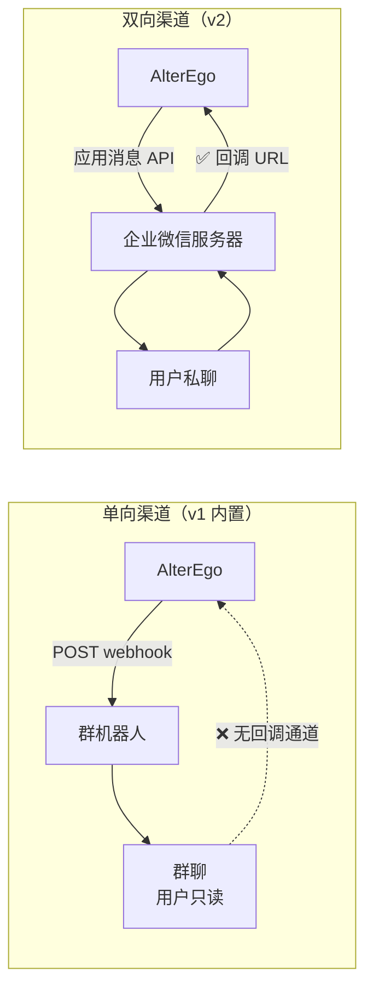
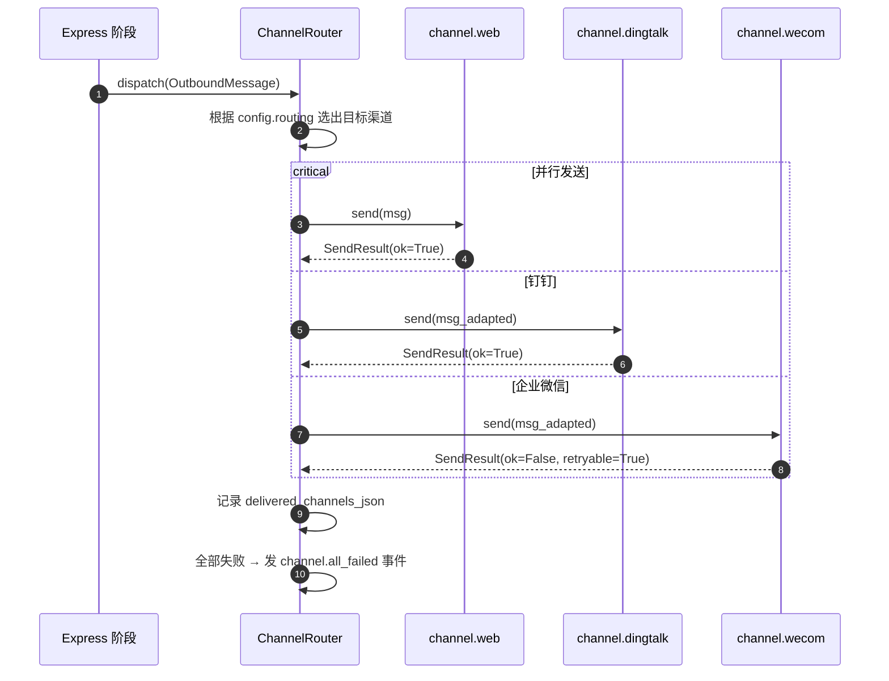
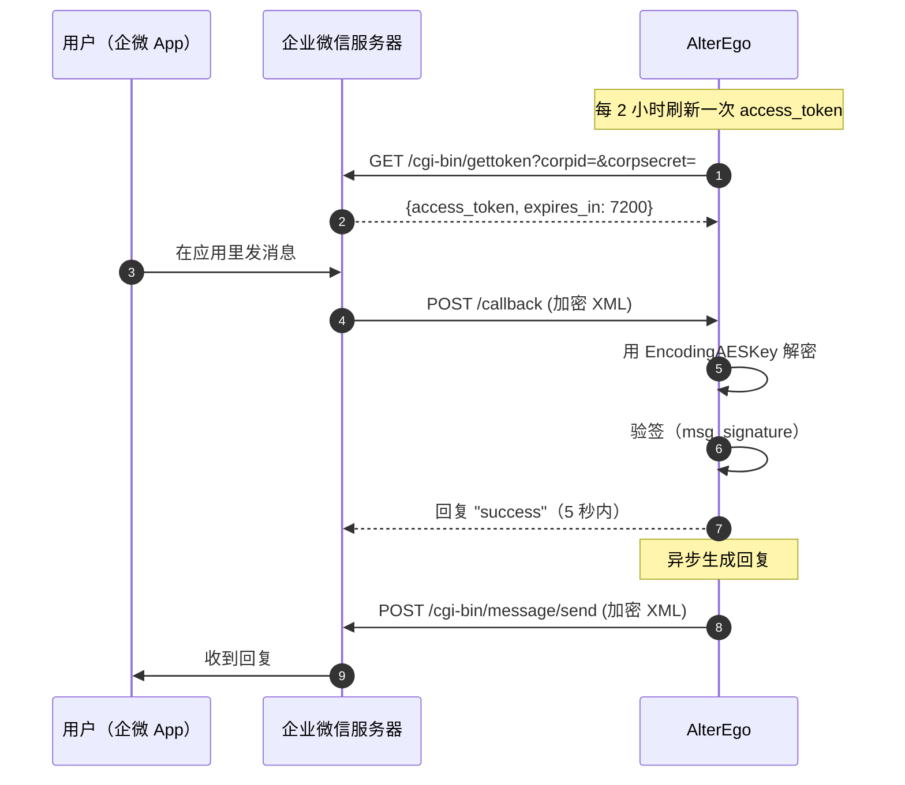

# 05 · 接入层与外部渠道

> 上级文档：[DESIGN.md](../DESIGN.md) · 版本 v0.1.0
> 本文档描述用户如何与 Agent 交互：本地 Web 界面、CLI、以及各类 IM 渠道。面向集成开发者。

---

## 目录

1. [核心约束：单向 vs 双向](#1-核心约束单向-vs-双向)
2. [渠道抽象](#2-渠道抽象)
3. [内置渠道](#3-内置渠道)
4. [企业微信](#4-企业微信)
5. [钉钉](#5-钉钉)
6. [QQ / Telegram / 其他](#6-qq--telegram--其他)
7. [本地 Web](#7-本地-web)
8. [CLI](#8-cli)
9. [通知路由](#9-通知路由)
10. [重试与限流](#10-重试与限流)
11. [安全](#11-安全)
12. [v2 规划：双向 IM](#12-v2-规划双向-im)

---

## 1. 核心约束：单向 vs 双向

### 1.1 必须理解的事实

> ⚠️ **企业微信「群机器人」和钉钉「自定义机器人」是单向渠道——只能发，不能收。**

这是它们的协议设计决定的：

- 群机器人通过一个 **Webhook URL** 工作，你 POST 内容过去，消息就出现在群里
- 没有回调机制，你无法知道用户是否回复、回复了什么
- 用户需要在群里 **@机器人** 才能触发回调，而群机器人配置里根本没有这个选项



### 1.2 v1 的渠道布局

| 渠道 | 方向 | 用户能否回复 | 说明 |
| --- | --- | --- | --- |
| `channel.web` | **双向** | ✅ | Web 聊天页面，v1 的主要交互入口 |
| `channel.file` | **双向** | ✅（写文件） | 写入本地 `data/outbox/`，用于调试与离线查看 |
| `channel.wecom_webhook` | 单向出 | ❌ | 企业微信群机器人 |
| `channel.dingtalk_webhook` | 单向出 | ❌ | 钉钉自定义机器人 |
| `channel.console` | 双向 | ✅ | 终端交互，开发调试用 |

**设计权衡**：v1 把 Web 作为唯一的真实入站通道，IM 作为「Agent 主动找你」的推送通道。这个组合实际上很符合使用场景：

- 用户想看 Agent 说了什么、想回复 → 打开 Web 聊天页
- Agent 想主动找用户 → 推送到钉钉/企业微信（用户手机上能收到通知）

**为什么不做「IM 单向出 + 手动复制回复」**：体验太差，不如把 Web 做好。

### 1.3 渠道能力矩阵

| 渠道 | `direction` | `capabilities` | 消息长度限制 | 限流 |
| --- | --- | --- | --- | --- |
| `channel.web` | `{in, out}` | text, markdown, image, card, long_text | 无 | 无 |
| `channel.file` | `{in, out}` | text, markdown, image, long_text | 无 | 无 |
| `channel.console` | `{in, out}` | text, markdown | 无 | 无 |
| `channel.wecom_webhook` | `{out}` | text, markdown, image | 4096 字节 | 20 条/分钟 |
| `channel.dingtalk_webhook` | `{out}` | text, markdown, mention | 20000 字节 | 20 条/分钟 |
| `channel.telegram`（可选插件） | `{in, out}` | text, markdown, image, mention | 4096 字符 | 30 条/秒 |

---

## 2. 渠道抽象

### 2.1 接口定义

见 [02-plugin-api.md § 6.2](02-plugin-api.md#62-channel)。

### 2.2 发送流程



### 2.3 渠道适配

不同渠道的能力不同，需要在发送前做适配。适配由 `ChannelAdapter` 完成：

```python
def adapt(msg: OutboundMessage, channel: Channel) -> OutboundMessage:
    """把消息适配到目标渠道的能力范围"""

    caps = channel.capabilities

    # 1) markdown 不支持的渠道降级为纯文本
    if msg.kind == "markdown" and "markdown" not in caps:
        msg = replace(msg, kind="text", content=strip_markdown(msg.content))

    # 2) 图片不支持的渠道降级
    if msg.image_path and "image" not in caps:
        # 尝试上传图床转 URL（若有 image_host 插件）
        url = try_upload_image(msg.image_path)
        if url:
            msg = replace(msg, content=f"{msg.content}\n{url}")
        else:
            msg = replace(msg, image_path=None,
                          content=f"{msg.content}\n[图片: {msg.image_path.name}]")

    # 3) 超长文本处理
    limit = CHANNEL_LENGTH_LIMITS.get(channel.id)
    if limit and len(msg.content.encode("utf-8")) > limit:
        if "long_text" in caps:
            msg = replace(msg, kind="card",
                          metadata={**msg.metadata, "full_content": msg.content},
                          content=truncate(msg.content, limit - 100) + "…")
        else:
            msg = replace(msg, content=truncate_smart(msg.content, limit - 50))

    # 4) mention 不支持 → 忽略
    if msg.mention and "mention" not in caps:
        msg = replace(msg, mention=(), mention_all=False)

    return msg


def truncate_smart(text: str, limit: int) -> str:
    """在句子边界截断，不切断词语"""
    if len(text) <= limit:
        return text
    cut = text[:limit]
    for punct in ("。", "！", "？", "；", "\n", "，"):
        idx = cut.rfind(punct)
        if idx > limit * 0.6:
            return cut[:idx + 1] + "…"
    return cut + "…"
```

### 2.4 渠道路由配置

```toml
[channels]
# 各渠道的启用与控制
[channels.web]
enabled = true
host = "127.0.0.1"
port = 8765
auth_token = "${ALTEREGO_WEB_TOKEN}"

[channels.file]
enabled = true
out_dir = "data/outbox"
format = "markdown"          # markdown | txt | jsonl

[channels.dingtalk_webhook]
enabled = true
webhook_url = "${DINGTALK_WEBHOOK}"
secret = "${DINGTALK_SECRET}"

[channels.wecom_webhook]
enabled = false
webhook_url = "${WECOM_WEBHOOK}"

# 消息类型 → 目标渠道
[routing]
# 主动消息推到哪里
message = ["web", "dingtalk_webhook"]
# 动态推到哪里
post = ["web", "dingtalk_webhook"]
# 系统告警推到哪里（不推送到 IM，避免骚扰）
alert = ["web", "console"]
```

**路由规则**：

| 规则 | 说明 |
| --- | --- |
| 列表中第一个 `direction` 含 `in` 的渠道是**主渠道** | 用户的回复只从这个渠道读取 |
| 所有列出的渠道都会收到消息 | 并行发送 |
| 单个渠道失败不影响其他渠道 | 隔离 |
| 全部失败 → 写本地文件兜底 + 发告警 | 保证不丢消息 |

---

## 3. 内置渠道

### 3.1 `channel.file`

最简单的渠道，用于调试、离线查看、以及作为其他渠道全挂时的兜底。

```python
class FileChannel(Plugin, Channel):
    id = "channel.file"
    direction = frozenset({"in", "out"})
    capabilities = frozenset({"text", "markdown", "image", "long_text"})

    def on_load(self, ctx: PluginContext) -> None:
        self._ctx = ctx
        self._out_dir = Path(ctx.config["out_dir"])
        self._out_dir.mkdir(parents=True, exist_ok=True)
        self._in_dir = self._out_dir / "inbox"
        self._in_dir.mkdir(exist_ok=True)
        self._fmt = ctx.config["format"]

        ctx.registry.register(Channel, self, name=self.id)

        # 轮询 inbox 目录接收用户消息
        ctx.scheduler.every(timedelta(seconds=5), self._poll_inbox,
                            name=f"{self.id}.poll")

    async def send(self, msg: OutboundMessage) -> SendResult:
        day = self._ctx.now().strftime("%Y-%m-%d")
        path = self._out_dir / f"{day}.{self._ext()}"

        if self._fmt == "jsonl":
            line = json.dumps({
                "at": self._ctx.now().isoformat(),
                "kind": msg.kind, "content": msg.content, "title": msg.title,
            }, ensure_ascii=False)
            with path.open("a", encoding="utf-8") as f:
                f.write(line + "\n")
        else:
            stamp = self._ctx.now().strftime("%H:%M:%S")
            prefix = f"[{stamp}]"
            if msg.kind == "markdown" and msg.title:
                text = f"{prefix} **{msg.title}**\n{msg.content}\n\n"
            else:
                text = f"{prefix} {msg.content}\n\n"
            with path.open("a", encoding="utf-8") as f:
                f.write(text)

        if msg.image_path:
            shutil.copy2(msg.image_path, self._out_dir / msg.image_path.name)

        return SendResult(ok=True, message_id=f"file_{int(time.time()*1000)}")

    async def _poll_inbox(self) -> None:
        """用户把一个 .txt 文件丢进 inbox/ 就当作发了消息"""
        for p in sorted(self._in_dir.glob("*.txt")):
            content = p.read_text(encoding="utf-8").strip()
            if not content:
                p.unlink()
                continue
            self._emit_inbound(InboundMessage(
                channel_id=self.id, sender_id="user", sender_name="用户",
                content=content, received_at=self._ctx.now(),
                raw={"file": str(p)},
            ))
            # 处理完移到 processed/
            done = self._in_dir / "processed"
            done.mkdir(exist_ok=True)
            p.rename(done / f"{time.time():.0f}_{p.name}")

    def _ext(self) -> str:
        return {"markdown": "md", "jsonl": "jsonl", "txt": "txt"}[self._fmt]
```

**用途**：

- 离线查看 Agent 的完整输出（`tail -f data/outbox/2026-09-15.md`）
- CI 测试中验证消息内容
- 其他渠道全部失败时的兜底

### 3.2 `channel.console`

终端交互，开发时最方便。

```python
class ConsoleChannel(Plugin, Channel):
    id = "channel.console"
    direction = frozenset({"in", "out"})
    capabilities = frozenset({"text", "markdown"})

    def on_start(self) -> None:
        if not sys.stdin.isatty():
            self._ctx.logger.warning("stdin 不是终端，控制台渠道只出站")
            self._read_enabled = False
            return
        self._read_enabled = True
        self._thread = threading.Thread(target=self._read_loop, daemon=True)
        self._thread.start()

    def _read_loop(self) -> None:
        while self._read_enabled:
            try:
                line = input()
            except (EOFError, KeyboardInterrupt):
                break
            if line.strip():
                self._emit_inbound(InboundMessage(
                    channel_id=self.id, sender_id="user", sender_name="你",
                    content=line.strip(), received_at=self._ctx.now(),
                ))

    async def send(self, msg: OutboundMessage) -> SendResult:
        stamp = self._ctx.now().strftime("%H:%M")
        color = "\033[36m"          # 青色，与用户输入区分
        reset = "\033[0m"
        print(f"\n{color}◆ {self._persona_name} {stamp}{reset}")
        print(f"{color}{msg.content}{reset}\n")
        return SendResult(ok=True)
```

### 3.3 `channel.web`

v1 的**主要交互入口**。

**技术栈**：FastAPI + uvicorn + SSE + 少量原生 JS（无前端构建步骤）。

```toml
[channels.web]
enabled = true
host = "127.0.0.1"
port = 8765
auth_mode = "token"          # token | password | none（仅 localhost）
auth_token = "${ALTEREGO_WEB_TOKEN}"
cors_origins = []
max_message_length = 4000
session_ttl_hours = 720
```

**API 设计**：

| 方法 | 路径 | 说明 |
| --- | --- | --- |
| `GET` | `/` | 聊天页面 |
| `GET` | `/api/health` | 健康检查 |
| `POST` | `/api/auth` | 用 token 换会话 cookie |
| `GET` | `/api/chat/history?before=&limit=` | 历史消息（分页） |
| `POST` | `/api/chat/send` | 发送消息 |
| `GET` | `/api/chat/stream` | **SSE**：实时推送新消息 |
| `GET` | `/api/feed?limit=&offset=` | 动态列表 |
| `POST` | `/api/feed/{id}/like` | 点赞 |
| `POST` | `/api/feed/{id}/comment` | 评论 |
| `GET` | `/api/status` | Agent 当前状态（情绪、日程、活动） |
| `GET` | `/api/emotion?days=7` | 情绪曲线数据 |
| `GET` | `/api/memory?limit=&offset=` | 记忆列表 |
| `GET` | `/api/thoughts?limit=` | **内心想法**（含被拦截的意图） |
| `GET` | `/api/tick/{tick_id}` | 某次 tick 的完整解释 |
| `GET` | `/api/stats` | 统计与成本（总览） |
| `GET` | `/api/stats/tokens?days=1&group=day|purpose|model` | **Token 与成本聚合**（读 `v_cost_daily`） |
| `GET` | `/api/stats/projection` | 按当前速率的外推预测 |
| `GET` | `/api/budget` | 当前预算占用与降级状态（含徽章文案） |
| `GET` | `/api/logs?level=&q=&correlation_id=&before=&limit=` | 日志历史查询 |
| `GET` | `/api/logs/stream` | **SSE**：实时 tail 日志 |
| `POST` | `/api/logs/level` | 运行期调级别（**必须带 `for` 时长**） |
| `GET` | `/api/logs/export?format=log|jsonl&correlation_id=` | 导出日志 |
| `GET` | `/api/trace/{correlation_id}` | 读 `v_trace`：一次推演的完整链路 |
| `GET` | `/api/album?role=&limit=&offset=` | 相册列表（定妆照置顶） |
| `POST` | `/api/album/{id}/publish` | 手动发布到动态（**唯一允许绕过预算的路径**） |
| `POST` | `/api/album/{id}/discard` | 丢弃 |
| `GET` | `/api/media/{id}` | 图片文件本体 |
| `GET` | `/api/sources?limit=&offset=` | 最近读了什么 |
| `GET` | `/api/sources/dropped?limit=` | 被丢弃的条目与原因 |
| `GET` | `/api/sources/interests` | 兴趣权重与变化 |
| `GET` | `/api/settings/schema` | **全部设置的元数据**（一个真源，多处渲染） |
| `GET` | `/api/settings` | 当前值（密钥只返回「变量名 + 是否已设置」） |
| `POST` | `/api/settings` | 写入（原子写入 + 同口径校验 + 热生效分级） |
| `POST` | `/api/settings/reset` | 恢复某键的默认值 |
| `GET` | `/api/plugins` | 插件列表与状态 |
| `POST` | `/api/plugins/{id}/reload` | 重载插件 |

**权限分级**（与 [10-settings-center.md § 5.1](10-settings-center.md#51-权限分级) 一致）：

| 类别 | 可写 | 说明 |
| --- | :-: | --- |
| 普通值 / 枚举 | ✅ | 直接生效 |
| 路径类 | ✅ | 带 `danger` 标记 + 二次确认 |
| **密钥** | ❌ | 只显示「环境变量名 + 是否已设置」，永不回显、永不接受写入 |
| 需重启项 | ✅ | 写入后页面必须显式提示「待重启生效」 |
| 只读派生项（如当日用量） | ❌ | 单独通道 `/api/budget` |

**SSE 实现**：

```python
from fastapi import FastAPI, Request
from fastapi.responses import StreamingResponse

app = FastAPI()

@app.get("/api/chat/stream")
async def stream(request: Request, _=Depends(require_auth)):
    queue: asyncio.Queue = asyncio.Queue(maxsize=100)
    subscribers.add(queue)

    async def event_gen():
        try:
            # 立即发送当前状态，避免前端空等
            yield sse_pack("status", current_status())
            while True:
                if await request.is_disconnected():
                    break
                try:
                    event = await asyncio.wait_for(queue.get(), timeout=20.0)
                    yield sse_pack(event["type"], event["data"])
                except asyncio.TimeoutError:
                    yield ": keepalive\n\n"        # 心跳，防代理断开
        finally:
            subscribers.discard(queue)

    return StreamingResponse(event_gen(), media_type="text/event-stream",
                             headers={"Cache-Control": "no-cache",
                                      "X-Accel-Buffering": "no"})


def sse_pack(event_type: str, data: dict) -> str:
    return f"event: {event_type}\ndata: {json.dumps(data, ensure_ascii=False)}\n\n"


# 把系统事件推给前端
def on_message_created(event) -> None:
    broadcast("message", event.payload)

def on_emotion_changed(event) -> None:
    broadcast("emotion", event.payload)

def broadcast(event_type: str, data: dict) -> None:
    for q in list(subscribers):
        try:
            q.put_nowait({"type": event_type, "data": data})
        except asyncio.QueueFull:
            pass
```

**页面结构**（单页 + 标签切换，共 13 个标签）：

```
┌──────────────────────────────────────────────────────────┐
│  AlterEgo · 拟我                    [情绪: 愉快] [⚙]     │
├──────────┬───────────────────────────────────────────────┤
│ 总览      │  ┌─────────────────────────────────────────┐ │
│ 对话      │  │ 14:32  ◆ 拟我                           │ │
│ 动态      │  │ 天挺好的，想起周末要去爬山，已经开始     │ │
│ 时间线    │  │ 期待了                                  │ │
│ 关系网    │  │                          [地点: 公司]   │ │
│ 内心      │  └─────────────────────────────────────────┘ │
│ 记忆      │                                               │
│ 相册      │  ┌─────────────────────────────────────────┐ │
│ 统计      │  │ 14:35  你                               │ │
│ 日志      │  │ 那到时候叫我                            │ │
│ 信息源    │  └─────────────────────────────────────────┘ │
│ 设置      │                                               │
│ 后台      │                                               │
│           ├───────────────────────────────────────────────┤
│           │  [输入消息...                          ] [发送]│
└──────────┴───────────────────────────────────────────────┘
```

**「日志」与「内心」不是同一个页面**（虽然都是流水账）：

| | 内心 | 日志 |
| --- | --- | --- |
| 受众 | **用户**——想知道它在想什么 | **排障的人**——想知道哪里坏了 |
| 内容 | 反思、想说但没说、日常念头 | 级别、模块、堆栈、`correlation_id` |
| 失败呈现 | 不出现 | **错误优先** |
| 能不能跳转 | 不需要 | 可从一条错误跳到那次推演的完整链路 |

**合并会让两边都难用**：给用户看的东西不应该出现堆栈，给排障用的东西不应该被美化成独白。

**「内心」页面**（本项目的特色）：

```
┌───────────────────────────────────────────────────────────────┐
│ 内心想法                                                       │
├───────────────────────────────────────────────────────────────┤
│ ⛔ 10:15  想说但没说                                           │
│    「刚看到一个独立游戏的预告，做得好精致，好想跟他说一声。    │
│      算了，他这会儿应该在开会」                                │
│    原因：当前日程不可打断（工作时段）                           │
├───────────────────────────────────────────────────────────────┤
│ 💭 09:20  反思                                                │
│    「早上开会又走神了，一直在想昨晚那个综艺。今天得把方案      │
│      写出来，不然周五要挨批」                                  │
├───────────────────────────────────────────────────────────────┤
│ ⛔ 昨天 23:45  想说但没说                                       │
│    「今天那个事想想还是有点难过。不过这个点他应该睡了，        │
│      明天再说吧」                                              │
│    原因：当前处于免打扰时段（23:30–08:00）                     │
└───────────────────────────────────────────────────────────────┘
```

**为什么把「被拦截的想法」展示给用户**：
1. 让用户看到 Agent 的克制，而不是只觉得它「不回消息」
2. 如果用户觉得拦截过度，可以调整预算配置
3. 用户看到「他其实想找我，只是觉得我在上班」→ 这才是拟人感

**前端实现原则**：

| 原则 | 说明 |
| --- | --- |
| **无构建步骤** | 原生 ES modules + 一个 CSS 文件，浏览器直接跑 |
| **无前端框架** | v1 不引入 React/Vue，避免 node_modules |
| **渐进增强** | SSE 不可用时降级为 10 秒轮询 |
| **暗色优先** | 默认暗色主题（`prefers-color-scheme` 支持） |
| **移动端可用** | 简单的响应式，手机上能正常发消息 |

**文件组织**：

```
src/alterego/channels/web/
├── __init__.py
├── plugin.py           # WebChannel 插件
├── app.py              # FastAPI app 与路由
├── routes/
│   ├── chat.py
│   ├── feed.py
│   ├── status.py
│   ├── thoughts.py
│   ├── stats.py
│   └── plugins.py
├── sse.py              # SSE 广播
├── auth.py             # token / password 认证
└── static/
    ├── index.html
    ├── app.js
    ├── style.css
    └── favicon.svg
```

---

## 4. 企业微信

### 4.1 群机器人（单向出）

**配置步骤**：

1. 在企业微信群中点击「群设置」→「群机器人」→「添加机器人」
2. 复制 Webhook 地址（形如 `https://qyapi.weixin.qq.com/cgi-bin/webhook/send?key=xxx`）
3. 填入配置

```toml
[channels.wecom_webhook]
enabled = true
webhook_url = "${WECOM_WEBHOOK}"     # 或直接粘贴 URL
mentioned_mobile_list = []           # @ 的手机号
```

**消息格式**（企微 webhook）：

```python
def build_body(msg: OutboundMessage, cfg: dict) -> dict:
    if msg.kind == "markdown":
        return {
            "msgtype": "markdown",
            "markdown": {"content": msg.content},
        }
    if msg.kind == "image" and msg.image_path:
        # 图片需先上传换取 media_id，或者用 base64
        b64 = base64.b64encode(msg.image_path.read_bytes()).decode()
        md5 = hashlib.md5(msg.image_path.read_bytes()).hexdigest()
        return {
            "msgtype": "image",
            "image": {"base64": b64, "md5": md5},
        }
    # text
    content = msg.content
    if msg.mention:
        content += "\n" + " ".join(f"<@{m}>" for m in msg.mention)
    return {
        "msgtype": "text",
        "text": {
            "content": content,
            "mentioned_mobile_list": list(msg.mention) or cfg.get("mentioned_mobile_list", []),
        },
    }
```

**响应格式**：

```json
{"errcode": 0, "errmsg": "ok"}
```

**常见错误码**：

| errcode | 含义 | 处理 |
| --- | --- | --- |
| `0` | 成功 | — |
| `93000` | webhook key 无效 | 不可重试，提示重新获取 |
| `45009` | 接口调用超过限制 | 可重试（限流 20 条/分钟） |
| `40001` | secret 错误 | 不可重试 |
| `40014` | access_token 不合法 | 仅应用消息需要 |

**限制**：

| 项 | 限制 |
| --- | --- |
| 消息长度 | 4096 字节 |
| 发送频率 | 20 条/分钟 |
| 图片大小 | 2 MB |
| 支持类型 | text / markdown / image / news / file / voice / template_card |

### 4.2 应用消息（双向，v2）

**为什么 v2 才做**：需要公网可达的回调 URL（或内网穿透），配置复杂度高。

**前置条件**：

1. 注册企业微信（个人也能注册「企业」，无需营业执照）
2. 创建自建应用，获取：
   - `corp_id`（企业 ID）
   - `agent_id`（应用 ID）
   - `corp_secret`（应用密钥）
3. 配置可信域名 / 公网 IP
4. 配置接收消息的 URL、Token、EncodingAESKey

**流程**：



**加密细节**：

```python
class WeComCrypto:
    """企业微信消息加解密（AES-256-CBC + PKCS7）"""

    def __init__(self, token: str, encoding_aes_key: str, corp_id: str):
        self.token = token
        self.corp_id = corp_id
        self.aes_key = base64.b64decode(encoding_aes_key + "=")
        self.iv = self.aes_key[:16]

    def verify_url(self, msg_signature: str, timestamp: str,
                   nonce: str, echostr: str) -> str:
        """首次配置 URL 时的验证"""
        if self._sign(timestamp, nonce, echostr) != msg_signature:
            raise SecurityError("签名校验失败")
        return self.decrypt(echostr)

    def _sign(self, timestamp: str, nonce: str, encrypted: str) -> str:
        items = sorted([self.token, timestamp, nonce, encrypted])
        return hashlib.sha1("".join(items).encode()).hexdigest()

    def decrypt(self, encrypted: str) -> str:
        cipher = AES.new(self.aes_key, AES.MODE_CBC, self.iv)
        plain = unpad(cipher.decrypt(base64.b64decode(encrypted)), 32)
        # 结构：random(16) + msg_len(4, 大端) + msg + corp_id
        msg_len = struct.unpack(">I", plain[16:20])[0]
        msg = plain[20:20 + msg_len].decode("utf-8")
        received_corp_id = plain[20 + msg_len:].decode("utf-8")
        if received_corp_id != self.corp_id:
            raise SecurityError("corp_id 不匹配，可能是伪造请求")
        return msg

    def encrypt(self, plain: str) -> str:
        text = plain.encode("utf-8")
        raw = os.urandom(16) + struct.pack(">I", len(text)) + text + self.corp_id.encode()
        cipher = AES.new(self.aes_key, AES.MODE_CBC, self.iv)
        return base64.b64encode(cipher.encrypt(pad(raw, 32))).decode()
```

**依赖**：加密需要 `pycryptodome`。设计为**可选依赖**：

```bash
pip install alterego[wecom]
```

未安装时 `channel.wecom_app` 插件加载失败并给出提示：

```
✗ 插件 channel.wecom_app 加载失败
  错误: ModuleNotFoundError: No module named 'Crypto'
  修复: pip install alterego[wecom]
```

---

## 5. 钉钉

### 5.1 自定义机器人（单向出）

**配置步骤**：

1. 钉钉群 →「群设置」→「智能群助手」→「添加机器人」→「自定义」
2. **安全设置必须勾选「加签」**（不要选「自定义关键词」，容易被误拦）
3. 复制 Webhook 地址和加签密钥（`SEC` 开头）

```toml
[channels.dingtalk_webhook]
enabled = true
webhook_url = "${DINGTALK_WEBHOOK}"
secret = "${DINGTALK_SECRET}"
at_mobiles = []
at_all = false
```

### 5.2 加签算法

```python
def _signed_url(self) -> str:
    timestamp = str(round(time.time() * 1000))
    string_to_sign = f"{timestamp}\n{self._secret}"
    digest = hmac.new(
        self._secret.encode("utf-8"),
        string_to_sign.encode("utf-8"),
        digestmod=hashlib.sha256,
    ).digest()
    sign = quote_plus(base64.b64encode(digest).decode("utf-8"))
    sep = "&" if "?" in self._webhook_url else "?"
    return f"{self._webhook_url}{sep}timestamp={timestamp}&sign={sign}"
```

**要点**：
- `string_to_sign` 是 `timestamp + "\n" + secret`（**换行符是必须的**）
- 用 **HMAC-SHA256**，不是 SHA256
- 结果先 base64 编码，再 **URL 编码**（`quote_plus`，因为 base64 含 `+/=`）
- `timestamp` 与服务器时间差**不能超过 1 小时**，否则报 `310000`

完整实现见 [02-plugin-api.md § 13](02-plugin-api.md#13-完整示例钉钉渠道插件)。

### 5.3 消息格式

```python
# markdown
{
    "msgtype": "markdown",
    "markdown": {"title": "标题", "text": "**加粗** 内容"},
    "at": {"atMobiles": ["13800138000"], "isAtAll": False},
}

# text
{
    "msgtype": "text",
    "text": {"content": "内容 @13800138000"},
    "at": {"atMobiles": ["13800138000"], "isAtAll": False},
}
```

**注意**：`atMobiles` 里必须填**手机号**，不是昵称或 userid（自定义机器人无法获取成员 userid）。

**markdown 语法限制**：

| 支持 | 不支持 |
| --- | --- |
| `#` 标题（1-6 级） | 表格 |
| `**粗体**`、`*斜体*` | 代码块高亮 |
| `>` 引用 | 有序列表嵌套 |
| `[链接](url)` | HTML 标签 |
| `` 图片（必须是公网 URL） | base64 图片 |
| `- ` 无序列表 | — |

### 5.4 常见错误码

| errcode | 含义 | 可重试 | 处理 |
| --- | --- | --- | --- |
| `0` | 成功 | — | — |
| `310000` | 加签校验失败 | ❌ | 检查 secret 与服务器时间 |
| `300001` | 无效的 token | ❌ | Webhook 已失效，重新创建机器人 |
| `130101` | 发送速度过快 | ✅ | 退避重试 |
| `410100` | 机器人被禁用 | ❌ | 群主需重新启用 |
| `400013` | 消息内容超过限制（20000 字节） | ❌ | 截断后重发 |
| `43004` | 需要 @ 成员才能发 | ❌ | 设置 at_mobiles |

### 5.5 企业应用机器人（双向，v2）

钉钉的企业内部机器人支持双向（需要 `appkey`/`appsecret` + 回调），但配置复杂度与企业微信类似，v2 再实现。

---

## 6. QQ / Telegram / 其他

### 6.1 为什么 v1 不做 QQ

QQ 官方机器人（QQ 开放平台）需要：
- 企业主体认证（个人开发者仅能创建沙箱环境）
- 复杂的事件订阅（WebSocket / Webhook）
- 审核周期

个人项目接入成本过高。若用户有需求，可作为社区插件，通过 `channel.qq_official` 实现。

**QQ 频道（Guild）机器人**门槛较低，但用户群体有限，同样列在 v2。

### 6.2 Telegram（可选插件示例）

Telegram Bot API 简单、双向、免费、无墙外限制时可直连。适合作为「双向渠道」的最简单实现。

```python
class TelegramChannel(Plugin, Channel):
    id = "channel.telegram"
    direction = frozenset({"in", "out"})
    capabilities = frozenset({"text", "markdown", "image", "mention"})

    def on_load(self, ctx: PluginContext) -> None:
        self._ctx = ctx
        self._token = ctx.config["bot_token"]
        self._chat_ids: list[str] = ctx.config["chat_ids"]
        self._base = f"https://api.telegram.org/bot{self._token}"
        self._client = httpx.AsyncClient(timeout=30)
        self._offset = ctx.state.get("poll_offset", 0)

        ctx.registry.register(Channel, self, name=self.id)
        ctx.scheduler.every(timedelta(seconds=2), self._poll, name=f"{self.id}.poll")

    async def send(self, msg: OutboundMessage) -> SendResult:
        parse_mode = "MarkdownV2" if msg.kind == "markdown" else None
        for chat_id in self._chat_ids:
            try:
                if msg.image_path:
                    with msg.image_path.open("rb") as f:
                        resp = await self._client.post(
                            f"{self._base}/sendPhoto",
                            data={"chat_id": chat_id, "caption": msg.content},
                            files={"photo": f},
                        )
                else:
                    resp = await self._client.post(
                        f"{self._base}/sendMessage",
                        json={"chat_id": chat_id, "text": msg.content,
                              "parse_mode": parse_mode},
                    )
                if not resp.json().get("ok"):
                    return SendResult(ok=False, error=resp.text,
                                      retryable=resp.status_code == 429)
            except httpx.HTTPError as exc:
                return SendResult(ok=False, error=str(exc), retryable=True)
        return SendResult(ok=True)

    async def _poll(self) -> None:
        try:
            resp = await self._client.get(f"{self._base}/getUpdates",
                                          params={"offset": self._offset + 1, "timeout": 1})
            data = resp.json()
        except httpx.HTTPError:
            return

        for update in data.get("result", []):
            self._offset = update["update_id"]
            m = update.get("message") or update.get("edited_message")
            if not m or "text" not in m:
                continue
            self._ctx.state.set("poll_offset", self._offset)
            self._emit_inbound(InboundMessage(
                channel_id=self.id,
                sender_id=str(m["from"]["id"]),
                sender_name=m["from"].get("first_name", "用户"),
                content=m["text"],
                received_at=self._ctx.now(),
                raw=m,
            ))
```

**关键点**：Telegram 用**长轮询**而非 Webhook（无需公网 IP）。`ctx.state` 保存 offset，进程重启后不丢消息。

### 6.3 自定义渠道开发要点

| 要点 | 说明 |
| --- | --- |
| 入站消息必须调用 `_emit_inbound()` | 由 `Channel` 基类提供，转发给注册的 handler |
| 出站必须是幂等的 | 重试可能重复发送，用 `message_id` 去重 |
| 区分可重试错误 | 网络错误/限流可重试；鉴权失败/参数错误不可 |
| 长轮询 offset 存 `ctx.state` | 重启不丢消息 |
| 不使用 `threading` 阻塞 tick | 用 `ctx.scheduler` |
| 提供 `health_check()` | 让 `alterego channels doctor` 能诊断 |

---

## 7. 本地 Web

### 7.1 启动

```bash
alterego serve                      # 默认 127.0.0.1:8765
alterego serve --host 0.0.0.0 --port 8080
alterego serve --no-web             # 只跑推演，不开 Web
```

启动输出：

```
AlterEgo v0.1.0

  推演模式    realtime（虚拟时间 1:1）
  Tick 间隔   5 虚拟分钟
  数据库      data/alterego.db（42.3 MB，schema v1）
  人格        林晚 · 26 岁 · UI 设计师 · 杭州

  已加载插件（12）
    ✓ storage.sqlite         0.1.0   [内置]
    ✓ llm.openai_compatible  0.1.0   [内置]
    ✓ stage.sense            0.1.0   [内置]
    ✓ stage.reflect          0.1.0   [内置]
    ✓ stage.intention        0.1.0   [内置]
    ✓ stage.act              0.1.0   [内置]
    ✓ stage.express          0.1.0   [内置]
    ✓ stage.persist          0.1.0   [内置]
    ✓ channel.web            0.1.0   [内置]
    ✓ channel.file           0.1.0   [内置]
    ✓ channel.dingtalk_webhook 0.1.0 [内置]
    ✓ capability.activity    0.1.0   [内置]

  Web 界面    http://127.0.0.1:8765
              访问令牌见 .alterego-token

  按 Ctrl+C 停止
```

### 7.2 认证

**默认 `auth_mode = "token"`**：

- 首次启动生成随机 token，写入 `.alterego-token`（权限 600，且加入 `.gitignore`）
- 首次访问 Web 时需在 URL 中带上 `?token=xxx`，之后写入 cookie

**`auth_mode = "none"`**：仅允许 `host = 127.0.0.1`（启动时强校验，否则拒绝启动）。

**安全提示**：

```
⚠️  检测到 host = 0.0.0.0 且 auth_mode = none
    这会把你的人格数据和聊天记录暴露给同一网络的所有设备。
    要么设置 host = 127.0.0.1，要么配置 auth_token。
    已拒绝启动。如需强制启动，设置 ALTEREGO_ALLOW_INSECURE=1
```

### 7.3 移动端访问

局域网内手机访问（`host = 0.0.0.0` + token 认证）：
- 手机浏览器打开 `http://<电脑IP>:8765/?token=xxx`
- 建议加到主屏幕（PWA manifest 已内置），体验接近原生 App

**不做**：独立的移动端 App（非目标，见 DESIGN.md § 15）。

---

## 8. CLI

### 8.1 命令总览

```
alterego
├── init                    初始化项目（生成配置与人设）
├── serve                   启动守护进程与 Web 界面
├── chat [--no-stream]      终端对话（开发调试）
├── status                  查看当前状态
├── why [--at|--outbound|--suppressed]  解释最近的行为
│
├── persona
│   ├── show                显示当前人设
│   ├── edit                编辑人设
│   ├── generate            用 LLM 生成新人设
│   ├── refine "<指令>"     按指令微调人设
│   ├── history             版本历史
│   ├── diff <v1> <v2>      版本对比
│   └── rollback <version>  回滚
│
├── memory
│   ├── list [--kind|--forgotten|--query]
│   ├── search "<query>"    记忆检索（显示分数分解）
│   ├── show <id>
│   ├── forget <id>
│   ├── distill [--dry-run] [--persona NAME]
│   │                       让模型把这段时间做过的事整理成记忆
│   └── consolidate [--dry-run] [--persona NAME]
│                           让模型把散落的经历归纳成新的认识
│
│                           （list/search/show/forget 见后续批次；
│                            distill 与 consolidate 已在 v0.4.0 落地）
│
├── calendar
│   ├── list [--year YYYY]  一年的节日一览（含生日）
│   ├── today [--date] [--days N]
│   │                       今天是什么日子 + 之后 N 天有什么
│   └── check [--year YYYY] 数据可信度：哪些日期还没核对
│
├── birthday
│   ├── list [--days N]     记过谁的生日，下次还有几天
│   ├── add  --who {self,user,npc} --on MM-DD ……
│   │                       记一个新的生日（已记过的会被挡住）
│   └── set  ……（参数与 add 完全相同）
│                           改掉已经记过的那个
│
├── feed
│   ├── list [--limit]
│   ├── show <id>
│   └── delete <id>
│
├── plugins
│   ├── list [--verbose]
│   ├── doctor              健康检查（含网络连通性）
│   ├── enable <id> / disable <id>
│   ├── reload <id>
│   └── reset <id>          重置熔断状态
│
├── channels
│   ├── list                渠道与方向
│   ├── test <id>           发测试消息
│   └── doctor              检查各渠道连通性
│
├── db
│   ├── status              库在哪、版本多少、还差几个迁移
│   ├── migrate [--dry-run] 建库，或把库升到当前版本
│   ├── backup [--dest PATH] 整份备份（唯一的「回滚」手段）
│   └── restore <file>      从备份恢复（会覆盖现在的库）
│
│                           vacuum 见 § 10 的优化建议；
│                           **没有** rollback --to，理由见 03-data-model.md § 8.5
│
├── export / import
├── stats [--cost|--activity|--emotion]
└── config
    ├── show [--redacted]
    └── edit
```

### 8.2 关键命令的输出

**`alterego status`**：

```
林晚 · 26 岁 · UI 设计师 · 杭州
───────────────────────────────────────────
虚拟时间   2026-09-15 14:30（realtime，1:1）
当前活动   工作 · 在公司工位（14:00–18:00，不可打断）
情绪       愉快  ████████░░  +0.45 / 0.41
疲劳       0.34
近期事件   14:30 发了条动态

今日预算
  消息  0/3     动态  1/4     熔断  无
最近联系   用户（5 小时 20 分钟前）

记忆       1,247 条（活跃 1,180 · 已遗忘 67）
LLM 消耗   今日 $1.12 / $2.00
运行时长   3 天 14 小时（连续失败 0 次）
```

**`alterego channels doctor`**：

```
渠道健康检查
───────────────────────────────────────────
✓ channel.web              监听 127.0.0.1:8765，3 个活跃连接
✓ channel.file             输出目录 data/outbox（今日 12 条）
✓ channel.console          终端交互可用
✓ channel.dingtalk_webhook 连通（延迟 142ms，今日发送 3 条）
✗ channel.wecom_webhook    未启用（config 中 enabled = false）

方向说明
  · channel.web / file / console 支持双向
  · channel.dingtalk_webhook 仅出站，用户回复请到 Web 界面
```

**`alterego calendar today --date 2026-09-26`**（节日上下文，见 [12](12-calendar-and-conversation.md)）：

```
2026-09-26  周六  周末
──────────────────────────────────────────────────────────
节后 中秋节（1 天前）  强度 █████░░░░░ 0.50
  这段时间大概会：月饼还剩一堆

未来 14 天
  10-01  周四  国庆节  5 天后 · 放假 3 天（10-01 ~ 10-03）
```

`--date` 与 `--year` 缺省时按**内核时区**算「今天」，不是进程本地时区——
差一天就是差一个节日。三命令的退出码：`0` 正常 / `2` 数据缺失或年份越界。

**`alterego birthday list`**（生日记录，见 [12](12-calendar-and-conversation.md) § 17）：

```
生日记录 · 2 条 · D:\ai\个人agent\data\birthdays.toml
──────────────────────────────────────────────────────────
  06-03  周三  用户  小明      下次 261 天后 · 提前 14 天
  11-08  周日  NPC   张三      下次 54 天后 · 提前 3 天  ⚠ 日期未确认
```

`add` 与 `set` 的参数完全相同，区别只在语义：`add` 挡「已经记过」、
`set` 挡「没记过」，默认都不覆盖。生日的「没核对」与节日的待核对**分两行显示**——
要去核的对象不同（一个是国务院公告，一个是本人）。

**`alterego db status`**（还没建库，见 [03](03-data-model.md) § 8.5）：

```
数据库 · D:\ai\个人agent\data\alterego.db
──────────────────────────────────────────────────────────
库文件    还没建过
当前版本  0
目标版本  4
待执行    4 个

  001_initial.sql          建立 v0.1.0 的基础表、记忆全文索引与触发器
                           非破坏性｜声明可逆
  002_media.sql            新增图片资产与生图计量
                           非破坏性｜声明可逆
  003_sources.sql          新增外部信息来源（检索条目、RSS 订阅源、检索记录）
                           非破坏性｜声明可逆
  004_observability.sql    新增结构化运行日志、补齐 correlation_id 与两个视图
                           非破坏性｜声明可逆

运行 alterego db migrate 把它升到 4。
```

「还没建过」就是字面意思：**这条命令没有把库建出来**。库不存在时它打开的是
一个内存库——`open(真路径)` 的默认行为就是顺手把文件创建出来，而「查一下」
不该变成「建了一个空库」。

迁移表格用**显示宽度**对齐（中文一个字占两列）。文件名那一列写死 25 列，
比现有最长的 `004_observability.sql`（23 个字符）宽一点——
否则那一行的描述会被挤进前一列里去。

**`alterego db status`**（已建库）：

```
数据库 · D:\ai\个人agent\data\alterego.db
──────────────────────────────────────────────────────────
库文件    440.0 KB
当前版本  4
目标版本  4
待执行    无

已是最新（schema_version 4）。
```

库的版本比程序新或太旧时，这**就是**状态，不是崩溃：`status` 照常打印
「当前无法读取」加上原因，退出码 `2`。脚本得能发现「这个库现在读不了」，
而人得能从那一行里看出该升级程序还是该升级库。

**`alterego memory search "爬山"`**（显示分数分解）：

```
记忆检索：「爬山」· 共 12 条候选，返回 Top 5
───────────────────────────────────────────────────────────
1. 0.782  ████████████████  [episodic]  2026-09-12
   「用户说周末想去爬山」
   相关 0.81 │ 重要 0.65 │ 新近 0.95 │ 情绪一致 0.72
   召回 3 次 · 上次想起 2 天前

2. 0.614  ████████████      [episodic]  2026-09-10
   「上周爬完山腿疼了三天」
   相关 0.64 │ 重要 0.55 │ 新近 0.88 │ 情绪一致 0.68
   召回 1 次 · 上次想起 5 天前

...

检索权重  相关 0.40 │ 重要 0.25 │ 新近 0.20 │ 情绪一致 0.15
```

**`alterego memory distill --dry-run`**（只看素材，不调模型也不写库）：

```
人设      林晚（p1）
时刻      2026-09-15 20:41
──────────────────────────────────────────────────────────
素材      5 条
规则      至少 3 条才值得梳理；一次最多留 10 条
  09-15 15:41  第 0 件事
  09-15 15:51  第 1 件事
  09-15 16:01  第 2 件事
  09-15 16:11  第 3 件事
  09-15 16:21  第 4 件事

这只是预演：没有调用模型，也没有写任何东西。
```

**`alterego memory distill`**（真跑）：

```
人设      林晚（p1）
时刻      2026-09-15 20:41
计费      [llm.routing] memory（账记在 llm_usage 表）
──────────────────────────────────────────────────────────
素材      5 条
生成      2 条
写入      2 条
```

**`alterego memory consolidate`** 多一行降权：

```
降权      4 条（×0.6）
```

三条不能省的约定：

- **`--dry-run` 不需要配好模型供应商。** 预演的整件事就是「先看看要喂什么进去」，
  卡在「你还没配 Key」上等于这个开关没有意义。
- **模型说「没什么值得记的」不是错误。** 素材照样标记为梳理过，打印
  「模型认为这段时间没有值得记住的事」，退出码 `0`；不标记的话下次还会问一遍，
  而下次的素材和这次一样。
- **计费那一行只在真跑时打印。** 预演没有账可记，写出来会让人以为花了钱。

### 8.3 实现

**argparse**（零依赖）。真实实现住在 `src/alterego/cli.py`：
`build_parser()` 用 `set_defaults(handler=...)` 把子命令接到处理函数上，
而不是维护一张 `COMMANDS` 映射表——表要在两处同步，`set_defaults` 只有一处。

四条与本节早期草稿不同的约定，每一条都是踩过之后才定下来的：

- **不用 `print`**。`scripts/check_architecture.sh` 第 5 组对整个 `src/alterego`
  禁止 `print(`（本意是「生产代码别留调试打印」，而 CLI 恰好也在那个目录里）。
  输出统一走 `cli_io._out` / `_err`。不去给红线开口子——它是给生产代码用的，
  而 `sys.stdout.write` 把「这行是给用户看的输出」表达得更清楚。
- **退出码不挂在异常上**。异常类只描述「发生了什么」，「这个进程该以几退出」
  是 CLI 的判断。`main()` 里按异常类型分派：迁移失败 `4`，其余配置类错误 `2`。
  （草稿里的 `exc.exit_code` 等于让每个异常类自己声明退出码，那是
  「谁用谁知道」的分工，而知道的是调用方。）
- **只敲到某一层组名时，打那一层的帮助**（`alterego db` 打 db 的帮助）。
  argparse 的默认行为是打顶层帮助，看着像「db 后面没东西可以敲」——
  而只敲了个组名，正是最需要指路的时候。
- **中文表格按显示宽度对齐**。`f"{text:<8}"` 数的是字符个数，中文一个字占两列，
  于是所有含中文的列都会错位。`cli_io._pad` 用 `unicodedata.east_asian_width`
  算真实宽度。

退出码（[01](01-architecture.md) § 6.3）：

| 码 | 含义 |
| --- | --- |
| 0 | 正常 |
| 1 | 通用错误 |
| 2 | 配置非法（含「数据文件写坏了」「年份越界」「库读不出来」） |
| 3 | 插件依赖环 |
| 4 | 数据库迁移失败 |

**为什么分成三个文件**：`cli.py`（参数树 + calendar/birthday）→
`cli_io.py`（输出助手）→ `cli_db.py`（`db` 命令组，**组装根**）。
切分的直接原因是 `AGENTS.md` § 5 的「单文件 ≤ 900 行」——`cli.py` 一度是 937 行。
不是因为「一个文件干太多事」，而是因为**加一个命令组就会再撞一次上限**。

**组装根**：整个程序里只有 `cli_db.py`（以及它的调用方 `cli.py`）知道
「存储用的是 SQLite」，其余代码一律只认 `StorageBackend` Protocol。
`scripts/check_architecture.sh` 第 3 组红线覆盖整个 `src/` 来钉住它，
例外写在脚本的注释里——**例外要出现在能看见的地方，才叫例外**。


---

## 9. 通知路由

### 9.1 何时推送到 IM

**不是所有消息都推 IM**。推送到 IM 会产生手机通知，是**打扰**，必须克制。

| 内容类型 | 是否推 IM | 理由 |
| --- | --- | --- |
| Agent 主动消息（`reach_out`） | ✅ | 这正是用户想要的 |
| Agent 回复用户消息 | ❌ | 用户在 Web 上聊天，不需要额外的 IM 通知 |
| Agent 发的动态 | ⚙️ 可配置 | 默认推，但可关闭 |
| NPC 评论/点赞 | ❌ | 太琐碎 |
| 系统告警（插件失败、预算超限） | ❌ | 推到 Web 与日志即可 |
| 免打扰时段的内容 | ❌ | 强制拦截 |

```toml
[routing]
message = ["web", "dingtalk_webhook"]
post    = ["web"]
alert   = ["web", "console"]

# 细粒度控制
[routing.filters]
# 只有主动消息推 IM
im_only_initiative = true
# 推送时静音（钉钉支持 at 但不支持静音，这里是语义标记）
im_quiet_hours_respected = true
```

### 9.2 免打扰的双重保护

免打扰时段在**两个层面**生效：

1. **Intention 阶段**：`reach_out` / `post_moment` 意图被拦截（[04-simulation-loop.md § 5.3](04-simulation-loop.md#53-校验算法)）
2. **Routing 层**：即使有 outbound 消息，路由层也会检查时间，非 IM 渠道照常、IM 渠道丢弃

```python
def dispatch(msg: OutboundMessage, intent_type: IntentType, ctx) -> None:
    targets = config.routing.get(intent_type.budget_kind or "message", [])

    # 免打扰时段：IM 渠道全部丢弃
    if is_quiet_hours(ctx.now()):
        targets = [t for t in targets if not is_im_channel(t)]
        ctx.logger.info(f"免打扰时段，IM 推送已跳过，仅发送到 {targets}")

    for name in targets:
        channel = ctx.get_service(Channel, name=name)
        ...
```

---

## 10. 重试与限流

### 10.1 重试策略

| 错误类型 | 最大重试 | 退避策略 |
| --- | --- | --- |
| 网络超时 / 连接错误 | 3 | 指数退避 `min(2^n × 0.5, 8.0)` 秒 |
| 限流（429 / errcode 限流） | 3 | 固定 2 秒（限流窗口短） |
| 5xx 服务端错误 | 2 | 指数退避 |
| 4xx 客户端错误 | 0 | 不重试（参数错误重试无意义） |
| 鉴权失败 | 0 | 不重试，告警 |

### 10.2 幂等性

网络超时后重试可能导致**重复发送**。解决方案：

```python
async def send_with_dedup(msg: OutboundMessage, channel: Channel, ctx) -> SendResult:
    """用本地记录避免重复发送"""
    key = f"sent:{channel.id}:{msg.metadata.get('dedup_key', hash(msg.content))}"

    if ctx.state.get(key):
        return SendResult(ok=True, message_id=ctx.state.get(key), error="已发送（去重）")

    result = await channel.send(msg)
    if result.ok:
        # 记录 24 小时，防止重试导致的重复
        ctx.state.set(key, result.message_id)
    return result
```

`scheduler` 在重试时携带相同的 `dedup_key`。

### 10.3 限流器

```python
class RateLimiter:
    """令牌桶限流"""

    def __init__(self, rate_per_minute: int, burst: int | None = None):
        self._interval = 60.0 / rate_per_minute
        self._burst = burst or max(1, rate_per_minute // 6)
        self._tokens = float(self._burst)
        self._last = time.monotonic()
        self._lock = asyncio.Lock()

    async def acquire(self) -> None:
        async with self._lock:
            while True:
                now = time.monotonic()
                self._tokens = min(self._burst,
                                   self._tokens + (now - self._last) / self._interval)
                self._last = now
                if self._tokens >= 1.0:
                    self._tokens -= 1.0
                    return
                await asyncio.sleep(self._interval)
```

**各渠道限流配置**：

| 渠道 | `rate_per_minute` | 说明 |
| --- | --- | --- |
| 钉钉 | 18 | 官方 20，留余量 |
| 企业微信 | 18 | 官方 20，留余量 |
| Telegram | 30/s → 1500/min | 官方限制宽松 |
| Web / File | ∞ | 不限制 |

### 10.4 失败告警

```python
async def on_all_channels_failed(msg: OutboundMessage, errors: dict[str, str], ctx) -> None:
    """所有渠道都失败 → 兜底 + 告警"""
    # 1) 写入本地文件（一定成功）
    file_channel = ctx.get_optional_service(Channel, name="channel.file")
    if file_channel:
        await file_channel.send(msg)
        ctx.logger.warning(f"所有远程渠道失败，已写入本地文件：{errors}")

    # 2) 记录到 event_log
    ctx.publish("channel.all_failed", {"message_id": msg.metadata.get("id"), "errors": errors})

    # 3) 连续 3 次全部失败 → 系统告警
    fail_streak = ctx.state.get("all_failed_streak", 0) + 1
    ctx.state.set("all_failed_streak", fail_streak)

    if fail_streak >= 3:
        ctx.publish("alert.raised", {
            "level": "warning",
            "title": "所有外部渠道持续失败",
            "detail": str(errors),
            "hint": "运行 alterego channels doctor 诊断",
        })
```

---

## 11. 安全

### 11.1 密钥管理

| 原则 | 实现 |
| --- | --- |
| 密钥不写入代码库 | `.gitignore` 排除 `.env`、`.alterego-token`、`config/alterego.local.toml` |
| 支持环境变量注入 | `ALTEREGO_*` 前缀，容器部署友好 |
| 日志脱敏 | `secret = true` 的配置字段在日志中显示为 `***` |
| CLI 输出脱敏 | `alterego config show` 默认脱敏，`--show-secrets` 才显示 |
| Web 界面脱敏 | 插件配置页的密钥字段显示为 `••••••`，不可回读 |

```python
SENSITIVE_PATTERNS: Final[tuple[re.Pattern[str], ...]] = (
    re.compile(r"(sk-[A-Za-z0-9]{20,})"),           # OpenAI key
    re.compile(r"(SEC[a-zA-Z0-9]{20,})"),           # 钉钉 secret
    # 注意 `\S*` 而不是 `[^/\s]*`：真实的 webhook 地址几乎都带路径
    # （`https://host/cgi-bin/hook/send?key=...`），而 `[^/\s]*` 跨不过斜杠，
    # 一条都匹配不到——安全过滤器「看起来在工作」是最糟的状态。
    re.compile(r"(https://\S*(?:webhook|hook)\S*key=)([A-Za-z0-9_-]+)"),
    re.compile(r"(bot\d{8,10}:[A-Za-z0-9_-]{35})"), # Telegram
)

_KEEP_PREFIX = 4        # 只保留开头几位，便于用户认出「是哪个 key 泄露了」

def _mask_match(match: re.Match[str]) -> str:
    if match.lastindex is not None and match.lastindex >= 2:
        # 双组模式：第一组是「非密钥的上下文」（URL 前缀），第二组才是密钥本身。
        # 只替换掉第二组，日志里仍能看出「是发往哪个 webhook 时泄露的」。
        return match.group(1) + MASK
    secret = match.group(0)
    return secret[:_KEEP_PREFIX] + MASK if len(secret) > _KEEP_PREFIX else MASK

class SecretFilter(logging.Filter):
    def filter(self, record: logging.LogRecord) -> bool:
        msg = record.getMessage()
        for pattern in SENSITIVE_PATTERNS:
            msg = pattern.sub(_mask_match, msg)
        record.msg = msg
        record.args = ()
        return True
```

> 实现位于 `src/alterego/kernel/logging.py`。
> **两条容易踩的坑**（都曾在本项目的样例代码里出现过）：
>
> 1. 单组模式若照抄 `m.group(1) + "***"`，会把**密钥本身原样打出来**——
>    那等于过滤器没生效，而且看起来还在工作。
> 2. 正则里的 `[^/\s]*` 跨不过 `/`，因此匹配不到任何真实 webhook 地址。
>    安全相关的正则必须拿**真实形态的样例**测一遍，见
>    `tests/test_kernel_logging.py` 里以真实 URL 形状写的用例。

### 11.2 Web 安全

| 项 | 措施 |
| --- | --- |
| 默认绑定 | `127.0.0.1`，不暴露到局域网 |
| 认证 | Token（默认）或密码，constant-time 比较防时序攻击 |
| CSRF | 所有写操作检查 `Origin` 头 + SameSite cookie |
| XSS | 消息内容渲染时转义 HTML；markdown 渲染禁用 raw HTML |
| 点击劫持 | `X-Frame-Options: DENY` |
| CSP | `default-src 'self'`，无内联脚本 |
| 限流 | 登录接口 5 次/分钟；发消息接口 30 次/分钟 |

```python
def require_auth(request: Request) -> None:
    cookie = request.cookies.get("alterego_session")
    if not cookie:
        raise HTTPException(401, "未认证")
    # constant-time 比较
    if not hmac.compare_digest(cookie, sessions.get(request.client.host, "")):
        raise HTTPException(401, "会话无效")
```

### 11.3 数据安全

| 项 | 说明 |
| --- | --- |
| 数据库文件权限 | 创建时设为 `0600`（仅属主可读写） |
| 备份 | `VACUUM INTO` 生成的文件同样 `0600` |
| 导出脱敏 | `alterego export --anonymize` 移除用户消息原文 |
| 无遥测 | 默认不发送任何数据到外部（除配置的 LLM API） |
| 无自动上报 | 崩溃日志只写本地 `logs/`，不自动上传 |

---

## 12. v2 规划：双向 IM

### 12.1 为什么 v2 才做

| 障碍 | 说明 |
| --- | --- |
| **公网可达** | 需要公网 IP / 域名 / 内网穿透（frp、cloudflare tunnel） |
| **配置复杂** | 企业微信需要 corpid + corpsecret + agentid + 加密三件套 |
| **加解密** | AES-256-CBC + PKCS7 + SHA1 验签，容易出错 |
| **审核** | 部分平台需要主体认证 |
| **安全** | 公网暴露回调端点需要额外的防护（IP 白名单、签名校验、重放防护） |

v1 先把 Web 做好，让用户能用起来；v2 再补 IM 双向。

### 12.2 计划实现

| 插件 | 平台 | 预计版本 |
| --- | --- | --- |
| `channel.wecom_app` | 企业微信应用消息 | v0.2.0 |
| `channel.dingtalk_app` | 钉钉企业内部应用 | v0.3.0 |
| `channel.telegram` | Telegram Bot（社区插件） | v0.2.0 |
| `channel.feishu` | 飞书自建应用 | 社区 |
| `channel.qq_guild` | QQ 频道 | 社区 |

### 12.3 内网穿透的内置支持

v2 提供 `alterego tunnel` 命令，封装常见穿透工具：

```bash
alterego tunnel --provider cloudflare     # 用 cloudflared
alterego tunnel --provider frp --config frpc.toml
```

自动把回调 URL 写入渠道配置，减少手工配置。

### 12.4 回调服务的安全设计

```python
class CallbackServer:
    """统一的回调端点，所有双向 IM 渠道共用"""

    ROUTES = {
        "/callback/wecom": ("channel.wecom_app", WeComAdapter),
        "/callback/dingtalk": ("channel.dingtalk_app", DingTalkAdapter),
    }

    async def handle(self, platform: str, request: Request) -> Response:
        route = self.ROUTES.get(f"/callback/{platform}")
        if not route:
            return Response(status_code=404)

        plugin_id, adapter_cls = route
        plugin = self.registry.get_optional(Channel, name=plugin_id)
        if not plugin:
            return Response(status_code=503)

        # 1) 原始 body（签名校验必须用原始字节）
        raw = await request.body()

        # 2) 签名校验
        if not adapter.verify(request.headers, request.query_params, raw):
            self.logger.warning(f"回调验签失败 platform={platform} ip={request.client.host}")
            return Response(status_code=403)

        # 3) 解密 + 解析
        try:
            message = adapter.parse(raw, request.query_params)
        except Exception as exc:
            self.logger.error(f"回调解析失败 platform={platform}: {exc}")
            return Response(status_code=400)

        # 4) 立即返回 success（平台要求 5 秒内响应）
        asyncio.create_task(self._dispatch_async(message, plugin))
        return Response(content=adapter.ack_body(), media_type="text/plain")

    async def _dispatch_async(self, message, plugin) -> None:
        """异步处理，有完整的时间做 LLM 生成"""
        try:
            plugin._emit_inbound(message)
        except Exception:
            self.logger.exception("入站消息处理失败")

    # 附加防护
    def _check_replay(self, timestamp: str) -> bool:
        """防重放：timestamp 超过 5 分钟视为攻击"""
        return abs(time.time() - int(timestamp)) < 300

    def _check_ip(self, ip: str, platform: str) -> bool:
        """IP 白名单（可配置）"""
        allowed = self.config.get(f"callback.{platform}.allowed_ips")
        if not allowed:
            return True
        return any(ipaddress.ip_address(ip) in ipaddress.ip_network(c, strict=False)
                   for c in allowed)
```

### 12.5 兼容性保证

v2 新增渠道**不应影响 v1 用户**：

- 所有新增都是插件，内核不变
- Web 仍是默认入站渠道
- 配置向后兼容（新字段都有默认值）
- `api_version` 保持 `1`（除非有破坏性变更）

---

## 变更记录

| 日期 | 版本 | 变更 | 作者 |
| --- | --- | --- | --- |
| 2026-09-15 | v0.1.0 | 初版 | LMG-arch |
| 2026-09-15 | v0.1.1 | § 11.1 修正 `SecretFilter` 示例的两处实现 bug（单组过度脱敏、正则跨不过 `/`） | LMG-arch |
