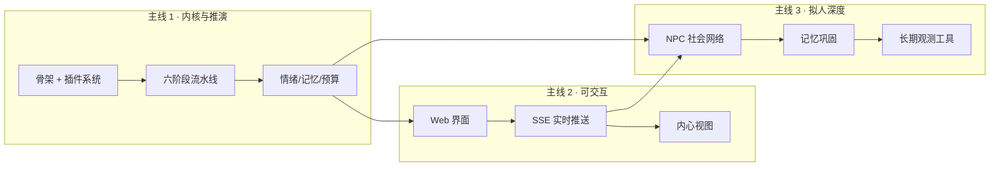
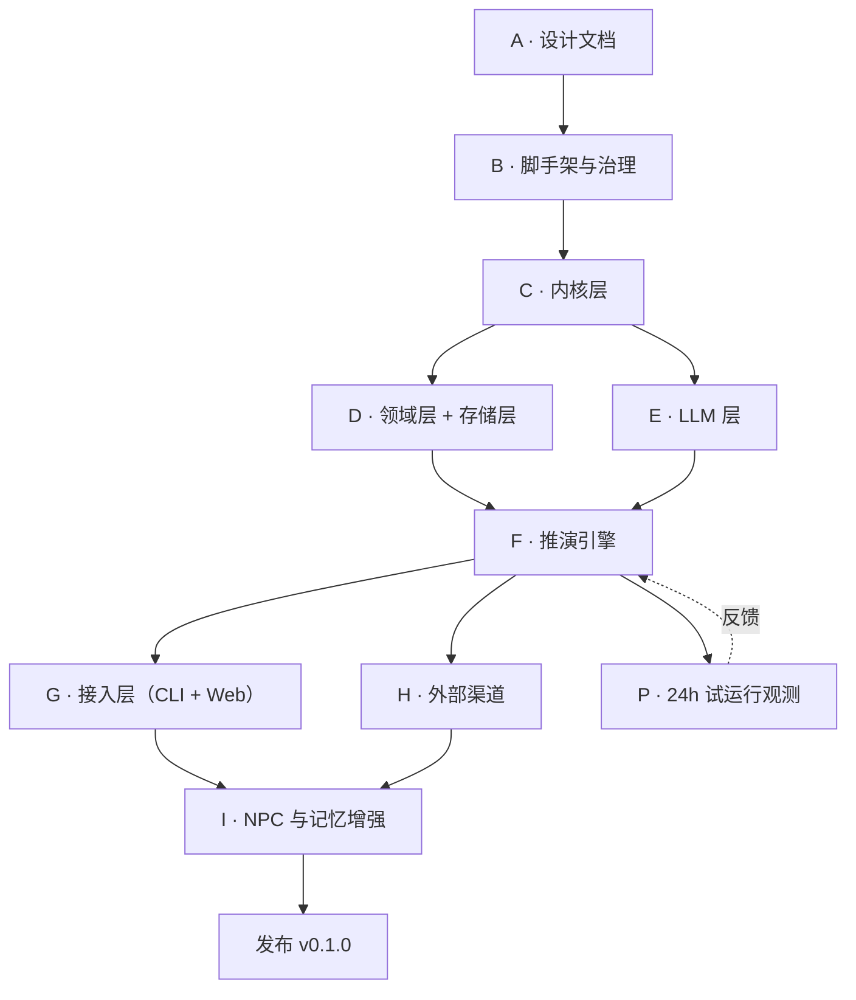
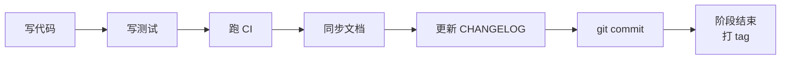

# 06 · 路线图与成本

> 上级文档：[DESIGN.md](../DESIGN.md) · 版本 v0.1.0
> 本文档描述版本规划、里程碑、验收标准、风险对策与成本估算。面向项目决策者与使用者。

---

## 目录

1. [总体策略](#1-总体策略)
2. [版本规划](#2-版本规划)
3. [里程碑与验收标准](#3-里程碑与验收标准)
4. [实施顺序](#4-实施顺序)
5. [成本估算](#5-成本估算)
6. [风险与对策](#6-风险与对策)
7. [成功标准](#7-成功标准)
8. [非目标](#8-非目标)

---

## 1. 总体策略

### 1.1 三条主线



**顺序原则**：主线 1 是基础，必须先完成。主线 2 与 3 可以并行，但主线 2 优先级更高——**一个不能交互的 Agent 无法验证拟人感**。

### 1.2 分阶段推进

| 阶段 | 内容 | 产出 |
| --- | --- | --- |
| A | 设计文档 | `docs/` 全套（本文档所属阶段） |
| B | 项目脚手架与治理 | 仓库、CI、规范、ADR |
| C | 内核层 | `kernel/` 全部模块 |
| D | 领域层 + 存储层 | `domain/` + `storage/` |
| E | LLM 层 | `llm/` |
| F | 推演引擎 | `sim/` 六阶段 |
| G | 接入层 | CLI + Web |
| H | 外部渠道 | 钉钉 / 企业微信 / 文件 |
| I | NPC 社会网络与记忆增强 | `npc/` |
| J | 多层模型路由与设置中心 | `kernel/settings.py`、`[llm.providers/models/routing]`、设置页 |
| K | 可观测性 | 统计页 + 日志页 + `correlation_id` 闭环 |
| L | 生图与形象一致性 | `interfaces/image.py`、`domain/media.py`、`image.*` 插件、相册页 |
| M | 联网检索 | `interfaces/source.py`、`domain/untrusted.py`、`source.*` 插件、信息源页 |

**每个阶段结束都必须**：测试通过 + 文档同步 + 提交 + 更新 CHANGELOG。

> **当前进度（2026-09-15）**：阶段 A–C 已完成。阶段 D 的**存储层已落地**——
> `storage/sqlite/` 下的 `connection.py` / `migrator.py` / `backend.py` 与四个迁移文件。
> 领域层完成两条纵向切片：
>
> 1. **作息/情绪/记忆**——`domain/schedule.py`、`domain/emotion.py`、`domain/memory.py`（提交 `b5371ba`）。
> 2. **节日日历与对话节奏**——`domain/calendar.py`、`domain/conversation.py`、随包数据 `holidays/2026.toml`，
>    外加 `alterego calendar {list,today,check}` 三个命令（共 1081 个测试，全局覆盖率 96.62%，
>    `domain/` 99.16%）。
>
> **领域层其余模块与 12 个 Repository 未开始**。阶段 E–M 均未开始。
>
> 先做这两条切片的理由见 [`docs/plans/2026-09-15-domain-emotion-memory.md`](../plans/2026-09-15-domain-emotion-memory.md) § 1：
> 只有情绪与记忆在文档里有**可执行的量化验收标准**（`strength_at` 验证表、`update_emotion` 四条规则），
> 其余实体只有字段清单，等 Repository 到位再铺开成本更低。
> 节日那条多了一个额外理由：它有需求里**点名的一句话**（「不要突然过渡到了节日」），
> 而这句话可以写成一个测试（见 [12](12-calendar-and-conversation.md) § 6.4）。

> **为什么 J/K 排在 L/M 前面**：设置中心与可观测性是**基础设施**。
> 如果先做生图再补设置页，那生图的十几个新配置项会先以「无标注」的形式存在一段时间，
> 而人一旦接受了无标注的配置，就很难再回头补。同理，先有 `correlation_id` 再添加新功能，
> 新功能天生就是可追踪的；反过来则要给已有功能补一层。

### 1.3 关键决策：先跑起来再完美

**目标**：阶段 F 结束时，Agent 应该能在终端里"活着"并主动说话——即使 Web 界面还很粗糙、NPC 还没有、记忆还很笨。

**理由**：
- 拟人感只能通过长期运行来验证，越早开始跑越好
- 长期运行的观察结果会反过来指导后续设计（例如发现"每小时发一条太频繁"）
- 避免陷入"把所有功能做完才发现方向错了"

因此阶段 F 结束时允许 CLI 界面简陋，但**推演循环必须是完整的**。

---

## 2. 版本规划

### 2.1 版本路线

| 版本 | 主题 | 核心内容 | 状态 |
| --- | --- | --- | --- |
| **v0.1.0** | 能活着 | 内核 + 推演 + Web + 单向 IM + **设置中心 + 可观测性** | 设计中 |
| **v0.2.0** | 有个形像 | **生图 + 角色一致性（定妆照）** + 相册 + NPC 社会网络 + 记忆巩固 | 规划 |
| **v0.3.0** | 会自己找东西 | **联网检索（兴趣驱动）** + 双向对话（企业微信应用消息） | 规划 |
| **v0.4.0** | 会成长 | 人设演化 + 关系深度模型 + 长期目标 | 规划 |
| **v0.5.0** | 多模态 | 语音合成 + 视频/图像**理解**（生成已在 v0.2.0） | 探索 |
| **v1.0.0** | 稳定 | API 冻结 + 完整文档 + 迁移工具 | 远期 |

> **图片生成从 v0.5.0 提前到了 v0.2.0**。原因：它不需要任何新技术——
> 云端生图就是一次 HTTP 调用，与调 LLM 同构；而“角色有自己的形像”
> 是拟人度的最大增量之一（“文字角色” vs “有脸的角色”体验差异很大）。
> **语音与视频理解仍在 v0.5.0**：它们需要额外的模型与存储，且对本项目的核心价值没有生图那么直接。

### 2.2 v0.1.0 详细范围（本文档的重点）

**包含**：

| 模块 | 内容 |
| --- | --- |
| 内核 | 事件总线、服务注册表、配置、插件加载/热重载、时钟、调度器、错误体系 |
| 领域 | 人设、情绪（4 规则）、记忆（3 类 + 衰减）、关系、日程、世界、动态、对话 |
| 存储 | SQLite（**26 表**）、FTS5 检索、迁移机制、备份 |
| LLM | 兼容 OpenAI 协议的 Provider、**三层配置（provider/model/routing）**、重试、预算、成本统计 |
| 推演 | 六阶段流水线、10 种意图、打扰预算、降级机制 |
| 接入 | CLI（argparse）、Web（FastAPI + SSE，**13 个页面**） |
| 渠道 | `web`、`file`、`console`、`dingtalk_webhook`、`wecom_webhook` |
| 能力 | `activity`（内部行为）、`post`（发动态）、`chat`（对话）、`reach_out`（主动消息） |
| 可解释性 | `tick_log` 完整记录、`alterego why`、Web 内心视图 |
| **可观测性** | **Token/成本统计页、日志页、`correlation_id` 排查闭环** |
| **设置中心** | **全部配置可在 UI 修改；每个键都有「是什么」与「改了会怎样」** |
| 人设 | LLM 生成 + 校验 + 手动调整（**不含自动演化**） |
| NPC | ⚠️ 仅数据表与最小实现（3-5 个 NPC，只发动态） |

**不包含**（明确推迟）：

- 人设自动演化（v0.4.0）
- 双向 IM（v0.3.0）
- 记忆向量检索（可选插件，非核心）
- **图片生成（v0.2.0，只预留 `ImageProvider` 接口与 `media_asset` 表）**
- **联网检索（v0.3.0，只预留 `SourceProvider` 接口）**
- 多 Agent 交互
- 移动端 App

### 2.3 兼容性承诺

| 版本 | 承诺 |
| --- | --- |
| `0.x` | **不保证**向后兼容。破坏性变更必须写 ADR 并在 CHANGELOG 中标注 ⚠️ BREAKING |
| `1.0` 之后 | 插件 `api_version` 保证向前兼容 1 个大版本；数据库提供迁移脚本 |
| 数据库 | 每次 schema 变更提供前向迁移；破坏性迁移自动备份 |
| 配置 | 新字段必有默认值；删除字段保留一个版本的兼容读取与弃用警告 |

---

## 3. 里程碑与验收标准

### M1 · 能加载插件（阶段 B + C 结束）

| 项 | 验收标准 |
| --- | --- |
| 配置 | `alterego init` 生成 `alterego.toml`；非法配置退出码 2 并给出定位信息 |
| 插件 | 能从 `plugins/` 加载插件；manifest 校验失败给出 `file:line` + 修复建议 |
| 总线 | 通配符订阅、优先级、异常隔离、重入深度限制均有测试 |
| 时钟 | `VirtualClock` 以 60x 推进；同一 tick 内时间冻结 |
| 调度 | `every` / `at_time_of_day` 在虚拟时钟下正确触发 |
| 架构红线 | `scripts/check_architecture.sh` 七组 22 项全部通过 |
| 测试 | 内核层覆盖率 ≥ 90% |

**验证命令**：

```bash
pytest tests/kernel -q
bash scripts/check_architecture.sh
alterego plugins list
```

### M2 · 能记住并思考（阶段 D + E 结束）

| 项 | 验收标准 |
| --- | --- |
| 数据库 | 26 张设计表 + `schema_version` + 2 个视图全部创建（`PRAGMA user_version = 4`） |
| 迁移 | 提供 `001_initial.sql` ~ `004_observability.sql`；`alterego db migrate --dry-run` 可预演 |
| 检索 | FTS5 BM25 检索可用；中文分词走 `preprocess_for_fts()`；Top-8 返回带分数分解 |
| 情绪 | `update_emotion()` 纯函数，顺序为回归→冲击→惯性；有单元测试覆盖 4 条规则 |
| 记忆 | `strength_at()` 与文档验证表数值一致（误差 < 0.001） |
| 衰减 | 每 6 虚拟小时的衰减任务正确执行；`strength < 0.05 且 importance < 0.6` 被标记遗忘 |
| LLM | 兼容 OpenAI 协议；分层路由生效；重试策略符合文档；预算超限触发降级 |
| 成本 | `alterego stats --cost` 输出与文档示例格式一致 |
| 测试 | 领域层覆盖率 ≥ 95%（纯函数，必须高覆盖） |

**验证命令**：

```bash
pytest tests/domain tests/storage -q
alterego memory search "爬山"          # 检查分数分解
alterego db status
```

### M3 · 能活着并主动说话（阶段 F 结束）

| 项 | 验收标准 |
| --- | --- |
| 流水线 | 六阶段全部实现，`order` 为 10/30/50/70/90/110 |
| 快照 | `StateSnapshot` 为 frozen dataclass，tick 内不变 |
| 感知 | 85% 的 tick 不调用 LLM 即可完成（`needs_llm()` 生效） |
| 意图 | 10 种意图注册为 `IntentType`，提示词目录自动渲染 |
| 预算 | 5 项校验（免打扰/熔断/日程/配额/间隔）全部实现；`check_budget()` 为纯函数 |
| **降级** | **被拦截的 `reach_out` 降级为 `reflect_internal`，`inner_voice` 写入 `activity_log`** |
| 重提 | 12 小时内的被拦截意图能在合适时机被重新激活 |
| 表达 | 打字延迟模拟生效（`len/3.0` 秒）；长消息按 `verbosity` 分句 |
| 可复现 | 固定 `ctx.rng` 种子，相同输入得到相同输出（golden test） |
| 可解释 | `alterego why` 输出包含感知/记忆/候选/决策/预算校验/行动/事件流 |
| 连续运行 | 能连续运行 24 真实小时不崩溃 |

**验证命令**：

```bash
pytest tests/sim -q
alterego serve --no-web &            # 后台跑 24 小时
alterego why                          # 检查解释输出
alterego why --suppressed             # 检查"想说没说"
```

**M3 是本项目最重要的里程碑**。它意味着 Agent 有了「生活感」。

### M4 · 能交互（阶段 G 结束）

| 项 | 验收标准 |
| --- | --- |
| Web | **13 个页面**可用（总览/对话/动态/时间线/关系网/内心/记忆/相册/统计/日志/信息源/设置/后台） |
| SSE | 新消息实时推送；断线自动重连；心跳保持 |
| 认证 | token 认证生效；`host=0.0.0.0` + `auth_mode=none` 被拒绝启动 |
| 安全 | XSS 转义、CSRF 检查、CSP 头、限流全部生效 |
| CLI | 全部子命令可用；错误退出码符合文档 |
| 移动端 | 手机浏览器访问正常，可发消息 |
| 性能 | 首屏加载 < 1s；消息发送到显示的端到端延迟 < 500ms（不含 LLM 生成） |

**验证命令**：

```bash
alterego serve
# 浏览器访问，逐页检查
curl -N http://127.0.0.1:8765/api/chat/stream   # 检查 SSE
```

### M5 · 能触及用户（阶段 H 结束）

| 项 | 验收标准 |
| --- | --- |
| 钉钉 | 加签正确（`timestamp\nsecret` + HMAC-SHA256 + base64 + quote_plus）；错误码处理符合文档 |
| 企业微信 | webhook 发送成功；4096 字节截断在句子边界 |
| 适配 | 超长消息按渠道能力降级；markdown 不支持时转纯文本 |
| 路由 | 各消息类型按 `[routing]` 分发；免打扰时段 IM 推送被丢弃 |
| 幂等 | 重试不产生重复消息（`dedup_key` 生效） |
| 兜底 | 所有渠道失败时写入文件并告警 |
| 诊断 | `alterego channels doctor` 输出符合文档格式 |
| 单向说明 | 输出中明确标注渠道方向，避免用户误解 |

**验证命令**：

```bash
alterego channels test dingtalk_webhook
alterego channels doctor
```

### M6 · 社交生活（阶段 I 结束）

| 项 | 验收标准 |
| --- | --- |
| NPC | 3-5 个 NPC 有独立人设与性格 |
| 推演 | `npc_tick` 每 30 虚拟分钟运行；75% 概率无事发生 |
| 行为 | NPC 能发动态、评论、点赞；影响主角情绪与关系 |
| 巩固 | 每 6 虚拟小时把 episodic 归纳为 semantic；原始记忆 importance × 0.6 |
| 复活 | 遗忘的记忆可被强关联触发"突然想起" |
| 成本 | NPC 推演 80% 走规则，不显著增加成本 |

### M7 · 发布 v0.1.0（全部阶段结束）

| 项 | 验收标准 |
| --- | --- |
| 文档 | DESIGN.md + **11 个分册**全部同步到最终实现 |
| 测试 | 总覆盖率 ≥ 85%；领域层 ≥ 95%；内核层 ≥ 90% |
| 红线 | CI 中**六组**架构检查全部通过（含新增的「LLM 调用必经 `ctx.llm()`」与「不得自建 logging handler」） |
| 设置标注 | `test_settings_metadata.py` 三条断言全绿（每个键有元数据 / `effect` 可验证 / 枚举选项有后果） |
| 可追踪 | 所有可观测表均有 `correlation_id`；`v_trace` 能把一次推演串成完整链路 |
| CHANGELOG | `[0.1.0]` 章节完整 |
| 安装 | `pip install alterego` 可用（或 `uv pip install .`） |
| 首次体验 | 新用户 5 分钟内能跑起来：`alterego init && alterego serve` |
| 30 天观测 | 连续运行 30 天，人格无明显漂移（主观评估 + 情绪曲线平稳） |

---

## 4. 实施顺序

### 4.1 依赖图



### 4.2 每阶段的固定动作



| 动作 | 要求 |
| --- | --- |
| 写代码 | 遵循 P1-P7 七条原则 |
| 写测试 | 新功能必须有测试；bug 修复必须先加复现测试 |
| 跑 CI | `ruff check` + `pytest` + `check_architecture.sh` 全绿 |
| 同步文档 | 代码行为变更 → 对应分册同步；冲突时先写 ADR |
| 更新 CHANGELOG | 在 `[Unreleased]` 下按类型追加 |
| 提交 | Conventional Commits 规范 |

### 4.3 分支策略

**trunk-based**（个人项目，无需复杂流程）：

```
main
 └── 直接提交（提交前跑 CI）
```

对较大的功能使用短生命周期分支：

```
feat/npc-social-network   →  PR  →  squash merge to main
```

分支存活时间 **< 1 周**。超过说明拆分不当。

---

## 5. 成本估算

### 5.1 LLM 成本（运行成本）

假设：`realtime` 模式、1 个人格 + 5 个 NPC、每天 288 个 tick。

**每天调用量**（按 [04-simulation-loop.md § 10.1](04-simulation-loop.md#101-分层模型路由)）：

| 用途 | 次数 | tier | 单次 token（输入+输出） | 单价（$ / 1M token） | 每日成本 |
| --- | --- | --- | --- | --- | --- |
| `reflection` | 96 | cheap | 1,800 + 150 | 0.15 / 0.60 | $0.035 |
| `decision` | 12 | strong | 3,200 + 300 | 2.50 / 10.00 | $0.126 |
| `expression` | 8 | strong | 2,400 + 250 | 2.50 / 10.00 | $0.068 |
| `npc` | 48 | cheap | 900 + 120 | 0.15 / 0.60 | $0.010 |
| `memory` | 4 | cheap | 4,000 + 600 | 0.15 / 0.60 | $0.004 |
| `emotion` | 12 | cheap | 1,200 + 100 | 0.15 / 0.60 | $0.003 |
| **合计** | **~180** | **85% cheap** | — | — | **~$0.25** |

**结论**：**约 $7.5/月**（按每日 $0.25 × 30）。

**加上重试与波动，预留 3 倍余量** → 建议预算 `daily_usd_limit = 2.0`，`monthly_usd_limit = 40.0`。

> **此前本文档建议 `1.0` / `30.0`，已改为与 [04-simulation-loop.md § 10.4](04-simulation-loop.md#104-预算与降级)
> 和 [DESIGN.md § 12.1](../DESIGN.md#121-配置文件) 一致的 `2.0` / `40.0`。
> 原因：v0.2.0/v0.3.0 新增了生图与检索两条成本线（见 § 5.1.1），
> 旧的余量已经不够，而这个不一致本身就是文档漂移。

#### 5.1.1 v0.2.0 / v0.3.0 新增成本

| 新增项 | 次数/天 | 单价 | 每日 |
| --- | --- | --- | --- |
| 生图（`selfie` / `scenery`） | 3 | $0.04/张 | $0.12 |
| 生图提示词构造（`image_prompt`） | 3 | cheap | $0.001 |
| 检索词生成（`research_query`） | 6 | cheap | $0.002 |
| 内容消化（`research_summarize`） | 6 | cheap（输入含 4000 字符正文） | $0.010 |
| 新增 LLM 调用（反思变长等） | — | — | $0.004 |
| **合计** | | | **~$0.14** |

**新总计：~$0.39/天 ≈ $11.6/月。**

三条新增线中，**生图占 86%**。所以 `[budget] max_images_per_day = 20`
是比每日总预算更有效的闸门——一张图的边际成本相当于约 400 次 cheap 文本调用。

> 上表使用「典型中端定价」（strong ≈ $2.5/$10，cheap ≈ $0.15/$0.6）。实际成本取决于所选模型：
>
> | 组合 | 每日 | 每月 |
> | --- | --- | --- |
> | 全用便宜模型 | ~$0.05 | ~$1.5 |
> | 便宜 + 中端（推荐） | ~$0.25 | ~$7.5 |
> | 全用顶级模型 | ~$2.10 | ~$63 |
>
> 设计允许通过 `[llm.routing]` 任意调整，无需改代码。

### 5.2 成本降级路径

| 消耗达预算 | 行为 | 每日成本 |
| --- | --- | --- |
| < 80% | 正常 | 基准 |
| 80%–100% | `strong` 全部降级为 `cheap` | 基准 × 0.35 |
| > 100% | 规则模式（无 LLM），发 `budget.exhausted` | $0 |

**关键**：即使预算耗尽，Agent 仍继续"生活"，只是变笨。见 [04-simulation-loop.md § 10.4](04-simulation-loop.md#104-预算与降级)。

### 5.3 成本对比：如果不用分层路由

| 方案 | 每日 | 每月 |
| --- | --- | --- |
| 全 strong（朴素实现） | ~$1.65 | ~$50 |
| **分层路由（本设计）** | **~$0.25** | **~$7.5** |
| 分层 + 跳过 60% tick | ~$0.25 | ~$7.5 |
| 分层 + 跳过 tick + v0.2.0/v0.3.0 新增能力 | ~$0.39 | ~$11.6 |

分层路由带来 **6.6 倍**的成本降低。这是设计中最重要的成本优化，
而且它现在是**用户可调**的：`[llm.routing]` 的每一个值都能在设置页里改，
改完界面会直接告诉你「改了会发生什么」（见 [10-settings-center.md](10-settings-center.md)）。

### 5.4 存储成本

假设 `realtime` 模式、5 分钟粒度、1 人格 + 5 NPC：

| 表 | 每日行数 | 每行大小 | 每日增长 | 每年增长 |
| --- | --- | --- | --- | --- |
| `tick_log` | 288 | ~4 KB | 1.15 MB | **420 MB** |
| `activity_log` | 288 | ~400 B | 115 KB | 42 MB |
| `emotion_log` | 288 | ~200 B | 58 KB | 21 MB |
| `llm_usage` | 180 | ~250 B | 45 KB | 16 MB |
| `memory` | ~20 | ~600 B | 12 KB | 4.4 MB |
| `message` | ~15 | ~500 B | 7.5 KB | 2.7 MB |
| `media_usage` | ~3 | ~200 B | ~0.6 KB | 0.2 MB |
| `log_entry` | ~30 | ~1 KB | 30 KB | 11 MB |
| `source_item` | ~8 | ~700 B | ~6 KB | 2 MB |
| `source_query` | ~1.5 | ~300 B | ~0.5 KB | 0.2 MB |
| `event_log`（默认关闭） | 0 | — | 0 | 0 |
| 其他 | — | — | ~20 KB | 7 MB |
| **数据库合计** | — | — | **~1.45 MB/天** | **~532 MB/年** |
| **图片文件**（文件系统） | 3–8 张 | PNG 1.2 MB / WebP 180 KB | 3.6–9.6 MB | **1.3–3.5 GB** |

**数据库部分 `tick_log` 仍占 81%（约 420 MB / 532 MB）**。

> **图片是唯一真正需要担心存储的部分**：它比数据库大 5 倍左右且无自然上限。
> 两个默认就开了的措施：存 WebP 而非 PNG（缩小 85%）、
> `[retention] media_keep_days = 365` + `media_private_keep_days = 90`
> （未发布的图 90 天后清理，已发布的保留 1 年）。

```toml
[retention]
tick_log_detail = "summary"   # 只保留关键字段，不含 state_snapshot_json
tick_log_keep_days = 30       # 30 天前的只保留摘要行
```

开启后 `tick_log` 降为原来的 1/20，**每年增长降到 ~75 MB**。

**默认配置**：

```toml
[retention]
tick_log_keep_days = 90
tick_log_detail = "full"      # 90 天内完整，之后降级为摘要
activity_log_keep_days = 365
log_keep_days = 30
media_keep_days = 365
media_private_keep_days = 90
source_item_keep_days = 90
event_log_enabled = false
auto_vacuum = true
```

### 5.5 开发成本

| 阶段 | 内容 | 工作量（人日）|
| --- | --- | --- |
| A | 设计文档 | 已完成 |
| B | 脚手架与治理 | 1 |
| C | 内核层 | 3–4 |
| D | 领域层 + 存储层 | 5–6 |
| E | LLM 层 | 2–3 |
| F | 推演引擎 | 6–8 |
| G | 接入层（CLI + Web） | 4–5 |
| H | 外部渠道 | 2–3 |
| I | NPC 与记忆增强 | 3–4 |
| J | 多层模型路由与设置中心 | 3–4 |
| K | 可观测性（统计页 + 日志页 + `correlation_id`） | 3–4 |
| L | 生图与形象一致性（+ 相册页） | 3–5 |
| M | 联网检索（+ 信息源页 + 不可信输入防护） | 3–4 |
| — | 测试与联调 | 6–8 |
| — | 文档同步 | 3–4 |
| **合计** | — | **~50–64 人日** |

**说明**：这是"认真做"的估算。使用 AI 辅助编码可以显著压缩（尤其是 D、G、J 阶段的样板代码）。但 **F 阶段（推演引擎）压缩空间有限**——它需要反复调试 Prompt 与参数。

**新增的 J–M 四个阶段里，L 的估算最不确定**（3–5 人日）：
角色一致性的「定妆照 + 参考图 + 四槽位骨架」三层机制本身不难写，
**难的是调参到 80% 的可辨认率**——这需要反复生成与目测，是人工时间而不是编码时间。
建议实现时先做一次性验收实验（20 张图目测），再根据结果决定要不要走 LoRA 这条路（见 [ADR-0008](../adr/0008-anchor-character-consistency-in-a-canonical-portrait.md)）。

### 5.6 隐性成本

| 项 | 说明 |
| --- | --- |
| **Prompt 调优** | 让 Agent 说话像真人需要反复试。预计占 F 阶段 40% 的时间 |
| **长期观测** | 验证"30 天不漂移"需要真实等待 30 天（可用倍速加速，但倍速下的表现与实时不完全相同） |
| **API 变更** | LLM 供应商改 API 或有破坏性更新，需要维护 |
| **IM 平台规则** | 钉钉/企业微信可能调整限流或风控，导致渠道失效 |

---

## 6. 风险与对策

### 6.1 风险清单

| # | 风险 | 可能性 | 影响 | 对策 |
| --- | --- | --- | --- | --- |
| R1 | **LLM 成本失控** | 中 | 高 | 分层路由（6.6x 降本）+ 硬预算 + 三级降级 + 每日成本报告 |
| R2 | **人格漂移**（跑久了说话不像人） | 中 | 高 | 人设版本化固定；`persona.updated_at` 不变则提示词不变；情绪曲线监控；30 天观测 |
| R3 | **行为重复机械**（总是说同一句话） | 高 | 中 | 记忆注入 + 最近行为注入（避免重复）；`last_recalled_at` 提升新近度；模板库不用于主路径 |
| R4 | **打扰用户** | 低 | 极高 | 硬约束预算（机制而非提示词）+ 免打扰 + 熔断 + 最大 3 条/天 |
| R5 | **不主动说话**（太内向，用户觉得没意思） | 中 | 中 | `longing_score` 随时间增长；沉默期保护只在"用户 24h 未回复"时才降权；权重下限保护 |
| R6 | **数据库损坏** | 低 | 高 | WAL + `synchronous=NORMAL` + 定期 checkpoint + `VACUUM INTO` 备份 + 启动时 `PRAGMA integrity_check` |
| R7 | **记忆无限增长** | 中 | 中 | 衰减 + 遗忘（不删除）+ 定期归档 + 容量估算与告警 |
| R8 | **插件崩溃拖垮主进程** | 中 | 中 | 三级错误隔离 + 熔断器（5 次失败自动打开）+ 降级模式 |
| R9 | **热重载导致状态丢失** | 低 | 中 | 重载前 flush `PluginState`；重载期间暂停 tick；失败不回滚旧实例但明确告警 |
| R10 | **中文分词效果差** | 高 | 中 | `jieba` 预分词（写入与查询用同一函数）；可选 `tokenizer_jieba` 插件 |
| R11 | **IM 渠道失效**（平台规则变更） | 中 | 低 | 多渠道冗余；文件渠道兜底；`channels doctor` 快速诊断 |
| R12 | **用户误解单向渠道** | 中 | 中 | 启动输出、`channels doctor`、Web 页面均明确标注渠道方向 |
| R13 | **Prompt 注入**（用户消息影响系统行为） | 低 | 中 | 用户消息放在 User 消息中且明确标注为"用户说什么"；系统提示词不变；输出结构校验（JSON schema） |
| R14 | **隐私泄露** | 低 | 高 | 默认本地存储；无遥测；密钥不进代码库；日志脱敏；导出支持 `--anonymize` |
| R15 | **范围蔓延**（不断加功能） | 高 | 中 | 非目标清单（DESIGN.md § 15）；每个新功能必须能作为插件实现，否则进 ADR 讨论 |
| R16 | **Web 界面成为安全漏洞** | 低 | 高 | 默认绑定 localhost；token 认证；CSP；拒绝不安全配置启动 |
| R17 | **外部内容注入**（网页/新闻里藏着指令） | **中** | **高** | 五条硬规则：不进 system prompt / 不当指令执行 / 显式标注不可信 / 模式命中即丢弃 / 长度截断。见 [ADR-0009](../adr/0009-fetched-content-is-untrusted.md) |
| R18 | **形象不一致**（每次生成不是同一个人） | **高** | 中 | 定妆照三层机制 + `supports_reference` 硬约束 + 20 张 80% 可辨认率验收标准。见 [ADR-0008](../adr/0008-anchor-character-consistency-in-a-canonical-portrait.md) |
| R19 | **配置项无说明，用户改错** | **高** | 中 | 每个设置强制携带 `description` + `effect`；三条 CI 断言卡住。见 [ADR-0010](../adr/0010-every-setting-carries-display-metadata.md) |
| R20 | **生图成本失控**（图比 token 贵得多） | 中 | 中 | `max_images_per_day` 独立闸门；§ 5.1.1 里生图占新增成本 86%，因此单独设闸 |

### 6.2 重点风险详解

#### R2 · 人格漂移

**症状**：运行 2 周后，Agent 的说话风格开始变得泛泛、模板化，失去人设特征。

**根因**：
1. 提示词中的人设被大量记忆内容"淹没"
2. 记忆巩固把具体细节抽象掉了，注入的记忆越来越空泛
3. LLM 的默认风格逐渐主导

**对策**：

| 措施 | 说明 |
| --- | --- |
| 人设片段固定位置 | 人设永远在 System 消息的第一段，且记忆注入有长度上限 |
| 记忆长度上限 | `_memory.md` 注入最多 8 条，每条摘要 ≤ 50 字 |
| 保留具体细节 | 记忆巩固时**必须保留至少 1 个具体细节**（时间/地点/物品） |
| 风格检查 | `Express` 阶段检查 emoji 习惯、标点习惯、口头禅使用率 |
| 监控 | `alterego stats --emotion --days 30` 观察情绪曲线；人工抽查每周输出 |
| 可回滚 | 人设版本化，发现漂移可 `persona rollback` |

#### R3 · 行为重复机械

**症状**：Agent 每次主动发消息都是"在干嘛呢"。

**对策**：

| 措施 | 说明 |
| --- | --- |
| 反重复注入 | 提示词中注入"最近 3 条你发过的消息"，明确要求"不要重复类似内容" |
| 记忆新近度 | `last_recalled_at` 频繁提升会导致记忆被反复使用——需要引入"独特性惩罚"：同一记忆 24 小时内被召回 2 次以上时降权 |
| 动机多样性 | 6 种 `reach_out` 动机加权采样，避免单一动机垄断 |
| 行为多样性监控 | `alterego stats --activity --days 7` 检查意图分布；某意图占比 > 50% 视为异常 |

**反重复实现**：

```python
def apply_novelty_penalty(memories: list[ScoredMemory], since: datetime) -> list[ScoredMemory]:
    """同一记忆短期内被反复召回时降权，避免车轱辘话"""
    for m in memories:
        if m.recall_count_recent >= 2 and m.last_recalled_at > since:
            m.score *= 0.5
    return memories
```

#### R5 · 太内向不主动

**症状**：Agent 因为人设内向 + 预算限制，一天都不说话。

**对策**：

| 措施 | 说明 |
| --- | --- |
| `longing_score` 单调增长 | 只要 affinity > 0 且时间长，分数必然上升 |
| 权重下限 | `reach_out` 在权重采样中的下限为 0.05（不会被完全排除） |
| 引导配置 | `alterego init` 时询问用户期望的主动频率（低/中/高），映射为不同的 `daily_message_limit` |
| 观测告警 | 连续 3 天无任何主动行为 → Web 上显示提示"要不要降低打扰预算？" |

**注意**：这是**设计权衡**。宁可 Agent 稍偏内向，也不要骚扰用户。默认配置偏向保守，允许用户主动调高。

### 6.3 风险应对的监控指标

| 指标 | 健康范围 | 异常时的动作 |
| --- | --- | --- |
| 每日 LLM 成本 | < 预算 80% | 调整 routing |
| 意图分布熵 | > 1.5 | 检查权重与提示词 |
| `reach_out` 被拦截率 | < 80% | 检查预算配置是否过严 |
| 熔断触发次数 | 0 次/周 | 检查是否打扰用户 |
| tick 失败率 | < 1% | 检查插件健康 |
| 情绪效价标准差（7 天） | 0.05–0.25 | < 0.05 说明情绪僵死；> 0.25 说明波动过大 |
| 记忆遗忘率 | 20%–40%/月 | 过高说明 importance 定得太低 |
| 数据库增长 | < 80 MB/月 | 检查 retention 配置（已含日志与检索） |
| **图片目录增长** | < 300 MB/月 | 检查 `media_keep_days`；检查是否误存 PNG |
| **生图张数/天** | ≤ `max_images_per_day` | 检查 `[media.selfie]` 频率配置 |
| **不可信内容丢弃率** | < 30% | > 30% 说明模式列表太宽（误杀），需调整 `INJECTION_PATTERNS` |
| **降级持续时间** | < 2 小时/天 | 持续处于 strong→cheap 说明预算定得太紧 |

---

## 7. 成功标准

### 7.1 v0.1.0 的成功标准

来自 [DESIGN.md § 3.4](../DESIGN.md#34-成功标准)，逐条可验证：

| # | 标准 | 验证方式 |
| --- | --- | --- |
| S1 | **连续运行 30 天，人格不漂移** | 每周人工抽查 10 条输出，评估语气一致性；情绪曲线无异常 |
| S2 | **每 24 小时至少 1 次非用户触发的主动行为** | 查询 `activity_log WHERE outbound = 1 AND initiative = 1`，按天分组 |
| S3 | **主动行为有可解释的动机** | `alterego why --outbound` 能显示 reason 与动机类型 |
| S4 | **严格遵守打扰预算** | `activity_log` 中无超预算记录；无免打扰时段的消息 |
| S5 | **新增行为类型无需改内核** | 写一个 `docs/adr/` 之外的插件（如 `weather_mood`）只需新增文件 |
| S6 | **所有行为可追溯** | 每条 `activity_log` 都有非空 `tick_id`，能通过 `alterego why` 还原 |
| S7 | **能看到 Agent 的克制** | `alterego why --suppressed` 有内容；Web 内心页面可用 |

### 7.2 定性评估

除了硬指标，以下主观感受也很重要（来自 30 天真实使用）：

| 问题 | 期望答案 |
| --- | --- |
| 打开对话框时，是否有点期待它说了什么？ | 是 |
| 看到"想说但没说"时，是否觉得它像个人？ | 是 |
| 有没有过"它今天心情好像不太好"的感觉？ | 是 |
| 有没有觉得它烦？ | 否 |
| 有没有觉得它是个 AI 在模仿人？ | 很少 |

**最后一条最难**。如果用户经常觉得"这是个 AI 在扮演人"，说明设计失败了。

### 7.3 反面成功标准

以下情况即使指标达标也算失败：

| 情况 | 为什么失败 |
| --- | --- |
| Agent 每天发满 3 条消息，但内容都是无意义的寒暄 | 满足数量不满足质量 |
| 情绪曲线很"活跃"，但用户看不出情绪和说话内容的关联 | 情绪没有被真正使用 |
| 记忆库很大，但 Agent 从不提起过去的事 | 记忆没有被真正使用 |
| `alterego why` 能输出解释，但解释和实际行为对不上 | 可解释性是假的 |

---

## 8. 非目标

与 [DESIGN.md § 15](../DESIGN.md#15-非目标) 一致，此处补充**路线图视角**的非目标：

| 非目标 | 说明 |
| --- | --- |
| 不做通用 Agent 框架 | AlterEgo 只解决"模拟一个人生活"这一个问题 |
| 不做多用户 / 多租户 | 单人使用，无需账号体系 |
| 不做云端服务 | 全部本地运行，数据不出本机 |
| 不做移动端 App | Web 响应式足够 |
| 不做语音交互 | v0.5.0 探索，非核心 |
| 不做图像识别 | 同上 |
| **不做实时视频/直播流** | 图像生成已在 v0.2.0；视频是另一个量级的问题 |
| **不做云端图像托管** | 图片默认存在本地 `data/media/`，不上传第三方（除非用户自己配的 provider 这么要求） |
| **不做社交平台的自动发帖** | 只发到自己的 Web 动态页与已配置渠道；“自己去微博发一条”不在范围内 |
| 不做分发到多个平台 | 不打算做 SaaS |
| 不做付费版 | 开源项目 |
| 不追求 tick 间的一致性（无分布式） | 单进程单机 |
| **不追求 100% 拟人** | 目标是"让人觉得有意思"，不是"通过图灵测试" |

**最后一条最重要**。追求 100% 拟人会导向无穷无尽的 Prompt 调优。本项目追求的是：**让用户愿意持续看它在做什么**。

---

## 变更记录

| 日期 | 版本 | 变更 | 作者 |
| --- | --- | --- | --- |
| 2026-09-15 | v0.1.0 | 初版 | LMG-arch |
| 2026-09-15 | v0.2.0 | 图片生成从 v0.5.0 提前到 v0.2.0，新增 v0.3.0「会自己找东西」；新增阶段 J–M；成本修正为 `2.0`/`40.0` 并补入生图与检索两条成本线（~$0.39/天）；存储补入 4 张新表与图片文件目录；新增风险 R17–R20 与 4 项监控指标 | LMG-arch |
