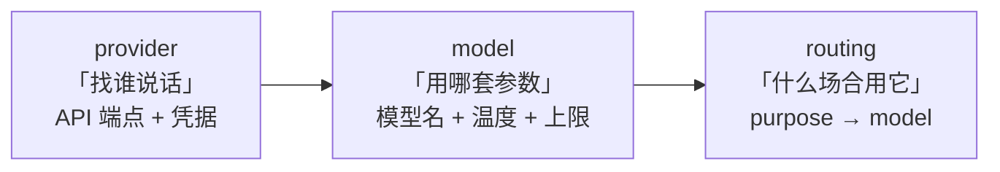
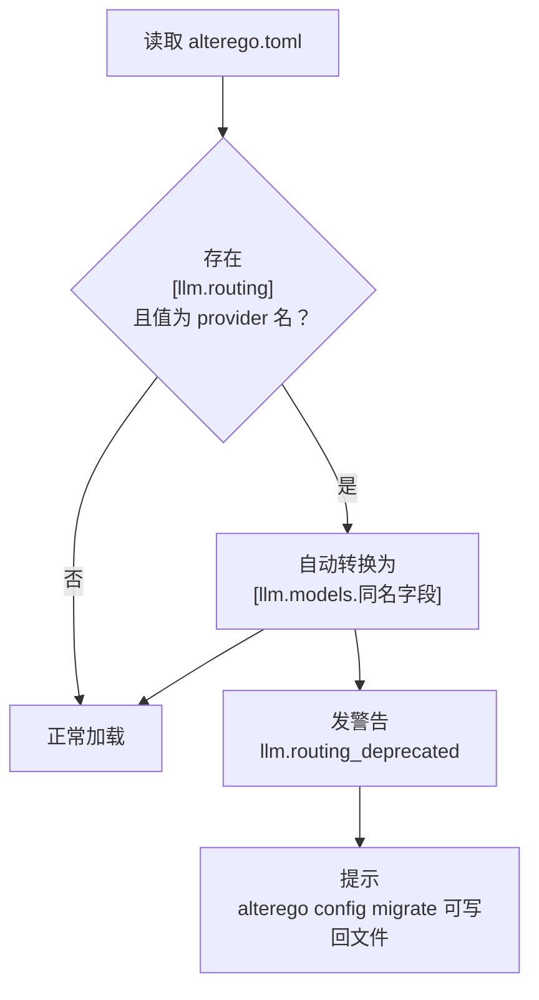
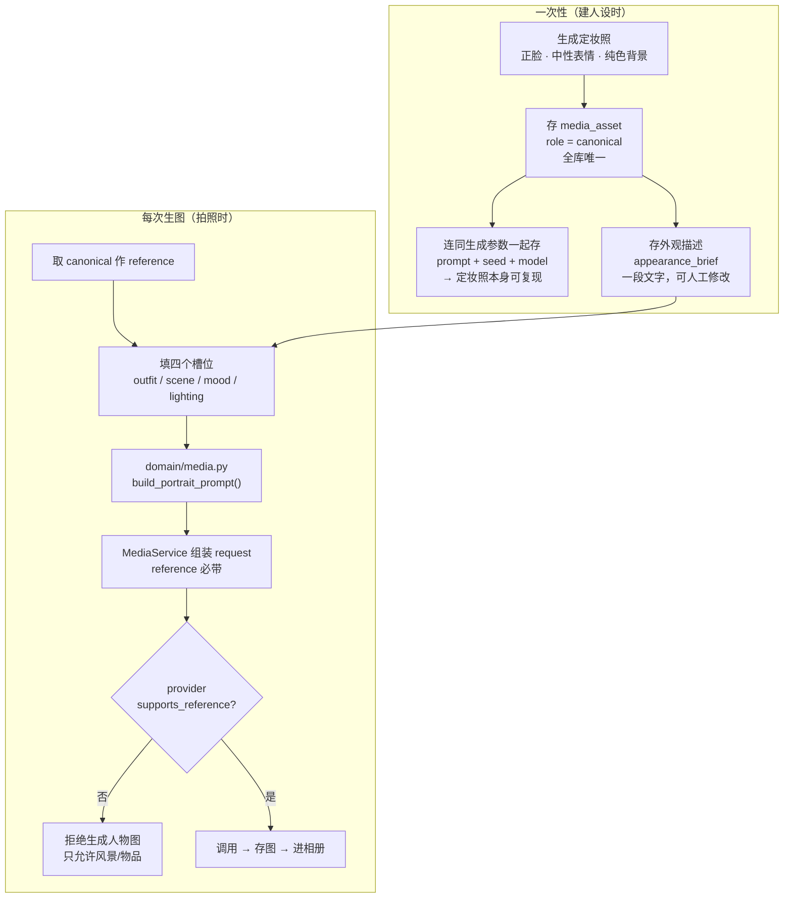

# 07 · 模型路由与多媒体

> 上级文档：[DESIGN.md](../DESIGN.md) · 版本 v0.1.0
> 本文档描述「每个用到 LLM 的地方都能独立指定模型」与「角色自己生图（含形象一致性）」两部分设计。
> 面向实现者与使用者。

---

## 目录

1. [问题与目标](#1-问题与目标)
2. [三层配置模型](#2-三层配置模型)
3. [配置迁移与兼容](#3-配置迁移与兼容)
4. [生图接口契约](#4-生图接口契约)
5. [角色一致性：机制而非提示词](#5-角色一致性机制而非提示词)
6. [相册、发布与打扰预算](#6-相册发布与打扰预算)
7. [成本计量](#7-成本计量)
8. [模块落位](#8-模块落位)
9. [配置参考](#9-配置参考)
10. [变更记录](#变更记录)

---

## 1. 问题与目标

### 1.1 现状的不足

现有设计（[DESIGN.md § 12.1](../DESIGN.md#121-配置文件)）只有 **两档** 模型：

```toml
[llm.routing]
strong = "openai_compatible"
cheap  = "openai_compatible"
decision = "strong"
```

这套设计隐含一个假设：**同一个档位下的所有用途，用同一个模型最合适**。实际上不成立：

| 真实诉求 | 现有配置能否表达 |
| --- | --- |
| 决策用 A 家旗舰，反思用 B 家的便宜模型 | ❌ 两个档位只能指向同一批 provider，且 provider 与档位是一对一 |
| 同一个 provider，但决策用 `max_tokens=2048`、NPC 对话用 `400` | ❌ `max_tokens` 是全局的 |
| 生图用一个完全不同的供应商 | ❌ 没有生图这个概念 |
| 想在界面上改「意图决策用哪个模型」 | ❌ 需要手改 TOML 并重启 |

### 1.2 目标

1. **任意粒度**：每个用途（purpose）都能独立指定「供应商 + 模型 + 采样参数」。
2. **不重复**：多个用途想用同一套参数时，只写一遍。
3. **可复现**：所有参数进入配置快照，黄金测试仍然逐字节可比（P6）。
4. **可展示**：每个键都能在设置界面显示「这是什么、改了会怎样」（见 [10-settings-center.md](10-settings-center.md)）。
5. **可生图**：角色能生成自拍照、风景照，且**形象前后一致——只换衣服与环境**。

---

## 2. 三层配置模型

### 2.1 三个概念，三个名字

现有配置把两件事混在一个名字里，这是所有不便的根源。拆开：



| 概念 | 回答的问题 | 变化频率 | 典型内容 |
| --- | --- | --- | --- |
| **provider** | 找谁说话？ | 极低（换服务商时） | `base_url`、`api_key_env`、`kind` |
| **model** | 用哪套参数？ | 低（换模型时） | `provider`、`model` 名、`temperature`、`max_tokens` |
| **routing** | 什么场合用它？ | 中（调优时） | `decision = "smart"` |

### 2.2 为什么中间要加一层 `model`

最直觉的写法是「每个用途直接写 provider + 模型名」：

```toml
# ❌ 反面例子：看起来直白，实际是维护负担
[llm.routing.decision]
provider = "deepseek"
model = "deepseek-chat"
temperature = 0.7
max_tokens = 2048

[llm.routing.expression]
provider = "deepseek"
model = "deepseek-chat"
temperature = 0.7          # 重复
max_tokens = 2048          # 重复
# ……还有 6 个用途要各抄一遍
```

想换模型时要改 8 处，想调温度时要改 8 处，而其中 7 处是同一个值。**一层间接换掉 N 处重复**，这是它存在的唯一理由。

```toml
# ✅ 引入 model 别名
[llm.models.smart]
provider = "deepseek"
model = "deepseek-chat"
temperature = 0.7
max_tokens = 2048

[llm.routing]
decision = "smart"
expression = "smart"
reflection = "cheap"       # 复用另一个别名
npc = "cheap"
```

### 2.3 每个模型的字段

| 字段 | 类型 | 默认 | 说明 |
| --- | --- | --- | --- |
| `provider` | `string` | **必填** | 引用 `[llm.providers.<name>]` |
| `model` | `string` | **必填** | 传给供应商的模型名 |
| `temperature` | `number` | `0.8` | 0–2 |
| `max_tokens` | `integer` | `1024` | 输出上限 |
| `timeout_sec` | `number` | `60.0` | 单次超时 |
| `supports_json` | `boolean` | `true` | 该模型是否支持 JSON 模式；为 `false` 时内核会退化为「提示词要求 JSON + 容错解析」 |
| `max_context_tokens` | `integer` | `0`（未知） | 为 >0 时，组装提示词前检查并截断 |
| `cost_per_1m_input` | `number` | `0.0` | 美元。为 0 时统计页只显示 token 不显示金额 |
| `cost_per_1m_output` | `number` | `0.0` | 同上 |

> **为什么 `cost_per_1m_*` 要写在配置里**：内置一张价目表意味着**每次服务商调价都要发新版**。
> 价格是数据不是代码——和 [ADR-0006](../adr/0006-ship-implementation-choices-as-data.md) 同一个判断。
> 内置表只作为「用户没填时」的兜底建议值，且明确标注「可能过时，请以服务商页面为准」。

### 2.4 用途（purpose）清单

purpose 是**代码里**的概念（每次 LLM 调用都必须声明它），routing 是**配置里**的映射。新增用途要改代码，这是刻意的——否则统计页会出现无法解释的用途名。

**代码里的权威集合只有一个：`LLMRoutingConfig` 的字段（去掉 `strong` / `cheap` 两个档位键）。**
`llm/gateway.py` 的 `_KNOWN_PURPOSES` 就是从那个 dataclass **推导**出来的，不另抄一份清单——抄的那份一定会在加字段那天忘记同步。因此下表只是**设计意图**，比代码多；多出来的行写进配置会被内核点名（见 § 3.1），不会静默生效。

| purpose | 触发者 | 建议档位 | 状态 | 说明 |
| --- | --- | --- | --- | --- |
| `decision` | 意图阶段 | strong | 🔌 仅配置键 | 10 个候选里选 1 个，质量最影响拟人感 |
| `expression` | 表达阶段 | strong | ✅ 已接线 | 生成真正说出口的话。两个调用方：推演里的三种模板（回话 / 发动态 / 主动找人，`sim/stages/express.py`）；用户在命令行直接开口（`cli_chat.py`）。**两边共用一条 purpose**——对它们的要求是同一件事 |
| `reflection` | 反思阶段 | cheap | ✅ 已接线 | 用一句话说出它此刻为什么是这种心情（`sim/stages/reflect.py`）。情绪主体由纯函数算出来，模型只负责那句解释，**而且只在有事发生的那一轮调** |
| `emotion` | 反思阶段 | cheap | ⏳ 未实现 | 情绪更新（结构化输出）。**当前不走 LLM**：`domain/emotion.py::update_emotion` 是纯函数（规则驱动，可复现），`prompts/emotion_update.md` 已备好但尚未接线 |
| `memory` | 记忆巩固 | cheap | ✅ 已接线 | 归纳 episodic → semantic（`sim/consolidation.py`） |
| `vault` | 知识库整理、学一格 | cheap | ✅ 已接线 | 两个调用方同一形状：整理时把收集箱里的笔记归位、起名、互链（`sim/vault.py`）；学习时按题面写一篇专业笔记（`sim/study.py`）。两边都是「给材料 + 要 JSON + 低温度」，所以不另开一个 purpose
| `npc` | NPC 推演 | cheap | 🔌 仅配置键 | 80% 走规则，剩下 20% 才调用 |
| `persona` | 人设生成 | strong | 🔌 仅配置键 | 一次性，质量重要 |
| **`image_prompt`** | 生图前 | strong | ⏳ 未实现 | 把「想拍什么」翻译成生图提示词的四个槽位（见 § 5.3） |
| **`research_query`** | 检索前 | cheap | ⏳ 未实现 | 把兴趣 + 情绪变成搜索词 |
| **`research_summarize`** | 检索后 | cheap | ⏳ 未实现 | 把网页正文压成一段可入记忆的摘要 |

**三种状态的含义**（`tests/test_kernel_config.py` 会把前两种和配置类对账）：

- ✅ **已接线** —— 配置键存在，而且真有代码路径拿它调 `LLMGateway.complete()`。
- 🔌 **仅配置键** —— 键在 `LLMRoutingConfig` 里（所以 `resolve()` 认得、统计页不会出现无法解释的用途名），
  但还没有调用方。推演循环落地后才会有。
- ⏳ **未实现** —— 连配置键都还没有。此时写进 `[llm.routing]` 会被 § 3.1 的未知键检测点名。

> 上表里带粗体的三个（`image_prompt` / `research_query` / `research_summarize`）是「生图与联网」
> 那批设计新增的。它们的存在说明一件事：**生图与联网不是一个独立系统，而是推演循环的延伸**
> ——它们各自都需要一次（或两次）LLM 调用，因此必须走同一套路由、同一套预算、同一套统计。
> 任何「绕过 routing 直接调 LLM」的实现都是 bug。

> `vault` 用途**已实现**（`alterego vault organize`，见
> [`plans/2026-09-16-obsidian-vault.md`](../plans/2026-09-16-obsidian-vault.md)）。
> 它与 `memory` 的差别在于**输出是「文件往哪放」**，所以除用途键外还多一层约束：
> 模型给的目录必须落在库的布局里，标题不能为空，说的那一篇得真在收集箱里
> ——一条不合格只丢那一条，不整批丢弃（`domain/vault.py::parse_organize_plan`）。
> 这是本设计里第一个「模型去动**外部可见的产物**」的用途，比写数据库多一层风险：
> 写错了用户看得见。

---

## 3. 配置迁移与兼容

### 3.1 旧配置怎么办

`0.x` 不承诺向后兼容（[06-roadmap.md § 2.3](06-roadmap.md#23-兼容性承诺)），但**静默失效**仍然不可接受——用户升级后 Agent 突然改用另一个模型，不会有人发现。

处理方式：



- 旧值 `strong = "openai_compatible"` 的语义是 **provider**，自动生成
  `[llm.models.strong] provider = "openai_compatible"`，其余参数取 `[llm.providers.openai_compatible]` 的默认值。
- 启动时发一条 `WARNING`，页面顶部显示一次性提示条。
- `alterego config migrate` 把转换结果**写回文件**（带备份），并删掉旧的 provider-形式的值。

> **为什么不直接报错退出**：配置非法才该退出码 2。这里是「能读懂但语义变了」，
> 用户的意图可以被无歧义地推断出来——这种情况下把用户挡在门外才是坏体验。
> 但**必须说出来**，静默转换是另一种伤害。

#### 3.1.1 不认识的键会被点名（已实现）

上面的迁移是给「值变了」用的。还有一类更隐蔽的情况：**键本身不存在**——
`[llm.routing]` 里把 `decision` 敲成 `decisionn`，或者照着 § 2.4 里标 ⏳ 的行
写了 `emotion = "cheap"`。这两种以前都**完全无声**：键落在已知的 `llm` 段里，
既不进 `Config.unknown_keys`，也不会被 `build_section` 认领（后者只遍历 dataclass
自己的字段名），就这么消失了。用户改完配置、重启、行为照旧，还没有任何提示。

现在 `kernel/config.py::_split_known` **递归到嵌套配置段**，未知键以点分路径
记进 `Config.unknown_keys` 并发一条 `WARNING`：

```text
配置里有内核不认识的键，已忽略: llm.routing.decisionn（/path/alterego.toml）
```

两条边界是刻意的：

- **`Mapping[str, Any]` 类型的字段不递归**。`llm.providers` / `channels.options` /
  `plugins.config` 里的键由插件自己解释（P4），内核无从判断——把插件键全报成
  未知，比不报更糟。
- **只告警，不失败**。插件可能需要内核不认识的键，所以退出码仍是 0。
  但 `unknown_keys` 不再是个只写不读的字段了。

`templates/alterego.toml` 是权威参考，它一旦出现未知键就说明模板写错了或
`config.py` 漏了字段——`test_authoritative_template_covers_every_key` 守住这条。

### 3.2 配置快照与黄金测试

`Config.to_dict()` 的输出进入黄金测试（P6）。新增键的顺序由 dataclass 字段顺序决定，因此：

- `[llm.models]` / `[llm.providers]` 是 `Mapping`，导出时必须 `sort_keys=True`，
  否则用户调整书写顺序就会导致黄金测试失败。
- 新增键**必须**有默认值，否则老配置加载后快照不一致。

---

## 4. 生图接口契约

### 4.1 接口

```python
# alterego/interfaces/image.py

@dataclass(frozen=True, slots=True)
class ImageRequest:
    """一次生图请求。"""
    prompt: str
    negative_prompt: str = ""
    #: 参考图。角色一致性完全靠它——见 § 5。
    reference: tuple["ImageRef", ...] = ()
    size: tuple[int, int] = (1024, 1024)
    count: int = 1
    #: 为 None 时由供应商自由发挥；非 None 时进统计，便于复现同一张图。
    seed: int | None = None
    metadata: dict[str, Any] = field(default_factory=dict)


@dataclass(frozen=True, slots=True)
class GeneratedImage:
    """一张生成出来的图。"""
    data: bytes
    mime: str                     # image/png | image/jpeg | image/webp
    width: int
    height: int
    seed: int | None = None
    model: str = ""


class ImageProvider(Protocol):
    """生图供应商契约。"""
    id: str
    models: tuple[str, ...]
    #: 是否支持参考图。**这是角色一致性的前提**，不支持就只能画风景。
    supports_reference: bool

    async def generate(self, request: ImageRequest) -> tuple[GeneratedImage, ...]: ...
    async def health_check(self) -> HealthStatus: ...
    async def aclose(self) -> None: ...
```

### 4.2 第 7 类插件

`image` 成为一个新的插件类型（原 6 类见 [02-plugin-api.md § 2](02-plugin-api.md#2-插件类型)）。

| 插件类型 | 契约 | 典型实现 |
| --- | --- | --- |
| `image` | `ImageProvider` | `image.openai_images` / `image.comfyui` / `image.sd_webui` |

`supports_reference` 必须是**声明在 manifest 里**的元数据（`[plugin] capabilities = ["reference"]`），
而不是运行时探测——探测要花钱，而且失败时用户不知道为什么图不对。

---

## 5. 角色一致性：机制而非提示词

**这是本文档最重要的一节。** 它决定了生图功能是「像一个人」还是「每次都是另一个陌生人」。

### 5.1 问题

扩散模型每次生成都从随机噪声出发。你写「一个 25 岁的短发女生」一千次，会得到一千个不同的人。
想让「同一个人换不同的衣服和环境」，必须把「这个人是谁」变成**模型看得见的输入**，而不是**提示词里的形容词**。

### 5.2 三层机制



| 层 | 做什么 | 不这样做会怎样 |
| --- | --- | --- |
| **1 · 定妆照** | 一张唯一的、全库仅此一张的形象真源，连生成参数一起存 | 没有真源，每次都是一张新脸 |
| **2 · 参考图传递** | 每次生图把定妆照塞进 `request.reference` | 模型只从文字理解长相，每次理解都不同 |
| **3 · 四槽位骨架** | 提示词由固定骨架 + 四个可控槽位组成，其余部分不可改 | 模型可能连脸和衣服一起「重新设计」 |

**为什么三层都要**：

- 只有 1 + 2：模型可能把定妆照里的**衣服和背景也一起抄过来**，于是所有照片都在同一个灰色房间里。
- 只有 1 + 3：文字描述不足以固定一张具体脸的细节（痣、脸型比例）。
- 只有 2 + 3：没有唯一的「本人」，参考图本身每次都不一样。

### 5.3 四个槽位

`domain/media.py` 只暴露四个槽位，**没有第五个**：

| 槽位 | 取值范围 | 例子 |
| --- | --- | --- |
| `outfit` | 服装 | 「米色毛衣」「校服外套」 |
| `scene` | 地点/环境 | 「下午的咖啡馆」「雨天的公交站」 |
| `mood` | 表情/情绪 | 「有点困」「刚笑过」 |
| `lighting` | 光线 | 「窗外逆光」「晚上台灯」 |

```python
# alterego/domain/media.py —— 纯函数，零 IO，可单测

def build_portrait_prompt(
    appearance_brief: str,
    *,
    outfit: str,
    scene: str,
    mood: str,
    lighting: str,
) -> str:
    """把「这个人是谁」与「这一刻是什么样」拼成生图提示词。

    骨架是**固定的**：它保证每次生成都用同一段描述长相的文字，
    变化的只有四个槽位。若允许调用方自由拼字符串，
    「一致性」就退化成「每次都写对」——那是祈祷，不是机制（P3）。
    """
```

> **槽位值是 LLM 生成的，但受约束**：`image_prompt` 用途的输出是 4 个短字符串，
> 提示词模板 `prompts/portrait_scene.md` 明确要求「不得描述长相、不得添加第五个维度」。
> 校验层再检查一次：槽位为空或超长则**拒绝生图**并记日志。

### 5.4 诚实的能力边界

**这层机制不能保证 100% 一致。** 不同供应商的参考图能力差别很大：有的只做风格迁移，
有的能锁人脸。所以：

> **验收标准（可测量，不是主观词）**：
> 用同一份定妆照，生成 20 张不同场景的图，人眼判断「是同一个人」的 ≥ **16/20（80%）**。
> 达不到 → 换 provider，或上 LoRA（见 § 5.5）。这条判定要人工做一次并记录结论。

把这个阈值写进文档的理由：**「一致性」如果不量化，就永远无法判断该不该换方案**，
最后的结果是用户在论坛上抱怨「它长得每次都不一样」然后项目没有任何人知道。

### 5.5 LoRA 路径（可选，不阻塞 v1）

本地 Stable Diffusion + 用定妆照训练的角色 LoRA，一致性显著高于参考图方案，边际成本为零，但需要：

| 代价 | 说明 |
| --- | --- |
| 硬件 | ≥ 8GB 显存；无显存则不可用 |
| 一次性时间 | 训练 30–60 分钟 |
| 依赖 | ComfyUI 或 SD WebUI，通过其 HTTP API 调用（`httpx` 已有依赖） |
| 存储 | LoRA 文件 50–200 MB |

**不阻塞 v1 的理由**：它实现的是**同一个 `ImageProvider` 接口**，因此可以后加。
用户先跑通云端方案，想要零边际成本或风格自由时再换插件——**不用改内核，也不用改人设**（P4）。

---

## 6. 相册、发布与打扰预算

### 6.1 拍照不受限，发布受限

| 动作 | 受打扰预算管辖？ | 理由 |
| --- | --- | --- |
| 生成图片（拍照） | ❌ 不受限，但受 `[media.budget] daily_images` 成本上限 | 拍照是「自己的事」，不是打扰 |
| 把图片发成动态 | ✅ 受 `daily_post_limit`（默认 4）管辖 | 发出去才是打扰 |
| 把图片发成消息 | ✅ 受 `daily_message_limit`（默认 3）管辖 | 同上 |

这条区分正是 [DESIGN.md S7](../DESIGN.md#12-成功标准)「能看到 Agent 的克制」在多媒体上的体现：

> 它今天拍了 5 张照，只发了 1 张。剩下的 4 张在「相册」和「内心」页能看到——
> **包括它为什么没发**（「这张角度不好」「这张太暗了」「今天已经发过 1 条了」）。

### 6.2 未发布的图必须有去处

如果未发布的图静默消失，用户会觉得功能随机失效。所以：

- 所有生成的图进 `media_asset`，`visibility` 为 `private` / `posted` / `discarded`。
- `private` 的图在相册页可见，标注生成时间与「未发布原因」。
- 用户可以在相册页手动点「发出去」——**这是唯一允许绕过打扰预算的路径，因为是用户本人要求的**。

### 6.3 存储

| 项 | 估算 |
| --- | --- |
| 单张 1024×1024 PNG | ~1.2 MB |
| 单张 1024×1024 WebP（质量 85） | ~180 KB |
| 每天生成 | 3–8 张 |
| 每天增长（WebP） | ~0.5–1.5 MB |
| 每年增长 | ~180–550 MB |

**默认存 WebP**（stdlib 无编码器，但 Pillow 不必要的场景下可存供应商原始格式；
若供应商只给 PNG，则在 `[media] compress = true` 时用可选依赖 `Pillow` 转码，
未安装则原样存并记一条 INFO）。这条要写清楚：**加 Pillow 是可选依赖，不是必需依赖**（P5）。

保留策略沿用 `[retention]`：

```toml
[retention]
media_keep_days = 0            # 0 = 永久保留（照片是回忆，默认别删）
media_private_keep_days = 30   # private 且从未被查看的图，30 天后清理
```

---

## 7. 成本计量

### 7.1 为什么不塞进 `llm_usage`

`llm_usage` 的语义是 **token 计量**。生图没有 token 概念，字段对不上（图片张数、像素、参考图数量、按张计价）。
硬塞进去会产生一堆永远为 0 的列，并且让「按 token 排前 10 的调用」这类查询需要额外过滤。

**新增 `media_usage` 明细表**，预算聚合走**视图**：

```sql
-- 统一成本账本：LLM 与生图都在这里汇聚
CREATE VIEW IF NOT EXISTS v_cost_daily AS
    SELECT substr(created_at, 1, 10) AS day, 'llm' AS kind,
           SUM(cost_usd) AS cost_usd, SUM(total_tokens) AS tokens, COUNT(*) AS calls
      FROM llm_usage WHERE success = 1
     GROUP BY day
    UNION ALL
    SELECT substr(created_at, 1, 10) AS day, 'media' AS kind,
           SUM(cost_usd) AS cost_usd, 0 AS tokens, COUNT(*) AS calls
      FROM media_usage WHERE success = 1
     GROUP BY day;
```

> **为什么是视图而不是「汇总表」**：汇总表要么双写（两个写入点，必然有一天不一致），
> 要么定时重算（预算检查会读到过期数据，于是「已超预算」判断失灵）。
> SQLite 的视图是查询期展开的，零维护、零漂移。

### 7.2 预算检查

`[llm.budget]` 升级为 `[budget]`，同时覆盖 token 与生图：

```toml
[budget]
daily_usd_limit = 2.0
monthly_usd_limit = 40.0
max_calls_per_day = 800
max_tokens_per_day = 2000000
max_images_per_day = 20          # 新增：生图张数上限（比金额更直观的护栏）
on_exceed = "degrade"
```

单个用途还能再设上限，防止 NPC 把预算吃光：

```toml
[budget.per_purpose]
npc = { daily_usd_limit = 0.20 }
reflection = { daily_usd_limit = 0.50 }
```

超出 `per_purpose` 上限只影响该用途（降级为规则模式），不影响全局——**一个用途失控不该让整个 Agent 变哑巴**。

### 7.3 成本估算更新

在 [06-roadmap.md § 5.1](06-roadmap.md#51-llm-成本运行成本) 的 ~$0.25/天基础上新增：

| 项 | 每日 | 每月 |
| --- | --- | --- |
| 生图 3 张 @ $0.04 | $0.12 | $3.6 |
| 联网检索 6 次 @ $0.002 | $0.012 | $0.36 |
| 新增 LLM 调用（`image_prompt` 3 次 + `research_*` 12 次，全 cheap） | $0.004 | $0.12 |
| **合计新增** | **~$0.14** | **~$4.1** |
| **总计** | **~$0.39** | **~$11.6** |

生图是新增成本的主要来源。因此 `daily_images` 与 `max_images_per_day` 两个护栏**都保留**：
前者是「生活节奏」（一天拍几张），后者是「钱包护栏」（绝不超过几张）。

---

## 8. 模块落位

| 内容 | 位置 | 理由 |
| --- | --- | --- |
| `ImageRequest` / `GeneratedImage` / `ImageProvider` | `alterego/interfaces/image.py` | 跨层契约，按现有惯例进 `interfaces/` 包 |
| `build_portrait_prompt()` / 槽位校验 | `alterego/domain/media.py` | **纯函数**：零 IO、零 LLM、可单测、可重放 |
| 确定型 seed 派生 | `alterego/domain/media.py` | 由 `(persona_id, scene_key)` 派生，保证同场景可复现 |
| 编排（取定妆照 → 组装 → 调用 → 存库 → 可能发布） | `capability.selfie` 插件 | 已有 capability 插件机制，**无需新增层** |
| 生图供应商 | `image.*` 插件 | 第 7 类插件 |
| 相册/发布预算校验 | 复用 `sim` 的预算校验 | 不重复实现 |

> **为什么编排放在插件而不是 `sim/`**：`sim/` 的红线是「只用抽象、不碰具体存储实现」
> （[01-architecture.md § 1](01-architecture.md#1-依赖方向与红线)）。而 capability 插件的定位
> 本来就是「有副作用的动作」，它通过 `ctx.storage` / `ctx.registry` 拿东西，
> 完全符合现有体系。**新增一层只为装 200 行编排代码是过度设计。**

> **但一致性机制必须在 `domain/`**：如果把 `build_portrait_prompt()` 放进插件，
> 第二个生图插件就能自己拼提示词绕过它。放在纯函数层意味着**所有插件都只能从同一个入口拿提示词**——
> 这是 P3 的又一次应用。

---

## 9. 配置参考

> **本节写的是目标形状，不是当前实现。** 到 v0.4.0 为止只有**两层**：
> `[llm.providers.<名字>]` 与 `[llm.routing]`，`routing` 的值直接落在
> 「档位」或「供应商名」上。`[llm.models.*]` 别名层、顶层 `[budget]`
> 与 `[media]` 都还没实现（见 § 3.1 的迁移计划）。
>
> 已经能跑的两层长这样（`templates/alterego.toml` 里的真实内容）：
>
> ```toml
> [llm]
> default_provider = "openai_compatible"
> timeout_seconds = 60
> max_retries = 3                 # 每次调用最多重试几次，退避 0.5s → 1s → 2s → … 上限 8s
>
> [llm.routing]
> strong = "openai_compatible"    # 档位 → 供应商名：两边必须对得上
> cheap  = "openai_compatible"    # 对不上时命令停下来点名，不默默降级
> decision  = "strong"            # 用途 → 档位；用途也可以直接写供应商名
> expression = "strong"
> reflection = "cheap"
> npc        = "cheap"
> persona    = "strong"
> memory     = "cheap"            # 记忆梳理（distill 与 consolidate）走这一档
>
> [llm.providers.openai_compatible]
> base_url = "https://api.openai.com/v1"
> api_key_env = "OPENAI_API_KEY"  # 密钥本身不写在这里
> model = "gpt-4o-mini"
> ```
>
> **`distill` 与 `consolidate` 没有各自的用途键**，两者都走 `memory`。
> 理由：它们是同一件事（把素材整理成文字）的两个入口，用两个键只会让
> 「换一个便宜的模型来省钱」这件事要多改一处。
> 等真的需要分别调参时再加，那时也就知道该调什么了。

> **这两层里，今天页面上能动的部分**：`[llm.providers.<名字>]` 的每一行都能在设置页
> 加和改（`GET` / `POST /api/settings/providers`）——控件类型按**文件里现有的那一行**
> 推断，猜不出来就灰字显示「这一行请在文件里改」，绝不把一整张嵌套表当成一个字符串；
> `[llm.routing]` 的 9 个键本来就是独立的单值配置项，页面按普通行渲染。
> 端点**不能在页面上删**：删掉一个还被 `routing` 指着的名字，下次启动就会失败，
> 而文本补丁只有一份 `.bak`，回滚不了。边界与理由见
> [`10-settings-center.md`](10-settings-center.md) § 7.5。

```toml
# ── 供应商 ──
[llm.providers.deepseek]
kind = "openai_compatible"
base_url = "https://api.deepseek.com/v1"
api_key_env = "DEEPSEEK_API_KEY"

[llm.providers.local]
kind = "openai_compatible"
base_url = "http://127.0.0.1:11434/v1"
api_key_env = ""                  # 本地服务通常不校验

# ── 模型别名 ──
[llm.models.smart]
provider = "deepseek"
model = "deepseek-chat"
temperature = 0.7
max_tokens = 2048
cost_per_1m_input = 0.27
cost_per_1m_output = 1.10

[llm.models.cheap]
provider = "local"
model = "qwen2.5:7b-instruct"
temperature = 0.9
max_tokens = 800

# ── 用途绑定 ──
[llm.routing]
decision = "smart"
expression = "smart"
reflection = "cheap"
emotion = "cheap"
memory = "cheap"
npc = "cheap"
persona = "smart"
image_prompt = "smart"
research_query = "cheap"
research_summarize = "cheap"

# ── 生图 ──
[media]
enabled = true
provider = "openai_images"
model = "gpt-image-1"
# 定妆照生成后是否允许被重新生成（会作废已有照片的一致性基准）
allow_regenerate_canonical = false
# 存 WebP 需要 Pillow；未安装则原样存供应商格式
compress = true
# 一天最多拍几张（生活节奏）
daily_images = 8
# 未发布图片的自动清理天数；0 = 永不清理
private_keep_days = 30

[media.selfie]
# 自拍占生成总量的比例（其余为风景/物品）
selfie_ratio = 0.35
# 四个槽位的候选池，由 LLM 从中挑选或生成同类值
outfits = ["米色毛衣", "蓝色卫衣", "白衬衫", "灰色外套"]
lighting = ["窗外自然光", "晚上台灯", "阴天散射光", "下午逆光"]

[media.providers.openai_images]
kind = "openai_images"
api_key_env = "OPENAI_API_KEY"
supports_reference = true
cost_per_image = 0.04

[media.providers.comfyui]
kind = "comfyui"
base_url = "http://127.0.0.1:8188"
supports_reference = false        # 走 LoRA 时不需要参考图
lora = "personas/default.safetensors"
cost_per_image = 0.0

# ── 预算 ──
[budget]
daily_usd_limit = 2.0
monthly_usd_limit = 40.0
max_images_per_day = 20
```

---

## 变更记录

| 日期 | 版本 | 变更 | 作者 |
| --- | --- | --- | --- |
| 2026-09-15 | v0.1.0 | 初稿：三层配置模型、`image` 插件类型、三层一致性机制与 80% 验收阈值、`media_usage` 与 `v_cost_daily` | LMG-arch |
| 2026-09-15 | v0.4.0 | 补记**已落地**的两层形状：`[llm.providers.<名字>]` + `[llm.routing]`（值落在档位或供应商名上）；`memory` 用途同时服务 `distill` 与 `consolidate`；网关的重试退避与「每次尝试都记账」；`core.user_name` | LMG-arch |
| 2026-09-16 | v0.4.0 | 补第 9 个**已实现**的用途 `vault`（Obsidian 知识库整理）。它是第一个让模型去动**外部可见产物**的用途，因此除了给用途键，还把「目录合法 / 标题非空 / 那一篇真在收集箱里」做成了逐条校验 | LMG-arch |
| 2026-09-16 | v0.4.1 | § 2.4 的 `vault` 行补上第二个调用方（`alterego study next` 学一格）；不新增 purpose，理由是形状相同 | LMG-arch |
| 2026-09-16 | v0.4.1 | § 9 补一句「今天页面上能动的部分」：`[llm.providers.*]` 的叶子可以在设置页加改，端点不能在页面上删 | LMG-arch |
