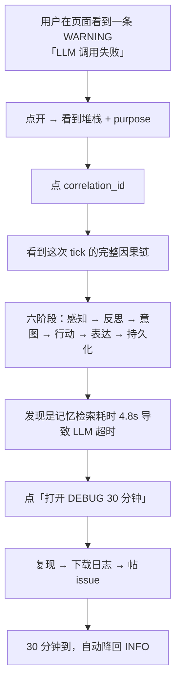
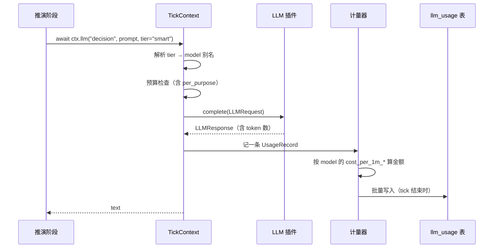
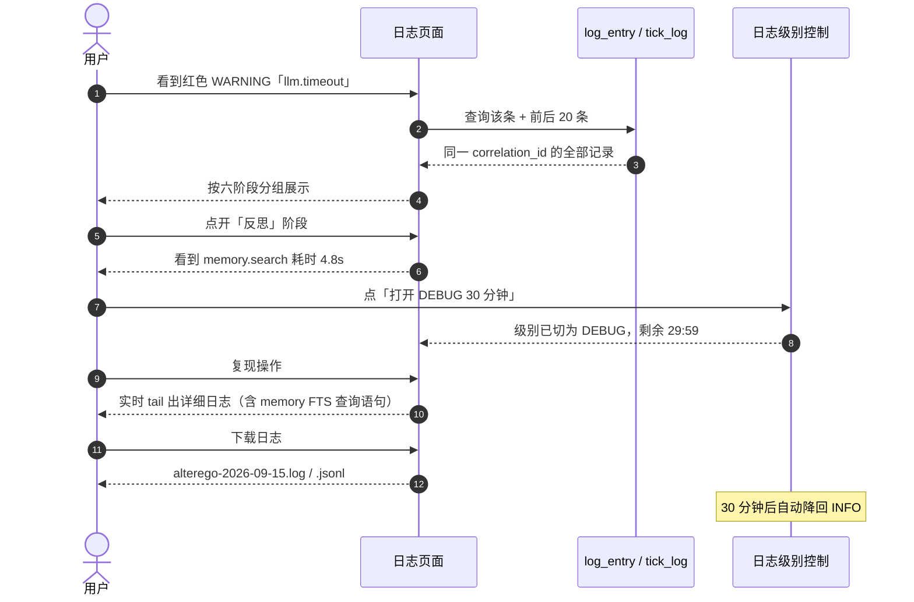

# 09 · 可观测性

> 上级文档：[DESIGN.md](../DESIGN.md) · 版本 v0.1.0
> 本文档描述 Token/成本统计页面与日志体系（含日志页面）。
> 这两件事放在一个分册里，因为它们的地基是同一个：**结构化、可串联的事件记录**。

---

## 目录

1. [目标与现状缺口](#1-目标与现状缺口)
2. [Token 与成本统计](#2-token-与成本统计)
3. [日志体系](#3-日志体系)
4. [排查闭环](#4-排查闭环)
5. [日志页面](#5-日志页面)
6. [统计页面](#6-统计页面)
7. [数据表](#7-数据表)
8. [配置参考](#8-配置参考)
9. [存储成本影响](#9-存储成本影响)
10. [变更记录](#变更记录)

---

## 1. 目标与现状缺口

### 1.1 用户的原话与它对应的设计问题

> 「还有词元(token)消耗页面统计」
> 「要有日志页面，要有详细的日志这样才能发现那里有问题」

这两句话指向同一个能力：**能看到它做了什么，以及在哪儿出错了**。现状缺口：

| 现状 | 缺口 |
| --- | --- |
| `llm_usage` 表已设计（20 张表之一） | 没有页面，没有 CLI 输出，没有预算联动视图 |
| `event_log` 表已设计 | **默认关闭**（`06-roadmap.md § 5.4`：0 行/天），且只记事件总线主题 |
| `kernel/logging.py` 有 `SecretFilter` / `JsonFormatter` | 只到 stderr/文件，不落库、不轮转、级别不可运行期调整 |
| `activity_log` / `tick_log` 记录推演 | 与日志、与 LLM 调用之间**没有共同的关联键** |

### 1.2 核心洞察：一切都要能串成一个 `correlation_id`

排查问题时最重要的能力不是「看到一条错误」，而是「从这条错误走到它发生的那一刻」。



**这条闭环是本文档的主要产出。** 没有它，日志页面只是一个滚动文本框。

因此设计上有一条硬要求：

> **所有可观测记录（`tick_log` / `activity_log` / `llm_usage` / `media_usage` /
> `source_query` / `event_log` / `log_entry`）都必须带 `correlation_id`，
> 且同一次推演内共享同一个值。**

`correlation_id` 已经在 `kernel/bus.py` 的事件里存在（`Event.correlation_id`），
只是下游表没统一使用。这是一次「补齐」而不是新增机制。

---

## 2. Token 与成本统计

### 2.1 计量在哪儿发生



**关键点：计量只在 `ctx.llm()` 一处发生。** 任何插件绕过 `ctx.llm()` 直接调 provider
都必须被架构检查拦住——见 § 3.5。

### 2.2 金额计算

```python
def estimate_cost(model_cfg: ModelConfig, prompt_tokens: int, completion_tokens: int) -> float:
    """按配置单价估算金额。

    单价来自 [llm.models.*]，不是内置价目表——价格是数据不是代码（ADR-0006）。
    单价为 0 时返回 0，统计页会标注「未配置单价，仅统计 token」。
    """
    return (
        prompt_tokens * model_cfg.cost_per_1m_input / 1_000_000
        + completion_tokens * model_cfg.cost_per_1m_output / 1_000_000
    )
```

**必须诚实标注**：未配置单价时显示「—」而不是「$0.00」。把未知显示成 0 会让用户
以为「不要钱」，从而关掉预算护栏。

### 2.3 统一成本视图

生图成本在 `media_usage`（见 [07-model-routing-and-media.md § 7](07-model-routing-and-media.md#7-成本计量)）。
成本聚合走视图 `v_cost_daily`，**定义在 [`03-data-model.md § 3.3`](03-data-model.md)**：

| 它的形状 | 为什么这样选 |
| --- | --- |
| 一次调用一行，不按天聚合 | 视图是**取数口**，不是成品报表。按天、按月、按用途、按 persona、按 provider——四种聚合方式里选一种写进视图，另外三种就得再开一个视图。原子行只有一种，无歧义 |
| 视图内固定 `WHERE success = 1` | 失败的调用不产生 `cost_usd`，混进去只会让「今天花了多少」这个数字变得需要解释。要算失败率、重试次数、P95 延迟的页面直接查 `llm_usage`，不走这个视图——**一个视图不必同时是报表和原始数据源** |
| 带 `persona_id` | 一个库里可以有多个 persona，而预算也是**按 persona 算**的 |
| `cost_kind` 区分 `llm` / `media` | 「生图是不是成了主要开销」是一级问题（§ 2.4 最后一行） |

### 2.4 统计维度

| 维度 | 说明 | 用途 |
| --- | --- | --- |
| 时间 | 小时 / 日 / 月 | 趋势、预算进度 |
| `purpose` | 10 个用途 | 「钱花在哪了」——最常用 |
| `tier` / `model` | 档位与具体模型 | 验证分层路由是否生效 |
| `provider_id` | 供应商 | 对比同一 prompt 在两家的表现 |
| 成功 / 失败 | `success` | 稳定性 |
| `retry_count` | 重试次数 | 供应商质量问题 |
| `latency_ms` | 延迟 | P50 / P95 |
| `cache_hit` | 命中缓存 | 缓存收益 |
| `cost_usd` | 金额 | 预算 |
| **成本构成** | `llm` vs `media` | 生图是否成为主要开销 |

### 2.5 「按当前速度会超」预测

统计页必须显示的三件事：

1. **今天已用 / 上限**（进度条）
2. **按当前速率，今天结束时预计 X 美元**（外推）
3. **当前降级状态**：正常 / `strong`→`cheap` 已生效 / 规则模式

第 3 条尤其重要。用户看到账单变高时会去查模型，但如果 Agent **已经因为超预算
悄悄切成了规则模式**，表现会明显变笨，而用户完全不知道原因。
把降级状态显式显示出来，这个「神秘变笨」的 bug 类就消失了。

### 2.6 CLI

```bash
alterego stats --cost                    # 今日 / 本月概览
alterego stats --tokens --by purpose     # 按用途
alterego stats --tokens --since 7d --by model
alterego stats --cost --json             # 机器可读
alterego budget status                   # 预算与降级状态
```

输出格式与文档示例逐字节一致（沿用 `M2` 的验收方式）。

---

## 3. 日志体系

### 3.1 结构化字段

每条日志记录（无论去文件还是去数据库）都携带：

| 字段 | 来源 | 必需 |
| --- | --- | --- |
| `level` | logging | ✅ |
| `logger` | logging（`alterego.sim.stages.reflect`） | ✅ |
| `message` | logging | ✅ |
| `module` / `function` / `line` | `record.pathname` 等 | ✅ |
| `plugin_id` | `PluginContext` 注入的 LoggerAdapter | 插件内 |
| `tick_id` | 上下文（`contextvars`） | 推演期间 |
| `correlation_id` | 上下文（`contextvars`） | 推演期间 |
| `exc_type` / `exc_text` | `record.exc_info` | 有异常时 |

> **为什么用 `contextvars` 而不是逐层传参**：日志发生在任意深度，
> 把 `tick_id` 一路传下去会污染每一个函数签名。`contextvars` 是 stdlib 的、
> 与 `asyncio` 天然兼容的机制（每个 task 有独立的 context）。
> **这不算「隐式状态」违反 P2**——它只影响日志的**附注字段**，不影响任何行为分支。

### 3.2 双写：文件与数据库

| 出口 | 内容 | 保留 | 理由 |
| --- | --- | --- | --- |
| **文件** | 全量，按天轮转 | `log_keep_days`（默认 14） | 全量留痕，报 bug 时能直接附上；不占数据库 |
| **数据库** | **仅 WARNING 及以上** | `log_db_keep_days`（默认 90） | 页面查询、关联 `tick_id`、长期趋势 |
| **SSE** | 实时推给日志页面 | 不存 | 实时 tail |

```toml
[log]
level = "INFO"
format = "console"               # console | json
file_enabled = true
file_dir = "logs"                # 相对 data_dir
rotate = "midnight"              # 每天一个新文件
keep_days = 14
db_enabled = true
db_min_level = "WARNING"         # 低于这个级别不进数据库
db_keep_days = 90
debug_auto_revert_minutes = 30   # 见 § 3.3
```

> **为什么数据库只存 WARNING+**：按 `06-roadmap.md § 5.4` 全部表加起来是 ~1.4 MB/天 ≈ 515 MB/年。
> 如果 INFO 全进数据库，日志一项就能把估算掀翻数倍。而 INFO 级日志的价值在于
> 「**出问题那一刻的上下文**」，那正是文件擅长的事——全量、顺序、可直接附给 issue。

### 3.3 运行期调整级别（带自毁保险）

```bash
alterego log level debug --for 30m
```

页面上的按钮等价于此。**两条保险**：

1. **必须指定时长**（或显式 `--forever`），到点自动降回配置值。
2. 自动降回时发一条 `INFO` 到控制台与日志页：「DEBUG 已自动关闭」。

> **为什么必须有保险**：用户开了 DEBUG 排查，修完忘了关，两周后磁盘满。
> 这是最典型的自伤，而阻止它的成本是一次 `call_later`。

级别调整本身**不写入配置文件**——它是临时的。要永久改就改配置。
这个区分必须在 UI 上写明，否则用户会以为改了永久生效。

### 3.4 密钥脱敏在所有出口

现有 `SecretFilter` 只在 console formatter 上挂载。必须改为**挂到 logger 上**：

```python
# 在每个出口前生效，而不是在某个 formatter 里
logger.addFilter(SecretFilter())
```

否则同一句话在文件里脱敏了、在数据库里没脱敏、在 SSE 里又脱敏了——
**三个出口三个样，而其中一个泄露密钥**。

例外：`event_log` 的 `payload_json` 走独立过滤（它是结构化数据，正则在 JSON 字符串上仍能生效）。

### 3.5 补齐架构红线

新增一条检查，防止绕过计量与脱敏：

| 检查 | 模式 | 位置 |
| --- | --- | --- |
| LLM 调用必须经 `ctx.llm()` | `\.complete\(` / `\.generate\(` 直接出现在 `sim/` 与 `domain/` | `sim/`、`domain/` |
| 不得自行构造日志 handler | `logging\.(FileHandler\|StreamHandler)\(` | `domain/`、`sim/`、`storage/` |

这条的意义：**计量与脱敏是「机制」，一旦允许绕道就退化成「祈祷」**（P3）。

---

## 4. 排查闭环

这是本文档的核心，其它部分都是为它服务。



**能做成这个闭环的前提**：

| 前提 | 对应设计 |
| --- | --- |
| 有共同的关联键 | § 1.2 的 `correlation_id` 要求 |
| 有详细上下文 | `tick_log` 已记录各阶段输入输出 |
| 能临时提高详细度 | § 3.3 的带保险级别调整 |
| 能导出 | § 5 的下载 |
| 不会忘记关 | § 3.3 的自动回落 |

每一项单独看都很普通，但**凑齐这五项**才能让「发现问题 → 定位 → 复现 → 上报」
变成一件不需要重启、不需要登服务器的事。

---

## 5. 日志页面

### 5.1 布局

```
┌─ 日志 ─────────────────────────────────────────────────────────┐
│ [实时 ●] [历史]    级别: [WARNING ▾]  模块: [全部 ▾]            │
│ 时间范围: [今天 ▾]  搜索: [____________]  □ 只看错误            │
│ [打开 DEBUG 30 分钟]  [下载日志 ▾]                              │
├────────────────────────────────────────────────────────────────┤
│ 15:42:03 WARN  sim.stages.reflect   llm.timeout                │
│           purpose=decision  model=deepseek-chat  4.82s         │
│           → correlation_id: a3f2…  [展开堆栈] [查看完整链路]     │
├────────────────────────────────────────────────────────────────┤
│ 15:42:07 WARN  capability.selfie     image.publish_skipped     │
│           原因=今天已发过 1 条动态                              │
└────────────────────────────────────────────────────────────────┘
```

### 5.2 能力

| 能力 | 说明 |
| --- | --- |
| 实时 tail | SSE，复用现有 `broadcast()`；自动滚动可暂停 |
| 历史查询 | 级别 / 模块 / 时间区间 / 关键字 / `plugin_id` / `tick_id` |
| 错误优先视图 | 只看 `ERROR`+ 或只看有堆栈的 |
| **完整链路** | 点 `correlation_id` → 跳转「一次推演的六个阶段」 |
| 导出 | `.log`（原文）或 `.jsonl`（结构化，便于脚本处理） |
| 级别控制 | 一键 DEBUG 30 分钟，带倒计时显示 |
| 折叠聚合 | 同一 `(logger, message 模板)` 连续出现时折叠计数，避免刷屏 |

> **折叠聚合为什么必须做**：Agent 常驻运行，某个 WARNING 每 5 分钟重复一次，
> 一天 288 条。不折叠的话页面在真实使用中毫无价值——用户第一次打开看到的是
> 满屏同样的行，然后就不再看它了。**而一个没人看的日志页面等于没有日志页面。**

### 5.3 与「内心」页的区别

两者都在讲「它做了什么」，但受众不同：

| 页面 | 问的问题 | 受众 |
| --- | --- | --- |
| **内心** | 它在想什么？为什么没发那条消息？ | 用户（拟人视角、自然语言） |
| **日志** | 它到底执行了什么？哪儿失败了？ | 用户（工程视角、结构化、含堆栈） |

**不要合并**。合并的结果是两边都不好用：拟人视角被堆栈淹没，工程视角被叙事文本拖累。

---

## 6. 统计页面

```
┌─ 统计 ─────────────────────────────────────────────────────────┐
│ 今天 $0.34 / $2.00  ▓▓▓░░░░░░░░░  17%        降级状态: 正常     │
│ 本月 $8.12 / $40.00 ▓▓░░░░░░░░░░  20%     预计月底: $11.6       │
│ ⚠ 按当前速率，今天预计 $0.41（未超限）                          │
├────────────────────────────────────────────────────────────────┤
│ Token 趋势（7 天折线）   │ 按用途分布（饼图）                    │
├──────────────────────────┴─────────────────────────────────────┤
│ 用途        调用    prompt  completion  金额      平均延迟  失败 │
│ decision     118     377k    35k        $0.14     1.9s      0   │
│ expression    92     221k    23k        $0.086    2.2s      1   │
│ reflection   384      69k    31k        $0.032    0.8s      0   │
│ npc           46      41k     6k        $0.014    0.7s      0   │
│ media(生图)    3          —       —      $0.120     8.4s      0   │
│ ───────────────────────────────────────────────────────────── │
│ 合计        643     708k    95k        $0.386            1     │
└────────────────────────────────────────────────────────────────┘
```

| 区块 | 内容 |
| --- | --- |
| 预算条 ×2 | 日 / 月进度 + 预计超限警告 + **降级状态徽章** |
| 趋势 | 7/30 天折线，可切 token / 金额 / 调用数 |
| 构成 | 按用途、按模型、按 provider 三种切分 |
| 明细表 | 可排序、可筛选、可导出 CSV |
| 异常 | 失败率、重试次数Top、P95 延迟 |
| 未定价提示 | 「有 2 个模型未配置单价，金额不完整」 |

---

## 7. 数据表

本分册需要**一张新表**（`log_entry`）与**三处补列**（`tick_log` / `activity_log` /
`llm_usage` 各自的 `correlation_id`）。

> **完整 DDL 不在本分册，在 [`03-data-model.md § 3.3`](03-data-model.md)。**
> 物理 schema 只能有一个出处。本分册早期版本里复制过一份 DDL，结果它与 03 分册
> 在列名（`occurred_at` vs `created_at`）、主键类型（`TEXT` vs `INTEGER`）、
> 索引名（`idx_log_corr` vs `idx_log_correlation`）上全都对不上。
> 复制一份 DDL 的代价不是多打几行字，而是从那一刻起存在两个「真相」——
> 而它们必然分叉。

下表回答的是另一个问题：**为什么这些列必须是它，而不是别的**。

| 本分册要求的列 / 索引 | 为什么必须是它 |
| --- | --- |
| `log_entry.tick_id` | 没有它，日志页无法回答「这次报错属于哪次推演」，只能靠时间戳猜 |
| `log_entry.correlation_id` | 链路视图 `v_trace` 的分组键（§ 4 的「完整链路」） |
| `log_entry.exc_text` | 含堆栈。**不落库就无法事后排查**——这正是它与 `event_log` 的关键区别 |
| `log_entry.extra_json` | 结构化字段，可被 `json_extract` 查询；也意味着它会过独立的正则脱敏（§ 6.2） |
| `log_entry.id` 用 `INTEGER PRIMARY KEY AUTOINCREMENT` | 日志表会被保留策略删行（§ 9）。普通 `INTEGER PRIMARY KEY` 会**复用**被删掉的行号，于是「昨天那条链结」会指向今天的新日志。`AUTOINCREMENT` 的代价是多一张 `sqlite_sequence` 表，代价到此为止 |
| `idx_log_correlation` | 按 correlation_id 一次性打开某次推演的全部日志 |
| `idx_llm_usage_correlation` / `idx_tick_log_correlation` / `idx_activity_log_correlation` | `v_trace` 的各条支路按它们筛 |

**只落 WARNING 及以上**：全量日志在 `logs/` 下的文件里（§ 5）。DB 里这一份
是给「页面能查、能按 tick 串联」用的，因此列比文件日志少，但关联键比它多。

### 7.1 `v_trace`：一个视图，不是汇总表

链路视图的定义同样在 [`03-data-model.md § 3.3`](03-data-model.md)。这里只记两条设计决定：

| 决定 | 理由 |
| --- | --- |
| 第一路取 `tick_log` 而不是 `event_log` | `event_log` 默认关闭（§ 7.2）。只有它是锚点时，时间线在默认配置下会一条 tick 记录都没有——而 tick 恰恰是整条链的起点 |
| `event_log` 那一路的 `tick_id` 是 `NULL` | `event_log` 没有 `tick_id` 列，也不该有：它的 `correlation_id` 已经唯一标识一次推演，再存一列等于把同一个值写两遍 |

**为什么用视图而不是汇总表**：汇总表要么有两个写入点（必然漂移，因为没人记得同时更新两处），
要么定期重算（于是预算检查会读到过期数据，而预算检查的全部意义就是「现在花超了吗」）。
视图每次读的都是真实数据，代价只是一次全表扫。

### 7.2 `event_log` 的定位调整

现状：默认关闭、只记事件总线主题。调整后：

| 项 | 现状 | 调整 |
| --- | --- | --- |
| 默认状态 | 关闭 | **保持关闭** |
| 与 `log_entry` 的关系 | 独立 | `event_log` 记**事件总线**（结构化、可回放）；`log_entry` 记 **logging 输出**（含堆栈、含第三方库）。**两者互补，不合并** |
| 何时开启 | 手动 | 调试复杂时序问题时开启；页面提供开关并**同样带自动关闭** |

> **为什么不合并**：事件总线日志可以**回放**（`payload_json` 是结构化数据），
> 它是「系统做了什么」的事实记录；而 logging 输出包含第三方库、含堆栈、
> 格式不稳定，**不可回放**。把它们混一张表，回放能力就没了。

---

## 8. 配置参考

```toml
[log]
level = "INFO"                    # DEBUG | INFO | WARNING | ERROR
format = "console"                # console | json
file_enabled = true
rotate = "midnight"
keep_days = 14
db_enabled = true
db_min_level = "WARNING"
db_keep_days = 90
debug_auto_revert_minutes = 30    # 0 = 不自动回落（不推荐）

[observability]
# 是否把 correlation_id 写进所有可观测表
correlation_enabled = true
# 页面实时 tail 的推送频率上限
tail_interval_ms = 400
# 日志页折叠相同消息
collapse_repeats = true
collapse_window_seconds = 60

[retention]
log_keep_days = 14
log_db_keep_days = 90

[stats]
# 统计页默认时间范围
default_range_days = 7
# 未配置单价的模型：显示「—」（true）还是按 0 计（false）
unknown_price_as_dash = true
```

---

## 9. 存储成本影响

在 `06-roadmap.md § 5.4` 的 ~1.4 MB/天 ≈ 515 MB/年 基础上：

| 新增项 | 每日行数 | 每日体积 | 每年 |
| --- | --- | --- | --- |
| `log_entry`（仅 WARNING+，假设 30 条/天） | 30 | ~30 KB | ~11 MB |
| `media_usage` | 3–8 | ~2 KB | ~0.7 MB |
| `source_item`（摘要，不存原文） | 20 | ~12 KB | ~4.4 MB |
| `source_feed` / `source_query` | 6 | ~2 KB | ~0.7 MB |
| `llm_usage` 新增列 | — | 忽略 | — |
| **合计新增** | | **~46 KB/天** | **~17 MB/年** |

**总量约 1.45 MB/天 ≈ 532 MB/年。** 仍然由 `tick_log` 主导（81%）。
因此 `06-roadmap.md § 5.4` 的优化手段（`tick_log_detail = "summary"` 降到 ~75 MB/年）
仍是唯一重要的一条。

> **如果哪天 `log_entry` 的体积开始显著增长，说明日志级别被长期留在 DEBUG**，
> 或者某个 WARNING 陷入了死循环。这时应该**修那个 bug**，而不是加保留策略。

---

## 变更记录

| 日期 | 版本 | 变更 | 作者 |
| --- | --- | --- | --- |
| 2026-09-15 | v0.1.0 | 初稿：`correlation_id` 贯穿要求、双写日志、带自毁保险的运行期级别调整、排查闭环、`log_entry`/`media_usage` 表、`v_cost_daily`/`v_trace` 视图 | LMG-arch |
