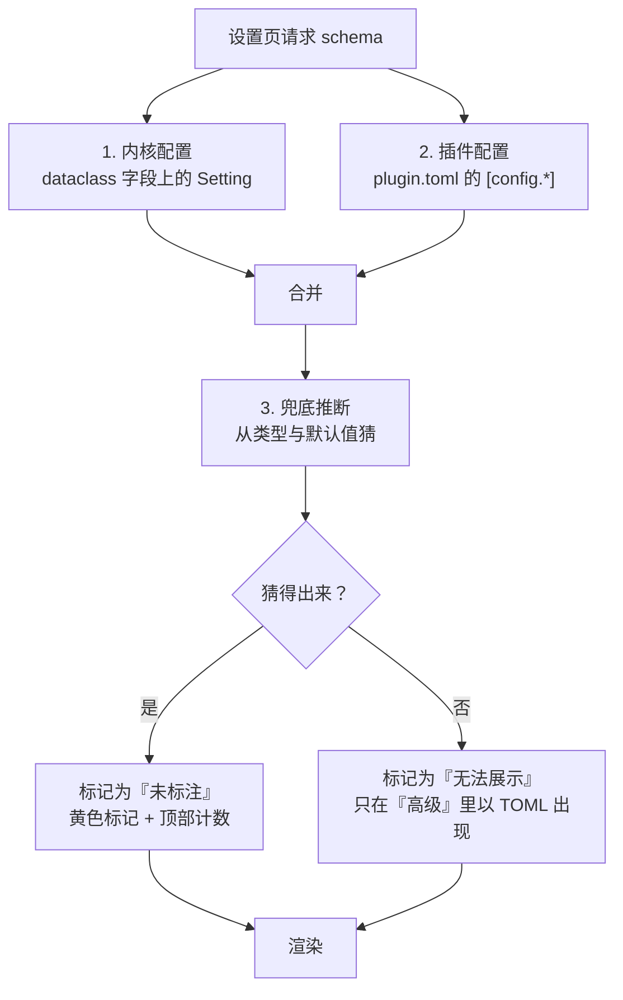
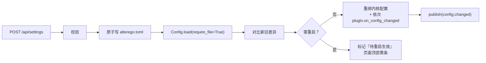

# 10 · 设置中心

> 上级文档：[DESIGN.md](../DESIGN.md) · 版本 v0.1.2
> 本文档描述「所有配置都能在 UI 里设置、且每个设置都有标注」的设计。

> ✅ **本文档描述的机制已经落地（v0.1.2，2026-09-16）。**
> 文中出现的文件名与符号名**就是代码里的名字**，可以直接照着写：
> `kernel/settings.py`（`Setting` / `SettingKind` / `Choice` / `infer_setting`）、
> `kernel/settings_catalog.py` + `settings_catalog_{agent,model,infra}.py`（95 条元数据 / 17 个段）、
> `kernel/settings_write.py`（文本级改写与原子写）、`cli_config.py`（`alterego config`）、
> `tests/test_settings_metadata.py`（三条强制标注的断言）。
> 依据：[`ADR-0010`](../adr/0010-every-setting-carries-display-metadata.md)。
> 本文档的 § 7「页面结构」还是规划：Web 设置页属于批次 C，`alterego config` 已经是实物。

---

## 目录

1. [真正的难点不是写入](#1-真正的难点不是写入)
2. [配置元数据](#2-配置元数据)
3. [元数据的三个来源](#3-元数据的三个来源)
4. [用测试强制标注](#4-用测试强制标注)
5. [写入策略](#5-写入策略)
6. [热生效与重启](#6-热生效与重启)
7. [页面结构](#7-页面结构)
8. [安全](#8-安全)
9. [CLI 侧的同一份元数据](#9-cli-侧的同一份元数据)
10. [配置参考](#10-配置参考)
11. [变更记录](#变更记录)

---

## 1. 真正的难点不是写入

「所有配置都能在 UI 里设置」听起来是个写入问题：读 TOML、改值、写回。这部分一天能做完。

真正的难点是**展示**。用户打开设置页，看到：

```toml
daily_message_limit = 3
on_exceed = "degrade"
temperature = 0.8
min_interval_minutes = 90
```

他会问四个问题，而配置文件一个都答不了：

| 用户的疑问 | 配置文件能否回答 |
| --- | --- |
| 这个 `3` 是「每天最多 3 条」还是「3 条以内最好」？ | ❌ |
| `degrade` 还有别的选项吗？各自什么后果？ | ❌ |
| `0.8` 算高还是低？调成 1.5 会怎样？ | ❌ |
| 我最多个小时收一条消息？这跟「每天 3 条」哪个先触发？ | ❌ |

**改错设置的代价比找不到设置高得多。** 一个用户把 `min_interval_minutes` 从 90 改成 5，
第二天收到 Agent 连续发来的 20 条消息，他会认为这个项目「坏了」——而其实是他自己改的。

所以设计目标不是「能改」，而是**改之前就知道会发生什么**。

---

## 2. 配置元数据

### 2.1 数据结构

```python
# alterego/kernel/settings.py

@dataclass(frozen=True, slots=True)
class Choice:
    """枚举值的一个选项。"""
    value: str
    label: str            # 中文短名：「降级但不停止」
    consequence: str      # 「超出预算后改用便宜模型，Agent 继续生活，只是变笨」


@dataclass(frozen=True, slots=True)
class Setting:
    """一个配置项的完整展示元数据。"""
    key: str                          # 点分路径："llm.routing.decision"
    label: str                        # 「意图决策用哪个模型」
    description: str                  # 这个设置**是什么**
    kind: SettingKind                 # bool|int|float|str|enum|duration|path|secret|list|mapping
    default: Any
    group: str = ""                   # 设置页分组：「模型」「打扰预算」
    choices: tuple[Choice, ...] = ()  # kind=enum 时必填
    minimum: float | None = None
    maximum: float | None = None
    unit: str = ""                    # 「分钟」「美元」「条」「张」
    effect: str = ""                  # **改了会发生什么**（与 description 不同的关键字段）
    depends_on: str = ""              # 例：「仅在 mode = fast 时生效」
    requires_restart: bool = False
    danger: bool = False              # 改错会让 Agent 行为异常
    advanced: bool = False            # 默认折叠
```

### 2.2 `description` 与 `effect` 的分工

这是整个设计里最重要的一处区分：

| 字段 | 回答的问题 | 例子 |
| --- | --- | --- |
| `description` | **这是什么** | 「每天主动给你发消息的次数上限（不含回复你的消息）」 |
| `effect` | **改了会怎样** | 「调高会让它更频繁地找你；设为 0 则它只在回复你时说话。」 |

只有 `description` 的页面是「说明书」，用户读完还是不知道该不该改。
带上 `effect` 才让用户能做决定。

**`effect` 必须是可验证的因果陈述，不是营销话术。** ❌「影响拟人程度」 ✅「设为 0 则它只在回复你时说话」。

### 2.3 与已有惯例对齐

`plugin.toml` 的 `[config.<key>]` 已经支持 `type` / `required` / `default` / `description` /
`secret` / `env` / `choices` / `min` / `max`（见 [02-plugin-api.md § 3.1](02-plugin-api.md#31-plugintoml-完整字段)），
`ConfigField` 也有 `describe()`。

**`Setting` 是它的超集，且两者共用渲染器。** 内核配置与插件配置在设置页里**长得一样、行为一样**——
用户不需要知道「这个键属于内核还是插件」这种实现细节（P2 的另一种表达：
不要把内部结构泄露给用户）。

---

## 3. 元数据的三个来源



| 来源 | 覆盖 | 质量 |
| --- | --- | --- |
| 内核 `Setting` 元数据 | 全部 `[core]` / `[llm]` / `[media]` / `[sources]` / `[log]` 等 | 完整（含 `effect`） |
| 插件 `plugin.toml` | 所有插件的 `[config.*]` | 有 `description`，无 `effect`（可补） |
| 兜底推断 | 用户自加的、未声明的键 | 只显示值，标注「未标注」 |

**第三层必须存在**：用户会在 `alterego.toml` 里手写自己的插件配置。如果设置页
遇到未知键就报错或静默忽略，用户会觉得「我的配置丢了」。

---

## 4. 用测试强制标注

「每个设置都做好标注」如果只靠自觉，三个月后一定腐烂。所以变成**机制**（P3）：

```python
# tests/test_settings_metadata.py

def test_every_config_field_has_metadata() -> None:
    """每个内核配置字段都必须有 Setting 元数据，否则设置页会出现无法解释的项。"""
    missing = []
    for cls in CONFIG_DATACLASSES:            # CoreConfig, LLMConfig, MediaConfig, ...
        for f in dataclasses.fields(cls):
            if not get_setting_metadata(cls, f.name):
                missing.append(f"{cls.__name__}.{f.name}")
    assert not missing, f"以下配置项缺少展示元数据：{missing}"


def test_every_effect_is_a_sentence() -> None:
    """effect 必须是可验证的因果陈述，不是空话。"""
    for s in all_settings():
        assert len(s.effect) >= 8, f"{s.key} 的 effect 太短，等于没说"
        assert not any(w in s.effect for w in ("可能", "大概", "也许")), \
            f"{s.key} 的 effect 是模糊表述，用户无法据此做决定"


def test_every_enum_choice_explains_its_consequence() -> None:
    for s in all_settings():
        if s.kind is SettingKind.ENUM:
            assert s.choices, f"{s.key} 是枚举但没有选项说明"
            for c in s.choices:
                assert c.consequence, f"{s.key} 的选项 {c.value} 没有说明后果"
```

三条断言各自挡住一类腐烂：

| 断言 | 挡住什么 |
| --- | --- |
| 有元数据 | 新增配置项后设置页出现「未知项」 |
| `effect` 非空话 | 「影响拟人程度」这类没有信息量的标注 |
| 枚举有后果说明 | 下拉框里一排看不懂的英文值 |

> **`test_every_config_field_has_metadata` 是这套设计的心脏。**
> 它把「用户能不能看懂」从主观问题变成 CI 能拦下来的客观失败。
> 没有它，本分册的其他部分都是优秀的构想；有了它，是本项目真实遵守的规则。

对应 ADR：[0010-every-setting-carries-display-metadata.md](../adr/0010-every-setting-carries-display-metadata.md)

---

## 5. 写入策略

### 5.1 权限分级

| 类别 | 能否在 UI 改 | 显示方式 |
| --- | --- | --- |
| 普通配置项 | ✅ | 正常控件 |
| 枚举项 | ✅ | 下拉 + 每个选项的后果说明 |
| **密钥项**（`secret = true`） | ❌ | 只读：「来自环境变量 `DEEPSEEK_API_KEY` — 已设置 ✓」 |
| 路径类（`data_dir`） | ✅ 但标为 `danger` | 带二次确认 + 提示「改这个会让 Agent 找不到已有数据」 |
| 运行期状态（当前日志级别） | ✅（走单独通道） | 标「临时生效，重启后恢复」 |
| 只读派生项（`database_path`） | ❌ | 灰色显示，附推导来源 |

### 5.2 为什么密钥不写进配置文件

| 理由 | 说明 |
| --- | --- |
| 现有隔离 | `config/secrets.env` 已被 `.gitignore`，而 `alterego.toml` **是要提交的**（`templates/alterego.toml` 就是给人抄的） |
| 泄露面 | 浏览器提交密钥 = 密钥进入请求体、进入可能的访问日志、进入内存快照 |
| 运维习惯 | 容器部署时密钥本来就是环境变量注入的，UI 写入反而制造第二真源 |

所以界面上显示的是**状态而非值**：

```
DEEPSEEK_API_KEY          [环境变量]  已设置 ✓     上次检测: 3 分钟前
ALterego_LLM_BASE_URL     [环境变量（可选）]  未设置 — 将使用默认值
```

用户看到「未设置」就知道该去配什么了，**这正是他本来想问的问题**。

### 5.3 原子写入

```python
def save_config(path: Path, data: Mapping[str, Any]) -> None:
    """原子写配置。

    直接 open(path, "w") 然后写，在中途崩溃/断电/被 kill 时会留下半截文件，
    而半截 TOML 会让下次启动直接失败——用户会以为是自己改设置改坏了项目。

    流程：写同目录临时文件 → fsync → os.replace()（原子）→ 保留 .bak
    """
```

| 步骤 | 为什么 |
| --- | --- |
| 写同目录的临时文件 | 跨文件系统的 `os.replace` 不是原子的 |
| `flush()` + `os.fsync()` | 不 fsync 时，`replace` 成功但内容还在页缓存，断电会丢 |
| `os.replace()` | POSIX 与 Windows 上都是原子的（同目录） |
| 保留 `alterego.toml.bak` | 用户改坏后能一键恢复；页面提供「恢复上一次」按钮 |

### 5.4 写入前校验

用**和加载时完全相同的**校验器（同一个 dataclass 的 `__post_init__`）：

```python
def validate_before_save(new_value: Any, setting: Setting) -> None:
    """校验失败就拒绝并给出人话原因，绝不写一个会让下次启动失败的值。"""
```

| 校验 | 失败提示 |
| --- | --- |
| 类型 | 「需要整数，你填了 abc」 |
| 范围 | 「`max_calls_per_day` 不能小于 1；你想设为 0 的话，请用 `on_exceed = "stop"` 来停止调用」 |
| 枚举 | 「`on_exceed` 只能是 degrade / stop / warn」 |
| 互斥 | 「`min_interval_minutes` (90) 不能大于 `quiet_hours` 的长度」 |
| 路径可达 | 「`data_dir` 指向的目录不存在，且父目录不可写」 |

**失败提示要给出「你大概想做的是 X」**——只报「值非法」会让用户卡在原地。

---

## 6. 热生效与重启

| 类别 | 生效方式 | UI 标记 |
| --- | --- | --- |
| 日志级别 | 立即 | `立即生效` |
| 打扰预算数值 | 立即（下一次预算检查） | `立即生效` |
| LLM 路由与模型 | 立即（下一次调用） | `立即生效` |
| 渠道开关 | 立即 | `立即生效` |
| 检索开关与兴趣 | 立即 | `立即生效` |
| 生图 provider | 立即 | `立即生效` |
| **`data_dir`** | 重启 | `⚠ 需重启` |
| **`storage.backend`** | 重启 | `⚠ 需重启` |
| **`[plugins] enabled`** | 重启（或走插件的重载通道） | `⚠ 需重启` |
| **`host` / `port`** | 重启 | `⚠ 需重启` |
| **`random_seed`** | 重启 | `⚠ 需重启` |
| **`simulation.mode`** | 重启 | `⚠ 需重启` |

热生效的实现路径：



> **`Config.load()` 重新加载而不是原地改**：原地改会绕过 `_collapse_extras()` 与
> `__post_init__` 校验，是「假生效」——页面显示改了，实际运行时还是旧值。
> 重新加载保证「界面显示的就是运行时用的」，这条一致性比省一次解析重要得多。

**「待重启生效」必须显式显示。** 否则用户改了 `data_dir`，页面显示成功，
重启后发现数据目录没变——这种「我明明改了」的困惑最消耗信任。

---

## 7. 页面结构

```
┌─ 设置 ───────────────────────────────────────────────────────┐
│ 常规│模拟│预算│模型│生图│信息源│渠道│存储│安全│插件│高级        │
├──────────────────────────────────────────────────────────────┤
│ ⚠ 有 2 项改动需要重启才生效               [查看] [立即重启]    │
├──────────────────────────────────────────────────────────────┤
│ 打扰预算                                                      │
│                                                              │
│ 每天主动发消息次数上限                    [ 3 ]  条           │
│   每天主动给你发消息的次数（不含回复你的消息）。              │
│   调高会让它更频繁地找你；设为 0 则它只在回复你时说话。        │
│                                               [恢复默认: 3]   │
│                                                              │
│ 超出预算时怎么办                        [降级但不停止 ▾]      │
│   超出预算后改用便宜模型，Agent 继续生活，只是变笨。← 选项说明 │
│   选项：降级但不停止 / 完全停止 / 只警告                       │
│                                                              │
│ 两条消息最小间隔                          [ 90 ]  分钟        │
│   两次主动发消息之间的最短间隔，与上面的每日上限共同生效，     │
│   实际频率取两者中更严格的那个。                    ⚠          │
└──────────────────────────────────────────────────────────────┘
```

| 分组 | 内容 |
| --- | --- |
| 常规 | 时区、语言、数据目录、日志级别、随机种子 |
| 模拟 | 模式、tick 间隔、速度倍率、NPC 开关 |
| 预算 | 打扰预算、成本预算、生图上限、降级策略 |
| 模型 | provider 列表、模型别名、**每个用途的绑定**（10 个下拉） |
| 生图 | provider、是否压缩、每日张数、槽位候选池、定妆照管理 |
| 信息源 | 搜索 provider、RSS 列表、兴趣权重、每日检索上限 |
| 渠道 | 各渠道开关、路由规则、免打扰时段 |
| 存储 | 保留天数、自动 vacuum、备份、导出 |
| 学习 | 学什么方向、一次学几格、聊天时召回几篇、算不算「聊到专业了」的门槛 |
| 安全 | 认证模式、密钥状态（只读）、限流 |
| 插件 | 已装插件、启用状态、每插件的 `[config.*]`（同一渲染器） |
| 高级 | 直接编辑完整 TOML（带校验 + 差异预览 + 恢复） |

### 7.1 「高级」页不该被藏起来

有些用户就是想直接改 TOML。**给他一个带校验的编辑器，比让他去 `vim` 里改然后用
重启失败来发现写错了要好得多。** 差异预览 + 恢复按钮让这条路不比改文件更危险。

### 7.2 模型分组页面的特殊设计

「模型」页要处理一个真实痛点：**用户不知道自己改了哪里**。所以除了一般的键值编辑，
还要有一个**矩阵视图**：

```
用途            当前绑定        模型              供应商      预计日成本
intention  →   smart          deepseek-chat     deepseek      $0.14
expression →   smart          deepseek-chat     deepseek      $0.09
reflection →   cheap          qwen2.5:7b        local         $0.00
...
                                                   合计      ~$0.25 / 天
```

这个视图的价值：用户想省钱时，一眼看到「把 `intention` 换成 `cheap` 省 $0.14/天」。
**把「改哪里」变成「看得到」的问题**，而不是让他读文档反推。

### 7.3 「学习」分组必须把 `rounds` 讲清楚

`[study]` 四个键里，`field` / `recall_limit` / `min_score` 看名字就懂，
只有 `rounds` 会骗人：它叫 `rounds`，但它数的是**格**不是**轮**
（一轮 = 五格：是什么 / 怎么做 / 容易踩的坑 / 和什么容易混 / 我还不服的）。

**字段名写错了，就在界面上把它补对。** 这一项的 `label` 不能只写
「学几轮」——正确写法是「一次学几格」，而 `effect` 要写成
「调高后一次跑好几次模型调用，单次耗时长且花钱多；学到的东西不会更差，
只是同一批内容挤在一次里写完，看不出它是隔了几天才想明白的」。

`field` 那一项还有个额外要求：**它必须能留空，而且留空是有意义的。**
留空表示「从人设的 `occupation` 认」——认不出来就**不学**，
而不是随便挑一个方向先去学。所以设置页应该在它旁边显示
「现在认出来的是：数据与算法」，否则用户会以为这个键没生效。

---

## 8. 安全

| 项 | 措施 |
| --- | --- |
| 认证 | 设置页与其他页面一样需要认证（[05-channels.md § 11.2](05-channels.md)） |
| CSRF | 所有写操作要求 `X-Requested-With: XMLHttpRequest` + 同源校验 |
| 密钥 | 永不回显，永不写入配置文件；`to_dict(redact=True)` 已是默认 |
| 路径穿越 | `data_dir` 等路径在服务端规范化后校验；不接受 `..` |
| 越权 | 设置 API 只存在于 Web 渠道，IM 渠道无法触发 |
| 审计 | 每次设置变更写一条 `INFO` 日志（含键名与新值，**密钥类不含值**）+ 发 `config.changed` 事件 |
| 危险项 | `data_dir` / `random_seed` / `simulation.mode` 标 `danger`，需二次确认 |

> **审计为什么要记**：用户改了设置两周后觉得 Agent 行为不对，
> 第一件事就是想知道「我改过什么」。有这条日志就能答，没有就只剩猜。

---

## 9. CLI 侧的同一份元数据

设置中心不是只有 Web。CLI 用**同一份 `Setting` 元数据**：

```bash
alterego config show                      # 按分组列出，带 description
alterego config show llm                  # 只看某组
alterego config explain llm.routing.decision
#   意图决策用哪个模型
#   在 10 个候选意图里选出这一个 tick 要做的事，质量最影响拟人感。
#   改了会怎样：换更强的模型会让选择更连贯，但成本上升约 3 倍。
#   当前值：smart（deepseek/deepseek-chat）  默认值：smart
alterego config set llm.routing.decision cheap
alterego config get llm.routing.decision
alterego config schema --json             # 机器可读，供补全脚本使用
```

> **为什么 CLI 要复用元数据**：如果 CLI 与 Web 各写一份说明，
> 两份会在一周内开始不一致，而用户会读到过时的那一份。
> **一个真源，多处渲染**——这是 P7「文档与代码同生共死」在配置层面的应用。

---

## 10. 配置参考

设置中心自身也是可配置的（自举，但保守）：

```toml
[settings]
# 设置页默认是否显示「高级」分组
show_advanced = false
# 是否在改动后自动备份 config/alterego.toml
auto_backup = true
# 保底推断出的「未标注」项是否显示
show_unannotated = true
# 保存前预览差异
confirm_diff = true
```

---

## 变更记录

| 日期 | 版本 | 变更 | 作者 |
| --- | --- | --- | --- |
| 2026-09-15 | v0.1.0 | 初稿：`Setting` 元数据与 `effect` 字段、三条元数据来源、元数据强制测试、原子写入与热生效分级、设置页 11 个分组 | LMG-arch |
| 2026-09-16 | v0.1.1 | § 7 分组表补「学习」（`[study]` 四个键）；新增 § 7.3：`rounds` 数的是**格**不是轮，字段名写错了就要在界面上补对，且 `field` 留空是有意义的 | LMG-arch |
| 2026-09-16 | v0.1.2 | **机制落地**：`kernel/settings.py`（`Setting` / `Choice` / `SettingKind` / `infer_setting`）、`settings_catalog{,_agent,_model,_infra}.py`（95 条元数据 / 17 个段）、`settings_write.py`（文本级改写 + 原子写 + 写前用同一个校验器加载一遍）、`cli_config.py`（`alterego config {show,explain,get,set,schema}`）、`test_settings_metadata.py`（三条强制标注断言）；`[settings]` 段写进 `templates/alterego.toml`。§ 7 的 Web 页仍属批次 C | LMG-arch |
