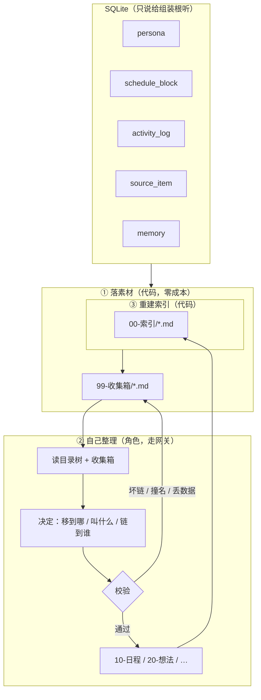

# 批次 7 · Obsidian 知识库

> 需求原文：「写一个插件使用 obsidian 进行搭建自己的知识库让角色自己写和搭建，
> 名字就是角色名字 + 知识库，把每日日程，自己搜集的信息等条理清晰的写好，搭建好」

## 1. 这一批要解决什么

前面六个批次把「它在想什么」做完了：推演循环、记忆、情绪、节日、生日、记忆梳理。
这些东西**只存在数据库里**——用户看不到，`sqlite3` 之外没法读。

这一批给它一个**属于它自己的地方**：一个能被 Obsidian 打开的知识库，
里面是它自己写的日程、它搜集到的东西、它记下的事。

和「导出功能」的区别：导出是一次性的、静态的；知识库是**它自己维护的**。
它每天往里写，也会自己回头整理——这正是需求里「让角色自己写和搭建」的意思。

## 2. 三个决定

### 2.1 为什么是 Obsidian

Obsidian 的库**就是一个文件夹**：一堆 `.md` 加上一个 `.obsidian/` 配置目录。

| 好处 | 说明 |
| --- | --- |
| **零新依赖（P5）** | 不需要任何库。写文件用 `pathlib`，写 frontmatter 用字符串拼接 |
| **它自己也能读** | 角色整理时，读自己的库就是读文件夹——不需要 Obsidian 参与 |
| **用户随时能接管** | 用记事本、VS Code、GitHub 都能读。库不是黑盒 |
| **`[[双链]]` 是真的** | 它能把「今天和阿哲聊了搬家」链到「阿哲」和「搬家」上，图上就长出了关系 |

反过来说：**不引入 `python-frontmatter`、`pyyaml`、`markdown`**。
frontmatter 是最简单的一种 YAML 子集（`key: value` 加列表），手写解析器四十行够了，
而多一个必需依赖是不可逆的（`AGENTS.md` § 9）。

### 2.2 为什么是 `capability`，不是 `tool`

`docs/design/02-plugin-api.md` § 2.1 把 `tool` 定义成「**模型可以主动调用的事情**」——
它会进 function calling 列表。写知识库如果做成 `tool`，模型就能在任何一次对话里
说「我要写笔记」然后**绕过打扰预算与成本闸门**。那是 P3 明令禁止的。

`capability` 不一样：它由推演循环决定何时执行，走正常的意图选择与预算流程。
「它今天想整理一下笔记」是一个**意图**，不是一个工具调用。

> ⚠️ 实现现状：`kernel/manifest.py` 的 `PluginKind` 目前只有
> `llm | storage | channel | capability | stage | tool` 六种，文档 § 2 的八行表格是
> 目标形状（`image` / `source` 尚未落地）。本批次用 `capability`，在六种之内。

### 2.3 「角色自己搭建」到什么程度

这是本批次最要紧的取舍。三种做法：

| 做法 | 结果 |
| --- | --- |
| 结构全由代码固定 | 稳、免费、可复现。但每个角色的库长得一模一样——谈不上「它自己搭的」 |
| 全交给模型 | 最自由。但会写出指向不存在文件的坏链、反复重建目录、丢数据 |
| **代码管骨架，角色管分类** | ✅ 采用 |

具体分工：

| 谁 | 管什么 | 为什么 |
| --- | --- | --- |
| **代码** | 目录骨架、frontmatter 字段、索引页、**坏链检查**、原子写入 | 「条理清晰」是**可验证的不变量**，不该指望提示词祈祷（P3） |
| **角色（LLM）** | 这条素材归到哪个目录、叫什么名字、打什么标签、和哪些笔记互链 | 这才是「它自己的想法」。林晚把「和阿哲聊搬家」放进「见过的人」，换个角色可能放进「最近的烦心事」 |

于是知识库会**长成它自己的样子**，而不会长成坏链和垃圾目录。

## 3. 数据流



**三段的顺序不能换**。索引放在最后，是因为它必须从**实际存在的文件**推导——
让模型写索引，它就会写出指向不存在文件的那一行。

`①` 和 `③` **永远不失败、永远免费**。`②` 是可选的、可关的、可干跑的。
所以哪怕模型不可用，知识库照样能在那儿，只是停在「收集箱还没整理」的状态。

## 4. 库的样子

```
exports/林晚的知识库/
├── .obsidian/                    ← 让 Obsidian 一打开就是配好的样子
│   ├── app.json
│   └── core-plugins.json
├── 00-索引/                       ← 全部由代码生成
│   ├── 林晚的知识库.md            ← 总索引（图谱的入口）
│   ├── 日程.md
│   ├── 想法.md
│   ├── 读到的.md
│   ├── 记得的事.md
│   └── 见过的人.md
├── 10-日程/
│   └── 2026-09/2026-09-16.md     ← 计划 + 实际做了什么 + 当时的心里话
├── 20-想法/                       ← inner_voice：想说但没说出口的那些
├── 30-读到的/                     ← 搜集到的信息，带原始链接
├── 40-记得的事/                   ← 记忆
├── 50-见过的人/                   ← NPC
└── 99-收集箱/                     ← 刚落下来、还没整理
```

目录名带两位数前缀，是为了让 Obsidian 的文件树**永远按这个顺序排**。
不靠 Obsidian 的排序设置，不靠用户手动调——文件系统层面就是对的。

### 一篇笔记长什么样

```markdown
---
title: 怕麻烦别人
type: 想法
created: 2026-09-16T21:40:00+08:00
tags:
  - 性格
  - 自我觉察
---

# 怕麻烦别人

今天阿哲说要帮我搬，我下意识说了「不用不用」。

说完就后悔了。

## 相关

- [[2026-09-16]]
- [[阿哲]]
```

frontmatter 四件套固定：`title` / `type` / `created` / `tags`。
`created` 用**虚拟时间**（`ctx.now()`），不是墙上时间——否则复盘时对不上（P6）。

## 5. 四条不变量（由 `domain/vault.py` 保证）

1. **每个 `.md` 都有合法 frontmatter**，含 `title` / `type` / `created` / `tags`
2. **每个 `[[链接]]` 都指向存在的文件**——这是最要紧的一条，坏链比没链更糟
3. **每篇笔记都被至少一个索引页覆盖**（没有孤儿）
4. **索引页从实际文件推导**，不是从数据库推导，也不是模型编的

整理失败时**整批不执行**，素材留在收集箱。理由和记忆梳理一样：
留下半批会让下一次的输入里混着不知道真假的中间态（`docs/plans/2026-09-15-memory-consolidation.md` § 4）。

## 6. 接进来的东西

| 从哪来 | 进哪个目录 | 谁渲染 |
| --- | --- | --- |
| `schedule_block` | `10-日程/YYYY-MM/YYYY-MM-DD.md` | 代码（表格） |
| `activity_log` | 并进当天的日记；有 `inner_voice` 的进 `20-想法/` | 代码（列表） |
| `source_item` | `30-读到的/` | 代码（链接 + 摘要） |
| `memory` | `40-记得的事/` | 代码 |
| `persona` | `00-索引/<角色名>的知识库.md` 的开头 | 代码 |
| NPC | `50-见过的人/` | 代码（骨架）+ 角色（补内容） |

`inner_voice` 单独成篇而不是塞进日记：一个人记住的常常是自己当时怎么想，
而不是自己当时做了什么。这一条在 `sim/consolidation.py` 里已经用过一次了
（`_format_activities` 把 `inner_voice` 单独一行），这里沿用。

## 7. 幂等

同一份数据跑两次，不能长出两份笔记。

| 层 | 怎么判重 |
| --- | --- |
| 素材渲染 | 目标文件名由**数据本身**决定（`2026-09-16.md`、`<url_hash>.md`）。存在就覆盖 |
| 角色整理 | 走一个 `00-索引/.vault-state.json`——记「哪些收集箱文件已经处理过」 |
| 索引重建 | 每次都全量重写。索引是派生数据，不做增量 |

`.vault-state.json` 用点号开头，Obsidian **不显示**以 `.` 开头的文件，不会污染用户的库。
放在 `00-索引/` 下而不是库根目录，是为了让「库根目录只放 Obsidian 认识的东西」。

> **不新增数据库迁移**。状态是插件/CLI 侧的事，不该往用户的库里塞
> 专属于某一个插件的表（P1 的反面：内核不该知道 Obsidian 存在）。
> 代价是删掉 `.vault-state.json` 会让它重整理一遍——那是可恢复的，可以接受。

## 8. 落地的文件

| 文件 | 做什么 |
| --- | --- |
| `src/alterego/domain/knowledge.py` | **新增**。笔记语法：`Note`、frontmatter 读写、`[[链接]]` 解析、文件名转义 |
| `src/alterego/domain/vault.py` | **新增**。库结构：布局、渲染、索引生成、四条不变量的校验 |
| `src/alterego/interfaces/repository.py` | 加 `ScheduleRepository` / `SourceRepository` / `PersonaRepository` 契约，并给 `ActivityRepository` 加 `list_range` |
| `src/alterego/storage/sqlite/repositories.py` | 实现上面三个 |
| `src/alterego/sim/vault.py` | **新增**。`VaultWorkbench` 编排 + `init_vault` / `sync` / `organize` / `build` / `scan` |
| `src/alterego/prompts/vault_organize.md` | **新增**。让它自己决定归类与互链 |
| `src/alterego/cli_vault.py` | **新增**。`alterego vault {init,sync,organize,build,status}` |
| `plugins/obsidian_vault/` | **新增**。插件壳：注册 capability、健康检查、订阅事件 |
| `tests/test_domain_knowledge.py` 等 | 测试 |

### 插件为什么这么薄

`cli_vault.py` 是**组装根**（架构红线第 3 组明确允许它引用具体存储实现），
它和插件**共用 `sim/vault.py` 这一条编排路径**。

插件壳只做三件事：把 `Capability` 注册进 `ctx.registry`、答 `health()` 与 `describe()`、
在配置热更新时重新读一遍路径。**不含任何业务逻辑**——
两套实现迟早会不一致。

它**不订阅任何事件**、也不声明 `intent_types`：库的同步与整理由 `alterego vault`
显式驱动。要花钱的那一步尤具不该在 tick 里自动发生（§ 11）。

### 命令

```
alterego vault init                    新建库骨架，建好 .obsidian 和索引
alterego vault sync [--lookback-days]  数据库 → 笔记，然后重建索引（代码渲染，免费）
alterego vault organize [--dry-run]    角色整理收集箱（走网关，要钱），然后重建索引
alterego vault build                   手改过文件之后，重算索引并校验
alterego vault status                  库在哪、多少笔记、有没有坏链
```

`sync` 与 `organize` **分开**是有意的：前者免费且永远安全，后者要花钱且会动文件。
合在一起会让「我只想看看今天写了什么」也变成一次计费调用。

## 9. 不在本批次范围内

| 不做 | 为什么 |
| --- | --- |
| Obsidian 插件（`.js`） | 库是纯 Markdown，不需要 Obsidian 扩展就能用 |
| Dataview / Canvas | 要用户另外装社区插件。宁可代码生成索引页，不赌用户环境 |
| 双向同步（改库 → 改库） | 用户手改笔记后回写数据库，涉及冲突解决，是另一个批次的事 |
| 图片附件 | 生图能力成熟后再说。`90-附件/` 目录先留着 |
| 新增数据库表 | 见 § 7 |

## 10. 怎么验证

```bash
python -m ruff format src tests plugins
python -m ruff check src tests plugins
python -m mypy src/alterego
python -m pytest tests -q
bash scripts/check_architecture.sh      # ← 第 6 组会扫 plugins/，确认插件之间不互相 import
python -m pytest tests -q --cov=alterego
```

外加**手工跑一遍**（前十三轮里这已经查出十个绿灯盖不住的问题）：

```bash
python -m alterego.cli vault init
python -m alterego.cli vault sync
python -m alterego.cli vault status
python -m alterego.cli vault organize --dry-run
```

然后**真的用 Obsidian 打开一次**，确认图谱上有节点、双链能跳。

## 11. 落地结果

六道门禁全绿：`ruff format` / `ruff check` / `mypy`（59 个源文件）/
`pytest`（1836 passed, 1 skipped）/ `check_architecture.sh`（23 项）/ 覆盖率 **96.65%**
（`domain/vault.py` 100%、`sim/vault.py` 94.99%）。

### 与计划的偏离

| 计划里写的 | 实际做的 | 为什么 |
| --- | --- | --- |
| `alterego vault open` | **不做了** | `vault status` 的首行就是库路径，再给一条命令只是多一种「路径记在哪」的记法 |
| 插件在 `on_tick_post` 时决定要不要同步 | 插件**不订阅任何事件** | 整理要花钱。挂在 tick 上意味着花多少由 tick 频率决定，而用户看不见 |
| 落地文件表里有一行 `storage.sqlite` 插件壳 | **不做** | 存储是启动时就装配好的东西，做成插件只会让「谁是组装根」变模糊 |
| 新表 / 新迁移 | 一条都没有 | 幂等靠 `00-索引/.vault-state.json`，见 § 7 |

### 手工跑出来的四个问题

前十三轮里手工验证已经查出十个绿灯盖不住的问题，这一批又四个：

1. **`sync` 从不重建索引**。模块头、命令表、CLI 帮助**三处**都写着「然后重建索引」，
   代码里没有。`init` 完 `sync` 一次，用户看到的是几张空索引页和旁边一整个满的
   `10-日程/`——那看起来像同步失败了。
2. **用量账本挂在只读连接上**。SQLite 只在日志里留一句
   `attempt to write a readonly database`，而命令照样打印「账记在 llm_usage 表」
   ——花掉的钱没记账，还告诉用户记了。现在花钱那一步单开一条可写连接，
   并且有一条测试直接查 `llm_usage.purpose`。
3. **日程页链接到会被改名的收集箱笔记**。`sync` 写 `[[今天的雨不太像秋天-act-0]]`，
   `organize` 归位时把它改名成 `我自己起的名字.md`，于是**每整理一次就在日程里
   留几条坏链**（沙箱实测：`status` 报 3 处问题）。现在日程页只写
   `- 09:40 今天的雨不太像秋天`。想通了：**日程页是派生的，它引用的名字却由
   另一步决定，这个链接本来就不该存在。**
4. **错误路径上漏关数据库连接**。`_prepare()` 在「没有这个名字的人设」
   「有多个人设」两条路径上把已经打开的连接丢给了垃圾回收。
   `filterwarnings = ["error"]` 会把它记成某个**无关测试**的失败——实测中
   `test_several_personas_need_a_name` 与 `test_the_error_is_not_printed_twice`
   交替变红，而单跑又都是绿的。

> 第 4 条最值得记：**一个测试单独跑是绿的、跟别人一起跑是红的，先怀疑共享状态与
> 资源泄漏，而不是怀疑测试顺序。** 这一批里「飘忽的失败」全部出自同一个
> 没关的 `sqlite3.Connection`。

### 沙箱实测

```
$ alterego vault init && alterego vault sync && alterego vault status
  10-日程    1 篇
  20-想法    3 篇
  30-读到的    0 篇
  40-记得的事    0 篇
  50-见过的人    0 篇

索引      6 个
收集箱    3 篇
问题      0 处

$ alterego vault organize          # 假供应商，一次回 3 条决定
归位      3 篇
问题      0 处

$ SELECT purpose, provider_id, model FROM llm_usage
('vault', 'openai_compatible', 'm1')     # ← 账真的记上了
```

落盘结果：`.obsidian/` 两个文件、`00-索引/` 六张索引页、`10-日程/2026-09-13.md`、
`20-想法/` 三篇（收集箱清空）。全程 `status` 报 0 处问题。

